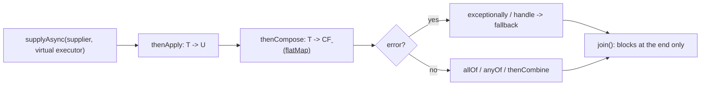
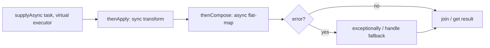

## Why it Matters

1. Composition, `thenApply`/`thenCompose` chain without nested callbacks.
2. Combination, `allOf`/`anyOf`/`thenCombine` coordinate multiple async results.
3. Error handling, `exceptionally`/`handle`/`whenComplete` in the pipeline, not scattered `try/catch`.
4. Non-blocking style, caller thread is free until `join()`; intermediate stages run on the supplied executor (virtual threads make blocking stages cheap).

## Diagram



## Code

## When to use / not

| Use | NOT |
|-----|-----|
| Composing async stages: `thenApply`/`thenCompose`/`thenCombine` | Scoped fan-out that must cancel siblings on failure , `StructuredTaskScope` |
| Combining results: `allOf`/`anyOf`/`thenCombine` | Blocking IO on `ForkJoinPool.commonPool()` , always pass a virtual executor |
| Pipeline error handling: `exceptionally`/`handle`/`whenComplete` | Calling `join()` inside a stage on a bounded pool , deadlock risk |
| Unscoped, long-lived pipelines (event chains, request orchestration) | Replacing a simple synchronous call , CF adds indirection for no gain |

## Trade-offs

> Honestly I find CompletableFuture verbose. You can chain it, but you will read it twice to be sure you got the threading right. For a single request fan-out I now just use StructuredTaskScope instead, simpler to reason about.

`CompletableFuture<T>` (Java 8+) is a composable, non-blocking future + promise: you can complete it manually, chain transformations (`thenApply`, `thenCompose`), combine multiple futures (`allOf`, `anyOf`), and handle errors without blocking, until you call `join()`/`get()`.

> Java 25 note: Supply the virtual-thread-per-task executor explicitly (`supplyAsync(task, Executors.newVirtualThreadPerTaskExecutor())`) for blocking/IO stages. For *scoped* fan-out with automatic cancellation, prefer `StructuredTaskScope` (preview, JEP 505), `CompletableFuture` remains ideal for *unscoped* async pipelines.

## Vs

## Pitfalls

- Omitting the executor → blocking tasks starve `commonPool`, stalling unrelated CFs.
- Calling `join()`/`get()` inside a `thenApply` → deadlock if pool is saturated (avoid on bounded pools; virtual threads mitigate but still poor style).
- Forgetting `exceptionally`/`handle` → exception swallowed until `join()` throws `CompletionException` far from source.
- Using `allOf` without collecting results, `allOf` returns `CF<Void>`; you must `join()` each original future afterwards.
- Leaking `newVirtualThreadPerTaskExecutor()`, always try-with-resources.

## Interview q&a

**Q: `get()` vs `join()`?** `get()` throws checked `InterruptedException` + `ExecutionException`; `join()` throws unchecked `CompletionException`, preferred in lambda/stream pipelines.

**Q: Why pass an executor to `supplyAsync`?** Without it, tasks run on `ForkJoinPool.commonPool()`, sized to CPUs, unsuitable for blocking IO. On Java 25 pass `newVirtualThreadPerTaskExecutor()` or a shared virtual executor.

**Q: `thenApply` vs `thenCompose`?** `thenApply`: `T -> U` (map); `thenCompose`: `T -> CF<U>` (flatMap), use compose when the next step itself is async.

**Q: How to timeout a CompletableFuture?** `orTimeout(2, SECONDS)` / `completeOnTimeout(fallback, 2, SECONDS)` (Java 9+). Or `CompletableFuture.anyOf(cf, failedAfter(...))`.

**Q: How to handle exceptions?** `exceptionally(ex -> fallback)`, `handle((v, ex) -> ...)`, `whenComplete((v, ex) -> sideEffect)`. Exceptions propagate down the chain until handled.

**Q: CompletableFuture vs StructuredTaskScope?** CF = unscoped, composable pipelines; StructuredTaskScope = scoped, structured fan-out with automatic cancellation and error propagation per request. Use CF for pipelines, Scope for request-scoped concurrency.

**Q: Is CompletableFuture blocking?** Chaining is non-blocking; only terminal `join()`/`get()` block. Intermediate blocking calls park the virtual thread cheaply if you supplied a virtual executor.

`get()` vs `join()`?:: `get()` throws checked `InterruptedException` + `ExecutionException`; `join()` throws unchecked `CompletionException`, preferred in lambda/stream pipelines. #flashcard
Why pass an executor to `supplyAsync`?:: Without it, tasks run on `ForkJoinPool.commonPool()`, sized to CPUs, unsuitable for blocking IO. On Java 25 pass `newVirtualThreadPerTaskExecutor()` or a shared virtual executor. #flashcard
`thenApply` vs `thenCompose`?:: `thenApply`: `T -> U` (map); `thenCompose`: `T -> CF<U>` (flatMap), use compose when the next step itself is async. #flashcard
How to timeout a CompletableFuture?:: `orTimeout(2, SECONDS)` / `completeOnTimeout(fallback, 2, SECONDS)` (Java 9+). Or `CompletableFuture.anyOf(cf, failedAfter(...))`. #flashcard
How to handle exceptions?:: `exceptionally(ex -> fallback)`, `handle((v, ex) -> ...)`, `whenComplete((v, ex) -> sideEffect)`. Exceptions propagate down the chain until handled. #flashcard
CompletableFuture vs StructuredTaskScope?:: CF = unscoped, composable pipelines; StructuredTaskScope = scoped, structured fan-out with automatic cancellation and error propagation per request. Use CF for pipelines, Scope for request-scoped concurrency. #flashcard
Is CompletableFuture blocking?:: Chaining is non-blocking; only terminal `join()`/`get()` block. Intermediate blocking calls park the virtual thread cheaply if you supplied a virtual executor. #flashcard

- [1115. Print Foobar Alternately](https://leetcode.com/problems/print-foobar-alternately/)
- [1226. The Dining Philosophers](https://leetcode.com/problems/the-dining-philosophers/)
- [1114. Print In Order](https://leetcode.com/problems/print-in-order/)

---
*Category: Concurrency • Part of [[README|Java MOC]] • Java 25*

## Related

- [[Executor Framework]], executors, virtual-thread-per-task
- [[Threads]], virtual threads, StructuredTaskScope, ScopedValue
- [[Locks and Synchronizers]], coordination alternatives
- [[Concurrent Collections]], thread-safe data flow between stages

# CompletableFuture

> Part of [[README|Java MOC]] • `Concurrency` • Java 25 (LTS)
- [[Architect/10_System-Design-Interviews/ASYNC-01-Async-Patterns.md|ASYNC-01-Async-Patterns]] — Async composition patterns

## Core api & Execution Model


| Factory | Description |
|---|---|
| `supplyAsync(Supplier, executor)` | Runs supplier async, returns `CF<T>` |
| `runAsync(Runnable, executor)` | Async `CF<Void>` |
| `completedFuture(value)` | Already-completed |
| `failedFuture(ex)` | Already-failed (Java 9+) |

| Stage | Sync vs Async | Behaviour |
|---|---|---|
| `thenApply(fn)` | sync, runs on completer thread | Transform result |
| `thenApplyAsync(fn, exec)` | async, runs on `exec` | Transform on executor |
| `thenCompose(fn)` | sync | Flat-map: `T -> CF<U>` |
| `thenComposeAsync(fn, exec)` | async | Flat-map on executor |
| `thenCombine(other, fn)` | sync | Merge two futures |
| `thenAccept / thenRun` | terminal consumers | |
| `exceptionally(fn)` | sync | Map exception → fallback value |
| `handle((v, ex) -> ...)` | sync | Bi-function for value or error |
| `whenComplete((v, ex) -> ...)` | sync | Side-effect, passes through |

Default executor: `ForkJoinPool.commonPool()` if none supplied, avoid for blocking IO. Always pass `newVirtualThreadPerTaskExecutor()` or a shared virtual executor on Java 25.

## Java 25 Changes

| Concern | Classic (Java 8,17) | Java 25 |
|---|---|---|
| Blocking supplier | `supplyAsync(() -> blockingCall(), fixedPool)`, pool exhaustion risk | `supplyAsync(() -> blockingCall(), newVirtualThreadPerTaskExecutor())`, parks cheaply |
| Fan-out + join | `CompletableFuture.allOf(f1, f2).join()`, no cancellation on failure | `StructuredTaskScope.ShutdownOnFailure`, auto-cancels siblings on first failure |
| Racing | `anyOf(f1, f2)` | `StructuredTaskScope.ShutdownOnSuccess`, first success wins |
| Context propagation | `ThreadLocal` manual copy | `ScopedValue` (JEP 506) auto-inherited by virtual/structured tasks |

> StructuredTaskScope note (JEP 505, preview): Use `CompletableFuture` for *long-lived pipelines* and *unscoped* composition. Use `StructuredTaskScope` when subtasks are scoped to a single operation (request handler) and must share a deadline / fail together. Both can coexist, a `StructuredTaskScope` subtask may itself return a `CompletableFuture`.

### CompletableFuture vs Future vs Structuredtaskscope

| Aspect | `Future<T>` | `CompletableFuture<T>` | `StructuredTaskScope` (preview) |
|---|---|---|---|
| Blocking | `get()` blocks | `join()`/`get()` block, but chain is non-blocking | `join()` blocks scope, subtasks on virtual threads |
| Composition | None | `thenApply`/`thenCompose`/`thenCombine` | `fork()` + `get()` after `join()` |
| Error propagation | `ExecutionException` on `get()` | `exceptionally`/`handle` in pipeline | `throwIfFailed()` propagates, auto-cancels siblings |
| Cancellation | `cancel(true)` manual | `cancel()` / `completeExceptionally()` | Automatic on failure/success policy |
| Scope | Unscoped | Unscoped | Scoped, try-with-resources, structured |
| Use when | Simple single task | Unscoped async pipelines | Scoped fan-out per request |

### `thenApply`Vs`thenCompose`

| Method | Signature | Analogy | Use when |
|---|---|---|---|
| `thenApply` | `T -> U` | `map` | Sync transform |
| `thenCompose` | `T -> CF<U>` | `flatMap` | Async step returning a future |

### `thenApply`Vs`thenApplyAsync`

| Variant | Runs on | Risk |
|---|---|---|
| `thenApply(fn)` | Completer thread | May block commonPool if `fn` blocks |
| `thenApplyAsync(fn, exec)` | `exec` (supply virtual executor) | Safe for blocking, virtual thread parks |

### Basic Pipeline on Virtual Threads

```java
import java.util.concurrent.*;
import java.time.Duration;

public class CfBasic {
 public static void main(String[] args) throws Exception {
 try (var exec = Executors.newVirtualThreadPerTaskExecutor()) {

 CompletableFuture<String> cf = CompletableFuture
 .supplyAsync(() -> fetchUser("42"), exec)
 .thenApplyAsync(user -> "Hello, " + user, exec)
 .thenComposeAsync(user -> CompletableFuture.supplyAsync(() -> fetchOrder(user), exec), exec)
 .exceptionally(ex -> "fallback: " + ex.getMessage());

 System.out.println(cf.join());
 }
 }
 static String fetchUser(String id) {
 try { Thread.sleep(Duration.ofMillis(150)); } catch (InterruptedException e) { Thread.currentThread().interrupt(); }
 return "alice-" + id;
 }
 static String fetchOrder(String user) {
 try { Thread.sleep(Duration.ofMillis(100)); } catch (InterruptedException e) { Thread.currentThread().interrupt(); }
 return "order-for-" + user;
 }
}
```

### Combining Futures + Timeout (Java 9+ OrTimeout)

```java
import java.util.concurrent.*;
import java.time.Duration;

class CfCombine {
 static void demo() throws Exception {
 try (var exec = Executors.newVirtualThreadPerTaskExecutor()) {

 var fUser = CompletableFuture.supplyAsync(() -> "alice", exec);
 var fOrder = CompletableFuture.supplyAsync(() -> "order-42", exec);

 var combined = fUser.thenCombine(fOrder, (u, o) -> u + " -> " + o);

 var all = CompletableFuture.allOf(fUser, fOrder)
 .thenApply(v -> java.util.List.of(fUser.join(), fOrder.join()));

 var withTimeout = combined.orTimeout(2, TimeUnit.SECONDS)
 .exceptionally(ex -> "timed out: " + ex);

 System.out.println(withTimeout.join());
 System.out.println(all.join());
 }
 }
}
```

### Error Handling Pipeline

```java
import java.util.concurrent.*;

class CfErrors {
 static void demo() {
 try (var exec = Executors.newVirtualThreadPerTaskExecutor()) {
 CompletableFuture<String> cf = CompletableFuture
 .<String>supplyAsync(() -> { if (Math.random() > 0.5) throw new RuntimeException("boom"); return "ok"; }, exec)
 .handle((val, ex) -> ex != null ? "recovered: " + ex.getMessage() : val.toUpperCase())
 .whenComplete((val, ex) -> System.out.println("completed: " + val + " err=" + ex));

 System.out.println(cf.join());
 }
 }
}
```

### CompletableFuture vs StructuredTaskScope (Scoped Fan-out)

```java
import java.util.concurrent.*;

class UnscopedPipeline {
 CompletableFuture<String> pipeline(ExecutorService exec) {
 return CompletableFuture.supplyAsync(() -> "alice", exec)
 .thenApplyAsync(u -> u.toUpperCase(), exec);
 }
}

class ScopedRequest {
 String handle() throws Exception {
 try (var scope = new StructuredTaskScope.ShutdownOnFailure()) {
 var user = scope.fork(() -> { Thread.sleep(Duration.ofMillis(100)); return "alice"; });
 var order = scope.fork(() -> { Thread.sleep(Duration.ofMillis(120)); return "order-42"; });
 scope.join();
 scope.throwIfFailed();
 return user.get() + " | " + order.get();
 }
 }
 String hedged() throws Exception {
 try (var scope = new StructuredTaskScope.ShutdownOnSuccess<String>()) {
 scope.fork(() -> fetchReplica("a"));
 scope.fork(() -> fetchReplica("b"));
 scope.join();
 return scope.result();
 }
 }
 String fetchReplica(String r) throws InterruptedException { Thread.sleep(Duration.ofMillis(80)); return "from-" + r; }
}
```