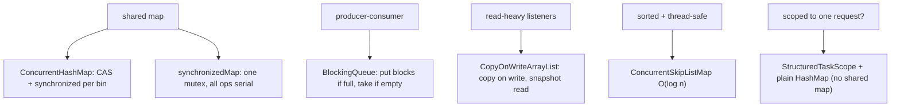

## Why it Matters

1. Coarse locking, single mutex for entire collection → contention bottleneck.
2. Compound-action gap, `if (!map.containsKey(k)) map.put(k, v)` is not atomic even when synchronized externally (check-then-act race).
3. Iterator pitfalls, `synchronizedMap` iterators require manual `synchronized(map)` and fail fast on concurrent modification.
4. Modern alternatives, `ConcurrentHashMap` (striped), `BlockingQueue` (producer-consumer), `CopyOnWriteArrayList` (read-heavy) solve each pattern correctly.

## Diagram



## Code

## When to use / not

| Use | NOT |
|-----|-----|
| `ConcurrentHashMap` for any map shared across threads | `Collections.synchronizedMap` , single mutex serialises all access |
| `computeIfAbsent`/`merge` for atomic load-or-compute | `if (!map.containsKey(k)) map.put(k, v)` , check-then-act race |
| `CopyOnWriteArrayList` for read-heavy, write-rare listener lists | `CopyOnWriteArrayList` for write-heavy work , O(n) copy per write |
| `BlockingQueue` for producer-consumer between threads | Plain `ArrayList` + manual `wait/notify` , use the queue |
| `ConcurrentSkipListMap` for sorted + concurrent | `TreeMap` + external locking |

## Trade-offs

> You don't need to memorize every queue variant. I remember it like this: you want a map, use ConcurrentHashMap, you want a queue between threads, use a BlockingQueue, everything else is niche.

`java.util.concurrent` provides thread-safe collections that avoid `Collections.synchronizedXxx` pitfalls: `ConcurrentHashMap`, `BlockingQueue` variants, `CopyOnWriteArrayList`/`CopyOnWriteArraySet`, and `ConcurrentSkipListMap/Set`. They use lock striping, CAS, or copy-on-write to allow high concurrent throughput with weak/ snapshot iterators.

> Java 25 note: Iterators remain *weakly consistent* (may reflect some concurrent updates). Virtual threads make blocking queue operations cheap, `take()`/`put()` park the virtual thread, not the carrier.

## Vs

## Pitfalls

- Using `if (!map.containsKey(k)) map.put(k, v)` on `ConcurrentHashMap`, not atomic; use `putIfAbsent`/`computeIfAbsent`.
- Iterating `Collections.synchronizedMap` without `synchronized(map)` → `ConcurrentModificationException` or visibility bugs.
- `CopyOnWriteArrayList` for write-heavy workloads → `O(n)` copy per write, GC pressure.
- Assuming `ConcurrentHashMap.size()` is exact under concurrency, it is *eventually* consistent; use `mappingCount()` for long counts.
- Forgetting `BlockingQueue` is bounded, `put()` can block forever; prefer `offer(timeout)` or virtual threads that park cheaply but still need handling.

## Interview q&a

**Q: Why does `ConcurrentHashMap` forbid null keys/values?** To disambiguate `get(k) == null` meaning "absent" vs "mapped to null" in concurrent code without extra `containsKey` checks (which would race).

**Q: `ConcurrentHashMap` vs `synchronizedMap`?** Striped/CAS vs single mutex, CHM allows concurrent reads and writes on different bins; `synchronizedMap` serialises all access. CHM also provides atomic `computeIfAbsent`/`merge`.

**Q: What does *weakly consistent* iterator mean?** May reflect some but not all concurrent updates; never throws `ConcurrentModificationException`; guarantees to traverse elements as they existed at iterator creation plus optionally some updates.

**Q: When to use `CopyOnWriteArrayList`?** Read-heavy, write-rare, iteration vastly outnumbers mutation (listener lists, configuration snapshots). Writes are `O(n)` copies, unsuitable for write-heavy workloads.

**Q: `ArrayBlockingQueue` vs `LinkedBlockingQueue`?** Array: single lock, bounded, often fair option; Linked: two locks (put/take), higher throughput for concurrent producer+consumer, optionally bounded.

**Q: `BlockingQueue` with virtual threads, does `take()` pin?** No, `take()`/`put()` park the virtual thread, freeing the carrier. Scale to thousands of blocked consumers/producers safely.

**Q: When does `StructuredTaskScope` replace `ConcurrentHashMap` + `CountDownLatch`?** When aggregation is *scoped to one operation* (single request), confine a plain `HashMap` to the scope and `join()`. For *shared, long-lived* state, keep `ConcurrentHashMap`.

Why does `ConcurrentHashMap` forbid null keys/values?:: To disambiguate `get(k) == null` meaning "absent" vs "mapped to null" in concurrent code without extra `containsKey` checks (which would race). #flashcard
`ConcurrentHashMap` vs `synchronizedMap`?:: Striped/CAS vs single mutex, CHM allows concurrent reads and writes on different bins; `synchronizedMap` serialises all access. CHM also provides atomic `computeIfAbsent`/`merge`. #flashcard
What does *weakly consistent* iterator mean?:: May reflect some but not all concurrent updates; never throws `ConcurrentModificationException`; guarantees to traverse elements as they existed at iterator creation plus optionally some updates. #flashcard
When to use `CopyOnWriteArrayList`?:: Read-heavy, write-rare, iteration vastly outnumbers mutation (listener lists, configuration snapshots). Writes are `O(n)` copies, unsuitable for write-heavy workloads. #flashcard
`ArrayBlockingQueue` vs `LinkedBlockingQueue`?:: Array: single lock, bounded, often fair option; Linked: two locks (put/take), higher throughput for concurrent producer+consumer, optionally bounded. #flashcard
`BlockingQueue` with virtual threads, does `take()` pin?:: No, `take()`/`put()` park the virtual thread, freeing the carrier. Scale to thousands of blocked consumers/producers safely. #flashcard
When does `StructuredTaskScope` replace `ConcurrentHashMap` + `CountDownLatch`?:: When aggregation is *scoped to one operation* (single request), confine a plain `HashMap` to the scope and `join()`. For *shared, long-lived* state, keep `ConcurrentHashMap`. #flashcard

- [380. Insert Delete Getrandom O1](https://leetcode.com/problems/insert-delete-getrandom-o1/)
- [381. Insert Delete Getrandom O1 Duplicates Allowed](https://leetcode.com/problems/insert-delete-getrandom-o1-duplicates-allowed/)
- [355. Design Twitter](https://leetcode.com/problems/problem-355/)

---
*Category: Concurrency • Part of [[README|Java MOC]] • Java 25*

## Related

- Executor Framework, work queues behind executors are `BlockingQueue`s
- Locks and Synchronizers, `Semaphore`/`CountDownLatch` with queues
- Threads, virtual threads parking on `BlockingQueue.take()`
- Atomics and Volatile, CAS primitives underlying CHM bins

# Concurrent Collections

> Part of [[README|Java MOC]] • `Concurrency` • Java 25 (LTS)
- ASYNC-02-Message-Queues — Message Queues - distributed concurrency
- ASYNC-03-Event-Driven-Architecture — Event-driven patterns

## Core Collections

### `ConcurrentHashMap<K,V>`

- Lock striping (Java 8+: CAS + `synchronized` on bin heads), many threads write different bins concurrently.
- Atomic compound ops: `putIfAbsent`, `computeIfAbsent`, `merge`, `compute`.
- No `null` keys/values (fail fast to avoid ambiguity with `get() == null`).
- Iterators: weakly consistent, never throw `ConcurrentModificationException`.

### `BlockingQueue<E>`, Producer-consumer

| Impl | Bounded? | Ordering | Use |
|---|---|---|---|
| `ArrayBlockingQueue` | Bounded (array) | FIFO | Fixed-capacity pipeline |
| `LinkedBlockingQueue` | Optionally bounded | FIFO | Classic work queue |
| `PriorityBlockingQueue` | Unbounded | Priority | Ordered tasks |
| `SynchronousQueue` | Zero capacity | Handoff | Direct handoff (`newCachedThreadPool` style) |
| `LinkedTransferQueue` | Unbounded | FIFO | `transfer()` handoff |
| `DelayQueue` | Unbounded | Delay | Scheduled expiry |

Core ops: `put(e)` (blocks if full), `take()` (blocks if empty), `offer/poll` with timeout.

### `CopyOnWriteArrayList<E>`/`CopyOnWriteArraySet<E>`

- Every mutative op copies the backing array, read-heavy, write-rare (listeners, caches).
- Snapshot iterators, iteration never blocks, sees array at iterator creation time.

### `ConcurrentSkipListMap/Set`, Sorted Concurrent

- Skip-list, `O(log n)`, sorted, weakly consistent iterators. Concurrent alternative to `TreeMap`/`TreeSet`.

## Java 25 Changes

| Pattern | Before | Java 25 |
|---|---|---|
| Producer-consumer | `ArrayBlockingQueue` + platform threads, `take()` blocks OS thread | Same queue, but `take()`/`put()` parks virtual thread cheaply, scale to thousands of producers/consumers |
| Fan-out aggregation | `ConcurrentHashMap` + `CountDownLatch` + `ExecutorService.invokeAll()` | `ConcurrentHashMap` + `StructuredTaskScope`, scope joins, latch optional |
| Thread-safe cache | `Collections.synchronizedMap` + manual sync | `ConcurrentHashMap.computeIfAbsent(k, loader)`, atomic, striped |

> StructuredTaskScope note (JEP 505, preview): For *scoped* aggregation (collect results of a single request's subtasks into a map), `StructuredTaskScope` + a plain `HashMap` confined to the scope can replace a shared `ConcurrentHashMap` + latch. Use `ConcurrentHashMap` when the map is shared across requests / long-lived. Flag: `--enable-preview` for `StructuredTaskScope`.
```java
import java.util.concurrent.StructuredTaskScope;
class ScopedAggregation {
 Map<String, String> gather(List<String> ids) throws Exception {
 try (var scope = new StructuredTaskScope.ShutdownOnFailure()) {
 var tasks = ids.stream().map(id -> scope.fork(() -> fetch(id))).toList();
 scope.join(); scope.throwIfFailed();
 var result = new java.util.HashMap<String, String>();
 for (int i = 0; i < ids.size(); i++) result.put(ids.get(i), tasks.get(i).get());
 return result;
 }
 }
 String fetch(String id) throws InterruptedException { Thread.sleep(java.time.Duration.ofMillis(50)); return "v-" + id; }
}
```

### `ConcurrentHashMap`Vs`HashMap`Vs`Collections.synchronizedMap`Vs`Hashtable`

| Aspect | `HashMap` | `Collections.synchronizedMap` | `Hashtable` (legacy) | `ConcurrentHashMap` |
|---|---|---|---|---|
| Thread-safe | No | Yes (single mutex) | Yes (single mutex) | Yes (striped / CAS) |
| Null keys/values | Yes | Yes | No | No |
| Compound atomic ops | No | No (external sync needed) | No | `putIfAbsent`, `computeIfAbsent`, `merge` |
| Iterator | Fail-fast | Fail-fast, manual sync | Fail-fast | Weakly consistent, no CME |
| Throughput (contended) | N/A | Poor | Poor | High |
| Use when | Single-threaded | Legacy, low contention | Avoid | Default for concurrent maps |

### `BlockingQueue`Implementations

| Queue | Bounded | `put()` blocks when | `take()` blocks when | Backing |
|---|---|---|---|---|
| `ArrayBlockingQueue(cap)` | Yes | Full | Empty | Array, single lock (optionally fair) |
| `LinkedBlockingQueue(cap)` | Yes (or `MAX_VALUE`) | Full | Empty | Linked nodes, two locks (put/take) |
| `PriorityBlockingQueue` | No | Never | Empty | Heap, comparator |
| `SynchronousQueue` | Zero | Until a taker arrives | Until a put arrives | Handoff, no storage |

### `CopyOnWriteArrayList`Vs`Collections.synchronizedList`Vs`ConcurrentHashMap.newKeySet()`

| Collection | Read cost | Write cost | Iterator | Best for |
|---|---|---|---|---|
| `CopyOnWriteArrayList` | O(1), no lock | O(n) copy | Snapshot, no CME | Read-heavy, write-rare (listeners, config) |
| `Collections.synchronizedList` | Locks on every access | Locks | Fail-fast, manual sync | Low-contention legacy |
| `Vector` | Synchronized per op | Synchronized per op | Fail-fast | Legacy, avoid |

### ConcurrentHashMap, Atomic Loaders

```java
import java.util.concurrent.*;
import java.time.Duration;

class ConcurrentMapDemo {
 private final ConcurrentHashMap<String, String> cache = new ConcurrentHashMap<>();

 String getOrLoad(String key) {
 return cache.computeIfAbsent(key, k -> {
 try { Thread.sleep(Duration.ofMillis(100)); } catch (InterruptedException e) { Thread.currentThread().interrupt(); }
 return "loaded-" + k;
 });
 }

 static void demo() throws Exception {
 var demo = new ConcurrentMapDemo();
 try (var exec = Executors.newVirtualThreadPerTaskExecutor()) {
 var futures = java.util.stream.IntStream.range(0, 20)
 .mapToObj(i -> exec.<String>submit(() -> demo.getOrLoad("key-" + (i % 5))))
 .toList();
 for (var f : futures) System.out.println(f.get());
 System.out.println("cache size=" + demo.cache.size());
 }
 }
}
```

### BlockingQueue, Producer-consumer on Virtual Threads

```java
import java.util.concurrent.*;
import java.time.Duration;

class QueueDemo {
 static void demo() throws Exception {
 BlockingQueue<String> queue = new ArrayBlockingQueue<>(10);
 try (var exec = Executors.newVirtualThreadPerTaskExecutor()) {
 exec.submit(() -> {
 for (int i = 0; i < 20; i++) {
 try { queue.put("item-" + i); }
 catch (InterruptedException e) { Thread.currentThread().interrupt(); break; }
 }
 });
 for (int i = 0; i < 20; i++) System.out.println(queue.take());
 }
 }
}
```

### CopyOnWriteArrayList, Event Listeners

```java
import java.util.concurrent.CopyOnWriteArrayList;
import java.util.concurrent.Executors;

class ListenerDemo {
 interface Listener { void onEvent(String e); }

 private final CopyOnWriteArrayList<Listener> listeners = new CopyOnWriteArrayList<>();

 void addListener(Listener l) { listeners.add(l); }
 void fireEvent(String event) {
 for (Listener l : listeners) l.onEvent(event);
 }

 static void demo() throws Exception {
 var demo = new ListenerDemo();
 demo.addListener(e -> System.out.println("L1: " + e));
 demo.addListener(e -> System.out.println("L2: " + e));

 try (var exec = Executors.newVirtualThreadPerTaskExecutor()) {
 exec.submit(() -> demo.fireEvent("hello")).get();
 exec.submit(() -> demo.addListener(e -> System.out.println("L3: " + e))).get();
 demo.fireEvent("world");
 }
 }
}
```

### Shared Cache Population (chm + Virtual Threads)

```java
import java.util.concurrent.*;
import java.util.*;

class SharedCache {
 private final ConcurrentHashMap<String, String> map = new ConcurrentHashMap<>();
 void populate(List<String> ids) throws Exception {
 try (var exec = Executors.newVirtualThreadPerTaskExecutor()) {
 var futures = ids.stream().map(id -> exec.submit(() -> map.put(id, fetch(id)))).toList();
 for (var f : futures) f.get();
 }
 }
 String fetch(String id) throws InterruptedException { Thread.sleep(Duration.ofMillis(30)); return "v-" + id; }
}
```