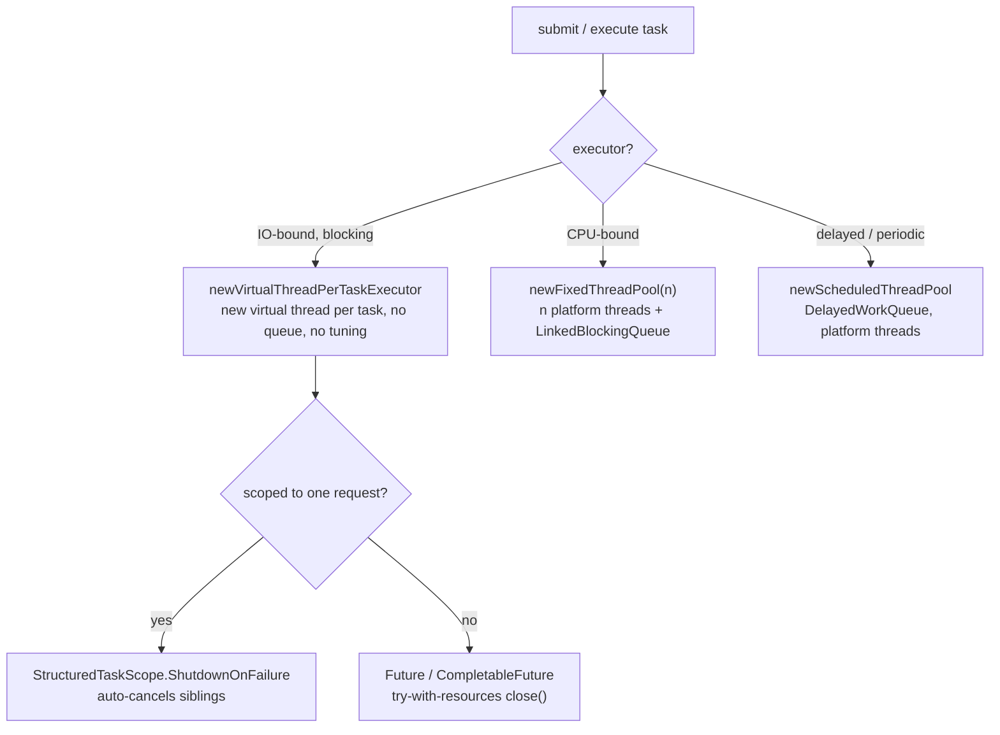
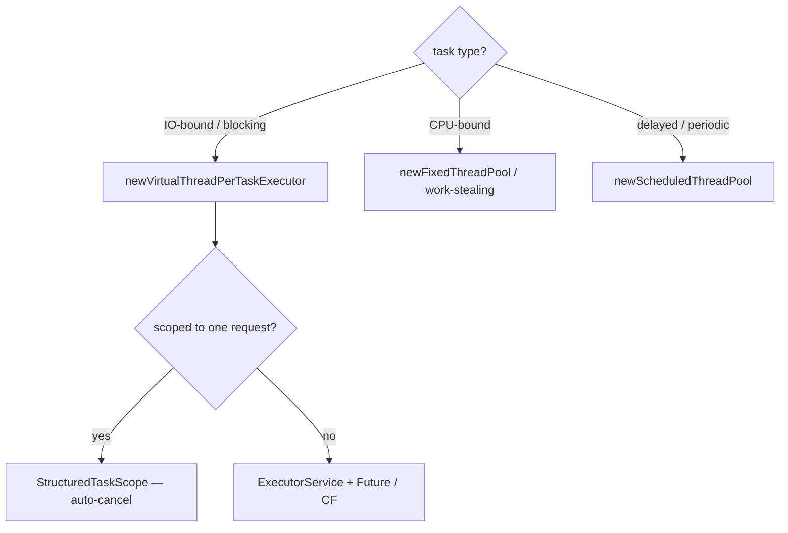

## Why it Matters

1. Resource control, bounded or unbounded execution without manually creating/destroying `Thread` objects.
2. Decoupling, caller submits tasks; executor decides *how* to run them (pool, virtual thread, scheduled).
3. Lifecycle & queuing, `shutdown()`, `awaitTermination()`, rejection policies, `Future` results.
4. Virtual-thread scale, `newVirtualThreadPerTaskExecutor()` handles millions of concurrent blocking tasks with no queue saturation.

## Diagram



## Code

## When to use / not

| Use | NOT |
|-----|-----|
| `newVirtualThreadPerTaskExecutor()` , IO-bound fan-out, servers, blocking calls | `newFixedThreadPool` for IO work , queue builds up and platform threads cap concurrency |
| `newFixedThreadPool(n)` for CPU-bound work with a strict concurrency cap | `newCachedThreadPool` on 25 , unbounded platform threads; virtual is cheaper |
| `newScheduledThreadPool` for delays / periodic tasks (still platform threads) | Raw `new Thread().start()` , no lifecycle, no queuing, ~MBs each |
| `StructuredTaskScope` when subtasks must fail/cancel together | `invokeAll` when a sibling failure should abort the rest , scope cancels automatically |
| try-with-resources on every executor | Manual `shutdown()`/`awaitTermination()` dance , `close()` does both |

## Trade-offs

> In practice you probably only need one line now: Executors.newVirtualThreadPerTaskExecutor(). I used to tune pools, now I mostly don't. Still, scheduled tasks are the exception, they still run on platform threads.

The Executor Framework (`java.util.concurrent`, since Java 5) decouples *task submission* from *thread management*. Instead of `new Thread(r).start()`, you submit `Runnable`/`Callable` to an `ExecutorService` that handles threading, queuing, and lifecycle.

> Java 25 default: `Executors.newVirtualThreadPerTaskExecutor()`, one lightweight virtual thread per task, no pool tuning. Platform-thread pools (`newFixedThreadPool`, `newCachedThreadPool`) are now the exception (CPU-bound / legacy).

## Vs

## Pitfalls

- Forgetting try-with-resources / `shutdown()` → leaked threads & JVM won't exit.
- Using `newFixedThreadPool` with unbounded `LinkedBlockingQueue` → OOM under load (virtual executor avoids this).
- Calling `Future.get()` without timeout → hangs forever; use `get(timeout, unit)`.
- Swallowing `InterruptedException` without `Thread.currentThread().interrupt()`.
- Using `newCachedThreadPool` for IO fan-out on Java 25, creates platform threads needlessly; use virtual.

## Interview q&a

**Q: Why not `new Thread()` per request?** OS threads are ~MBs + kernel scheduling; unbounded creation causes OOM / thrashing. Executors bound or virtualise the cost. On Java 25 virtual threads make per-task threads cheap (~KBs) but you still want lifecycle management via `ExecutorService`.

**Q: `newFixedThreadPool` vs `newVirtualThreadPerTaskExecutor`?** Fixed pool caps *platform* threads and queues overflow; virtual-per-task creates a new virtual thread each submission and parks it cheaply on blocking IO, no queue, no tuning, scales to millions.

**Q: Do you need `shutdown()` with virtual-thread executor?** Yes, but prefer try-with-resources: `try (var exec = Executors.newVirtualThreadPerTaskExecutor()) { ... }`, `close()` calls `shutdown()` and awaits termination.

**Q: When to use `StructuredTaskScope` instead of `ExecutorService`?** When subtasks are *scoped* (share a deadline, must all succeed or cancel together). Executor is for long-lived / unbounded service pools; `StructuredTaskScope` is for structured fan-out with automatic cancellation and error propagation.

**Q: What happens if you submit after `shutdown()`?** `RejectedExecutionException`.

**Q: `execute()` vs `submit()`?** `execute` takes `Runnable` and returns nothing (exceptions go to handler); `submit` returns `Future` so you can `get()` the result or `ExecutionException`.

**Q: How to handle exceptions from tasks?** `Future.get()` wraps in `ExecutionException`; `CompletableFuture.exceptionally()`; `StructuredTaskScope.throwIfFailed()` rethrows the first failure.

Why not `new Thread()` per request?:: OS threads are ~MBs + kernel scheduling; unbounded creation causes OOM / thrashing. Executors bound or virtualise the cost. On Java 25 virtual threads make per-task threads cheap (~KBs) but you still want lifecycle management via `ExecutorService`. #flashcard
`newFixedThreadPool` vs `newVirtualThreadPerTaskExecutor`?:: Fixed pool caps *platform* threads and queues overflow; virtual-per-task creates a new virtual thread each submission and parks it cheaply on blocking IO, no queue, no tuning, scales to millions. #flashcard
Do you need `shutdown()` with virtual-thread executor?:: Yes, but prefer try-with-resources: `try (var exec = Executors.newVirtualThreadPerTaskExecutor()) { ... }`, `close()` calls `shutdown()` and awaits termination. #flashcard
When to use `StructuredTaskScope` instead of `ExecutorService`?:: When subtasks are *scoped* (share a deadline, must all succeed or cancel together). Executor is for long-lived / unbounded service pools; `StructuredTaskScope` is for structured fan-out with automatic cancellation and error propagation. #flashcard
What happens if you submit after `shutdown()`?:: `RejectedExecutionException`. #flashcard
`execute()` vs `submit()`?:: `execute` takes `Runnable` and returns nothing (exceptions go to handler); `submit` returns `Future` so you can `get()` the result or `ExecutionException`. #flashcard
How to handle exceptions from tasks?:: `Future.get()` wraps in `ExecutionException`; `CompletableFuture.exceptionally()`; `StructuredTaskScope.throwIfFailed()` rethrows the first failure. #flashcard

- [1115. Print Foobar Alternately](https://leetcode.com/problems/print-foobar-alternately/)
- [1226. The Dining Philosophers](https://leetcode.com/problems/the-dining-philosophers/)
- [1114. Print In Order](https://leetcode.com/problems/print-in-order/)

---
*Category: Concurrency • Part of [[README|Java MOC]] • Java 25*

## Related

- [[Threads]], lifecycle, virtual threads, JEP 491/505/506
- [[CompletableFuture]], async pipelines on virtual executors
- [[Locks and Synchronizers]], coordination primitives
- [[Concurrent Collections]], thread-safe data structures

# Executor Framework

> Part of [[README|Java MOC]] • `Concurrency` • Java 25 (LTS)

## Core Interfaces & Classes


| Type | Role | Key method |
|---|---|---|
| `Executor` | Fire-and-forget | `execute(Runnable)` |
| `ExecutorService` | Lifecycle + `Future` | `submit()`, `invokeAll()`, `shutdown()` |
| `ScheduledExecutorService` | Delayed / periodic | `schedule()`, `scheduleAtFixedRate()` |
| `ThreadFactory` | Creates threads | `newThread(Runnable)` |
| `Executors` | Factory helpers | `newVirtualThreadPerTaskExecutor()`, `newFixedThreadPool(n)`, etc. |

Lifecycle: `RUNNING → SHUTDOWN (no new tasks, running tasks continue) → TERMINATED`. Call `shutdown()` or use try-with-resources (`ExecutorService` is `AutoCloseable` since Java 19).

## Java 25 Changes

| Approach | Java 21 and before | Java 25 (LTS) default |
|---|---|---|
| IO-bound fan-out | `newFixedThreadPool(200)` + tuning + queue | `newVirtualThreadPerTaskExecutor()`, no tuning |
| Thread creation | `new Thread(r)` / `Executors.newCachedThreadPool()` | `Thread.ofVirtual().factory()` / `newThreadPerTaskExecutor(factory)` |
| Structured fan-out | `invokeAll()` / `CompletableFuture.allOf()` | `StructuredTaskScope` (preview, JEP 505), preferred for scoped tasks |
| Carrier pool | N/A | JVM `ForkJoinPool` sized to CPUs; `-Djdk.virtualThreadScheduler.parallelism=N` |

> StructuredTaskScope note (JEP 505, preview in Java 25): For *scoped* fan-out where subtasks share a deadline or must fail together, prefer `StructuredTaskScope.ShutdownOnFailure` / `ShutdownOnSuccess` over raw `ExecutorService.invokeAll()`. Executor remains correct for long-lived services / fire-and-forget. See [[Threads]] § Structured Concurrency.

### Executor Types

| Executor | Thread model | Queue | When to use |
|---|---|---|---|
| `newVirtualThreadPerTaskExecutor()` | New virtual thread per task | None (direct) | Default for IO-bound, servers, fan-out, blocking calls |
| `newThreadPerTaskExecutor(Thread.ofVirtual().factory())` | Virtual, custom factory (naming) | None | Need custom `ThreadFactory` (names, `ThreadLocal` control) |
| `newFixedThreadPool(n)` | n platform threads | `LinkedBlockingQueue` (unbounded) | CPU-bound, strict concurrency cap, legacy |
| `newCachedThreadPool()` | Unbounded platform threads | `SynchronousQueue` | Short-lived bursts (legacy, prefer virtual) |
| `newSingleThreadExecutor()` | 1 platform thread | `LinkedBlockingQueue` | Ordered sequential execution |
| `newScheduledThreadPool(n)` | n platform threads | `DelayedWorkQueue` | Delays / periodic tasks (still platform-thread based) |
| `newWorkStealingPool()` | `ForkJoinPool` | Work-stealing queues | CPU-bound recursive tasks (`RecursiveTask`) |

### `submit()`Vs`execute()`Vs`invokeAll()`

| Method | Takes | Returns | Throws on failure |
|---|---|---|---|
| `execute(Runnable)` | `Runnable` | `void` | Uncaught via `UncaughtExceptionHandler` |
| `submit(Runnable/Callable)` | `Runnable`/`Callable` | `Future<T>` | `ExecutionException` on `get()` |
| `invokeAll(Collection<Callable>)` | Batch | `List<Future<T>>` | Per-future `ExecutionException` |
| `StructuredTaskScope.fork()` | `Callable` | `Subtask<T>` | `throwIfFailed()` propagates |

### Preferred: Try-with-resources + Virtual-thread-per-task

```java
import java.util.concurrent.*;
import java.time.Duration;

public class ExecutorDemo {
 public static void main(String[] args) throws Exception {
 try (ExecutorService exec = Executors.newVirtualThreadPerTaskExecutor()) {
 Future<String> f1 = exec.submit(() -> {
 Thread.sleep(Duration.ofMillis(200));
 return "hello from " + Thread.currentThread();
 });
 Future<String> f2 = exec.submit(() -> "world");

 System.out.println(f1.get() + " " + f2.get());
 }
 }
}
```

### Custom Virtual-thread Factory (Named Threads)

```java
import java.util.concurrent.*;

class NamedFactoryDemo {
 static void demo() throws Exception {
 ThreadFactory factory = Thread.ofVirtual()
 .name("worker-", 0)
 .factory();

 try (var exec = Executors.newThreadPerTaskExecutor(factory)) {
 var futures = java.util.stream.IntStream.range(0, 5)
 .mapToObj(i -> exec.submit(() -> "task-" + i + " on " + Thread.currentThread()))
 .toList();
 for (var f : futures) System.out.println(f.get());
 }
 }
}
```

### Fan-out: Executor vs StructuredTaskScope

```java
import java.util.List;
import java.util.concurrent.*;

class ExecutorFanOut {
 String fetchAll(ExecutorService exec) throws Exception {
 var tasks = List.<Callable<String>>of(
 () -> fetchUser(), () -> fetchOrder());
 List<Future<String>> futures = exec.invokeAll(tasks);
 return futures.get(0).get() + " | " + futures.get(1).get();
 }
 String fetchUser() throws InterruptedException { Thread.sleep(Duration.ofMillis(100)); return "alice"; }
 String fetchOrder() throws InterruptedException { Thread.sleep(Duration.ofMillis(150)); return "order-42"; }
}

class StructuredFanOut {
 String fetchUser() throws InterruptedException { Thread.sleep(Duration.ofMillis(100)); return "alice"; }
 String fetchOrder() throws InterruptedException { Thread.sleep(Duration.ofMillis(150)); return "order-42"; }

 String handle() throws Exception {
 try (var scope = new StructuredTaskScope.ShutdownOnFailure()) {
 var u = scope.fork(this::fetchUser);
 var o = scope.fork(this::fetchOrder);
 scope.join();
 scope.throwIfFailed();
 return u.get() + " | " + o.get();
 }
 }
}
```

### Scheduled Tasks (Still Platform-thread Based)

```java
import java.util.concurrent.*;

class ScheduledDemo {
 static void demo() throws Exception {
 try (var scheduler = Executors.newScheduledThreadPool(2)) {
 scheduler.schedule(() -> System.out.println("once after 500ms"),
 500, TimeUnit.MILLISECONDS);
 var periodic = scheduler.scheduleAtFixedRate(
 () -> System.out.println("tick " + Thread.currentThread()),
 0, 1, TimeUnit.SECONDS);
 Thread.sleep(Duration.ofSeconds(3));
 periodic.cancel(false);
 }
 }
}
```