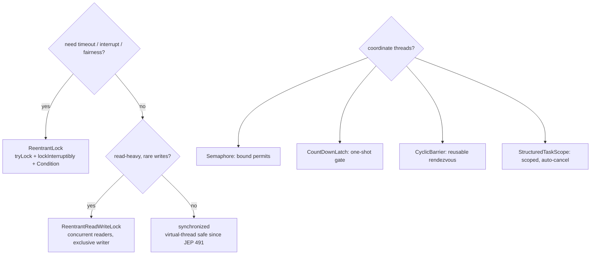
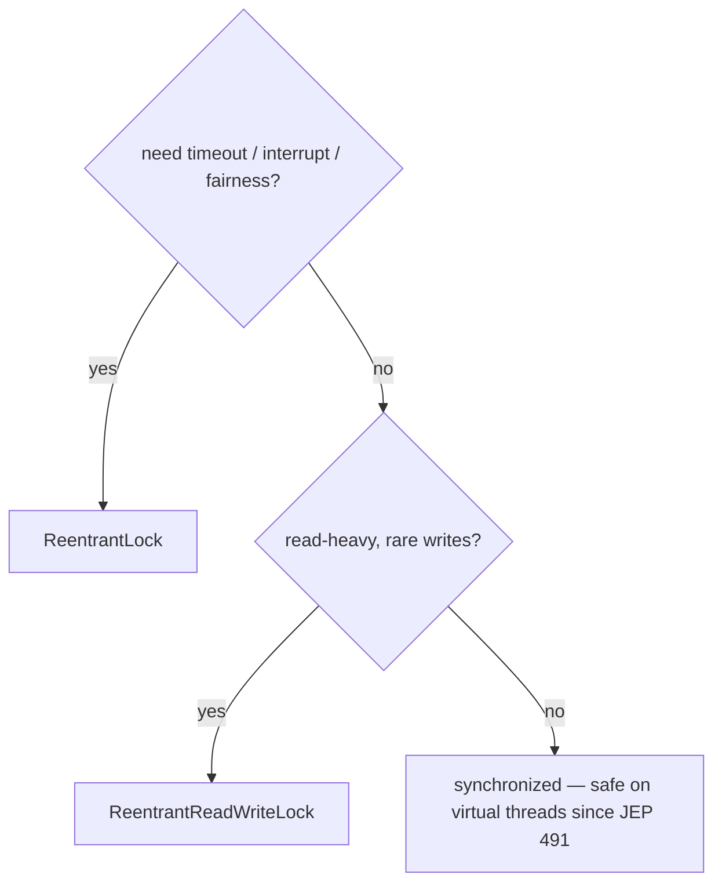

## Why it Matters

1. Timeouts & interruptibility, `lock.tryLock(1, SECONDS)` / `lockInterruptibly()` avoid indefinite blocking.
2. Fairness & read/write split, `ReentrantLock(true)` and `ReadWriteLock` reduce contention for read-heavy workloads.
3. Permits & barriers, `Semaphore` (bounded resource), `CountDownLatch` (one-shot gate), `CyclicBarrier` (reusable rendezvous).
4. Virtual-thread friendliness, On Java 25 all blocking locks park the virtual thread (not the carrier), so throughput is preserved even under contention.

## Diagram



## Code

## When to use / not

| Use | NOT |
|-----|-----|
| `synchronized` for simple invariants , safe on virtual threads since JEP 491 | Holding a lock across blocking IO , no pinning now, but it still serialises other threads |
| `ReentrantLock` when you need `tryLock(timeout)`, `lockInterruptibly()`, fairness, or multiple `Condition`s | `ReentrantLock` when a plain `synchronized` block suffices , extra ceremony, easy to forget `unlock()` |
| `ReadWriteLock` for read-heavy / write-rare caches | `ReadWriteLock` for write-heavy work , write starvation and extra overhead |
| `Semaphore` for bounded resource pools / rate limiting | `Semaphore` as a mutex , `Lock` is the right tool |
| `CountDownLatch` for a one-shot startup gate; `CyclicBarrier` for reusable rendezvous | `CountDownLatch` when the gate must reset , it cannot; use `CyclicBarrier` |
| `StructuredTaskScope` for per-request structured fan-out | `CountDownLatch` + `ExecutorService` when siblings should auto-cancel |

## Trade-offs

> I try to avoid explicit locks unless I really need them. Synchronized is fine in Java 25, it no longer pins virtual threads (JEP 491), so the old advice to replace every synchronized with ReentrantLock feels dated.

Java provides several layers of mutual exclusion and coordination: `synchronized` (intrinsic monitors), `java.util.concurrent.locks` (`ReentrantLock`, `ReadWriteLock`), and synchronizers (`Semaphore`, `CountDownLatch`, `CyclicBarrier`, `Phaser`). They differ in reentrancy, fairness, scope, and whether they block or fail fast.

> Java 25 (JEP 491): `synchronized` no longer pins virtual threads, it unmounts the carrier like `ReentrantLock`. Prefer `synchronized` for simple invariants; reach for `Lock` when you need timeouts, interruptibility, or fairness. For scoped fan-out, consider `StructuredTaskScope` (preview, JEP 505).

## Vs

## Pitfalls

- Forgetting `unlock()` in `finally` → deadlock. Always `lock(); try { ... } finally { unlock(); }`.
- Holding any lock while doing long IO → contention (no longer pins on Java 25, but still serialises).
- `ReadWriteLock` write-starvation if readers continuously hold read lock, consider `StampedLock` or fair mode.
- `CountDownLatch` cannot be reset, create a new instance; `CyclicBarrier` can.
- `Semaphore` permit leak if `release()` not in `finally`.
- Synchronising on boxed primitives / `String` literals (interned, shared globally).

## Interview q&a

**Q: Does `synchronized` pin virtual threads?** No since Java 24 (JEP 491). On Java 21 it pinned the carrier when blocking inside `synchronized`; on Java 25 `synchronized` unmounts like `ReentrantLock`.

**Q: When to prefer `ReentrantLock` over `synchronized`?** When you need `tryLock(timeout)`, `lockInterruptibly()`, fairness, or multiple `Condition`s. Otherwise `synchronized` is simpler and now equally virtual-thread-friendly.

**Q: `ReadWriteLock`, when does it help?** Read-heavy workloads (many readers, few writers), readers proceed concurrently. Write-heavy workloads see no benefit and pay extra overhead.

**Q: `CountDownLatch` vs `CyclicBarrier`?** Latch is one-shot (count down to 0, then open forever); barrier is reusable and trips when *all* parties arrive, optionally running a barrier action.

**Q: `Semaphore` vs `Lock`?** Semaphore controls *number of permits* (N threads can enter); Lock is binary (1 holder). Semaphore is for resource pools / rate limiting.

**Q: Fair vs non-fair `ReentrantLock`?** Non-fair (default) allows barging, higher throughput, possible starvation. Fair (`new ReentrantLock(true)`) queues in order, lower throughput, no starvation. Most apps use non-fair.

**Q: StructuredTaskScope vs CountDownLatch?** `StructuredTaskScope` is *structured*, scoped, auto-cancels siblings on failure, try-with-resources. `CountDownLatch` is unstructured / one-shot, still correct for service-wide gates, but prefer Scope for per-request fan-out.

Does `synchronized` pin virtual threads?:: No since Java 24 (JEP 491). On Java 21 it pinned the carrier when blocking inside `synchronized`; on Java 25 `synchronized` unmounts like `ReentrantLock`. #flashcard
When to prefer `ReentrantLock` over `synchronized`?:: When you need `tryLock(timeout)`, `lockInterruptibly()`, fairness, or multiple `Condition`s. Otherwise `synchronized` is simpler and now equally virtual-thread-friendly. #flashcard
`ReadWriteLock`, when does it help?:: Read-heavy workloads (many readers, few writers), readers proceed concurrently. Write-heavy workloads see no benefit and pay extra overhead. #flashcard
`CountDownLatch` vs `CyclicBarrier`?:: Latch is one-shot (count down to 0, then open forever); barrier is reusable and trips when *all* parties arrive, optionally running a barrier action. #flashcard
`Semaphore` vs `Lock`?:: Semaphore controls *number of permits* (N threads can enter); Lock is binary (1 holder). Semaphore is for resource pools / rate limiting. #flashcard
Fair vs non-fair `ReentrantLock`?:: Non-fair (default) allows barging, higher throughput, possible starvation. Fair (`new ReentrantLock(true)`) queues in order, lower throughput, no starvation. Most apps use non-fair. #flashcard
StructuredTaskScope vs CountDownLatch?:: `StructuredTaskScope` is *structured*, scoped, auto-cancels siblings on failure, try-with-resources. `CountDownLatch` is unstructured / one-shot, still correct for service-wide gates, but prefer Scope for per-request fan-out. #flashcard

- [1115. Print Foobar Alternately](https://leetcode.com/problems/print-foobar-alternately/)
- [1226. The Dining Philosophers](https://leetcode.com/problems/the-dining-philosophers/)
- [1114. Print In Order](https://leetcode.com/problems/print-in-order/)

---
*Category: Concurrency • Part of [[README|Java MOC]] • Java 25*

## Related

- [[Threads]], lifecycle, JEP 491 pinning fix, ScopedValue
- [[Executor Framework]], executors that use these locks internally
- [[Concurrent Collections]], lock-free / striped alternatives to locking
- [[Atomics and Volatile]], CAS vs locking

# Locks and Synchronizers

> Part of [[README|Java MOC]] • `Concurrency` • Java 25 (LTS)

## Core Mechanisms

### Lock Choice (Java 25)



### `synchronized`, Intrinsic Monitor

```java
class Counter {
 private int c = 0;
 public synchronized void inc() { c++; }
 public synchronized int get() { return c; }
}
```
- Reentrant, `BLOCKED` state on contention, released on exit / exception.
- JEP 491 (Java 24/25): blocking inside `synchronized` unmounts the virtual thread, no longer pins the carrier.

### `ReentrantLock`, Explicit Lock

```java
import java.util.concurrent.locks.ReentrantLock;
import java.time.Duration;

class ExplicitCounter {
 private final ReentrantLock lock = new ReentrantLock();
 private int c = 0;
 void inc() {
 lock.lock();
 try { c++; } finally { lock.unlock(); }
 }
 boolean tryInc(Duration timeout) throws InterruptedException {
 if (lock.tryLock(timeout.toSeconds(), java.util.concurrent.TimeUnit.SECONDS)) {
 try { c++; return true; } finally { lock.unlock(); }
 }
 return false;
 }
}
```

### `ReadWriteLock`, Read/write Split

```java
import java.util.concurrent.locks.*;

class CachedData {
 private final ReadWriteLock rwl = new ReentrantReadWriteLock();
 private String data;

 String read() {
 rwl.readLock().lock();
 try { return data; } finally { rwl.readLock().unlock(); }
 }
 void write(String v) {
 rwl.writeLock().lock();
 try { data = v; } finally { rwl.writeLock().unlock(); }
 }
}
```

### Synchronizers,`Semaphore`,`CountDownLatch`,`CyclicBarrier`,`Phaser`

```java
import java.util.concurrent.*;

class Synchronizers {
 final Semaphore permits = new Semaphore(10);
 void use() throws InterruptedException {
 permits.acquire();
 try { /* use resource */ } finally { permits.release(); }
 }

 void awaitAll() throws InterruptedException {
 var latch = new CountDownLatch(3);
 for (int i = 0; i < 3; i++) new Thread(() -> { /* work */ latch.countDown(); }).start();
 latch.await();
 }

 final CyclicBarrier barrier = new CyclicBarrier(3, () -> System.out.println("all arrived"));
 void meet() throws Exception { barrier.await(); }
}
```

## Java 25 Changes

| Topic | Java 21 behaviour | Java 25 (JEP 491/505/506) |
|---|---|---|
| `synchronized` + blocking IO/`sleep` | Pinned carrier → throughput collapse | Not pinned, virtual thread unmounts, carrier reused |
| `ReentrantLock` + blocking | Never pinned | Unchanged, still parks virtual thread |
| Scoped coordination | `CountDownLatch` / `invokeAll` manual | `StructuredTaskScope.ShutdownOnFailure`, structured, auto-cancels on failure |
| Context | `ThreadLocal` leaked across virtual threads | `ScopedValue` (JEP 506), immutable, auto-inherited |

> StructuredTaskScope note (JEP 505, preview): When a *set of tasks* must complete together (scatter-gather per request), `StructuredTaskScope` replaces ad-hoc `CountDownLatch` + `ExecutorService`. One-shot latches/barriers remain correct for long-lived services and cross-request coordination. Use try-with-resources and `--enable-preview`.
```java
import java.util.concurrent.StructuredTaskScope;
class ScopedGather {
 String gather() throws Exception {
 try (var scope = new StructuredTaskScope.ShutdownOnFailure()) {
 var a = scope.fork(() -> "from-a");
 var b = scope.fork(() -> "from-b");
 scope.join();
 scope.throwIfFailed();
 return a.get() + b.get();
 }
 }
}
```

### `synchronized`Vs`ReentrantLock`

| Aspect | `synchronized` | `ReentrantLock` |
|---|---|---|
| Syntax | Keyword, auto-release on exit | Explicit `lock()`/`unlock()` in `finally` |
| Reentrant | Yes | Yes |
| Try-lock / timeout | No (blocks indefinitely) | `tryLock()`, `tryLock(timeout)`, `lockInterruptibly()` |
| Fairness | Non-fair (monitor) | Fair or non-fair (constructor flag) |
| Condition vars | Single `wait/notify` per monitor | Multiple `Condition` objects (`newCondition()`) |
| Virtual-thread pinning (Java 25) | No (JEP 491 fixed) | No (never pinned) |
| Use when | Simple invariants, single condition | Timeouts, interruptibility, fairness, multiple conditions |

### `ReadWriteLock`Vs`ReentrantLock`Vs`synchronized`

| Lock | Concurrent readers | Writer exclusivity | Overhead | Best for |
|---|---|---|---|---|
| `synchronized` | 1 at a time | Exclusive | Lowest | Simple, low-contention |
| `ReentrantLock` | 1 at a time | Exclusive | Low | Need timeout/fairness |
| `ReentrantReadWriteLock` | Many readers concurrently | Exclusive writer, blocks readers | Higher (two locks) | Read-heavy (cache, config) |

### `CountDownLatch`Vs`CyclicBarrier`Vs`Semaphore`Vs`Phaser`

| Synchronizer | Counts | Reusable? | Blocks | Typical use |
|---|---|---|---|---|
| `CountDownLatch(n)` | Down to 0 | No (one-shot) | `await()` until 0 | Wait for N tasks to finish (startup gate) |
| `CyclicBarrier(n)` | Parties arrive | Yes (resets) | `await()` until all arrive | Iterative phased computation |
| `Semaphore(n)` | Permits | Yes (acquire/release) | `acquire()` if 0 permits | Bound resource pool, rate limiting |
| `Phaser` | Dynamic parties | Yes | `arriveAndAwaitAdvance()` | Dynamic fork-join phases |

### `Semaphore`Vs`CountDownLatch`Mental Model

| | `Semaphore` | `CountDownLatch` |
|---|---|---|
| Direction | Acquire before use, release after | Count down as work completes |
| Who blocks | Acquirer when permits exhausted | Awaiter until count is 0 |

### `synchronized`Vs`ReentrantLock`Demo (Both Park Virtual Threads)

```java
import java.util.concurrent.*;
import java.util.concurrent.locks.ReentrantLock;
import java.time.Duration;

class LockComparison {
 static class SyncCounter {
 private int c = 0;
 public synchronized void incAndSleep() throws InterruptedException {
 c++;
 Thread.sleep(Duration.ofMillis(50));
 }
 public synchronized int get() { return c; }
 }

 static class ExplicitCounter {
 private final ReentrantLock lock = new ReentrantLock();
 private int c = 0;
 void inc() { lock.lock(); try { c++; } finally { lock.unlock(); } }
 boolean tryInc(Duration d) throws InterruptedException {
 if (lock.tryLock(d.toMillis(), java.util.concurrent.TimeUnit.MILLISECONDS)) {
 try { c++; return true; } finally { lock.unlock(); }
 }
 return false;
 }
 }
}
```

### ReadWriteLock, Read-heavy Cache

```java
import java.util.concurrent.locks.*;
import java.util.concurrent.*;
import java.time.Duration;

class CacheDemo {
 private final ReadWriteLock rwl = new ReentrantReadWriteLock();
 private String cached;

 String get() {
 rwl.readLock().lock();
 try { return cached; } finally { rwl.readLock().unlock(); }
 }
 void refresh(String v) {
 rwl.writeLock().lock();
 try { cached = v; } finally { rwl.writeLock().unlock(); }
 }
}
```

### Semaphore, Bounded Pool + CountDownLatch Gate

```java
import java.util.concurrent.*;
import java.time.Duration;

class PoolDemo {
 private final Semaphore pool = new Semaphore(5);

 void useResource() throws InterruptedException {
 pool.acquire();
 try { Thread.sleep(Duration.ofMillis(100)); }
 finally { pool.release(); }
 }
}
```