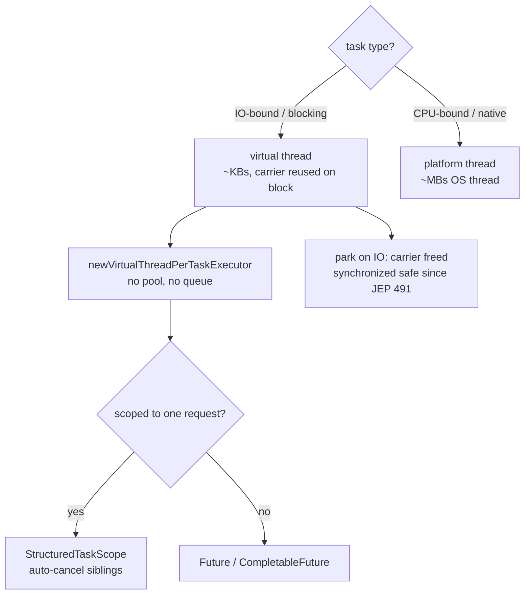
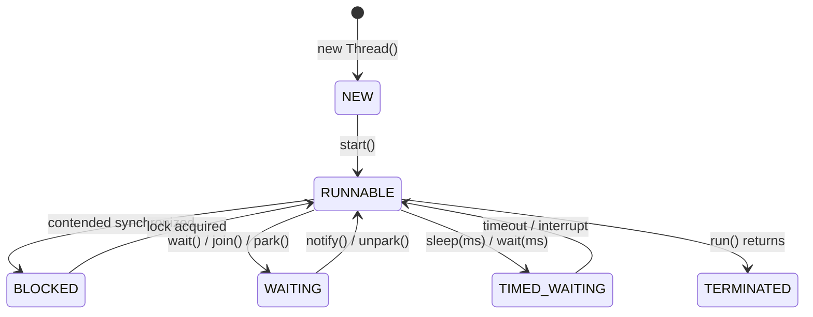
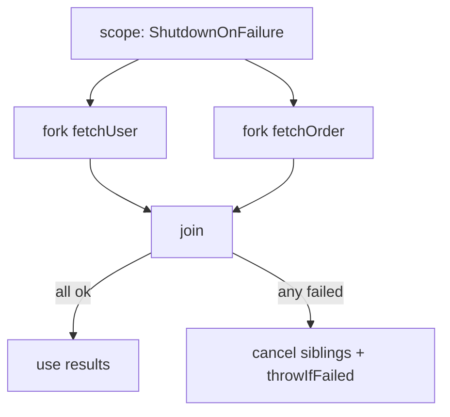

## Why it Matters

1. Better CPU & IO utilisation, one thread can compute while another waits on IO (virtual threads make blocking IO essentially free).
2. Responsiveness: UI / server stays responsive while background work runs.
3. Throughput & scalability, handle many concurrent requests (web servers, async pipelines). Virtual threads enable millions of concurrent tasks on the same hardware.
4. Natural modelling, independent tasks map to independent threads, now without thread-pool tuning.

## Diagram



## Code

```java
// Java 25 default: one virtual thread per task, try-with-resources lifecycle
import java.util.concurrent.Executors;

try (var exec = Executors.newVirtualThreadPerTaskExecutor()) {
 var f1 = exec.submit(() -> fetch("user"));
 var f2 = exec.submit(() -> fetch("order"));
 System.out.println(f1.get() + " " + f2.get());
}

// JEP 491: synchronized no longer pins the carrier
synchronized void incAndIO() throws InterruptedException {
 count++;
 Thread.sleep(java.time.Duration.ofMillis(50)); // unmounts, carrier reused
}

// ScopedValue (JEP 506) replaces ThreadLocal for request context
static final ScopedValue<String> REQ_ID = ScopedValue.newInstance();
void handle(String id) {
 ScopedValue.where(REQ_ID, id).run(() -> log(REQ_ID.get()));
}
```

## When to use / not

| Use | NOT |
|-----|-----|
| Virtual threads for IO-bound work (HTTP, DB, file, `sleep`) | CPU-bound tight loops , platform threads or `ForkJoinPool` are faster |
| `newVirtualThreadPerTaskExecutor()` , no pool tuning, no queue | `newFixedThreadPool(N)` for IO , queue builds up, platform threads cap concurrency |
| Platform threads for CPU-bound, JNI/native, and `ForkJoinPool` work | Raw `new Thread().start()` , no lifecycle, no queuing, ~MBs per thread |
| `ScopedValue` for request/tenant context | `ThreadLocal` with virtual threads , bloat and leaks |
| `StructuredTaskScope` when subtasks must fail or cancel together | `Thread.stop()` , deprecated and unsafe; use `volatile` flag or interrupt |

## Trade-offs

A Thread is the smallest unit of execution inside a process. The JVM starts with a main thread and can spawn additional threads to utilise CPU/IO in parallel.

> If you take one thing from this note, make it this: virtual threads are cheap, platform threads are not, and ThreadLocal will bite you on virtual threads. ScopedValue is the fix, even if the API feels unfamiliar at first. I keep coming back to this when debugging.

> Java 21+ / 25 default shift: Virtual threads (Project Loom, finalised in Java 21, JEP 444) are now the default recommendation for IO-bound concurrency in Java 25. Platform threads (`Thread.ofPlatform()`) remain for CPU-bound / native-critical work, but most application code, especially servers, should use virtual threads via `Executors.newVirtualThreadPerTaskExecutor()`.

## Vs

| | Platform thread | Virtual thread |
|--|----------------|----------------|
| Cost | ~1MB OS thread, kernel-scheduled | ~KBs, user-mode, carrier-scheduled |
| Best for | CPU-bound, JNI/native | IO-bound, blocking calls |
| `synchronized` + block (Java 21) | N/A | pinned carrier |
| `synchronized` + block (Java 25) | N/A | not pinned (JEP 491) |
| Context | `ThreadLocal` | `ScopedValue` (JEP 506) |
| Pool | `newFixedThreadPool(n)` | `newVirtualThreadPerTaskExecutor()` |

## Pitfalls

- Holding a lock while doing IO / long compute → contention (congestion). On Java 25 no longer pins, but still contends.
- Synchronising on mutable / interned objects (`String`, boxed primitives).
- Forgetting to handle `InterruptedException` (swallowing without restoring interrupt bit).
- Double-checked locking without `volatile`.
- Using `ThreadLocal` with virtual threads at scale → memory bloat & leaks → use `ScopedValue`.
- Forgetting try-with-resources on `newVirtualThreadPerTaskExecutor()` / `StructuredTaskScope` → leaked threads.
- Enabling `--enable-preview` for `StructuredTaskScope` but forgetting the flag at runtime.

## Interview q&a

**Q: `start()` vs `run()`?** `start()` spawns a new call stack and transitions to RUNNABLE; `run()` is just a normal method call on the current thread.

**Q: Can a thread be restarted?** No, once TERMINATED, `start()` throws `IllegalThreadStateException`; create a new `Thread` instance.

**Q: What is `ThreadLocal`?** Per-thread storage; each thread sees its own copy. Useful for `SimpleDateFormat`, request context. Must `remove()` in pooled threads to avoid leaks. **On Java 25 prefer `ScopedValue` for virtual threads**, see table above.

**Q: Why prefer `ExecutorService` over raw `Thread`?** Pooling, queuing, lifecycle management, `Future`/`CompletableFuture`, saturation policies, raw threads are expensive and unbounded. **On Java 25 use `newVirtualThreadPerTaskExecutor()`, no tuning needed.**

**Q: Spurious wakeups?** `wait()` may return without `notify()` (OS/JVM spec). Always wait in a `while` predicate loop.

**Q: Virtual threads (Java 21 → 25)?** Lightweight user-mode threads (Project Loom) scheduled on carrier threads; `Thread.ofVirtual().start(task)` or `Executors.newVirtualThreadPerTaskExecutor()`. Great for blocking IO-heavy workloads. **Java 25 defaults to virtual threads for servers (`spring.threads.virtual.enabled=true`). Pinning fixed by JEP 491. Structured Concurrency (JEP 505) and ScopedValue (JEP 506) are the companion APIs.**

**Q: Does `synchronized` pin virtual threads?** No on Java 25 (JEP 491, Java 24+). It did on Java 21, now `synchronized` unmounts like `ReentrantLock`.

**Q: When to use `ScopedValue` vs `ThreadLocal`?** `ScopedValue` for request/tenant context with virtual/structured threads, immutable, auto-cleared, inherited. `ThreadLocal` only for legacy APIs that require it.

`start()` vs `run()`?:: `start()` spawns a new call stack and transitions to RUNNABLE; `run()` is just a normal method call on the current thread. #flashcard
Can a thread be restarted?:: No, once TERMINATED, `start()` throws `IllegalThreadStateException`; create a new `Thread` instance. #flashcard
What is `ThreadLocal`?:: Per-thread storage; each thread sees its own copy. Useful for `SimpleDateFormat`, request context. Must `remove()` in pooled threads to avoid leaks. **On Java 25 prefer `ScopedValue` for virtual threads**, see table above. #flashcard
Why prefer `ExecutorService` over raw `Thread`?:: Pooling, queuing, lifecycle management, `Future`/`CompletableFuture`, saturation policies, raw threads are expensive and unbounded. **On Java 25 use `newVirtualThreadPerTaskExecutor()`, no tuning needed.** #flashcard
Spurious wakeups?:: `wait()` may return without `notify()` (OS/JVM spec). Always wait in a `while` predicate loop. #flashcard
Virtual threads (Java 21 → 25)?:: Lightweight user-mode threads (Project Loom) scheduled on carrier threads; `Thread.ofVirtual().start(task)` or `Executors.newVirtualThreadPerTaskExecutor()`. Great for blocking IO-heavy workloads. **Java 25 defaults to virtual threads for servers (`spring.threads.virtual.enabled=true`). Pinning fixed by JEP 491. Structured Concurrency (JEP 505) and ScopedValue (JEP 506) are the companion APIs.** #flashcard
Does `synchronized` pin virtual threads?:: No on Java 25 (JEP 491, Java 24+). It did on Java 21, now `synchronized` unmounts like `ReentrantLock`. #flashcard
When to use `ScopedValue` vs `ThreadLocal`?:: `ScopedValue` for request/tenant context with virtual/structured threads, immutable, auto-cleared, inherited. `ThreadLocal` only for legacy APIs that require it. #flashcard

- [1115. Print Foobar Alternately](https://leetcode.com/problems/print-foobar-alternately/)
- [1114. Print In Order](https://leetcode.com/problems/print-in-order/)
- [1116. Print Zero Even Odd](https://leetcode.com/problems/print-zero-even-odd/)

---
*Category: Concurrency • Part of [[README|Java MOC]] • Java 25*

## Related

- [[README|Java MOC]]
- [[Array]], thread-safe variants `CopyOnWriteArrayList`
- [[Java/07_DSA/HashMap|HashMap (DSA)]], vs `ConcurrentHashMap`
- [[Spring Framework]], `spring.threads.virtual.enabled=true` (Boot 3.2+/3.5)
- [[Spring Security]], SecurityContext propagation with virtual threads
- [[Spring Transaction]], TransactionSynchronizationManager + ScopedValue

# Threads

> Part of [[README|Java MOC]] • `Concurrency` • Java 25 (LTS)

## Thread Lifecycle

| State | `Thread.State` | How it is entered | How it leaves |
|---|---|---|---|
| New | `NEW` | `new Thread(r)` created, `start()` not yet called | `start()` → Runnable |
| Runnable | `RUNNABLE` | `start()` called; thread eligible for CPU | Scheduler picks it → Running; `yield()`/`time-slice` stays Runnable |
| Running | `RUNNABLE` | Actually executing `run()` on CPU | `sleep()`/`wait()`/`park()` → Timed/Waiting; `run()` returns → Terminated |
| Blocked | `BLOCKED` | Waiting to acquire a `synchronized` monitor | Lock acquired → Runnable |
| Waiting | `WAITING` | `Object.wait()`, `Thread.join()`, `LockSupport.park()` | `notify()`/`notifyAll()`/`unpark()`/join completes → Runnable |
| Timed Waiting | `TIMED_WAITING` | `Thread.sleep(ms)`, `wait(timeout)`, `join(timeout)`, `parkNanos()` | Timeout or signal → Runnable |
| Terminated (Dead) | `TERMINATED` | `run()` completed or uncaught exception | Terminal, cannot be restarted |

> Call `start()` exactly once; a second call throws `IllegalThreadStateException`. A **virtual thread** parks (same `Thread.State`) while its **carrier** stays `RUNNABLE` and is reused , no pinning since **JEP 491**.

Related image: ![[Pasted image 20211116081758.png]]

> Virtual-thread lifecycle note (Java 25): Virtual threads use the same `Thread.State` enum but their carrier thread stays `RUNNABLE` while the virtual thread is parked (blocked on IO / `sleep`). Pinning no longer applies (see JEP 491 below), so `synchronized` park no longer pins the carrier.

### Lifecycle Helpers

| Method | Effect | Releases lock? |
|---|---|---|
| `start()` | Transitions NEW→RUNNABLE, invokes `run()` on new call stack |, |
| `sleep(ms)` | Current thread → TIMED_WAITING | No |
| `yield()` | Hint to scheduler, stays RUNNABLE | No |
| `join()` | Caller → WAITING until target terminates | No |
| `Object.wait()` | Current thread → WAITING (must own monitor) | Yes |
| `notify()/notifyAll()` | Wakes waiting threads on same monitor |, |

## Creating Threads (Java 25)

### Extend`Thread`, Legacy, Avoid for new Code

```java
public class ThreadAPI1 {
 public static class MyThread extends Thread {
 @Override public void run() {
 System.out.println("Running: " + Thread.currentThread());
 }
 }
 public static void main(String[] args) throws InterruptedException {
 Thread platform = Thread.ofPlatform().name("platform-1").unstarted(new MyThread());
 Thread virtual = Thread.ofVirtual().name("virtual-1").unstarted(new MyThread());
 platform.start(); virtual.start();
 platform.join(); virtual.join();
 }
}
```
*Pros:* Simple. *Cons:* Single-inheritance consumed; poor separation of task vs. thread. Prefer `Thread.ofVirtual()` over `extends Thread`.
### Implement`Runnable`

```java
public class ThreadAPI4 implements Runnable {
 @Override public void run() {
 System.out.println("Runnable on: " + Thread.currentThread());
 }
 public static void main(String[] args) throws InterruptedException {
 Thread vt = Thread.ofVirtual().name("worker").start(new ThreadAPI4());
 vt.join();
 }
}
```
Preferred when task logic should be decoupled from thread mechanics.
### Lambda`Runnable`(Java 8+)

```java
public class ThreadAPI2and3 {
 public static void main(String[] args) throws InterruptedException {
 Runnable task = () -> System.out.println("Lambda on: " + Thread.currentThread());

 Thread t1 = Thread.ofVirtual().start(task);
 Thread t2 = Thread.ofPlatform().start(task);
 t1.join(); t2.join();
 }
}
```

### `Callable<T>`+ Virtual-thread-per-task (Java 25 Default)

> Java 25 change: Replace fixed/cached thread pools with virtual-thread-per-task executors for almost all IO-bound workloads. No tuning, no queue saturation, no thread starvation.

#### Preferred:`newVirtualThreadPerTaskExecutor()`

```java
import java.util.concurrent.*;

public class CallableDemo {
 public static void main(String[] args) throws Exception {
 Callable<Integer> task = () -> {
 Thread.sleep(java.time.Duration.ofMillis(200));
 return 42;
 };

 try (ExecutorService executor = Executors.newVirtualThreadPerTaskExecutor()) {
 Future<Integer> f1 = executor.submit(task);
 Future<Integer> f2 = executor.submit(task);
 System.out.println("Results: " + f1.get() + ", " + f2.get());
 }
 }
}
```
Why this is the Java 25 default: Each submission gets its own virtual thread (lightweight, ~KBs). `close()` (via try-with-resources) is required, it awaits termination. No `shutdown()`/`awaitTermination()` dance. `CompletableFuture`, `ForkJoinTask` still work but are rarely needed for IO fan-out.
#### Custom Factory:`newThreadPerTaskExecutor(factory)`

```java
import java.util.concurrent.*;

public class CustomFactoryDemo {
 public static void main(String[] args) throws Exception {
 ThreadFactory factory = Thread.ofVirtual()
 .name("virtual-worker-", 0)
 .factory();

 try (ExecutorService executor = Executors.newThreadPerTaskExecutor(factory)) {
 var futures = java.util.stream.IntStream.range(0, 100)
 .mapToObj(i -> executor.submit(() -> "task-" + i))
 .toList();
 for (var f : futures) f.get();
 }

 }
}
```
Use `Thread.ofVirtual().factory()` when you need to customise name, `ThreadLocal` inheritance, or pass a factory to libraries (e.g. `Tomcat`, custom `ForkJoinPool`). Equivalent to `newVirtualThreadPerTaskExecutor()` but explicit.
#### Structured Concurrency over raw Futures

```java
import java.util.concurrent.CompletableFuture;
import java.util.concurrent.Executors;

class CfDemo {
 static void demo() throws Exception {
 try (var exec = Executors.newVirtualThreadPerTaskExecutor()) {
 var cf = CompletableFuture.supplyAsync(() -> 42, exec);
 System.out.println(cf.get());
 }
 }
}
```

## JEP 491, Synchronized no Longer Pins (Java 24/25)

> Before Java 24: A virtual thread entering a `synchronized` block/method pinned its carrier thread, the carrier could not be reused while the virtual thread blocked, negating scalability if you synchronised around IO.

> Java 24+ (JEP 491, Synchronize Virtual Threads without Pinning): `synchronized` no longer pins the carrier. The virtual thread unmounts from the carrier while blocked inside `synchronized`, exactly like `ReentrantLock`.

What changed:

| Scenario | Java 21 behaviour | Java 25 (JEP 491) |
|---|---|---|
| `synchronized` + `Thread.sleep()` / blocking IO | Pinned, carrier blocked, throughput collapses | Not pinned, virtual thread unmounts, carrier reused |
| `ReentrantLock` + blocking | Never pinned (always unmounted) | No change, still not pinned |
| Recommendation | Avoid `synchronized` around IO; use `ReentrantLock` | `synchronized` is safe again, use either, but `ReentrantLock` still preferred for timeouts/interrupts |
```java
class SafeCounter {
 private int count = 0;
 public synchronized void incrementAndCallRemote() throws Exception {
 count++;
 Thread.sleep(java.time.Duration.ofMillis(100));
 }
}

import java.util.concurrent.locks.ReentrantLock;
class ExplicitLock {
 private final ReentrantLock lock = new ReentrantLock();
 void doWork() throws InterruptedException {
 if (lock.tryLock(java.time.Duration.ofSeconds(1))) {
 try { Thread.sleep(java.time.Duration.ofMillis(100)); }
 finally { lock.unlock(); }
 }
 }
}
```
> Interview note: If asked "does `synchronized` pin virtual threads?", answer: No since Java 24 (JEP 491). On Java 21 it did; on Java 25 it does not.

## Structured Concurrency,`StructuredTaskScope`(Preview, jep 505, Java 25)

Structured concurrency treats a group of concurrent subtasks as a single unit: all subtasks are scoped, failures propagate, and cancellation is automatic. In Java 25 it is a preview API (`--enable-preview`).

```java
import
 java.util.concurrent.StructuredTaskScope;
import java.time.Duration;

class StructuredDemo {

 record User(String name), Order(String id) {}

 User fetchUser(String id) throws InterruptedException {
 Thread.sleep(Duration.ofMillis(200)); return new User("alice");
 }
 Order fetchOrder(String id) throws InterruptedException {
 Thread.sleep(Duration.ofMillis(300)); return new Order("o-42");
 }

 String handle(String userId, String orderId) throws Exception {
 try (var scope = new StructuredTaskScope.ShutdownOnFailure()) {
 var userTask = scope.fork(() -> fetchUser(userId));
 var orderTask = scope.fork(() -> fetchOrder(orderId));

 scope.join();
 scope.throwIfFailed();

 return userTask.get() + " -> " + orderTask.get();
 }
 }

 String firstWins() throws Exception {
 try (var scope = new StructuredTaskScope.ShutdownOnSuccess<String>()) {
 scope.fork(() -> fetchFromReplica("a"));
 scope.fork(() -> fetchFromReplica("b"));
 scope.join();
 return scope.result();
 }
 }
 String fetchFromReplica(String r) throws InterruptedException {
 Thread.sleep(Duration.ofMillis(150)); return "from-" + r;
 }
}
```
Scope types:

| Scope | Behaviour | Use when |
|---|---|---|
| `ShutdownOnFailure` | If any subtask fails, cancel remaining; `throwIfFailed()` rethrows | Fan-out where all results are required (scatter-gather) |
| `ShutdownOnSuccess<T>` | First success cancels rest; `result()` returns it | Hedged requests / racing replicas |

Rules: Must use try-with-resources (scope enforces structure). `fork()` must be called from the scope owner thread. Virtual threads are used automatically.

## `ScopedValue`(JEP 506) vs`ThreadLocal`

`ThreadLocal` is problematic with virtual threads (millions of threads × mutable `ThreadLocal` = leaks, expensive, incompatible with structured concurrency). ScopedValue (finalised in Java 25, JEP 506) is the replacement: immutable, bounded by scope, automatically inherited by child virtual/structured tasks, no `remove()` needed.
```java
import
 java.util.concurrent.StructuredTaskScope;

class ContextDemo {
 static final ScopedValue<String> REQUEST_ID = ScopedValue.newInstance();

 void handleRequest(String id) throws Exception {
 ScopedValue.where(REQUEST_ID, id).run(() -> {
 try (var scope = new StructuredTaskScope.ShutdownOnFailure()) {
 scope.fork(() -> log("subtask: " + REQUEST_ID.get()));
 scope.join();
 scope.throwIfFailed();
 } catch (Exception e) { throw new RuntimeException(e); }
 });
 }

 void log(String m) { System.out.println(m); }
}
```
| Aspect | `ThreadLocal` | `ScopedValue` (JEP 506, Java 25) |
|---|---|---|
| Mutability | Mutable `set()`/`remove()`, must clean up | Immutable binding per `where(...).run/call` scope |
| Inheritance | `InheritableThreadLocal` copies at thread creation (costly, snapshot) | Automatic for virtual & structured child tasks, no copy |
| Cost with virtual threads | High, millions × map entries, leak-prone | Cheap, single binding, no per-thread map |
| Cleanup | Manual `remove()` in `finally` (pools leak if forgotten) | Automatic, unbound when scope exits |
| Structured Concurrency | Not propagated correctly into `StructuredTaskScope` | First-class, forked subtasks see the binding |
| Use when | Legacy platform-thread pools, `SimpleDateFormat` (but prefer `DateTimeFormatter`) | All new code on Java 25, especially virtual/structured threads; request context, tenant, correlation ID |

> Migration rule (Java 25): New code uses `ScopedValue`. Keep `ThreadLocal` only for legacy libraries that require it. Spring 6.2+/Boot 3.4+ propagates `ScopedValue` through `TransactionSynchronizationManager` and `SecurityContext` where applicable.

## Virtual Threads, Defaults & Tuning (Java 25)

- Default for IO-bound work. If your task blocks on network, DB, file, or `sleep`, use virtual threads. Platform threads are for CPU-bound, `ForkJoinPool`, or JNI.
- No pool tuning. `newVirtualThreadPerTaskExecutor()` has no core/max size, no queue. Submit and forget.
- Carrier pool: JVM-managed `ForkJoinPool` sized to `Runtime.getRuntime().availableProcessors()`. Override only for testing: `-Djdk.virtualThreadScheduler.parallelism=N` or `-Djdk.virtualThreadScheduler.maxPoolSize=N`.
- Monitoring: `Thread.ofVirtual()` threads appear in thread dumps / JFR with `virtual` flag; `jcmd Thread.dump_to_file` includes them; Micrometer `jvm.threads.virtual` gauges.
- Pinning is gone (JEP 491) but avoid long `synchronized` + native/JNI pinning, native frames still pin.
- Spring Boot 3.2+/3.5: set `spring.threads.virtual.enabled=true` to run Tomcat/Jetty + `@Async` on virtual threads (see [[Spring Framework]]).

## Stopping a Thread, Cooperative Cancellation

```java
java
public class StoppableRunnable implements Runnable {
 private volatile boolean stopRequested = false;
 public void requestStop() { stopRequested = true; }
 public boolean isStopRequested() { return stopRequested; }

 @Override public void run() {
 while (!stopRequested && !Thread.currentThread().isInterrupted()) {
 try { Thread.sleep(java.time.Duration.ofMillis(500)); }
 catch (InterruptedException e) {
 Thread.currentThread().interrupt();
 break;
 }
 }
 }
}
```

## Concurrency Issues

| # | Issue | What happens | Typical cause | Fix |
|---|---|---|---|---|
| 1 | Race Condition | Two threads read-modify-write shared state; final result depends on interleaving | Unsynchronised access to mutable shared variable (`count++` is not atomic) | `synchronized`, `AtomicInteger`, `ReentrantLock`, or thread confinement |
| 2 | Visibility / Invisible Writes | Thread A writes a value but Thread B never sees it (stale cache) | No happens-before edge; JMM allows cached reads | `volatile`, `synchronized`, `final` publish, `Atomic*` |
| 3 | Lost Signals / Missed Signals | `notify()` fires before `wait()` starts → waiter blocks forever | Unconditional `wait()` without predicate loop | Always `while (!condition) wait()` + `notifyAll()` |
| 4 | Slipped Conditions (Check-then-act) | Condition passes, but is invalid by the time the action runs | Gap between `if (condition)` and acting, without holding lock | Guard the whole check+act with `synchronized` or `compareAndSet` |
| 5 | Deadlock | Threads block forever waiting for each other's locks (circular wait) | Nested locks acquired in inconsistent order | Global lock ordering, `tryLock(timeout)`, lock hierarchy, `Lock` with timeout |
| 6 | Starvation | Some threads never get CPU/lock because others are favoured | Unfair locks, high-priority threads monopolise scheduler | `ReentrantLock(true)` (fair), bounded pools, priority hygiene |
| 7 | Congestion / Livelock & Thread Contention | Many threads contend for one lock → poor throughput; livelock: threads keep reacting to each other without progress | Coarse-grained synchronisation, retry loops without back-off | Finer-grained locks, lock-free structures (`ConcurrentHashMap`), exponential back-off |

> Additional: False sharing, priority inversion, and memory consistency errors are variants of 2/7.

> Java 25 addendum: Virtual threads make contention cheaper to diagnose (thread dumps list millions of virtual threads) but do not fix lock contention, still scope locks narrowly. Use `ScopedValue` instead of `ThreadLocal` to avoid virtual-thread memory bloat.

## `volatile`Vs`synchronized`Vs`java.util.concurrent`

| Aspect | `volatile` | `synchronized` | `java.util.concurrent` (Lock, Atomic, Concurrent Collections) |
|---|---|---|---|
| Scope | Single variable visibility + ordering | Block/method mutual exclusion + visibility | Fine-grained, composable primitives |
| Atomicity | Only single read/write atomic | Compound actions atomic within section | CAS-based lock-free atomicity |
| Blocking | Never blocks | Blocks contending threads (monitor), on Java 25 no longer pins virtual threads | Often non-blocking (CAS spin) or explicit `Lock.tryLock()` |
| Use when | Flag / safe publication | Invariant spanning multiple variables | High contention, complex coordination |
| Cost | Cheapest | Heavier (monitor enter/exit) but pinning-free on Java 25 | Varies; often best throughput |

Happens-before rules to remember: `volatile` write → subsequent read; `synchronized` exit → next entry on same monitor; `Thread.start()` → first action in new thread; `Thread.join()` completion → after thread termination; `ExecutorService.submit()` → task execution.

## Thread vs Process

| | Thread (lightweight) | Process (heavyweight) |
|---|---|---|
| Memory | Shares heap/metaspace within process | Isolated address space |
| Creation cost | Cheap (virtual threads: ~KBs, near-zero) | Expensive (fork) |
| Communication | Shared memory (needs synchronisation); `ScopedValue` for context | IPC / sockets |
| Crash isolation | One thread crash may kill JVM | Process isolation |

## Producer-consumer

```java
class BoundedBuffer<T> {
 private final java.util.Queue<T> q = new java.util.ArrayDeque<>();
 private final int cap;
 BoundedBuffer(int cap) { this.cap = cap; }

 public synchronized void put(T v) throws InterruptedException {
 while (q.size() == cap) wait();
 q.add(v);
 notifyAll();
 }
 public synchronized T take() throws InterruptedException {
 while (q.isEmpty()) wait();
 T v = q.remove();
 notifyAll();
 return v;
 }
}
```
```java
import java.util.concurrent.*;

class ModernBuffer<T> {
 private final BlockingQueue<T> q;
 ModernBuffer(int cap) { this.q = new ArrayBlockingQueue<>(cap); }
 void put(T v) throws InterruptedException { q.put(v); }
 T take() throws InterruptedException { return q.take(); }

 static void demo() throws Exception {
 var buf = new ModernBuffer<String>(10);
 try (var exec = Executors.newVirtualThreadPerTaskExecutor()) {
 exec.submit(() -> { try { buf.put("hello"); } catch (InterruptedException e) { Thread.currentThread().interrupt(); } });
 Future<String> f = exec.submit(() -> buf.take());
 System.out.println(f.get());
 }
 }
}
```