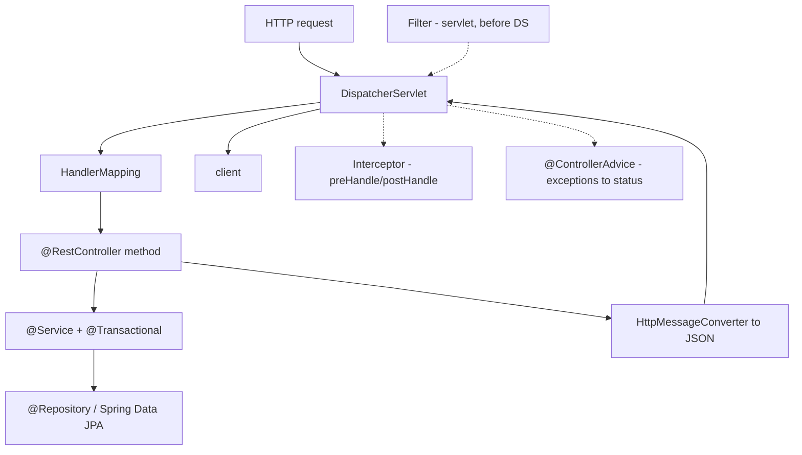
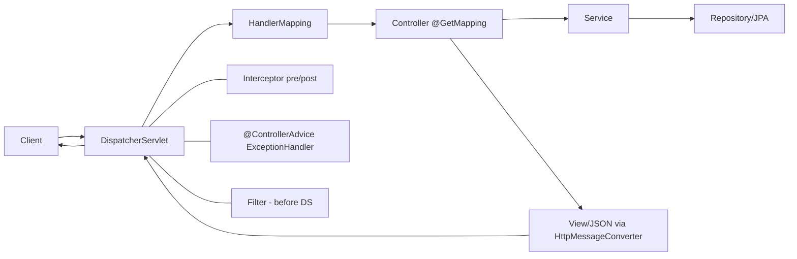

---
title: "Spring Cheat Sheet"
category: "Spring"
tags: [spring, cheat-sheet, java25]
created: 2026-09-03
pattern: 0
difficulty: Hard
completed: false
reviewed: ""
sr-due: ""
problems-solved: []
problems-solved-dates: {}
excalidraw: ""
---## Why it Matters

The **one-page reference for the whole Spring module**: the MVC request path, the comparison table that settles the "which one do I pick" questions (`@Component` vs `@Service`, constructor vs field injection, `REQUIRED` vs `REQUIRES_NEW`, Filter vs Interceptor vs AOP), the annotations you must know by heart, Boot internals that interviewers probe, and the Java 25 one-liners. It is not a tutorial, it is the **recall layer** for the eight notes in `05_Spring`, used the morning of an interview.

Core ideas:
- **Everything here is a pointer**, each row maps to a full note: MVC flow → [[Spring MVC]], comparison rows → [[Dependency Injection]] / [[Spring Transaction]] / [[Spring Core]], Boot internals → [[Spring Boot]], Java 25 → [[Whats New in Java 25]].
- **The "Pick" column is the answer.** When two options look equal, the row tells you which one and why.
- **Java 25 changes two rows**: `RestClient` is the imperative replacement for `RestTemplate`, and `spring.threads.virtual.enabled=true` makes blocking MVC scale without WebFlux.

## Diagram



## Code

Every row of the Vs table as runnable code, copy, paste, adapt:
```java
@SpringBootApplication
public class App { public static void main(String[] a) { SpringApplication.run(App.class, a); } }

@RestControllerAdvice class GlobalHandler { // one error envelope for the API
 @ExceptionHandler(MethodArgumentNotValidException.class)
 ProblemDetail handle(MethodArgumentNotValidException e) {
 var pd = ProblemDetail.forStatusAndDetail(HttpStatus.BAD_REQUEST, "validation failed");
 pd.setProperty("errors", e.getFieldErrors().stream().map(f -> f.getField() + ": " + f.getDefaultMessage()).toList());
 return pd;
 }
}

record CreateUserRequest(@NotBlank @Email String email) {} // record DTO + validation

@Service
class OrderService {
 private final OrderRepository repo; // constructor injection, no @Autowired
 OrderService(OrderRepository repo) { this.repo = repo; }

 @Transactional // proxy starts/commits/rolls back
 public Order place(CreateUserRequest req) { return repo.save(new Order(req.email())); }
}

@ConfigurationProperties("my.app") record AppProps(Duration timeout, int maxRetries) {}
```
Java 25 one-liners:
```java
try (var exec = Executors.newVirtualThreadPerTaskExecutor()) { // IO fan-out, one virtual thread per task
 var u = exec.submit(() -> userRepo.findById(id));
 var o = exec.submit(() -> orderRepo.findByUser(id));
 return new UserOrders(u.get(), o.get());
}
ScopedValue.where(REQ_ID, rid).run(service::handle); // not ThreadLocal
```

## When to use / not

| Use | Avoid |
|-----|-------|
| **The morning of an interview**, recite the request flow + the Vs rows aloud | Learning Spring from this sheet, it has no explanations, use the notes it points to |
| Copying a row to settle a design choice in code review | Copying annotations without knowing which bean they configure |
| The Java 25 one-liners as your default for IO fan-out and request context | `RestTemplate` for new code (use `RestClient`), `ThreadLocal` on virtual-thread services |

## Trade-offs

- **A reference, not a course**: fast recall of the whole module in one screen; it cannot teach the reasoning, follow the links for "why".
- **Density is the feature and the cost**: every line is a decision; skim it and you miss the "Pick" column that actually answers the question.
- **Broad, by design**: covers MVC, DI, TX, Core, Boot, and Java 25 in one page, so it is shallow by construction, each topic's note has the depth.
- **Opinionated picks**: the "Pick" column takes a side (constructor injection, `REQUIRED`, `RestClient`), which saves time but hides the rare cases where the other option is right.

## Vs

| Comparison | A | B | Pick |
|---|---|---|---|
| **@Component vs @Service vs @Repository vs @Controller** | All are `@Component` stereotypes | `@Repository` adds persistence exception translation; `@Service` semantics | Use specific stereotype for clarity + AOP pointcuts |
| **@Autowired vs Constructor injection** | Field injection (hidden dep, hard test) | Constructor injection (immutable, required) | **Constructor injection** , mandated since Spring 4.3 |
| **@Scope singleton vs prototype** | Singleton: 1 per container (default) | Prototype: new per injection/request | Singleton + stateless beans; prototype for stateful |
| **@Transactional REQUIRED vs REQUIRES_NEW** | REQUIRED joins existing TX | REQUIRES_NEW suspends & creates new | REQUIRES_NEW for audit/log that must commit independently |
| **Filter vs Interceptor vs AOP** | Filter: Servlet, before DS | Interceptor: Spring MVC, pre/post Handle | AOP: any Spring bean method |
| **JPA save vs saveAndFlush** | `save` may defer to flush/commit | `saveAndFlush` immediate DB write | Flush only when you need ID or constraint check now |
| **RestTemplate vs WebClient** | Blocking, deprecated | Non-blocking reactive | WebClient (or RestClient in Spring 6.1+) |

## Pitfalls

- **`@Transactional` on a `private` or self-called method** = no transaction, the proxy is never invoked; move the method to another bean or inject the self-proxy.
- **Field injection** when the row says constructor injection: hidden dependency, non-final field, harder to test, extra native hint.
- **`@ConditionalOnMissingBean` as a "back off" assumption** that is never tested, if your bean is defined in a profile that is not active, auto-config still wins and you get the default.
- **Reading the MVC flow left-to-right and missing the three side branches** — Filter, Interceptor, and `@ControllerAdvice` sit *outside* the controller, that is exactly what the "where do I put X" row is about.
- **Treating `save` as "written to the DB"** — `save` registers in the persistence context; only `saveAndFlush` (or flush at commit/query) writes now.
- **`RestTemplate` in new code** — deprecated; `RestClient` (6.1+) is the imperative replacement, `WebClient` for reactive.

## Interview q&a

**Q1. Walk me through a Spring MVC request end to end.**
The servlet `FilterChain` runs first (security, CORS, MDC), then `DispatcherServlet` asks `HandlerMapping` to resolve the URL to a controller method, a `HandlerAdapter` binds arguments (`@PathVariable`, `@RequestBody`, `@Valid`), and invokes the method. The method returns an object or `ResponseEntity`; an `HttpMessageConverter` (Jackson) serialises it to JSON. Interceptors run `preHandle`/`postHandle` around the handler, and any exception that reaches the servlet is handled by the nearest `@ControllerAdvice` `@ExceptionHandler`. On Boot 3.5 + Java 25 with `spring.threads.virtual.enabled=true`, the handler runs on a virtual thread, so blocking JDBC just parks it (JEP 491).

**Q2. `@Component`, `@Service`, ``@Repository`, `@Controller` — what is actually different?**
All four are `@Component` stereotypes, so component scanning treats them identically. The differences are semantic plus one functional one: `@Repository` enables **persistence exception translation** (Hibernate/JPA exceptions converted to Spring's `DataAccessException` hierarchy), `@Service` and `@Controller` carry no extra behaviour but mark the layer and serve as AOP pointcuts, and `@Controller` (with `@ResponseBody`, i.e. `@RestController`) is what `HandlerMapping` recognises as a web handler. Use the most specific stereotype for clarity and for pointcut accuracy.

Walk me through a Spring MVC request end to end.:: Filters run first, then DispatcherServlet asks HandlerMapping to resolve the URL, HandlerAdapter binds args and invokes the method, HttpMessageConverter serialises the return, interceptors wrap the handler, and exceptions go to @ControllerAdvice. On Java 25 with virtual threads the handler runs on a virtual thread, blocking JDBC parks it (JEP 491). #flashcard
@Component vs @Service vs @Repository vs @Controller - what is actually different?:: All are @Component stereotypes. @Repository adds persistence exception translation to DataAccessException; @Service/@Controller are semantic markers and AOP pointcuts; @Controller is what HandlerMapping recognises as a web handler. Use the most specific one. #flashcard

## Related

- [[Spring Framework]] and [[Spring Core]], container, beans, scopes, proxies
- [[Dependency Injection]], constructor vs field vs setter, IoC
- [[Spring MVC]], full request flow, `@ControllerAdvice`, records as DTOs
- [[Spring Data JPA]], repositories, N+1, lifecycle, dirty checking
- [[Spring Transaction]], propagation, rollback rules, self-invocation
- [[Spring Security]], filter chain, authentication vs authorization
- [[Spring Boot]], auto-configuration, starters, Actuator, profiles
- [[README|Java MOC]] and [[../00_Java-25-Overview/Whats New in Java 25|Whats New in Java 25]], the Java 25 one-liners above

# Spring / Spring Boot , Cheat Sheet

## Spring mvc Request Flow



## Annotations , Must Know

| Annotation | Purpose |
|---|---|
| `@SpringBootApplication` | `@Configuration + @EnableAutoConfiguration + @ComponentScan` |
| `@RestController` | `@Controller + @ResponseBody` , JSON |
| `@RequestBody / @ResponseBody` | JSON ↔ object via Jackson |
| `@PathVariable / @RequestParam / @RequestHeader` | URL / query / header binding |
| `@Valid + @Validated` | Bean validation (`@NotNull`, `@Size`) |
| `@Transactional` | Proxy-based TX; self-invocation bypasses proxy! |
| `@Async / @EnableAsync` | Async execution (needs executor) |
| `@Cacheable / @CacheEvict` | Declarative caching |
| `@Value("${prop:default}")` | Property injection; prefer `@ConfigurationProperties` for groups |
| `@Profile("prod")` / `@ConditionalOnProperty` | Conditional beans |
| `@ControllerAdvice + @ExceptionHandler` | Global exception handling |

## Boot Internals , Interview hot

| Topic | One-Liner |
|---|---|
| **Auto-configuration** | `spring.factories` / `AutoConfiguration.imports` + `@ConditionalOnClass/OnMissingBean` |
| **Starter** | Opinionated dependency set (`spring-boot-starter-web` → Tomcat+Spring MVC+Jackson) |
| **Actuator** | `/actuator/health, metrics, env, beans, mappings` |
| **Externalized config order** | CLI args > env vars > `application-{profile}.yml` > `application.yml` > defaults |
| **Transaction proxy trap** | `@Transactional` on private/self-called method = **no TX** (proxy not invoked) , extract to another bean |
| **N+1** | `FetchType.LAZY` + `@EntityGraph` / `JOIN FETCH` / `BatchSize` |

## Java 25 One-Liners

```java
// One virtual thread per task, Java 25 default for IO fan-out
try (var exec = Executors.newVirtualThreadPerTaskExecutor()) {
 var u = exec.submit(() -> userRepo.findById(id));
 var o = exec.submit(() -> orderRepo.findByUser(id));
 return new UserOrders(u.get(), o.get());
}

// ScopedValue context instead of ThreadLocal
ScopedValue.where(REQ_ID, rid).run(() -> service.handle());

// Record DTO + validation + ProblemDetail
record CreateUserRequest(@NotBlank @Email String email) {}
```
*Category: CheatSheet*
