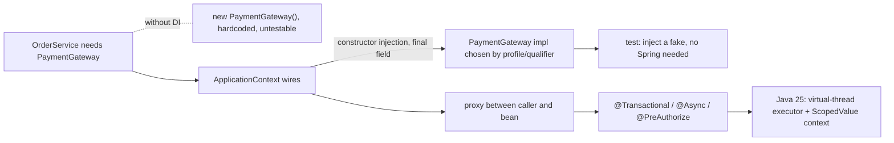
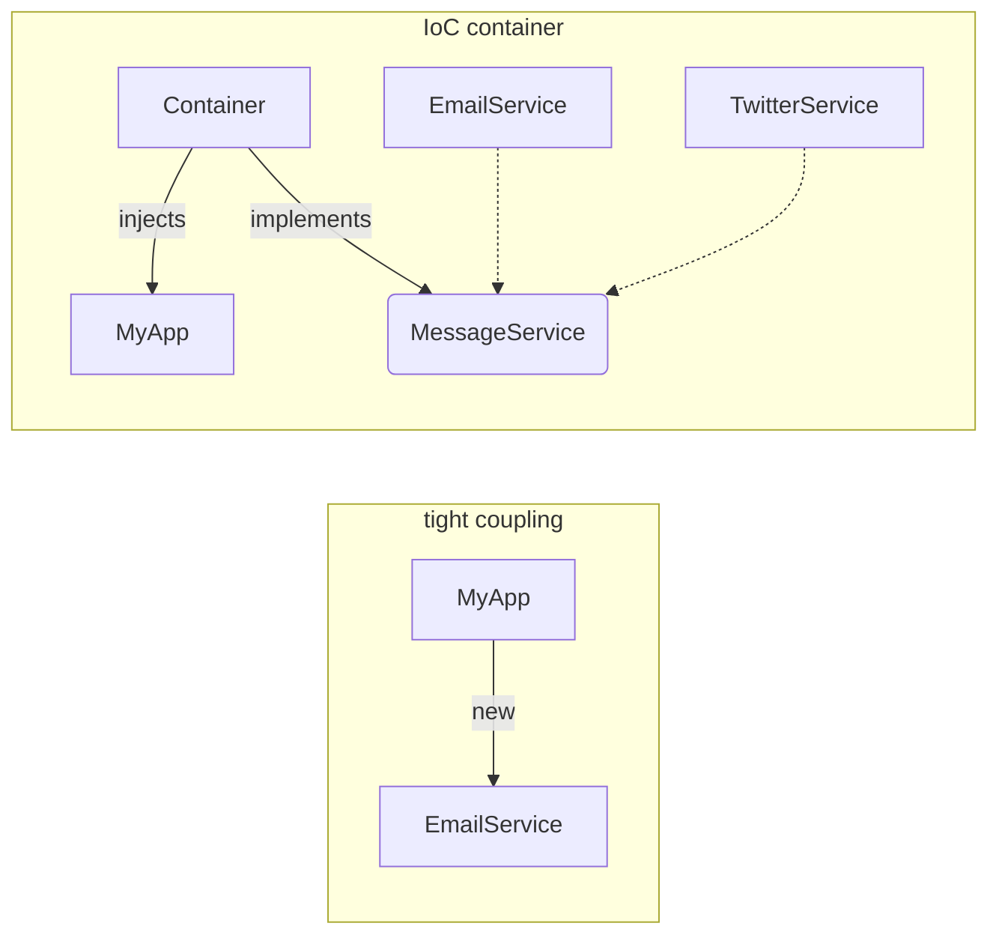

## Why it Matters

**Dependency Injection (DI)** is *the* design principle behind the Spring container and the most-tested concept in a Spring interview: a class receives its collaborators from outside instead of building them with `new`. **Inversion of Control (IoC)** is the broader idea, the container decides what to instantiate and when; **DI** is the concrete mechanism, constructor, setter, or field. It matters because it is what makes a Spring app testable (swap a real `PaymentGateway` for a fake), loosely coupled (swap implementations without touching the client), and AOP-friendly (the container proxy is what makes `@Transactional` work).

Core ideas:
- **Constructor injection is the default since Spring 4.3**, one constructor needs no `@Autowired`; fields can be `final`, so beans are immutable and thread-safe.
- **`@Component` family** is how beans get discovered; `@Bean` in `@Configuration` is for third-party types.
- **Qualifiers and profiles** resolve ambiguity when multiple beans satisfy a type.
- **The container proxy is the reason DI is load-bearing**, not just tidy: without the container between caller and bean, `@Transactional`, `@Async`, and `@PreAuthorize` have nothing to intercept.
- **Java 25 angle**: virtual threads + `ScopedValue` make per-request context cheap, but only if you inject an executor and avoid `ThreadLocal`.

## Diagram



## Code

The three injection styles and the Java 25 context rule in one file:
```java
interface PaymentGateway { Result charge(Order o); }

@Component
@Profile("prod")
class StripeGateway implements PaymentGateway {
 public Result charge(Order o) { return Result.ok(o.getId()); }
}

@Service
class OrderService {
 private final PaymentGateway gateway; // CONSTRUCTOR injection: final, immutable
 OrderService(PaymentGateway gateway) { this.gateway = gateway; } // no @Autowired needed (4.3+)

 public Order place(Order o) { return gateway.charge(o).toOrder(); }
}

@Configuration
class PaymentConfig {
 @Bean // for types you do not own
 PaymentGateway fakeGateway() { return new FakeGateway(); }
}
```
Ambiguity and context propagation, the two things that bite after the basics:
```java
// Multiple implementations -> qualify explicitly
@Service
class CheckoutService {
 CheckoutService(@Qualifier("stripeGateway") PaymentGateway gateway) { /* ... */ }
}

// Java 25: request context that propagates to child virtual threads, not ThreadLocal
static final ScopedValue<String> REQ_ID = ScopedValue.newInstance();

void handle(String id) {
 ScopedValue.where(REQ_ID, id).run(() -> orderService.place(cart)); // immutable, scope-bound
}
```
> **Why constructor injection is the default:** the dependency is visible in the signature, enforced at compile time, `final` so it is thread-safe, trivially faked in a unit test with `new OrderService(fake)`, and it needs no extra native-image hint.

## When to use / not

| Use | Avoid |
|-----|-------|
| Constructor injection: immutable, required deps, testable, AOT-friendly | Field injection (`@Autowired` on a field): hides wiring, blocks `final`, and needs extra native-image hints |
| Interfaces as the injected type so implementations can be swapped or faked | Injecting concrete classes when an interface exists, you lose swapability and JDK-proxy support |
| `@Qualifier` / `@Profile` when multiple beans satisfy one type | `@Primary` as a default answer to every ambiguity, it hides which bean you actually get |
| DI for cross-cutting collaborators (repos, gateways, clients) | Injecting `ApplicationContext` to look up beans at runtime (service locator anti-pattern) |

## Trade-offs

| Pros | Cons |
|---|---|
| Loose coupling → swap `Email`/`Twitter`/`Mock` without changing client | Over-injection hides complexity (many ctor args → SRP violation) |
| Easy unit testing (pass fakes) | Misuse (field injection, circular deps) masked until runtime |
| Centralised wiring → consistent scope/lifecycle | Debugging wiring errors (`NoSuchBeanDefinitionException`, `NoUniqueBeanDefinitionException`) |
| Enables AOP/TX/Security proxies transparently | Requires understanding of qualifiers/profiles/conditions |
| Constructor injection is AOT/native-image friendly | Field injection needs extra AOT hints |

## Vs

**Constructor vs Setter vs Field injection**

| Aspect | Constructor | Setter | Field |
|--------|-------------|--------|-------|
| Immutability | yes, fields can be `final` | no, settable after construction | no |
| Required deps | enforced at compile time | optional unless `@Autowired(required=true)` | optional |
| Circular deps | fails fast at startup (good) | silently allowed (a design smell) | silently allowed |
| Testing | pass fakes to the constructor | call setters, or ReflectionTestUtils | reflection required |
| Java 25 / native | friendliest, no extra hints | ok | needs reflection hints |

**IoC vs DI**

| Aspect | IoC | DI |
|--------|-----|----|
| Meaning | container controls object creation and lifecycle | the mechanism: inject collaborators from outside |
| Scope | framework principle | implementation of that principle |
| Example | `SpringApplication.run()` starts the container | `OrderService(OrderRepository repo)` receives the repo |

**DI vs Service Locator**

| Aspect | DI | Service Locator |
|--------|----|-----------------|
| Dependency | declared in the signature, visible | hidden, fetched at runtime from the locator |
| Testability | pass a fake to the constructor | must mock the locator first |
| Fail mode | compile/startup error | runtime `NoSuchBean` deep in code |

## Pitfalls

- Injecting too many collaborators → extract a façade/service.
- Field injection with `required=true` masking missing beans in tests, also needs AOT reflection hints.
- Using `new` inside a Spring bean for a dependency that should be injected (bypasses proxy/TX).
- `@Component` on abstract classes or with `final` methods that prevent CGLIB proxying.
- Injecting a platform-thread `TaskExecutor` on Java 25 IO-bound services, use virtual-thread executor instead.

## Interview q&a

**Q: IoC vs DI?** IoC is the principle ("invert who controls flow/creation"); DI is the concrete pattern implementing IoC by injecting dependencies.

**Q: Why is constructor injection preferred?** Immutability, fail-fast on missing deps, no reflection in tests, prevents circular field-injection cycles, and is AOT/native-image friendly.

**Q: `@Autowired(required=false)` vs `Optional<T>` vs `ObjectProvider<T>`?** All express optional deps; `ObjectProvider` also gives `getIfAvailable()`, stream, and lazy access.

**Q: How does `@Qualifier` vs `@Primary` work?** `@Primary` marks the default when multiple candidates exist; `@Qualifier("name")` picks a specific one; `@Qualifier` wins over `@Primary`.

**Q: Can you DI without Spring?** Yes, manual constructor wiring, Dagger/Guice, or service locator; Spring just automates it and adds lifecycle/AOP.

**Q: What does `@Lazy` do?** Defers bean creation until first use; can also break circular deps by injecting a lazy proxy.

**Q: How does DI interact with virtual threads (Java 25)?** DI is unchanged, but inject `AsyncTaskExecutor` backed by `Executors.newVirtualThreadPerTaskExecutor()` for async work. With `spring.threads.virtual.enabled=true`, Boot auto-configures it. Use `ScopedValue` for context instead of `ThreadLocal`.

IoC vs DI?:: IoC is the principle ("invert who controls flow/creation"); DI is the concrete pattern implementing IoC by injecting dependencies. #flashcard
Why is constructor injection preferred?:: Immutability, fail-fast on missing deps, no reflection in tests, prevents circular field-injection cycles, and is AOT/native-image friendly. #flashcard
`@Autowired(required=false)` vs `Optional<T>` vs `ObjectProvider<T>`?:: All express optional deps; `ObjectProvider` also gives `getIfAvailable()`, stream, and lazy access. #flashcard
How does `@Qualifier` vs `@Primary` work?:: `@Primary` marks the default when multiple candidates exist; `@Qualifier("name")` picks a specific one; `@Qualifier` wins over `@Primary`. #flashcard
Can you DI without Spring?:: Yes, manual constructor wiring, Dagger/Guice, or service locator; Spring just automates it and adds lifecycle/AOP. #flashcard
What does `@Lazy` do?:: Defers bean creation until first use; can also break circular deps by injecting a lazy proxy. #flashcard
How does DI interact with virtual threads (Java 25)?:: DI is unchanged, but inject `AsyncTaskExecutor` backed by `Executors.newVirtualThreadPerTaskExecutor()` for async work. With `spring.threads.virtual.enabled=true`, Boot auto-configures it. Use `ScopedValue` for context instead of `ThreadLocal`. #flashcard

## Related

- [[Spring Core]] • [[Spring Framework]] • [[Spring Security]] • [[Spring Transaction]] • [[Threads]]
- [[README|Java MOC]]

---
*Category: Spring • Part of [[README|Java MOC]] • Java 25*

# Dependency Injection

> Part of [[README|Java MOC]] • `Spring` • Java 25 / Spring Framework 6.2

## Summary

Dependency Injection (DI) is the Spring implementation of Inversion of Control (IoC): instead of an object constructing its own dependencies (`new X()`), an external entity (the container / an assembler) provides them, so the object depends only on abstractions and remains testable and replaceable.

> I used to think field injection was convenient, then I tried to write a test without Spring. Never again. Constructor injection is the only one that makes your dependencies obvious, use it.

DI = "don't call us, we'll call you." A client declares what it needs (via constructor, setter, or field), and a provider (Spring container, factory, test harness) supplies it at creation time. Spring supports constructor, setter, and field injection; constructor injection is the recommended form.

## Architecture


```Without
 DI: With DI (IoC Container):
 ┌──────────┐ new ┌────────┐ ┌──────────┐ injects ┌────────┐
 │ MyApp │──────▶│EmailSvc│ │ MyApp │◀──────────────│ Container│
 └──────────┘ └────────┘ └──────────┘ MessageService└────────┘
 tight coupling - hard to test ▲ ▲
 interface Email/Twitter impl
 Container flow:
 @Configuration / @ComponentScan → BeanDefinitions → BeanFactory
 → resolves @Autowired constructor → instantiates EmailService
 → injects into MyApplication → returns fully wired graph

 Java 25: container can wire virtual-thread executors as beans (see below).
```
Key principle: depend on `MessageService` interface, not `EmailService` concrete class.

## Injection Styles, Comparison

| Style | Syntax | Required? | Testability | Spring recommendation |
|---|---|---|---|---|
| Constructor | `MyApp(MessageService s){this.s=s;}` + `@Autowired` (optional if single ctor) | Enforced ( `final` ) | Excellent, `new MyApp(mock)` | Preferred |
| Setter | `@Autowired void setService(MessageService s)` | Optional / reconfigurable | Good | Use for optional deps |
| Field | `@Autowired private MessageService s;` | Hidden | Poor, needs reflection / Spring test | Avoid |

### Qualifiers & Disambiguation
```java
javainterface MessageService { void send(String msg); }

@Component("email") class EmailService implements MessageService {
 public void send(String m) { System.out.println("email: " + m); }
}
@Component("twitter") class TwitterService implements MessageService {
 public void send(String m) { System.out.println("tweet: " + m); }
}

@Component
class Notifier {
 private final MessageService svc;
 Notifier(@Qualifier("email") MessageService svc) { this.svc = svc; }
}
```
Other resolution controls: `@Primary` (default bean), `@Profile`, `@ConditionalOnProperty`, `ObjectProvider<T>` for optional/lazy, `@Lazy` for deferred init.

## Virtual Threads & di (Java 25)

DI itself is thread-agnostic, but what you inject changes on Java 25:
```java
java@Configuration
class ExecutorConfig {
 @Bean
 AsyncTaskExecutor applicationTaskExecutor() {
 return new TaskExecutorAdapter(Executors.newVirtualThreadPerTaskExecutor());
 }
}

@Service
class NotificationService {
 private final AsyncTaskExecutor exec;
 NotificationService(AsyncTaskExecutor exec) { this.exec = exec; }
 void notifyAsync(String msg) { exec.submit(() -> System.out.println(msg)); }
}
```
> ScopedValue + DI: On Java 25, request-scoped context (correlation ID, tenant) should be a `ScopedValue`, not a `ThreadLocal` bean. Inject a holder or use `ScopedValue.where(...)` in the call site, see [[Threads]] for the `ScopedValue` vs `ThreadLocal` table.

## Service + Component Example (Full)
```
java@Component
class MyApplication {
 private final MessageService svc; // constructor, preferred
 private MessageService optional; // setter, optional deps

 MyApplication(MessageService svc) { this.svc = svc; }

 @Autowired(required = false)
 void setOptional(MessageService s) { this.optional = s; }
}
```
## AOT Note (Java 25 / Boot 3.5)

Constructor injection is AOT-friendly, no reflection needed at runtime. Field injection requires reflection hints (`RuntimeHintsRegistrar`) for native image. Prefer constructor injection for GraalVM compatibility.
```java
java@Configuration
class AotConfig implements RuntimeHintsRegistrar {
 @Override
 public void registerHints(RuntimeHints hints, ClassLoader cl) {
 hints.reflection().registerType(EmailService.class, MemberCategory.INVOKE_DECLARED_CONSTRUCTORS);
 }
}
```