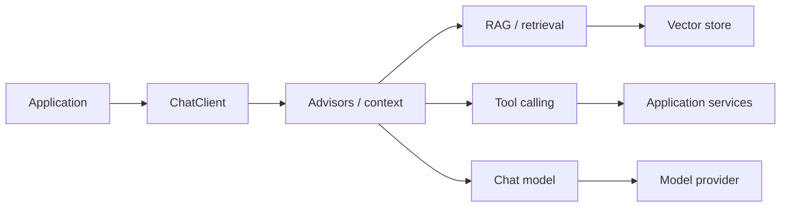

# Spring AI

> Java/Spring integration layer for AI applications. Treat model APIs, retrieval, tool calling and evaluation as application infrastructure rather than controller logic.

## Current Version Context

Spring AI 2.0 is the current GA generation in September 2026 and is designed for Spring Boot 4 / Spring Framework 7. Spring AI 2.1.0-M1 is a milestone line and should not be treated as the stable baseline.

## Core Abstractions

- ChatClient for application-facing model interaction.
- ChatModel for lower-level model integration.
- Embedding models and vector stores for semantic retrieval.
- Advisors for reusable request/response transformations.
- Tool calling for controlled interaction with application capabilities.
- RAG support for retrieval-augmented generation.
- MCP integration for standardized tool/resource/prompt interoperability.
- Evaluation utilities for measuring generated output.

## Architecture



## Engineering Rules

1. Keep model access behind an application boundary.
2. Do not let prompts become the only source of business rules.
3. Validate structured outputs at the application boundary.
4. Treat tool calls as privileged operations with authorization and audit requirements.
5. Evaluate retrieval and generation separately.
6. Record latency, token usage, errors and model/provider identifiers.
7. Pin the Spring AI and Spring Boot versions used by the project.

## Minimal Example

```java
@Bean
CommandLineRunner runner(ChatClient.Builder builder) {
    var client = builder.build();

    return args -> {
        String answer = client.prompt()
                .user("Explain dependency inversion in one paragraph.")
                .call()
                .content();

        System.out.println(answer);
    };
}
```

## RAG Boundary

A production RAG flow should make these stages observable:

**ingest → chunk → embed → store → retrieve → rerank/filter → prompt/context → generate → evaluate**

Do not hide all of this inside one controller method.

## Tool Calling Boundary

A tool should expose a narrow business capability rather than arbitrary database or HTTP access.

Good tool boundary: getCustomerOrders(customerId)

Poor tool boundary: executeSql(query)

The tool layer should enforce authorization, input validation, timeouts, idempotency where relevant, and auditability.

## MCP

MCP is useful when interoperability with external tool/resource/prompt providers is required. It is not automatically required for every Spring AI application. Decide based on integration boundaries.

## Practice

- [ ] Build a ChatClient endpoint behind a service interface.
- [ ] Add structured output validation.
- [ ] Add one retrieval-backed use case.
- [ ] Add one authorized tool call.
- [ ] Capture latency, token/cost metadata and failures.
- [ ] Add an evaluation case that can fail independently of the model call.

## Related

- Spring Boot
- Spring Security
- AI RAG Engineering
- AI Agentic AI
- AI Production Platform
