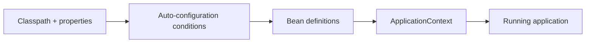

# Spring Boot

## Intent

Understand how Spring Boot turns the Spring Framework into an opinionated application platform: dependency management, auto-configuration, embedded servers, configuration and production features.

## Current Generation

As of September 2026, Spring Boot 4.1.1 is the current stable release line, with 4.0.x also maintained. Spring Boot 4 is built on Spring Framework 7 and treats Java 25 as a first-class baseline while retaining Java 17 compatibility.

When working on an existing service, use the project's pinned version rather than blindly upgrading to the latest line.

## What Boot Adds

- dependency and version management;
- auto-configuration;
- starters;
- embedded web servers;
- externalized configuration;
- Actuator and production endpoints;
- test slices and test infrastructure;
- AOT/native-image support.

## Auto-Configuration Mental Model

Boot does not remove the container. It supplies conditional configuration that creates beans when the application's dependencies and configuration indicate that they are needed.

## Configuration

Prefer explicit, validated configuration objects over scattering property lookups through business code.

For secrets, use the application's secret-management mechanism rather than committing credentials to application configuration.

## Virtual Threads

Virtual threads are a Java 21+ runtime capability. If enabling them in a Boot application, validate the actual server/executor behavior and workload instead of assuming one property changes every thread in the application.

The decision should be based on workload characteristics:

- good fit: blocking I/O with many concurrent requests;
- poor fit: CPU-bound work where the bottleneck is cores;
- investigate: libraries or native calls that impose blocking/compatibility constraints.

## Production Checklist

- [ ] configuration is externalized and validated;
- [ ] health/readiness behavior is defined;
- [ ] metrics and traces are observable;
- [ ] error responses are consistent;
- [ ] dependency versions are pinned;
- [ ] integration tests cover infrastructure boundaries;
- [ ] startup and shutdown behavior are tested;
- [ ] security defaults are explicit.

## Senior Interview Questions

**How does auto-configuration work?**

Conditional configuration inspects the classpath, beans and properties and registers infrastructure only when conditions match.

**How do you override Boot behavior?**

Prefer the supported configuration or bean customization point first. Use exclusions only when the auto-configuration is genuinely inappropriate.

**Boot 3 vs Boot 4?**

Boot 4 is a major generation based on Spring Framework 7, with Java 25 as a first-class baseline and significant ecosystem/dependency changes. Migration should follow the official upgrade guide and the application's dependency graph.

## Related

- [[Spring Framework]]
- [[Dependency Injection]]
- [[Spring MVC]]
- [[Spring Security]]
- [[Spring Transaction]]
- [[Spring AI]]
- [[../12_Testing-Tooling/Maven and Gradle|Maven and Gradle]]
