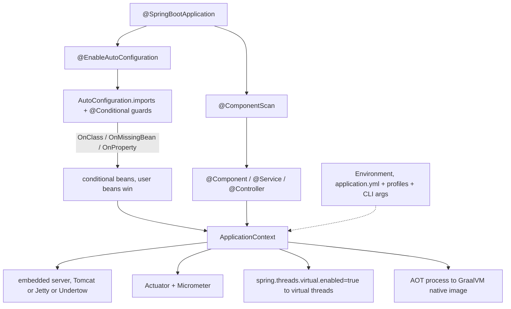
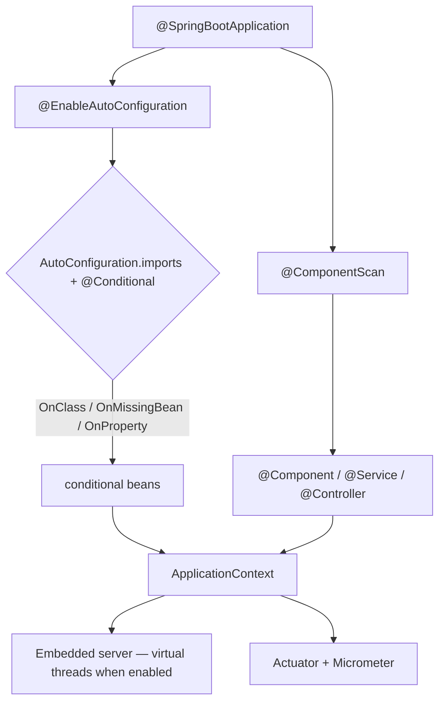

## Why it Matters

**Spring Boot** is the **opinionated layer that made Spring the default Java backend**: it takes the Framework container and adds **auto-configuration** (conditional beans driven by your classpath), **starters** (dependency bundles), an **embedded server** (Tomcat/Jetty/Undertow), **externalised configuration** (`application.yml` + profiles), and **Actuator** (production endpoints + Micrometer). The result is that a working, observable, container-ready service is one `@SpringBootApplication` class and one `java -jar`. On Java 25 / Boot 3.5, one flag (`spring.threads.virtual.enabled=true`) moves the whole web + async + scheduled stack onto virtual threads.

Core ideas:
- **`@SpringBootApplication`** = `@SpringBootConfiguration` + `@EnableAutoConfiguration` + `@ComponentScan`; `SpringApplication.run()` boots an embedded container.
- **Auto-configuration is conditional**: `AutoConfiguration.imports` lists candidates, `@ConditionalOnClass` / `@ConditionalOnMissingBean` / `@ConditionalOnProperty` decide which register, and **your own beans win** via `@ConditionalOnMissingBean`.
- **Configuration is external and ordered**: CLI args > env vars > `application-{profile}.yml` > `application.yml` > defaults, and **higher wins**.
- **`@ConfigurationProperties` on a `record`** gives type-safe binding with `Duration`/`DataSize` support.
- **Actuator + Micrometer** are the observability surface; expose `health`/`metrics`/`prometheus` publicly and guard `env`/`beans`.
- **AOT + GraalVM** (`mvn -Pnative native:compile`) gives sub-100ms startup at the cost of reflection hints.

## Diagram



## Code

```java
@SpringBootApplication
@ConfigurationPropertiesScan
public class DemoApplication {
 public static void main(String[] args) { SpringApplication.run(DemoApplication.class, args); }
}

record OrderDto(long id, String item) {}
```

## When to use / not

| Use | Avoid |
|-----|-------|
| Greenfield services, `@SpringBootApplication` + starters for an opinionated, fast bootstrap | Writing new XML `@Configuration` by hand when Boot auto-config already wires it |
| `application.yml` + profiles + `@ConfigurationProperties` record for type-safe config | Scattering `@Value("${x}")` across beans for a group of related properties |
| `exclude` a specific auto-config when you genuinely need a custom setup | `exclude`-ing auto-config blindly, then debugging a missing `DataSource`; read the `--debug` condition report first |
| Actuator with only `health`/`metrics`/`prometheus` public, `env`/`beans` behind auth | `management.endpoints.web.exposure.include=*` in any reachable profile |
| `spring.threads.virtual.enabled=true` on Java 25 IO-bound MVC/JDBC services | Custom `TaskExecutor` pool sizing for IO work, the flag replaces it |

## Trade-offs

| Pros | Cons |
|---|---|
| Zero XML, fast bootstrap with starters + auto-config | Auto-config magic can hide bean origin, use `/actuator/beans` + `--debug` |
| Embedded server → single `java -jar`, ideal for containers/K8s | Fat jar size / classpath conflicts if starters overlap |
| Externalised config + profiles + `@ConfigurationProperties` records | Property source ordering can surprise, higher wins |
| Actuator + Micrometer → prod-ready observability | Endpoints must be secured, don't expose `env`/`beans` publicly |
| Virtual threads (Java 25) eliminate pool tuning for IO-bound services | Requires Java 21+, driver must not pin carrier (JEP 491 fixes `synchronized`) |
| AOT/native: sub-100ms startup, low memory | Reflection-heavy code needs `RuntimeHints` for native |

## Vs

**Spring Boot vs Spring Framework vs Spring Cloud**

| Aspect | Spring Framework | Spring Boot | Spring Cloud |
|--------|------------------|-------------|--------------|
| Provides | IoC container, DI, AOP, abstractions | Framework + auto-config, starters, embedded server, Actuator | Distributed-system patterns on Boot |
| Solves | decoupling and cross-cutting concerns | bootstrap and production-readiness | config, discovery, gateway, resilience, tracing |
| Config | XML or `@Configuration` by hand | `application.yml` + `@Conditional` auto-config | Boot config + `spring-cloud-*` starters |
| Use when | you need the container without opinions | most services, the default choice | microservice infrastructure |

**`@ConfigurationProperties` (record) vs `@Value`**

| Aspect | `@ConfigurationProperties(prefix="my.app")` on a record | `@Value("${my.app.timeout:5s}")` |
|--------|--------------------------------------------------------|----------------------------------|
| Shape | one type-safe object, nested records supported | one scalar per injection site |
| Validation | JSR-380 on components | none |
| Types | `Duration`, `DataSize`, `Period`, lists, maps | String or simple conversion |
| Use | any group of related properties | a single throwaway value |

**`@ConditionalOnMissingBean` vs `@Primary` vs `@Qualifier`**

| Aspect | `@ConditionalOnMissingBean` | `@Primary` | `@Qualifier` |
|--------|------------------------------|------------|--------------|
| Resolves | auto-config backing off when you define your own | a single default when multiple match | a specific bean at the injection point |
| Scope | auto-configuration classes | the container | one constructor argument |
| Failure mode | your bean must actually be registered (right profile) | hides which bean won, surprises later | verbose but explicit, safest |

**Embedded server choice**

| Aspect | Tomcat (default) | Jetty | Undertow | Netty (WebFlux) |
|--------|------------------|-------|----------|-----------------|
| Model | blocking, servlet | blocking, servlet | blocking, servlet + low overhead | non-blocking, reactive |
| Pick when | the default, virtual threads on 25 | existing Jetty ops | memory/CPU constrained | SSE/streaming/backpressure |

## Pitfalls

- Excluding needed auto-config (`exclude = DataSourceAutoConfiguration.class`) then wondering why `DataSource` is missing, check `--debug` condition report.
- Putting `application.yml` in wrong location, Boot searches `classpath:`, `classpath:config/`, `file:./`, `file:./config/`; use `spring.config.import` for custom paths.
- Using `InheritableThreadLocal` for context with virtual threads, doesn't propagate to `StructuredTaskScope`; use `ScopedValue` or `TaskDecorator` / `ContextPropagation`.
- Exposing all Actuator endpoints publicly (`exposure.include=*`), leaks `env` secrets and bean graph.
- Defining `TaskExecutor` bean without virtual threads on Java 25 IO service, set `spring.threads.virtual.enabled=true` instead of custom pool sizing.
- Native image without hints, `NoSuchMethodException` at runtime; run `process-aot` and add `RuntimeHintsRegistrar`.
- Fat-jar classpath conflicts from overlapping starters, use `mvn dependency:tree` and `<exclusions>`.

## Interview q&a

**Q: What does `@SpringBootApplication` compose?** `@SpringBootConfiguration` + `@EnableAutoConfiguration` + `@ComponentScan`. It enables auto-config, component scanning, and marks configuration class.

**Q: How does auto-configuration work?** `AutoConfiguration.imports` lists candidates; each has `@Conditional` guards (`OnClass`, `OnMissingBean`, `OnProperty`). Matching ones register beans; user beans with `@ConditionalOnMissingBean` take precedence.

**Q: Starters vs auto-configuration?** Starters are dependency descriptors (pom bundles); auto-configuration is conditional bean registration, starters pull jars, auto-config wires them.

**Q: `application.properties` vs `application.yml`?** Same semantics; YAML supports hierarchy, lists, and multi-document (`---` profiles), preferred for Boot.

**Q: How does externalised config ordering work?** CLI args > env vars > `application-{profile}.yml` > `application.yml` > defaults. Higher wins; `spring.config.import` adds extra sources.

**Q: What is Actuator and how to secure it?** Production endpoints (`health`, `metrics`, `env`, `beans`). Expose only `health`/`metrics`/`prometheus` publicly; secure `env`/`beans` behind management port or Spring Security (`requestMatchers("/actuator/**").hasRole("ADMIN")`).

**Q: What does `spring.threads.virtual.enabled=true` do?** Boot 3.2+ flag: replaces Tomcat/Jetty/Undertow executors and `@Async`/`@Scheduled` executors with `Executors.newVirtualThreadPerTaskExecutor()`. On Java 25 each request runs on a virtual thread, blocking (`Thread.sleep`, JDBC) parks the virtual thread (JEP 491), no pool tuning needed.

**Q: When NOT to use virtual threads?** CPU-bound batch, heavy computation, or JNI that pins, keep platform pool for those; virtual threads shine for IO-bound MVC/JDBC/RestClient.

**Q: How to build a GraalVM native image?** `mvn -Pnative native:compile` runs AOT (`process-aot`) generating `reflect-config.json`/`resource-config.json`; custom reflection needs `RuntimeHintsRegistrar` or `@RegisterReflectionForBinding`.

What does `@SpringBootApplication` compose?:: `@SpringBootConfiguration` + `@EnableAutoConfiguration` + `@ComponentScan`. It enables auto-config, component scanning, and marks configuration class. #flashcard
How does auto-configuration work?:: `AutoConfiguration.imports` lists candidates; each has `@Conditional` guards (`OnClass`, `OnMissingBean`, `OnProperty`). Matching ones register beans; user beans with `@ConditionalOnMissingBean` take precedence. #flashcard
Starters vs auto-configuration?:: Starters are dependency descriptors (pom bundles); auto-configuration is conditional bean registration, starters pull jars, auto-config wires them. #flashcard
`application.properties` vs `application.yml`?:: Same semantics; YAML supports hierarchy, lists, and multi-document (`---` profiles), preferred for Boot. #flashcard
How does externalised config ordering work?:: CLI args > env vars > `application-{profile}.yml` > `application.yml` > defaults. Higher wins; `spring.config.import` adds extra sources. #flashcard
What is Actuator and how to secure it?:: Production endpoints (`health`, `metrics`, `env`, `beans`). Expose only `health`/`metrics`/`prometheus` publicly; secure `env`/`beans` behind management port or Spring Security (`requestMatchers("/actuator/**").hasRole("ADMIN")`). #flashcard
What does `spring.threads.virtual.enabled=true` do?:: Boot 3.2+ flag: replaces Tomcat/Jetty/Undertow executors and `@Async`/`@Scheduled` executors with `Executors.newVirtualThreadPerTaskExecutor()`. On Java 25 each request runs on a virtual thread, blocking (`Thread.sleep`, JDBC) parks the virtual thread (JEP 491), no pool tuning needed. #flashcard
When NOT to use virtual threads?:: CPU-bound batch, heavy computation, or JNI that pins, keep platform pool for those; virtual threads shine for IO-bound MVC/JDBC/RestClient. #flashcard
How to build a GraalVM native image?:: `mvn -Pnative native:compile` runs AOT (`process-aot`) generating `reflect-config.json`/`resource-config.json`; custom reflection needs `RuntimeHintsRegistrar` or `@RegisterReflectionForBinding`. #flashcard

## Related

- [[Spring Framework]] • [[Spring Core]] • [[Dependency Injection]] • [[Spring MVC]] • [[Spring Data JPA]] • [[Spring Security]] • [[Spring Transaction]] • [[Threads]]
- [[README|Java MOC]]

---
*Category: Spring • Part of [[README|Java MOC]] • Java 25*

# Spring Boot

> Part of [[README|Java MOC]] • `Spring` • Java 25 / Spring Boot 3.5 / Framework 6.2

## Summary

Make production-grade Spring applications trivial to create and run: auto-configuration over manual wiring, starters over dependency hell, externalised configuration (`application.yml`) over XML, and built-in observability (Actuator, Micrometer), with one flag (`spring.threads.virtual.enabled=true`) to run the entire stack on Java 25 virtual threads.

> Boot does a lot for you. Sometimes too much. I like the convention, but when auto-configuration surprises you, check the condition report first, that saves hours.

Spring Boot = Spring Framework + opinionated auto-configuration + embedded server (Tomcat/Jetty/Undertow) + Actuator + Micrometer/Metrics + AOT/Native support. A `@SpringBootApplication` triggers `@EnableAutoConfiguration` + `@ComponentScan` + `@Configuration`, classpath scanning registers only matching `@Conditional` beans, and `SpringApplication.run()` boots an embedded container in a single `java -jar`.

## Architecture


```Developer
 → @SpringBootApplication
 │
 ├── @EnableAutoConfiguration
 │ └── spring.factories / AutoConfiguration.imports
 │ ├── @ConditionalOnClass(JdbcTemplate.class) → DataSourceAutoConfiguration
 │ ├── @ConditionalOnWebApplication → DispatcherServletAutoConfiguration
 │ ├── @ConditionalOnProperty / @ConditionalOnMissingBean
 │ └── @EnableConfigurationProperties → @ConfigurationProperties beans
 ├── @ComponentScan → @Component / @Service / @Repository / @Controller
 └── @Configuration → @Bean definitions

 Runtime: SpringApplication
 │
 ├── Environment (application.yml → application-{profile}.yml → env vars → CLI args)
 ├── ApplicationContext (AOT-optimised on Java 25 native)
 ├── Embedded Server (Tomcat / Jetty / Undertow) - virtual threads when enabled
 └── Actuator endpoints (/actuator/health, /metrics, /info)
 └── Micrometer → Prometheus / OTLP

 Java 25: spring.threads.virtual.enabled=true
 └── TomcatProtocolHandler.setExecutor(Executors.newVirtualThreadPerTaskExecutor())
 @Async / @Scheduled → virtual-thread TaskExecutor automatically
```
Starters are dependency bundles; auto-configuration is conditional bean registration, together they eliminate boilerplate.

## Starters & Auto-Configuration

| Starter | Brings in | Auto-configures |
|---|---|---|
| `spring-boot-starter-web` | `spring-webmvc`, Tomcat, Jackson, validation | `DispatcherServlet`, `ObjectMapper`, error handling |
| `spring-boot-starter-data-jpa` | Hibernate, HikariCP, Spring Data | `DataSource`, `EntityManagerFactory`, `JpaTransactionManager` |
| `spring-boot-starter-security` | Spring Security filter chain | `SecurityFilterChain`, `PasswordEncoder` |
| `spring-boot-starter-validation` | Hibernate Validator | `LocalValidatorFactoryBean` |
| `spring-boot-starter-actuator` | Micrometer, Actuator | Health, metrics, env, beans endpoints |
| `spring-boot-starter-test` | JUnit 5, Mockito, AssertJ, MockMvc | `SpringBootTest` slice annotations |

### How Auto-configuration Decides

| Annotation | Condition | Effect |
|---|---|---|
| `@ConditionalOnClass` | Class on classpath | Enable config only if dependency present |
| `@ConditionalOnMissingBean` | No user-defined bean | Back off when user provides custom bean |
| `@ConditionalOnProperty` | `my.feature.enabled=true` | Toggle via `application.yml` |
| `@ConditionalOnWebApplication` | Servlet/reactive env | Web-only beans |
| `@AutoConfigureOrder` | Ordering hint | Controls config application order |
```java
@AutoConfiguration
@ConditionalOnClass(RestClient.class)
@ConditionalOnProperty(prefix = "my.service", name = "enabled", matchIfMissing = true)
@EnableConfigurationProperties(MyServiceProperties.class)
class MyServiceAutoConfiguration {
 @Bean
 @ConditionalOnMissingBean
 MyService myService(MyServiceProperties props) { return new MyService(props.endpoint()); }
}

@ConfigurationProperties(prefix = "my.service")
record MyServiceProperties(boolean enabled, String endpoint) {}
```
```java
java
@SpringBootApplication(exclude = DataSourceAutoConfiguration.class)
class App {
 public static void main(String[] args) { SpringApplication.run(App.class, args); }
}
```
```yaml
spring.autoconfigure.exclude:
 - org.springframework.boot.autoconfigure.jdbc.DataSourceAutoConfiguration
```

## Configuration, Application.yml & Profiles

| Source (higher wins) | Example |
|---|---|
| CLI args | `--server.port=9090` |
| Env vars | `SPRING_DATASOURCE_URL` |
| `application-{profile}.yml` | `application-prod.yml` |
| `application.yml` | default |
| `@PropertySource` | custom `.properties` |
```yaml
spring:
 threads:
 virtual:
 enabled: true # ← Java 25: Tomcat + @Async + scheduling → virtual threads
 application.name: demo-app
 datasource:
 url: jdbc:postgresql://localhost:5432/demo
 username: demo
 password: ${DB_PASSWORD:changeme}
 hikari.maximum-pool-size: 20
 jpa:
 hibernate.ddl-auto: validate
 open-in-view: false
 properties.hibernate.jdbc.batch_size: 25
 jackson.deserialization.fail-on-unknown-properties: false

server:
 port: 8080
 shutdown: graceful # Boot 3.5 graceful shutdown on virtual threads

management:
 endpoints.web.exposure.include: health,info,metrics,prometheus
 endpoint.health.show-details: when-authorized
 metrics.tags.application: ${spring.application.name}

my:
 service:
 enabled: true
 endpoint: https://api.example.com
 timeout: 5s # Duration binding (Java 25: supports Duration parsing)

---
spring.config.activate.on-profile: prod
server.port: 8443
my.service.endpoint: https://api.prod.example.com
```

### Type-safe Binding with Records (Java 25)

```java
@ConfigurationProperties(prefix = "my.service")
record MyServiceProperties(String endpoint, Duration timeout, Retry retry) {
 record Retry(int maxAttempts, Duration backoff) {}
}

@Service
class MyService {
 private final MyServiceProperties props;
 MyService(MyServiceProperties props) { this.props = props; }
}
```
| Binding | `application.yml` | Java type |
|---|---|---|
| `Duration` | `5s`, `200ms`, `PT10S` | `java.time.Duration` |
| `DataSize` | `10MB`, `256KB` | `org.springframework.util.unit.DataSize` |
| `Period` | `7d` | `java.time.Period` |
| List/Map | `my.list[0]=a` / `my.map.key=val` | `List<String>`, `Map<String,String>` |

## Actuator, Observability & Virtual Threads

| Endpoint | Purpose | Typical use |
|---|---|---|
| `/actuator/health` | Liveness/readiness (`db`, `redis`, `diskSpace`) | K8s probes |
| `/actuator/metrics` | Micrometer metrics (JVM, HTTP, Hikari, custom) | Prometheus scrape |
| `/actuator/info` | Build/git/app info | Deploy verification |
| `/actuator/env` | Resolved properties + origins | Debug config |
| `/actuator/beans` | Bean graph | Wiring issues |
| `/actuator/mappings` | HTTP mappings | Route audit |
| `/actuator/prometheus` | Prometheus exposition | Grafana |
```yaml
management:
 endpoints.web.exposure.include: health,info,metrics,prometheus
 endpoint.health.probes.enabled: true # /actuator/health/liveness, /readiness for K8s
 metrics.distribution.percentiles-histogram.http.server.requests: true
```

### Virtual Threads, one Flag (Java 25 / Boot 3.5)

```yaml
spring.threads.virtual.enabled: true
```
| Component | Without flag | With `virtual.enabled=true` (Java 25) |
|---|---|---|
| Tomcat | `ThreadPoolExecutor` 200 threads | `Executors.newVirtualThreadPerTaskExecutor()`, unbounded virtual threads |
| Jetty/Undertow | Platform pool | Virtual-thread executor |
| **`@Async`** | Platform `SimpleAsyncTaskExecutor` | Virtual-thread `AsyncTaskExecutor` |
| **`@Scheduled`** | Platform scheduler | Virtual-thread scheduler |
| JDBC blocking | Holds platform thread | Parks virtual thread (JEP 491), cheap |
```java
@RestController
class HelloController {
 @GetMapping("/hello")
 String hello() { return "hello on " + Thread.currentThread(); }
}

@Configuration
class AsyncVirtualConfig {
 @Bean
 AsyncTaskExecutor applicationTaskExecutor() {
 return new TaskExecutorAdapter(Executors.newVirtualThreadPerTaskExecutor());
 }
}
```

### AOT & GraalVM (Boot 3.5 / Java 25)

```bash
mvn -Pnative native:compile # AOT → GraalVM native image
mvn spring-boot:process-aot # AOT only, then: java -Dspring.aot.enabled=true -jar app.jar
```
```java
@Configuration
@ImportRuntimeHints(AppHints.class)
class AppHints implements RuntimeHintsRegistrar {
 @Override
 public void registerHints(RuntimeHints hints, ClassLoader cl) {
 hints.reflection().registerType(MyServiceProperties.class, MemberCategory.values());
 }
}
```
### Slice Test (Java 25)
```java
@WebMvcTest(OrderController.class)
class OrderControllerTest {
 @Autowired MockMvc mvc;

 @Test
 void listsOrders() throws Exception {
 mvc.perform(get("/orders")).andExpect(status().isOk());
 }
}
```