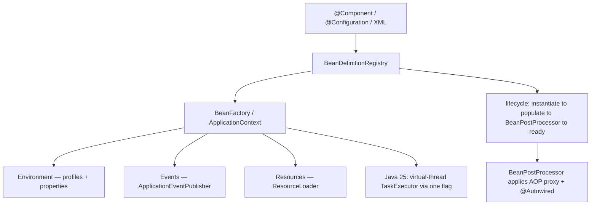
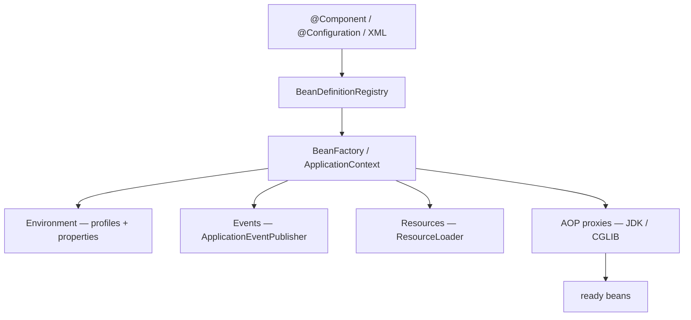

## Why it Matters

**Spring Core** is the **engine room**: the `spring-core`, `spring-beans`, `spring-context`, and `spring-expression` modules that implement the IoC container, bean lifecycle, DI, AOP, SpEL, and the `Environment` abstraction. Every higher Spring module (Boot, Data, Security, Cloud) is built on it, so understanding it is what separates "I use annotations" from "I can debug a wiring failure". The mental model that unlocks it: **the container is a map of beans with lifecycle callbacks**, and scopes, proxies, and AOT hints all become predictable once you hold that picture.

Core ideas:
- **`BeanFactory` vs `ApplicationContext`**: `ApplicationContext` extends `BeanFactory` and adds events, i18n, `Environment`, `ResourceLoader`, and AOP integration, it is the one you use.
- **Bean lifecycle**: `BeanDefinition` (scan or `@Bean`) → instantiate → populate properties → `BeanPostProcessor` (this is where `@Autowired` and AOP proxies are applied) → ready bean → destroy.
- **Scopes**: `singleton` (default, one per container), `prototype` (new per injection), plus `request`/`session`/`application` in web contexts.
- **`Environment`** unifies profiles and property sources so the same code runs per environment.
- **Java 25 angle**: `spring.threads.virtual.enabled=true` makes `@Async`, events, and scheduling run on virtual threads, so blocking calls no longer exhaust pools; pair it with `ScopedValue` instead of `ThreadLocal`.

## Diagram



## Code

```java
@Configuration
@ComponentScan
@PropertySource("classpath:app.properties")
class AppConfig {
 @Bean(initMethod = "start", destroyMethod = "stop")
 StartupBean startup() { return new StartupBean(); }
}

void demo() {
 try (var ctx = new AnnotationConfigApplicationContext(AppConfig.class)) {
 System.out.println(Arrays.toString(ctx.getBeanDefinitionNames()));
 }
}
```

## When to use / not

| Use | Avoid |
|-----|-------|
| `ApplicationContext` in application code; it adds events, i18n, `Environment`, `ResourceLoader`, and AOP over bare `BeanFactory` | `BeanFactory` directly, unless you have a constrained startup budget and need the lighter container |
| `@Component` on classes you own; `@Bean` in `@Configuration` for third-party or composed types | `@Bean` for your own application classes, component scan already finds them |
| `singleton` scope for stateless services/repositories (the default) | stateful singletons, they become shared mutable state, worse under virtual threads where many more callers run concurrently |
| `prototype` for stateful or per-use objects, injected into singletons via `ObjectProvider`/`@Lookup` | injecting `prototype` straight into a `singleton` field, you silently get one instance forever |

## Trade-offs

| Pros | Cons |
|---|---|
| Inversion of control → testable, decoupled POJOs | Magic wiring can hide errors until runtime |
| Centralised config (Java/annotations/XML) | Bean-creation order / proxy nuances can surprise |
| Profiles & Environment unify config across envs | Large context → slower startup if not sliced (mitigated by AOT/native) |
| Events, resources, validation, conversion built-in | Must understand scopes to avoid leaks |
| Virtual threads (Java 25) make blocking IO free, no pool tuning | Requires Java 21+ and driver checks for native-image |

## Vs

**`BeanFactory` vs `ApplicationContext`**

| Aspect | `BeanFactory` | `ApplicationContext` |
|--------|---------------|----------------------|
| Role | base container, instantiate + wire + lifecycle | superset, the container you actually use |
| Adds | nothing beyond basics | events, i18n, `Environment`, `ResourceLoader`, AOP integration |
| Startup | lazy by default (bean on first use) | eager singleton instantiation at startup, fails fast |
| Pick when | extreme memory/startup constraint | everything else |

**`@Bean` vs `@Component`**

| Aspect | `@Component` | `@Bean` |
|--------|--------------|---------|
| Where | on a class | on a method inside `@Configuration` |
| Discovery | `@ComponentScan` auto-detects it | you write the method explicitly |
| Best for | classes you own | third-party types, conditional wiring, composed config |

**`@Value` vs `Environment`**

| Aspect | `@Value("${k:default}")` | `Environment` |
|--------|--------------------------|---------------|
| Shape | one injected property | programmatic access to all property sources + profiles |
| Use | a single scalar into a bean | resolving at runtime, profile checks, multiple keys |

## Pitfalls

- Defining stateful singletons without synchronisation, worse with virtual threads (many more concurrent callers).
- `@Configuration` without `proxyBeanMethods=false` causing CGLIB proxy overhead, set `false` for lite config when no inter-`@Bean` calls (also helps AOT).
- Using `prototype` beans injected into singletons without `ObjectProvider`/`@Lookup`, you get one instance only.
- Forgetting `@EnableAspectJAutoProxy` when not using Boot (Boot enables it).
- Native image without hints, add `RuntimeHintsRegistrar` for reflective / proxied types.

## Interview q&a

**Q: `BeanFactory` vs `ApplicationContext`?** `ApplicationContext` extends `BeanFactory` and adds events, i18n, `Environment`, `ResourceLoader`, AOP integration; prefer `ApplicationContext`.

**Q: How does component scanning work?** `@ComponentScan` registers `BeanDefinition`s for classes annotated with `@Component/@Service/@Repository/@Controller`; `ClassPathBeanDefinitionScanner` reads classpath. In AOT/native, definitions are pre-computed at build time.

**Q: `@Bean` vs `@Component`?** `@Component` on class auto-detected; `@Bean` on method inside `@Configuration` for explicit / third-party types.

**Q: What is a `BeanPostProcessor`?** Hook to customise beans after construction, used internally for AOP proxies, `@Autowired` processing, etc. In AOT, many post-processors run at build time.

**Q: How does `@Value` vs `Environment` differ?** `@Value("${key:default}")` injects one property; `Environment` gives programmatic access and profile checks.

**Q: Circular dependency, why does constructor injection fail but setter injection may succeed?** Constructor cycle requires both beans constructed before either exists, impossible. Setter cycle can create raw instances first, then wire (still a design smell; refactor).

**Q: How do virtual threads affect Spring Core?** With `spring.threads.virtual.enabled=true` (Boot 3.2+/3.5, Java 25), `@Async`, event listeners, and scheduling run on `Executors.newVirtualThreadPerTaskExecutor()`. Blocking calls no longer exhaust pools. Use `ScopedValue` for context propagation instead of `ThreadLocal`.

**Q: What are AOT hints?** `RuntimeHintsRegistrar` / `@RegisterReflectionForBinding` tell GraalVM native-image what reflection/resources/proxies to keep. Boot's AOT engine auto-generates most; custom hints only for dynamic reflection.

`BeanFactory` vs `ApplicationContext`?:: `ApplicationContext` extends `BeanFactory` and adds events, i18n, `Environment`, `ResourceLoader`, AOP integration; prefer `ApplicationContext`. #flashcard
How does component scanning work?:: `@ComponentScan` registers `BeanDefinition`s for classes annotated with `@Component/@Service/@Repository/@Controller`; `ClassPathBeanDefinitionScanner` reads classpath. In AOT/native, definitions are pre-computed at build time. #flashcard
`@Bean` vs `@Component`?:: `@Component` on class auto-detected; `@Bean` on method inside `@Configuration` for explicit / third-party types. #flashcard
What is a `BeanPostProcessor`?:: Hook to customise beans after construction, used internally for AOP proxies, `@Autowired` processing, etc. In AOT, many post-processors run at build time. #flashcard
How does `@Value` vs `Environment` differ?:: `@Value("${key:default}")` injects one property; `Environment` gives programmatic access and profile checks. #flashcard
Circular dependency, why does constructor injection fail but setter injection may succeed?:: Constructor cycle requires both beans constructed before either exists, impossible. Setter cycle can create raw instances first, then wire (still a design smell; refactor). #flashcard
How do virtual threads affect Spring Core?:: With `spring.threads.virtual.enabled=true` (Boot 3.2+/3.5, Java 25), `@Async`, event listeners, and scheduling run on `Executors.newVirtualThreadPerTaskExecutor()`. Blocking calls no longer exhaust pools. Use `ScopedValue` for context propagation instead of `ThreadLocal`. #flashcard
What are AOT hints?:: `RuntimeHintsRegistrar` / `@RegisterReflectionForBinding` tell GraalVM native-image what reflection/resources/proxies to keep. Boot's AOT engine auto-generates most; custom hints only for dynamic reflection. #flashcard

## Related

- [[Spring Framework]] • [[Dependency Injection]] • [[Spring Transaction]] • [[Spring Security]] • [[Threads]]
- [[README|Java MOC]]

---
*Category: Spring • Part of [[README|Java MOC]] • Java 25*

# Spring Core

> Part of [[README|Java MOC]] • `Spring` • Java 25 / Spring Framework 6.2 / Boot 3.5

## Summary

Provide the foundation of Spring: the IoC container, bean lifecycle, DI, AOP, SpEL, and environment abstraction so that application code depends on abstractions, not on infrastructure or manual `new`.

> The container is just a map of beans with lifecycle callbacks. Once you see it that way, scopes and AOT hints feel less mysterious. I still forget the exact scope semantics sometimes, so I look it up.

Spring Core = `spring-core` + `spring-beans` + `spring-context` + `spring-expression`. It offers `BeanFactory` / `ApplicationContext`, bean scopes, profiles, events, resources, and the wiring that every higher Spring module builds on.

## Architecture


```Application
 Code (@Component, @Configuration, XML)
 │
 ▼
 ┌─────────────────────┐
 │ BeanDefinitionRegistry │ ← parses @ComponentScan, @Bean, XML, properties
 └──────────┬──────────┘
 ▼
 ┌─────────────────────┐
 │ BeanFactory / │ - creates & wires beans, resolves dependencies,
 │ ApplicationContext │ applies BeanPostProcessors, manages lifecycle
 └──────────┬──────────┘
 ├── Environment (profiles, properties, PropertySource)
 ├── Events (ApplicationEventPublisher)
 ├── Resources (ResourceLoader)
 └── AOP proxies (JDK / CGLIB) wrapping beans

 External: DataSource, JPA, Web, Security built on top
 Java 25: virtual-thread executors + ScopedValue + AOT hints feed into the same container
```
Bean lifecycle (simplified): `instantiate → populate properties (DI) → Aware callbacks → BeanPostProcessor#postProcessBeforeInitialisation → @PostConstruct / afterPropertiesSet → postProcessAfterInitialisation (AOP proxy) → ready → @PreDestroy / destroy()`.

## Container Variants

| Container | Description | When to use |
|---|---|---|
| `BeanFactory` | Lazy, minimal container | Infrastructure / constrained env |
| `ApplicationContext` | Full feature (events, i18n, `Environment`, `ResourcePatternResolver`) | All standard apps, `AnnotationConfigApplicationContext`, `ClassPathXmlApplicationContext` |

## Scopes & Lifecycle

| Scope | Lifecycle | Notes |
|---|---|---|
| `singleton` (default) | One instance per container | Thread-safe design required, virtual threads amplify contention if singleton is stateful |
| `prototype` | New instance per injection/lookup | Container does not manage destruction |
| `request` / `session` | Per HTTP request/session | Web-only (`spring-web`); with `spring.threads.virtual.enabled=true` each request is a virtual thread, scope still works |
| `application` / `websocket` | Per `ServletContext` / WebSocket | Web-only |

> Java 25 note: Scopes are stored via `ThreadLocal` internally but Spring 6.2+ bridges them to virtual threads correctly. For custom context propagation prefer `ScopedValue` over `ThreadLocal` (see [[Threads]]).

## Virtual Threads in Spring Core (Java 25)
```yamlspring
:
 threads:
 virtual:
 enabled: true
```
```
java
@Configuration
@EnableAsync
class VirtualThreadCoreConfig {
 @Bean
 AsyncTaskExecutor applicationTaskExecutor() {
 return new TaskExecutorAdapter(Executors.newVirtualThreadPerTaskExecutor());
 }
}
```What
 changes in Core with virtual threads:
- `@Async` methods run on virtual threads, blocking calls (`RestClient`, JDBC) no longer exhaust the pool.
- `ApplicationEventPublisher` with `@Async @EventListener` fans out on virtual threads.
- `ScopedValue` (JEP 506) is the idiomatic way to propagate request context through `ApplicationContext`, Spring 6.2 exposes `ContextPropagation` support for it.

## AOT & GraalVM Hints (Spring 6.2 / Boot 3.5)

AOT pre-computes bean definitions at build time for GraalVM native images. Most hints are auto-generated; add custom ones for dynamic reflection.
```java
java
@Configuration
@ImportRuntimeHints(CoreHints.class)
class CoreHints implements RuntimeHintsRegistrar {
 @Override
 public void registerHints(RuntimeHints hints, ClassLoader cl) {
 hints.reflection().registerType(OrderService.class, MemberCategory.INVOKE_DECLARED_METHODS);
 }
}
```
```
java
@Component
@RegisterReflectionForBinding(Order.class)
class OrderService {
 Order find(long id) { return new Order(id); }
}
```-
 Build: `mvn -Pnative native:compile` or `gradle nativeCompile` → runs `spring-boot:process-aot`.- Virtual threads need no extra hint, supported in GraalVM for JDK 25.

### AOP Snippet (Core + AOP), Java 25

```java
java
@Aspect
@Component
class LoggingAspect {
 @Around("execution(* com.acme..*(..))")
 Object log(ProceedingJoinPoint pjp) throws Throwable {
 long t0 = System.nanoTime();
 try { return pjp.proceed(); }
 finally { System.out.println(pjp.getSignature() + " took " + (System.nanoTime() - t0) + "ns"); }
 }
}
```
> AOT note: Aspects need proxy hints in native image, Boot generates them for `@Aspect` beans automatically.