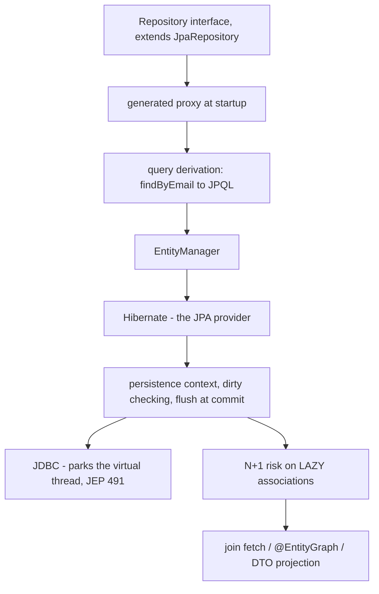
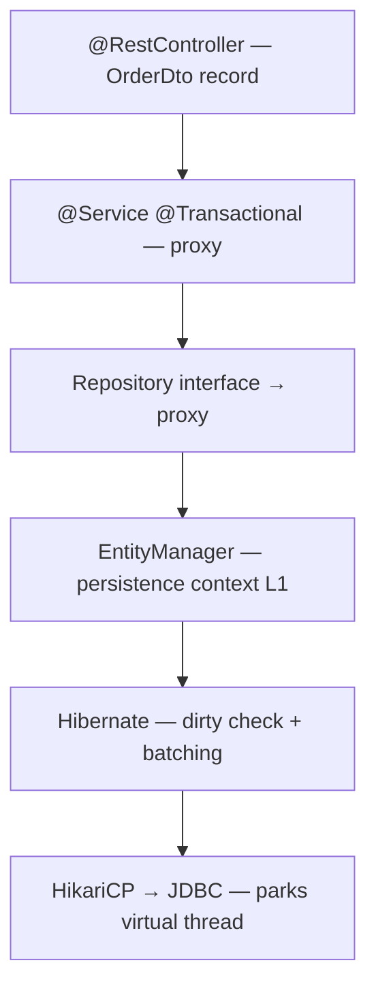

## Why it Matters

**Spring Data JPA** is the **repository abstraction over JPA/Hibernate** and the layer where most backend interview time goes: you write an interface that `extends JpaRepository`, and the framework generates the implementation, CRUD, paging, sorting, and **query derivation from method names** (`findByEmail` → JPQL). It is also the layer with the classic failure modes interviewers probe, N+1 selects, `LazyInitializationException`, and the persistence-context/flush lifecycle, because the abstraction hides them until production.

Core ideas:
- **JPA is the spec, Hibernate is the provider, Spring Data JPA is the repository layer over both.**
- **Entity lifecycle**: transient → managed → detached / removed; only managed entities are dirty-checked, so no explicit `save()` is needed inside a transaction.
- **Query derivation** (`findByEmailAndStatus`) plus `@Query` JPQL and DTO projections replace hand-written DAOs.
- **N+1 is the signature bug**: mark associations `LAZY`, then use `join fetch` / `@EntityGraph` / projections, and keep `open-in-view=false`.
- **Java 25 angle**: transactions stay thread-bound, so keep a transaction on one virtual thread; `spring.threads.virtual.enabled=true` makes the JDBC parks cheap (JEP 491) but does not propagate the transaction to `StructuredTaskScope` children.

## Diagram



## Code

```java
@SpringBootApplication
public class JpaApplication {
 public static void main(String[] args) { SpringApplication.run(JpaApplication.class, args); }
}
```

## When to use / not

| Use | Avoid |
|-----|-------|
| `JpaRepository` interface for CRUD/paging/sorting, implementation generated | Writing DAO implementations by hand, the interface is the implementation |
| Query derivation for simple lookups; `@Query` JPQL for anything complex | Derived queries past ~3 conditions, they become unreadable, write explicit JPQL |
| `LAZY` associations + `join fetch` / `@EntityGraph` / DTO projections | `EAGER` collection fetching, loads the whole graph and invites N+1 |
| `record` DTOs as API output, mapped from entities | Exposing entities to the client, leaks lazy proxies and couples API to schema |
| `GenerationType.SEQUENCE` with `allocationSize` for batch inserts | `GenerationType.IDENTITY`, disables JDBC insert batching |

## Trade-offs

| Pros | Cons |
|---|---|
| Zero DAO boilerplate, interface is implementation | Magic proxy, method-name typos fail at startup, not compile time |
| Paging, sorting, `Specification`, `QueryDSL` built-in | Lazy loading outside TX → `LazyInitializationException` (fix: fetch join / EntityGraph, not `open-in-view`) |
| Hibernate dirty checking → no manual UPDATE | N+1 easy to introduce, always verify with `hibernate.stat` / `datasource-proxy` |
| `@Transactional` declarative, virtual-thread-friendly (parks on JDBC) | TX is thread-bound, cannot span `StructuredTaskScope` children |
| Records as DTOs + JPQL `new` keep API immutable | Entities still need no-arg constructor + mutable fields for Hibernate |

## Vs

**JPA vs Hibernate vs Spring Data JPA**

| Aspect | JPA | Hibernate | Spring Data JPA |
|--------|-----|-----------|-----------------|
| Role | the specification (`EntityManager`, annotations, JPQL) | the provider, implements JPA + extras (batching, `@CreationTimestamp`) | repository abstraction over both |
| You write | entities + JPQL | entities + HQL when needed | an interface, implementation generated |
| Question | "what is the spec?" | "what is the provider?" | "how do I avoid DAO boilerplate?" |

**`findByX` derivation vs `@Query` vs native SQL**

| Aspect | Derived query | `@Query("JPQL")` | Native SQL |
|--------|---------------|-------------------|------------|
| Source | method name | hand-written JPQL | raw SQL |
| Safety | parsed at startup | parsed at startup | none until runtime |
| Use | 1-3 conditions | joins, aggregations, DTO projections | vendor-specific features |
| Risk | unreadable past ~3 conditions | JPQL limitations | portability lock-in |

**Fetch strategies and N+1 fixes**

| Aspect | `FetchType.LAZY` + `join fetch` | `@EntityGraph` | DTO projection |
|--------|----------------------------------|----------------|----------------|
| Shape | one query with a join | one query, graph defined on repo | one query, constructor expression |
| Use | fixed fetch path | per-query graph tuning | read-only API output |
| Trade | cartesian product risk on several collections | same, keep graphs shallow | no entity state, safest |

**`save()` vs `saveAndFlush()` vs dirty checking**

| Aspect | `save()` | `saveAndFlush()` | dirty checking |
|--------|----------|------------------|----------------|
| Effect | registers in persistence context | forces flush to DB now | auto-UPDATE on changed managed entities at flush |
| Use | the default | you need the ID or a constraint check *now* | inside a transaction, no save() needed at all |

**`GenerationType.SEQUENCE` vs `IDENTITY`**

| Aspect | SEQUENCE | IDENTITY |
|--------|----------|----------|
| ID source | DB sequence, `allocationSize` pooled | DB autoincrement column |
| Insert batching | supported | **disabled**, INSERT is immediate |
| Use | preferred, Postgres/Oracle | MySQL-idiomatic |

**Java 25: transaction on one virtual thread vs fanned-out work**

| Aspect | TX on one virtual thread | fan-out via `StructuredTaskScope` |
|--------|--------------------------|----------------------------------|
| Transaction | present, commits at method exit | **no TX in children**, thread-bound |
| Blocking JDBC | parks the virtual thread (JEP 491), cheap | parallel, but must be non-TX work |

## Pitfalls

- Leaving `spring.jpa.hibernate.ddl-auto=update` in prod, use `validate` + Flyway/Liquibase.
- Keeping `open-in-view=true`, hides N+1 and holds `EntityManager` through view rendering; set `false`.
- Calling `@Transactional` method via `this` (self-invocation), bypasses proxy; move to another bean or inject self-proxy.
- Exposing entities as REST responses, leaks lazy proxies and couples API to persistence; always map to `record` DTOs.
- `EAGER` fetching on collections, loads entire graph; use `LAZY` + fetch joins.
- Forgetting `@Version`, lost updates silently overwrite; add optimistic locking.
- Forking `StructuredTaskScope` inside `@Transactional` expecting TX, child threads have no TX; fetch outside or use `TransactionTemplate` per child.
- `IDENTITY` + batching, incompatible; switch to `SEQUENCE` for batch inserts.
- Native image without entity hints, `NoSuchMethodException` at startup; let Boot AOT generate or add `RuntimeHintsRegistrar`.

## Interview q&a

**Q: JPA vs Hibernate vs Spring Data JPA?** JPA is the spec (`EntityManager`, annotations, JPQL); Hibernate is the JPA provider (implements the spec + extras like `@CreationTimestamp`, batching); Spring Data JPA is the repository abstraction over `EntityManager`/Hibernate, generates implementations from interfaces.

**Q: Entity lifecycle states?** Transient (`new`), Managed (in persistence context), Detached (context closed/cleared), Removed (scheduled delete). `persist` → managed, `detach/clear` → detached, `merge` re-attaches, `remove` schedules delete.

**Q: What is dirty checking?** Hibernate snapshots managed entities at load; at flush it diffs current state vs snapshot and issues `UPDATE` for changed fields automatically, no explicit `save()` needed inside a TX.

**Q: `save()` vs `saveAndFlush()`?** `save()` registers in context; flush may be deferred to commit/query. `saveAndFlush()` forces `flush()` immediately, needed when DB constraint must be validated before continuing.

**Q: How to avoid N+1?** Mark associations `LAZY`, use `join fetch` / `@EntityGraph` / DTO projections, set `hibernate.jdbc.batch_size`, and keep `open-in-view=false` so lazy outside TX fails fast.

**Q: `REQUIRED` vs `REQUIRES_NEW`?** `REQUIRED` joins caller's TX (single commit); `REQUIRES_NEW` suspends caller and commits independently, inner failure doesn't roll back outer.

**Q: Which exceptions trigger rollback?** Only unchecked (`RuntimeException`, `Error`) by default; add `rollbackFor = Exception.class` to include checked. Swallowing exceptions inside `@Transactional` prevents rollback, rethrow or `setRollbackOnly()`.

**Q: How do transactions work with virtual threads (Java 25)?** TX is per-thread via `TransactionSynchronizationManager`, each virtual thread has its own TX. `spring.threads.virtual.enabled=true` makes JDBC parks cheap (virtual thread parks, JEP 491), but TX does not propagate to `StructuredTaskScope` children. Keep TX on one virtual thread; fan out only non-TX work.

**Q: `GenerationType.SEQUENCE` vs `IDENTITY`?** `SEQUENCE` with `allocationSize=50` allows JDBC batching and pooled IDs, preferred. `IDENTITY` forces immediate INSERT (no batching) and is MySQL-idiomatic.

**Q: AOT / native image for JPA?** Boot's AOT generates entity reflection hints at build time; custom converters/listeners may need `RuntimeHintsRegistrar` or `@RegisterReflectionForBinding`.

JPA vs Hibernate vs Spring Data JPA?:: JPA is the spec (`EntityManager`, annotations, JPQL); Hibernate is the JPA provider (implements the spec + extras like `@CreationTimestamp`, batching); Spring Data JPA is the repository abstraction over `EntityManager`/Hibernate, generates implementations from interfaces. #flashcard
Entity lifecycle states?:: Transient (`new`), Managed (in persistence context), Detached (context closed/cleared), Removed (scheduled delete). `persist` → managed, `detach/clear` → detached, `merge` re-attaches, `remove` schedules delete. #flashcard
What is dirty checking?:: Hibernate snapshots managed entities at load; at flush it diffs current state vs snapshot and issues `UPDATE` for changed fields automatically, no explicit `save()` needed inside a TX. #flashcard
`save()` vs `saveAndFlush()`?:: `save()` registers in context; flush may be deferred to commit/query. `saveAndFlush()` forces `flush()` immediately, needed when DB constraint must be validated before continuing. #flashcard
How to avoid N+1?:: Mark associations `LAZY`, use `join fetch` / `@EntityGraph` / DTO projections, set `hibernate.jdbc.batch_size`, and keep `open-in-view=false` so lazy outside TX fails fast. #flashcard
`REQUIRED` vs `REQUIRES_NEW`?:: `REQUIRED` joins caller's TX (single commit); `REQUIRES_NEW` suspends caller and commits independently, inner failure doesn't roll back outer. #flashcard
Which exceptions trigger rollback?:: Only unchecked (`RuntimeException`, `Error`) by default; add `rollbackFor = Exception.class` to include checked. Swallowing exceptions inside `@Transactional` prevents rollback, rethrow or `setRollbackOnly()`. #flashcard
How do transactions work with virtual threads (Java 25)?:: TX is per-thread via `TransactionSynchronizationManager`, each virtual thread has its own TX. `spring.threads.virtual.enabled=true` makes JDBC parks cheap (virtual thread parks, JEP 491), but TX does not propagate to `StructuredTaskScope` children. Keep TX on one virtual thread; fan out only non-TX work. #flashcard
`GenerationType.SEQUENCE` vs `IDENTITY`?:: `SEQUENCE` with `allocationSize=50` allows JDBC batching and pooled IDs, preferred. `IDENTITY` forces immediate INSERT (no batching) and is MySQL-idiomatic. #flashcard
AOT / native image for JPA?:: Boot's AOT generates entity reflection hints at build time; custom converters/listeners may need `RuntimeHintsRegistrar` or `@RegisterReflectionForBinding`. #flashcard

## Related

- [[Spring Framework]] • [[Spring Core]] • [[Spring Transaction]] • [[Spring Boot]] • [[Spring MVC]] • [[Threads]]
- [[README|Java MOC]]

---
*Category: Spring • Part of [[README|Java MOC]] • Java 25*

# Spring Data jpa

> Part of [[README|Java MOC]] • `Spring` • Java 25 / Spring Boot 3.5 / Hibernate 6.6 / JPA 3.2

## Summary

Eliminate boilerplate persistence: declare an interface (`extends JpaRepository`), get CRUD, paging, sorting, and query derivation for free; map entities with Hibernate so that transactions (`@Transactional`) and the persistence context handle flush/dirty-checking without manual JDBC.

> JPA is powerful until N+1 queries show up in production. I have been burned by lazy collections more than once, fetch joins or entity graphs are worth learning early.

Spring Data JPA = Spring Data (repository abstraction) + JPA (Jakarta Persistence spec: `EntityManager`, `Entity` lifecycle, JPQL) + Hibernate (JPA provider: dirty checking, L1 cache, batching, lazy loading). Boot auto-configures `DataSource` (HikariCP), `EntityManagerFactory`, and `JpaTransactionManager`; repositories become transactional proxies at startup.

## Architecture


```Controller
 (@RestController, virtual thread when spring.threads.virtual.enabled=true)
 │ OrderDto record ←→ Entity
 ▼
 Service (@Transactional) ← TransactionInterceptor (AOP proxy)
 │ PlatformTransactionManager / JpaTransactionManager
 │ TransactionSynchronizationManager (ThreadLocal per virtual thread)
 ▼
 Spring Data Repository (interface → proxy at startup)
 │ JpaRepository<Order, Long> → SimpleJpaRepository
 ▼
 EntityManager / Persistence Context (L1 cache, per-transaction)
 │ persist / merge / remove / flush / dirty-check
 ▼
 Hibernate (Session, ActionQueue, JDBC batching, L2 cache optional)
 │
 ▼
 HikariCP → JDBC → PostgreSQL / MySQL
 (virtual thread parks on JDBC call - JEP 491 - carrier reused)

 Startup: @SpringBootApplication → @EnableJpaRepositories
 → scans interfaces → creates JDK proxies → registers as beans
 AOT (Java 25): entity reflection hints generated at build time
```
## JPA Lifecycle, Hibernate & Identity

### Entity States

| State | In Persistence Context? | In DB? | How to enter |
|---|---|---|---|
| Transient | No | No | `new Order()` |
| Managed | Yes | May be flushed | `em.persist(o)`, `find()`, query result |
| Detached | No (was managed) | Yes | `em.detach()`, `em.clear()`, TX commit/close, serialize |
| Removed | Yes (scheduled) | Will be deleted on flush | `em.remove(managed)` |
```mermaidstateDiagram-v2
 [*] --> TRANSIENT: new Order()
 TRANSIENT --> MANAGED: persist() / find()
 MANAGED --> DB: flush / commit
 MANAGED --> DETACHED: detach() / clear() / close
 DETACHED --> MANAGED: merge()
 MANAGED --> REMOVED: remove()
 REMOVED --> DB: flush → DELETE
```
### Hibernate Dirty Checking & Flush

| Concept | Detail |
|---|---|
| Dirty checking | At flush, Hibernate compares managed entity snapshot vs current fields; changed entities → `UPDATE` automatically, no `save()` needed inside TX |
| Flush | `EntityManager.flush()` synchronises context → DB (still inside TX, not commit). Triggered before query, at `commit`, or manually |
| L1 cache | Per-`EntityManager` (per TX) map `id → entity`; `find(id)` hits L1 first |
| L2 cache | Optional `SessionFactory`-scoped (Ehcache/Caffeine), cross-TX, needs `@Cache` |

### Identity & Equals/hashCode

| Concern | Rule |
|---|---|
| `@Id` generation | `IDENTITY` (DB auto-increment), `SEQUENCE` (preferred for batching), `UUID` |
| `equals/hashCode` | Don't use `@Id` before persist (null); use business key (e.g. `orderNumber`) or rely on identity until persisted |
```java
@Entity
@Table(name = "orders")
class Order {
 @Id
 @GeneratedValue(strategy = GenerationType.SEQUENCE, generator = "order_seq")
 @SequenceGenerator(name = "order_seq", allocationSize = 50)
 Long id;

 @Enumerated(EnumType.STRING)
 Status status;

 @Version Long version; // optimistic locking
 protected Order() {} // JPA requires no-arg constructor
 Order(Status s) { this.status = s; }
}
enum Status { NEW, PAID, SHIPPED }
record OrderDto(long id, String status) {}
```
### Fetching & n+1

| Fetch | Behaviour | Default |
|---|---|---|
| `LAZY` | Proxy loaded on first access, needs open `EntityManager` (within TX) | `@ManyToOne`, `@OneToMany` collections |
| `EAGER` | Loaded with parent | `@ManyToOne` (JPA default EAGER, override to LAZY) |
```java
public
 interface OrderRepository extends JpaRepository<Order, Long> {
 // N+1 fix: single query with join fetch
 @Query("select o from Order o join fetch o.items where o.status = :s")
 List<Order> findByStatusFetched(@Param("s") Status s);

 @EntityGraph(attributePaths = "items")
 List<Order> findByCustomerId(String customerId);
}
```
> `spring.jpa.open-in-view=false` (Boot default since 2.x), closes `EntityManager` after TX, so lazy access outside TX fails fast instead of hiding N+1.

## Repositories, Query Derivation, JPQL, Projections
```java
public
 interface OrderRepository extends JpaRepository<Order, Long> {
 List<Order> findTop3ByStatusOrderByTotalDesc(Status s); // derived

 @Query("select new com.acme.OrderDto(o.id, o.status) from Order o where o.id = :id")
 Optional<OrderDto> findDto(@Param("id") long id);

 @Modifying
 @Transactional
 @Query("update Order o set o.status = :s where o.id = :id")
 int markStatus(@Param("id") long id, @Param("s") Status s);
}
```java
### Query Keywords (Derived)

| Keyword | JPQL | Example |
|---|---|---|
| `And`, `Or` | `and` / `or` | `findByStatusAndCustomerId` |
| `Between`, `LessThan`, `GreaterThan` | `between`, `<`, `>` | `findByTotalBetween` |
| `Like`, `Containing`, `StartingWith` | `like %?%` | `findByCustomerIdContaining` |
| `OrderBy` | `order by` | `findByStatusOrderByTotalDesc` |
| `Top3`, `First` | `limit` | `findTop3ByStatusOrderByCreatedAtDesc` |
| `IgnoreCase` | `upper()` | `findByCustomerIdIgnoreCase` |

### Projections vs Entities

| Projection | What it returns | When to use |
|---|---|---|
| Entity `Order` | Full managed entity | Need to modify & flush |
| Interface projection | `interface OrderView { String getCustomerId(); }` | Read-only subset, no manual query |
| Record / DTO via JPQL `new` | Immutable `OrderDto` record | API response, no managed overhead |
| `Tuple` / `Object[]` | Raw columns | Ad-hoc reporting |

## Transactions, @Transactional

| Attribute | Options | Default | Notes |
|---|---|---|---|
| `propagation` | `REQUIRED`, `REQUIRES_NEW`, `NESTED`, `SUPPORTS`, `MANDATORY`, ... | `REQUIRED` | Join or new |
| `isolation` | `READ_COMMITTED` … `SERIALIZABLE` | `DEFAULT` (DB) | Higher → more locks |
| `readOnly` | `true/false` | `false` | Optimises flush/dirty check; route to replica |
| `rollbackFor` | exception classes | Unchecked only | Add `rollbackFor = Exception.class` for checked |
| `timeout` | seconds | `-1` | Rollback on timeout |
```java
@Service
class OrderService {
 private final OrderRepository repo;
 OrderService(OrderRepository repo) { this.repo = repo; }

 @Transactional
 public OrderDto place(CreateOrderRequest req) {
 var saved = repo.save(new Order(Status.NEW)); // dirty checking needs no save() on update
 return new OrderDto(saved.id, saved.status.name());
 }

 @Transactional(readOnly = true)
 public List<OrderDto> list() {
 return repo.findAll().stream().map(o -> new OrderDto(o.id, o.status.name())).toList();
 }
}
```
### Virtual Threads & JPA, Rules (Java 25)

| Concern | Behaviour |
|---|---|
| TX binding | `TransactionSynchronizationManager` uses `ThreadLocal` per virtual thread, isolation preserved |
| Child threads | `StructuredTaskScope` / `newVirtualThreadPerTaskExecutor()` children do not inherit TX, keep DB work on owning thread |
| Blocking cost | JDBC call parks virtual thread (JEP 491), many concurrent TXs without pool exhaustion |
| Read-only TX | `readOnly=true` skips dirty checking, preferred for queries on virtual threads |

### Configuration (Boot 3.5)
```yamlspring
:
 threads.virtual.enabled: true
 datasource:
 url: jdbc:postgresql://localhost:5432/demo
 hikari.maximum-pool-size: 20
 jpa:
 hibernate.ddl-auto: validate # never update/create in prod
 open-in-view: false
 show-sql: false
 properties:
 hibernate.jdbc.batch_size: 25
 hibernate.order_inserts: true
 hibernate.order_updates: true
 hibernate.jdbc.batch_versioned_data: true
 hibernate.query.fail_on_pagination_over_collection_fetch: true
```