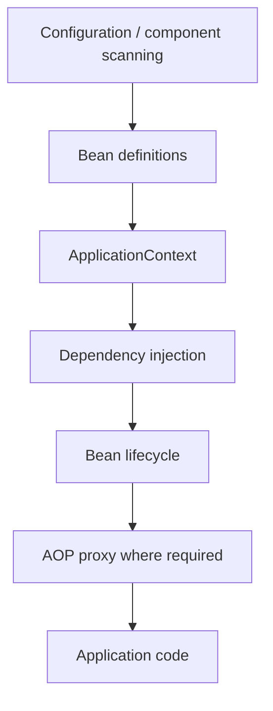

# Spring Framework

## Intent

Understand the container model underneath Spring Boot: bean definitions, dependency injection, lifecycle, AOP proxies, configuration and resource abstractions.

## Current Generation

Spring Framework 7 is the current generation in September 2026 and is the foundation for Spring Boot 4. Spring Framework 7 embraces Java 25 while retaining a Java 17 baseline.

Older Spring Framework 6 material remains useful for existing services, but version-specific APIs must be checked against the application's dependency management.

## Container Model

## Core Concepts

### IoC

The container owns object creation and lifecycle. Application code declares dependencies rather than constructing the dependency graph manually.

### Dependency Injection

Prefer constructor injection for required dependencies. It makes dependencies explicit and supports immutable collaborators.

### Bean Lifecycle

Know the broad lifecycle:

**definition → instantiation → dependency population → post-processors → initialization callbacks → ready → destruction**

The exact callback sequence depends on configuration and framework version.

### AOP and Proxies

Declarative transactions, authorization and caching are commonly implemented through interception/proxy mechanisms.

Important consequence:

**self-invocation does not cross the proxy.**

If method A calls method B through this.methodB(), proxy-based advice on B may not run.

## When to Use / When NOT

| Use | Avoid |
|---|---|
| Non-trivial application with dependency graphs and cross-cutting infrastructure | Tiny scripts where a container adds more complexity than value |
| Declarative transactions/security/caching | AOP for one-off business logic |
| Constructor injection for required collaborators | Hidden field injection |
| Boot when opinionated defaults reduce setup | Treating auto-configuration as magic you cannot inspect |

## Senior Interview Questions

**Why constructor injection?**

It makes required dependencies explicit, supports final fields and makes unit testing straightforward.

**What is the difference between IoC and DI?**

IoC is the broader inversion of control; DI is one mechanism for achieving it by supplying collaborators from outside the object.

**Why can self-invocation bypass @Transactional?**

Because the call stays on the target object instead of crossing the proxy that applies the interceptor.

**Spring Framework vs Spring Boot?**

Framework provides the underlying container and modules. Boot provides opinionated application setup, auto-configuration, starters and production-oriented defaults.

## Practice

- [ ] Explain bean creation without using the phrase "Spring magic".
- [ ] Demonstrate proxy self-invocation with a transaction or security example.
- [ ] Trace one application bean from definition to ready state.
