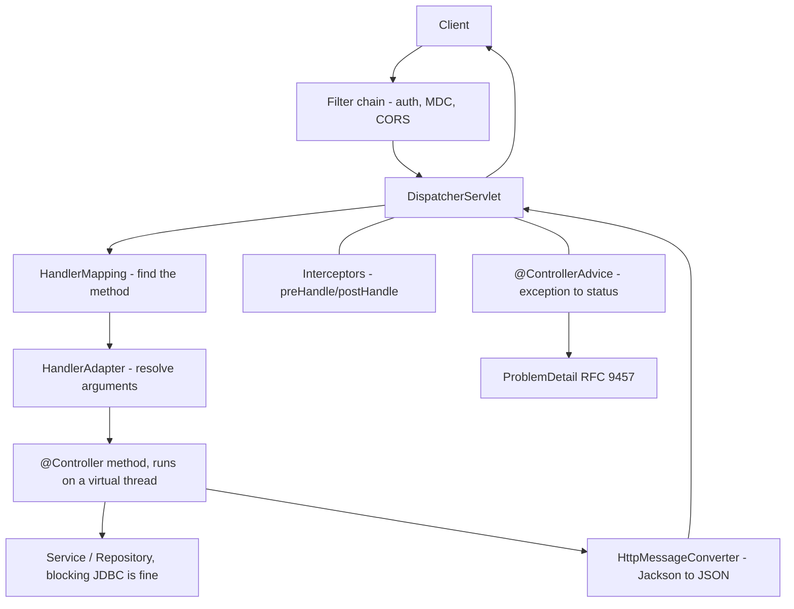
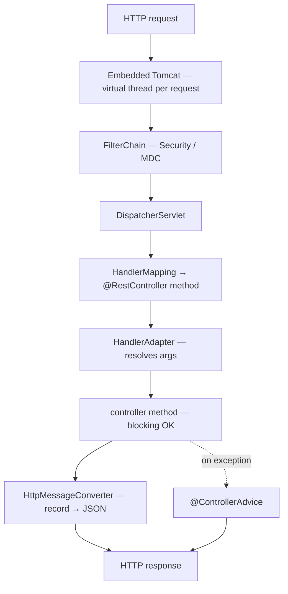

## Why it Matters

**Spring MVC** is the **Servlet-based web framework** every Spring backend serves HTTP through, and the reason Java 25 changed its calculus: with `spring.threads.virtual.enabled=true` (Boot 3.5, Java 25) **each request runs on a virtual thread**, so a straightforward imperative controller with blocking JDBC scales to thousands of concurrent requests *without reactive programming*. That single fact removed the main reason teams moved to WebFlux, and it is the most-asked MVC question in current interviews.

Core ideas:
- **`DispatcherServlet` is the front controller**: one servlet receives every request, asks `HandlerMapping` which controller method to call, and lets a `HandlerAdapter` resolve arguments (`@PathVariable`, `@RequestBody`, `@RequestParam`) and invoke it.
- **`@RestController` = `@Controller + @ResponseBody`**: methods return objects, `HttpMessageConverter` (Jackson) serialises them to JSON.
- **Records as DTOs + `@Valid`**: put Jakarta validation annotations on record components for automatic 400s.
- **`@ControllerAdvice` + `@ExceptionHandler`**: one place for the whole API's error envelope, RFC 9457 `ProblemDetail` is built in.
- **Filter → Interceptor → Advice**: three layers, each at a different point in the request path.

## Diagram



## Code

```java
@SpringBootApplication
public class MvcApplication {
 public static void main(String[] args) { SpringApplication.run(MvcApplication.class, args); }
}
```

## When to use / not

| Use | Avoid |
|-----|-------|
| Standard CRUD/REST APIs with blocking JDBC, now scaled by virtual threads | Returning `null` from a handler, that yields 200 + empty body, throw or return `ResponseEntity.notFound()` |
| `record` DTOs in/out + `@Valid` for automatic 400s | Exposing JPA entities straight to the client, lazy proxies leak and your API becomes your schema |
| `@ControllerAdvice` for one error envelope per API | Catching exceptions inside the controller and returning 200, the advice never fires |
| Virtual threads for IO-bound handlers (`spring.threads.virtual.enabled=true`) | WebFlux for typical CRUD unless you need SSE/streaming/backpressure, MVC + virtual threads is simpler and equally scalable on 25 |

## Trade-offs

| Pros | Cons |
|---|---|
| Simple imperative model, records as DTOs, `ResponseEntity` for HTTP semantics | Blocking handlers still hold DB locks, keep transactions short |
| `@ControllerAdvice` gives single error envelope for the whole API | Self-invocation or filter ordering bugs can bypass advice |
| Validation (`@Valid` on records) → automatic 400 without boilerplate | Multiple `@ControllerAdvice` ordering needs `@Order` |
| Virtual threads (Java 25) make blocking MVC as scalable as WebFlux | WebFlux still preferred for backpressure / SSE / streaming |
| Full filter/interceptor chain for cross-cutting concerns | Over-filtering adds latency, measure with Actuator metrics |

## Vs

**Spring MVC vs WebFlux vs MVC + virtual threads**

| Aspect | Spring MVC (servlet) | WebFlux (reactive) | MVC + virtual threads (Java 25) |
|--------|----------------------|--------------------|---------------------------------|
| Concurrency model | thread-per-request, platform pool | event loop, non-blocking | thread-per-request, **virtual** threads |
| Blocking JDBC | fine, holds an OS thread | needs R2DBC or blocks the loop | fine, parks the virtual thread (JEP 491) |
| Scalability ceiling | ~200 concurrent per pod | high with non-blocking IO | high with ordinary blocking code |
| Backpressure / SSE | limited | first-class | limited, same as MVC |
| Code style | imperative, simplest | reactive chains, steeper | imperative, simplest |
| Pick when | classic CRUD | streaming, SSE, gateway aggregation | **default on Java 25** for IO-bound APIs |

**`@Controller` vs `@RestController`**

| Aspect | `@Controller` | `@RestController` |
|--------|---------------|-------------------|
| Composition | base stereotype | `@Controller + @ResponseBody` |
| Returns | view names (or `@ResponseBody` per method) | body, serialised by Jackson |
| Use | server-rendered HTML | JSON/XML APIs |

**Filter vs Interceptor vs `@ControllerAdvice`**

| Aspect | Filter | Interceptor | `@ControllerAdvice` |
|--------|--------|-------------|---------------------|
| Layer | servlet, before `DispatcherServlet` | Spring MVC, around the handler | exceptions and result handling |
| Sees | raw request/response | handler + ModelAndView | thrown exceptions |
| Typical use | auth, CORS, MDC, logging | metrics, header tweaks | error envelope, `ProblemDetail` |

**`ResponseEntity` vs returning a bare object**

| Aspect | `ResponseEntity<T>` | bare `T` |
|--------|---------------------|----------|
| Controls | status, headers (`Location`, `ETag`), body | status 200 by default, body only |
| Use | 201 with Location, cache headers, conditional responses | the simple success case |

**`@Valid` on a record vs validation omitted**

| Aspect | `@Valid` + annotations on record components | no `@Valid` |
|--------|--------------------------------------------|------------|
| Behaviour | 400 with field errors on bad input | validation silently skipped |
| Failure cost | one annotation | bad data reaches your service |

## Pitfalls

- Returning `null` from `@RestController` → 200 with empty body, not 404, throw `NotFoundException` or return `ResponseEntity.notFound()`.
- Forgetting `@Valid` on `@RequestBody` record, validation silently skipped; always add `@Valid`.
- Multiple `@ControllerAdvice` without `@Order`, unpredictable handler precedence.
- Using field injection in controllers, prefer constructor injection (AOT-friendly, testable).
- `synchronized` + native call inside controller, still pins virtual thread (native frame); isolate native calls.
- Swallowing exceptions in controller and returning 200, breaks advice and clients; let exceptions propagate to advice.
- Not setting `spring.threads.virtual.enabled=true` on Java 25 IO-bound service, stays on 200-thread platform pool.

## Interview q&a

**Q: `DispatcherServlet` flow?** `FilterChain` → `DispatcherServlet` → `HandlerMapping` finds controller → `HandlerAdapter` resolves args → invoke method (on virtual thread) → `HttpMessageConverter` writes body → interceptors post-process. Exceptions bubble to `@ControllerAdvice`.

**Q: `@Controller` vs `@RestController`?** `@RestController = @Controller + @ResponseBody`, every method returns body (JSON). `@Controller` returns view names unless annotated with `@ResponseBody`.

**Q: Why `ResponseEntity`?** Full HTTP control: status, headers (`Location`, `ETag`), body. `ResponseEntity.created(location).body(dto)` for 201; `noContent()` for 204.

**Q: How does `@ControllerAdvice` work?** A bean with `@ExceptionHandler` methods that applies globally. Most specific handler wins; use `@Order` if multiple advices. For RFC 9457 use `ProblemDetail`.

**Q: Validation with records?** Put Jakarta annotations on record components (`record Req(@NotBlank String name){}`), annotate controller param with `@Valid`, handle `MethodArgumentNotValidException` in advice → 400 with field map.

**Q: Filters vs Interceptors vs Advice?** Filters (servlet, before dispatch), Interceptors (around handler inside dispatch), Advice (exception/result handling). Auth/MDC → filter; metrics/header → interceptor; errors → advice.

**Q: How do virtual threads change MVC?** With `spring.threads.virtual.enabled=true` (Boot 3.5, Java 25) each request is a virtual thread. Blocking `RestClient`/JDBC/`Thread.sleep` parks the virtual thread (JEP 491), no `DeferredResult` needed. Throughput jumps from ~200 to 10k+ concurrent with no code change.

**Q: When to choose WebFlux over MVC + virtual threads?** Streaming/SSE, backpressure, or gateway aggregation needing non-blocking composition. For typical CRUD + blocking JDBC, MVC + virtual threads is simpler and equally scalable on Java 25.

`DispatcherServlet` flow?:: `FilterChain` → `DispatcherServlet` → `HandlerMapping` finds controller → `HandlerAdapter` resolves args → invoke method (on virtual thread) → `HttpMessageConverter` writes body → interceptors post-process. Exceptions bubble to `@ControllerAdvice`. #flashcard
`@Controller` vs `@RestController`?:: `@RestController = @Controller + @ResponseBody`, every method returns body (JSON). `@Controller` returns view names unless annotated with `@ResponseBody`. #flashcard
Why `ResponseEntity`?:: Full HTTP control: status, headers (`Location`, `ETag`), body. `ResponseEntity.created(location).body(dto)` for 201; `noContent()` for 204. #flashcard
How does `@ControllerAdvice` work?:: A bean with `@ExceptionHandler` methods that applies globally. Most specific handler wins; use `@Order` if multiple advices. For RFC 9457 use `ProblemDetail`. #flashcard
Validation with records?:: Put Jakarta annotations on record components (`record Req(@NotBlank String name){}`), annotate controller param with `@Valid`, handle `MethodArgumentNotValidException` in advice → 400 with field map. #flashcard
Filters vs Interceptors vs Advice?:: Filters (servlet, before dispatch), Interceptors (around handler inside dispatch), Advice (exception/result handling). Auth/MDC → filter; metrics/header → interceptor; errors → advice. #flashcard
How do virtual threads change MVC?:: With `spring.threads.virtual.enabled=true` (Boot 3.5, Java 25) each request is a virtual thread. Blocking `RestClient`/JDBC/`Thread.sleep` parks the virtual thread (JEP 491), no `DeferredResult` needed. Throughput jumps from ~200 to 10k+ concurrent with no code change. #flashcard
When to choose WebFlux over MVC + virtual threads?:: Streaming/SSE, backpressure, or gateway aggregation needing non-blocking composition. For typical CRUD + blocking JDBC, MVC + virtual threads is simpler and equally scalable on Java 25. #flashcard

## Related

- [[Spring Boot]] • [[Spring Framework]] • [[Spring Core]] • [[Spring Data JPA]] • [[Spring Security]] • [[Threads]]
- [[README|Java MOC]]

---
*Category: Spring • Part of [[README|Java MOC]] • Java 25*

# Spring mvc

> Part of [[README|Java MOC]] • `Spring` • Java 25 / Spring Boot 3.5 / Framework 6.2

## Summary

Expose HTTP endpoints as plain Java methods: map requests → controller methods → responses via annotations (`@RequestMapping`, `@GetMapping`), serialize bodies with Jackson, handle errors centrally (`@ControllerAdvice`), and run each request on a Java 25 virtual thread so blocking handlers scale like reactive without changing code.

> MVC on virtual threads is my default now. One request, one virtual thread, blocking code is fine. I only reach for WebFlux when I need streaming or true backpressure, otherwise it adds complexity you don't need.

Spring MVC = Servlet-based web framework (`DispatcherServlet` as front controller) that routes HTTP to `@Controller` / `@RestController` methods, resolves arguments (`@PathVariable`, `@RequestBody`, `@RequestParam`), negotiates content, invokes the handler, and writes the result (view or JSON) via `HttpMessageConverter`. On Boot 3.5 + Java 25 with `spring.threads.virtual.enabled=true`, the embedded Tomcat dispatches each request on a virtual thread.

## Architecture


```HTTP
 Request (virtual thread when spring.threads.virtual.enabled=true)
 │
 ▼
 Embedded Tomcat (VirtualThreadPerTaskExecutor)
 │
 ▼
 FilterChain (Security, OncePerRequestFilter, MDC)
 │
 ▼
 DispatcherServlet (Front Controller)
 │
 ├── HandlerMapping → finds @RestController method for (method, path)
 ├── HandlerAdapter → resolves args (@PathVariable, @Valid @RequestBody, @RequestParam)
 │ │
 │ ▼
 │ @RestController method on virtual thread
 │ │ return OrderDto / ResponseEntity<OrderDto> / void
 │ ▼
 ├── HandlerInterceptor (preHandle / postHandle / afterCompletion)
 ├── @ControllerAdvice / @ExceptionHandler ← on exception
 └── HttpMessageConverter (MappingJackson2HttpMessageConverter)
 │ OrderDto record → JSON
 ▼
 HTTP Response (status, headers, body)

 Virtual thread note: Thread.sleep / JDBC / RestClient inside controller parks
 the virtual thread (JEP 491) - carrier thread is reused - no async needed.
```
## Core Annotations & Response Handling

### Controller vs Restcontroller

| Annotation | Semantics | When to use |
|---|---|---|
| `@Controller` | Returns view name (Thymeleaf/JSP) or `@ResponseBody` per method | MVC with server-rendered views |
| `@RestController` | `@Controller` + `@ResponseBody` on every method → JSON/XML | REST APIs (preferred) |
| `@RequestMapping` | Class or method level, any HTTP method | Base path / legacy |
| `@GetMapping` / `@PostMapping` / etc. | Shortcut for method + path | Idiomatic REST |

### Argument & Return Resolution

| Annotation | Binds from | Example |
|---|---|---|
| `@PathVariable` | URI segment `/orders/{id}` | `getById(@PathVariable Long id)` |
| `@RequestParam` | Query `?page=0&size=20` | `list(@RequestParam(defaultValue="0") int page)` |
| `@RequestBody` | JSON body → record/DTO | `create(@Valid @RequestBody CreateOrderRequest req)` |
| `@RequestHeader` | Header | `@RequestHeader("X-Request-Id") String rid` |
| `@CookieValue` | Cookie | `@CookieValue String session` |
| `@ModelAttribute` | Form / query → object | HTML form binding |
| `HttpServletRequest` | Raw servlet | Rare, low-level access |

### ResponseEntity, Full HTTP Control

| Factory | Status | Use |
|---|---|---|
| `ResponseEntity.ok(body)` | 200 | Success |
| `ResponseEntity.created(location).body(b)` | 201 + `Location` | POST create |
| `ResponseEntity.noContent().build()` | 204 | DELETE / void update |
| `ResponseEntity.status(202).body(b)` | 202 | Accepted / async |
| `ResponseEntity.notFound().build()` | 404 | Missing resource |
```java
@RestController
@RequestMapping("/orders")
class OrderController {
 private final OrderService orders;
 OrderController(OrderService orders) { this.orders = orders; }

 @GetMapping("/{id}")
 OrderDto getById(@PathVariable long id) { return orders.find(id); }

 @PostMapping
 ResponseEntity<OrderDto> create(@Valid @RequestBody CreateOrderRequest req) {
 var created = orders.create(req);
 return ResponseEntity.created(URI.create("/orders/" + created.id())).body(created);
 }
}

record CreateOrderRequest(@NotBlank String item, @Positive int qty) {}
record OrderDto(long id, String item) {}
```
### Validation (Jakarta Validation on Records)
```javarecord
 CreateOrderRequest(@NotBlank String item, @Positive int qty) {}

@PostMapping
ResponseEntity<OrderDto> create(@Valid @RequestBody CreateOrderRequest req) {
 return ResponseEntity.ok(orders.create(req));
}
// Missing @Valid → validation silently skipped; MethodArgumentNotValidException → 400 in advice.
```
### Vs Tables, mvc on Virtual Threads vs WebFlux

| Aspect | Spring MVC + virtual threads (Java 25) | Spring WebFlux (reactive) |
|---|---|---|
| Concurrency | One virtual thread per request, blocking is cheap (park) | Event loop + `Mono`/`Flux`, non-blocking |
| Code style | Imperative, `return dto;` / `Thread.sleep` ok | Reactive, `return Mono<Dto>` |
| JDBC/JPA | Direct (Hibernate blocks virtual thread) | Needs R2DBC for non-blocking |
| When to use | Default for IO-bound REST on Java 25 | Streaming, SSE, high-fan-out with backpressure |

| `@Controller` vs `@RestController` | Detail |
|---|---|
| `@Controller` | View resolver; need `@ResponseBody` per method for JSON |
| `@RestController` | Implicit `@ResponseBody`, every return is body |

## Exception Handling, @Controlleradvice

Three layers, most specific wins:

| Mechanism | Scope | Typical use |
|---|---|---|
| `@ExceptionHandler` inside controller | One controller | Controller-local fallback |
| `@ControllerAdvice` / `@RestControllerAdvice` | Global, all controllers | Centralised API error envelope |
| `ResponseStatusException` / `ErrorController` | Global | Quick `throw new ResponseStatusException(404)` |
```java
@RestControllerAdvice
class GlobalExceptionHandler {
 record ApiError(int status, String message, Map<String, String> fields) {}

 @ExceptionHandler(MethodArgumentNotValidException.class)
 ResponseEntity<ApiError> invalid(MethodArgumentNotValidException ex) {
 var fields = new HashMap<String, String>();
 ex.getBindingResult().getFieldErrors().forEach(e -> fields.put(e.getField(), e.getDefaultMessage()));
 return ResponseEntity.badRequest().body(new ApiError(400, "validation failed", fields));
 }

 @ExceptionHandler(NoSuchElementException.class)
 ResponseEntity<ApiError> notFound(NoSuchElementException ex) {
 return ResponseEntity.status(404).body(new ApiError(404, ex.getMessage(), Map.of()));
 }
}
```
### Validation + ProblemDetail (rfc 9457, Boot 3.5)
```java
@RestControllerAdvice
class ProblemAdvice {
 @ExceptionHandler(NoSuchElementException.class)
 ProblemDetail notFound(NoSuchElementException ex) {
 return ProblemDetail.forStatusAndDetail(HttpStatus.NOT_FOUND, ex.getMessage());
 }
}
```
### Interceptors vs Filters vs Advice

| Layer | Interface | Runs | Use |
|---|---|---|---|
| Filter | `jakarta.servlet.Filter` / `OncePerRequestFilter` | Before `DispatcherServlet` | Auth, logging, MDC, virtual-thread context |
| Interceptor | `HandlerInterceptor` | Around handler (pre/post) | Metrics, locale, header enrichment |
| Advice | `@ControllerAdvice` | On exception / `@InitBinder` | Error envelope, binder customisation |

## Virtual Threads in mvc (Java 25)
```yamlspring.threads.virtual.enabled
: true
```
| Without flag | With flag (Java 25) |
|---|---|
| Tomcat pool 200 platform threads | `newVirtualThreadPerTaskExecutor()`, unbounded virtual threads |
| `Thread.sleep` / JDBC blocks platform thread | Parks virtual thread (JEP 491, `synchronized` no longer pins) |
| Need `DeferredResult` / `Callable` for concurrency | Plain blocking controller scales to 10k+ concurrent |
```java
@GetMapping("/{id}")
OrderDto getById(@PathVariable long id) {
 // Blocking is optimal on virtual threads, parks, carrier reused (JEP 491).
 return orders.findBlocking(id);
}
```
> Pinning note (JEP 491, Java 25): `synchronized` no longer pins virtual threads to carriers. Native frames still pin, avoid `synchronized(nativeCall)`.
