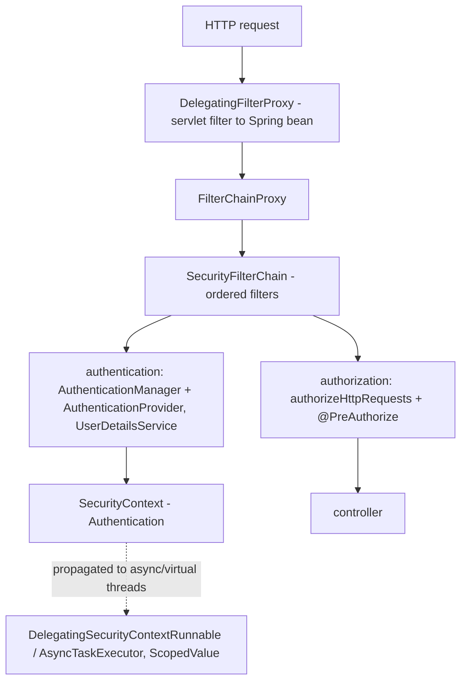
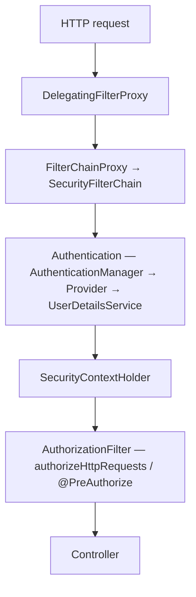

## Why it Matters

**Spring Security** is the **filter-chain framework** that protects every request in a Spring app, and it is deliberately layered so it can be misunderstood: `DelegatingFilterProxy` (servlet filter) → `FilterChainProxy` → a `SecurityFilterChain` of filters → `AuthenticationManager` + `AuthenticationProvider` → `SecurityContext` → authorization rules. It matters because security misconfiguration is not a bug you find in QA, it is a breach. The Java 25 wrinkle that interviewers now probe: `SecurityContext` is `ThreadLocal`-based, so virtual threads, `@Async`, and `StructuredTaskScope` need explicit delegation rather than `InheritableThreadLocal`.

Core ideas:
- **Authentication vs authorization**: *who you are* vs *what you may do*, applied in that order.
- **`SecurityFilterChain`** is a chain of Spring beans acting as servlet filters, ordered; matchers are evaluated **most-specific first**, `anyRequest()` last.
- **`UserDetailsService`** + `PasswordEncoder` (BCrypt) is the form-login/jdbc path; **OAuth2 resource server** validates a JWT via `JwtDecoder` (signature, `exp`, `iss`, `aud`).
- **`SecurityContext` holds the `Authentication`**; on virtual threads, propagate it explicitly with `DelegatingSecurityContextRunnable` / `DelegatingSecurityContextAsyncTaskExecutor` (Spring Security 6.4+ supports `ScopedValue`-backed context).
- **CSRF**: keep it for browser session apps, safe to disable for stateless JWT APIs.

## Diagram



## Code

Security in one file: filter chain DSL, method security, password encoding, and the Java 25 propagation rule:
```java
@Configuration
@EnableWebSecurity
@EnableMethodSecurity // @PreAuthorize / @PostAuthorize
class SecurityConfig {

 @Bean
 SecurityFilterChain api(HttpSecurity http) throws Exception {
 return http
 .securityMatcher("/api/**")
 .authorizeHttpRequests(a -> a
 .requestMatchers("/api/public/**").permitAll()
 .requestMatchers("/api/admin/**").hasRole("ADMIN") // most specific FIRST
 .anyRequest().authenticated())
 .sessionManagement(s -> s.sessionCreationPolicy(SessionCreationPolicy.STATELESS))
 .csrf(AbstractHttpConfigurer::disable) // fine for stateless JWT; keep for browser form login
 .oauth2ResourceServer(o -> o.jwt(Customizer.withDefaults()))
 .build();
 }

 @Bean
 PasswordEncoder passwordEncoder() {
 return new BCryptPasswordEncoder(); // or DelegatingPasswordEncoder to migrate hashes
 }
}

@Service
class OrderService {
 @PreAuthorize("hasRole('ADMIN') or #order.owner == authentication.name") // SpEL, method-level
 public void approve(Order order) { /* ... */ }
}

record CreateUserRequest(@NotBlank @Email String email) {}
```
Java 25 propagation, the rule that changes with virtual threads:
```java
@Bean
AsyncTaskExecutor asyncTaskExecutor() { // security context must be carried, not inherited
 return new DelegatingSecurityContextAsyncTaskExecutor(
 new TaskExecutorAdapter(Executors.newVirtualThreadPerTaskExecutor()));
}
```
> **Why it matters on Java 25:** each virtual thread has its own `ThreadLocal`, so per-request isolation still holds, but `InheritableThreadLocal` semantics do **not** cross into `@Async` or `StructuredTaskScope` forks, wrap the executor as above or use Spring Security 6.4+ `ScopedValue`-backed context.

## When to use / not

| Use | Avoid |
|-----|-------|
| `SecurityFilterChain` bean with the DSL, one chain per concern (stateless JWT vs browser session) | The removed `WebSecurityConfigurerAdapter`, and one giant chain mixing stateful and stateless |
| BCrypt (`DelegatingPasswordEncoder` for migration) for stored passwords | MD5/SHA-1 or storing verifiers without a `PasswordEncoder` |
| Specific matchers first, `anyRequest().authenticated()` last | `permitAll()` sprinkled after `anyRequest()`, dead rules |
| `@PreAuthorize` for method-level checks tied to business rules | Doing authorization inside controllers, it scatters across the codebase |
| `DelegatingSecurityContext*` wrappers on `@Async` / virtual-thread executors | `MODE_INHERITABLETHREADLOCAL`, it does not propagate across virtual executors |

## Trade-offs

| Pros | Cons |
|---|---|
| Comprehensive: authN, authZ, OAuth2/OIDC, CSRF, headers, session | Configuration surface is large, defaults matter |
| Declarative (`@PreAuthorize`, `hasRole`) + DSL (`HttpSecurity`) | Filter ordering/debugging non-trivial |
| Pluggable `AuthenticationProvider`, `UserDetailsService` | JWT/session mix or multiple chains easy to misconfigure |
| Battle-tested, integrates with Boot Actuator / Micrometer | Password-encoder migration & legacy `WebSecurityConfigurerAdapter` migration |
| Virtual-thread-aware context propagation (6.4+/Java 25) | Must wrap executors with `DelegatingSecurityContext*` for virtual threads |

## Vs

**Authentication vs Authorization**

| Aspect | Authentication (authN) | Authorization (authZ) |
|--------|------------------------|-----------------------|
| Answers | who you are | what you may access |
| Mechanism | `AuthenticationManager` / `AuthenticationProvider` + `UserDetailsService` | `authorizeHttpRequests`, `@PreAuthorize`, `hasRole` |
| Failure | 401 Unauthorized | 403 Forbidden |
| Order | first, always | second, after authN |

**Session/JWT vs OAuth2 resource server**

| Aspect | Stateful session | Stateless JWT | OAuth2 / OIDC |
|--------|------------------|---------------|---------------|
| State | server-side `HttpSession` | signed token in `Authorization: Bearer` | issued by an authorization server |
| Validation | session lookup | `JwtDecoder` verifies signature, `exp`, `iss`, `aud` | JWKS fetch + claim mapping |
| Scale | sticky sessions or shared store | any replica, no shared state | centralized identity, per-tenant |
| CSRF | keep enabled (cookie-based) | safe to disable (no cookie session) | follow provider guidance |

**Filter vs Interceptor vs `@ControllerAdvice`**

| Aspect | Filter | Interceptor | `@ControllerAdvice` |
|--------|--------|-------------|---------------------|
| Layer | servlet, before `DispatcherServlet` | Spring MVC, around handler | exception/result handling |
| Sees | raw request/response only | handler + ModelAndView | thrown exceptions |
| Typical use | auth, CORS, MDC, logging | metrics, header tweaks | error envelope (ProblemDetail) |

**`DelegatingSecurityContext*` vs `MODE_INHERITABLETHREADLOCAL`**

| Aspect | `MODE_INHERITABLETHREADLOCAL` | `DelegatingSecurityContext*` wrappers |
|--------|-------------------------------|---------------------------------------|
| Works for | child platform threads created after login | any executor, incl. virtual-thread and `@Async` |
| Fails on | virtual executors, `StructuredTaskScope` forks | nothing, it is explicit |

## Pitfalls

- Storing passwords without `PasswordEncoder` or using weak hashes (MD5/SHA-1).
- Exposing `SecurityContext` across threads without `DelegatingSecurityContextRunnable` / `DelegatingSecurityContextExecutor`, especially with virtual threads where `InheritableThreadLocal` does not propagate.
- `permitAll()` ordering mistakes, more specific matchers must come before `anyRequest()`.
- Mixing stateful sessions with stateless JWT without separating `SecurityFilterChain`s (`@Order` + `securityMatcher`).
- Not rotating JWT keys / ignoring `exp`/`aud` validation.
- Forgetting AOT hints for custom `UserDetails` / `JwtDecoder` in native image.

## Interview q&a

**Q: Authentication vs Authorization?** Authentication verifies identity (who you are); Authorization checks permissions (what you may access) after authentication.

**Q: What is `DelegatingFilterProxy`?** A servlet filter that delegates to Spring's `FilterChainProxy`, allowing security filters to be Spring beans.

**Q: How does JWT resource-server validation work?** `BearerTokenAuthenticationFilter` extracts `Authorization: Bearer *** `JwtDecoder` verifies signature/expiry/issuer, maps claims to `GrantedAuthority`, sets `SecurityContext`.

**Q: Where is `SecurityContext` stored for reactive apps?** Not `ThreadLocal`, it's in `ReactiveSecurityContextHolder` / Reactor `Context`.

**Q: CSRF, when to disable?** Safe to disable for stateless JWT APIs (no cookie session); keep enabled for browser form-login apps.

**Q: How to test secured endpoints?** `@WebMvcTest` + `@WithMockUser`, `@WithUserDetails`, or `SecurityMockMvcRequestPostProcessors.jwt()`.

**Q: How does SecurityContext work with virtual threads (Java 25)?** Each virtual thread has its own `ThreadLocal`, so per-request isolation still works. For child virtual threads / `StructuredTaskScope` / `@Async`, wrap with `DelegatingSecurityContextRunnable` / `DelegatingSecurityContextAsyncTaskExecutor`. Spring Security 6.4+ also supports `ScopedValue`-backed context. `MODE_INHERITABLETHREADLOCAL` alone is insufficient for virtual executors.

**Q: Does `spring.threads.virtual.enabled=true` affect Security?** It moves the web layer to virtual threads. Add a `DelegatingSecurityContextAsyncTaskExecutor` backed by `Executors.newVirtualThreadPerTaskExecutor()` for async security propagation.

Authentication vs Authorization?:: Authentication verifies identity (who you are); Authorization checks permissions (what you may access) after authentication. #flashcard
What is `DelegatingFilterProxy`?:: A servlet filter that delegates to Spring's `FilterChainProxy`, allowing security filters to be Spring beans. #flashcard
How does JWT resource-server validation work?:: `BearerTokenAuthenticationFilter` extracts `Authorization: Bearer *** `JwtDecoder` verifies signature/expiry/issuer, maps claims to `GrantedAuthority`, sets `SecurityContext`. #flashcard
Where is `SecurityContext` stored for reactive apps?:: Not `ThreadLocal`, it's in `ReactiveSecurityContextHolder` / Reactor `Context`. #flashcard
CSRF, when to disable?:: Safe to disable for stateless JWT APIs (no cookie session); keep enabled for browser form-login apps. #flashcard
How to test secured endpoints?:: `@WebMvcTest` + `@WithMockUser`, `@WithUserDetails`, or `SecurityMockMvcRequestPostProcessors.jwt()`. #flashcard
How does SecurityContext work with virtual threads (Java 25)?:: Each virtual thread has its own `ThreadLocal`, so per-request isolation still works. For child virtual threads / `StructuredTaskScope` / `@Async`, wrap with `DelegatingSecurityContextRunnable` / `DelegatingSecurityContextAsyncTaskExecutor`. Spring Security 6.4+ also supports `ScopedValue`-backed context. `MODE_INHERITABLETHREADLOCAL` alone is insufficient for virtual executors. #flashcard
Does `spring.threads.virtual.enabled=true` affect Security?:: It moves the web layer to virtual threads. Add a `DelegatingSecurityContextAsyncTaskExecutor` backed by `Executors.newVirtualThreadPerTaskExecutor()` for async security propagation. #flashcard

## Related

- [[Spring Framework]] • [[Spring Core]] • [[Dependency Injection]] • [[Spring Transaction]] • [[Threads]]
- [[README|Java MOC]]

---
*Category: Spring • Part of [[README|Java MOC]] • Java 25*

# Spring Security

> Part of [[README|Java MOC]] • `Spring` • Java 25 / Spring Security 6.5 / Boot 3.5

## Summary

Provide authentication (who you are), authorization (what you can do), and protection (CSRF, session, headers, password encoding) as a declarative, filter-chain layer on top of Spring MVC / WebFlux, so that business endpoints stay focused on business logic.

> Security config is confusing at first. Filters, chains, context, it clicks once you trace a request through the chain once. And please stop putting SecurityContext in ThreadLocal on virtual threads, use the new context propagation instead.

Spring Security is a filter-chain framework (`SecurityFilterChain`) that intercepts every HTTP request, builds an `Authentication` object, delegates to an `AuthenticationManager` / `AuthenticationProvider` chain (backed by `UserDetailsService`), establishes a `SecurityContext`, and enforces access rules (`authorizeHttpRequests`, `@PreAuthorize`) before the request reaches controllers.

## Architecture


```HTTP
 Request (on virtual thread when spring.threads.virtual.enabled=true)
 │
 ▼
 DelegatingFilterProxy (web.xml / Boot auto-config)
 │
 ▼
 FilterChainProxy → ordered SecurityFilterChain
 │ e.g. SecurityContextPersistenceFilter
 │ UsernamePasswordAuthenticationFilter (extracts username/password)
 │ BasicAuthenticationFilter / BearerTokenAuthenticationFilter
 │ CsrfFilter, CorsFilter, ExceptionTranslationFilter
 │ AuthorizationFilter (formerly FilterSecurityInterceptor)
 ▼
 Authentication Object (principal, credentials, authorities)
 │ filter → AuthenticationManager.authenticate(auth)
 ▼
 ProviderManager → iterates AuthenticationProviders
 │ DaoAuthenticationProvider ──▶ UserDetailsService ──▶ DB / LDAP / OIDC
 │ JwtAuthenticationProvider ──▶ JwtDecoder
 │ LdapAuthenticationProvider ...
 ▼
 On success: SecurityContextHolder.getContext().setAuthentication(auth)
 │ (ThreadLocal on platform threads; propagated via DelegatingSecurityContext* on virtual threads)
 ▼
 Controller / Resource Server (SecurityContext available via @AuthenticationPrincipal)

 OAuth2 / OIDC extension:
 Client → Authorization Server (Cognito / Azure AD / Okta / Keycloak)
 → obtains access_token / id_token (JWT)
 → Resource Server validates JWT via JwtDecoder
```
Additional diagram: ![[Pasted image 20211019220915.png]]

### Core Security Chain Elements

| Component | Role |
|---|---|
| `DelegatingFilterProxy` | Bridges servlet container filter to Spring `FilterChainProxy` |
| `SecurityFilterChain` | Ordered list of `Filter`s for matched request patterns |
| `Authentication` | Token holding `principal`/`credentials`/`authorities`; `authenticated` flag |
| `AuthenticationManager` / `ProviderManager` | Entry point; delegates to providers |
| `AuthenticationProvider` | Knows how to authenticate one type (DAO, JWT, LDAP) |
| `UserDetailsService` | Loads `UserDetails` from persistence; throws `UsernameNotFoundException` if absent |
| `SecurityContext` / `SecurityContextHolder` | Holds current `Authentication`, see virtual-thread notes below |
| `PasswordEncoder` | Hash & verify passwords (`BCryptPasswordEncoder`, `Argon2`) |

## Virtual Threads & Securitycontext (Java 25)

> Enable virtual threads: `spring.threads.virtual.enabled=true` (Boot 3.2+/3.5, Java 25). Each HTTP request then runs on a virtual thread, `SecurityContext` propagation must be virtual-thread-aware.

### The Problem with`ThreadLocal`On Virtual Threads

`SecurityContextHolder` defaults to `MODE_THREADLOCAL`. With platform threads (pool of ~200), this is fine. With virtual threads (millions, short-lived), `ThreadLocal` is expensive and `InheritableThreadLocal` does not propagate into `StructuredTaskScope` or `newVirtualThreadPerTaskExecutor()` children.

### Java 25 / Spring Security 6.5 Solution

| Concern | Platform threads (legacy) | Virtual threads (Java 25) |
|---|---|---|
| `SecurityContextHolder` strategy | `MODE_THREADLOCAL` | `MODE_THREADLOCAL` still works per-request (each virtual thread has its own `ThreadLocal`), but cross-thread propagation needs help |
| Propagating context to child tasks | `DelegatingSecurityContextRunnable` / `DelegatingSecurityContextExecutor` | Same wrappers still work, plus `ScopedValue` support (Spring Security 6.4+ can store context in `ScopedValue` when available) |
| `@Async` with security | `@EnableAsync` + `DelegatingSecurityContextAsyncTaskExecutor` | Virtual-thread executor + `DelegatingSecurityContextExecutor` or `ContextPropagation` |
| Reactive | `ReactiveSecurityContextHolder` / Reactor `Context` | Unchanged |
```
java@Configuration
@EnableWebSecurity
@EnableMethodSecurity
class SecurityConfig {
 @Bean
 SecurityFilterChain chain(HttpSecurity http) throws Exception {
 return http
 .csrf(csrf -> csrf.disable())
 .authorizeHttpRequests(a -> a
 .requestMatchers("/public/**").permitAll()
 .anyRequest().authenticated())
 .oauth2ResourceServer(o -> o.jwt(Customizer.withDefaults()))
 .build();
 }

 @Bean PasswordEncoder passwords() { return new BCryptPasswordEncoder(); }
```
```java
java
@Bean
AsyncTaskExecutor securedExecutor() {
 var delegate = new TaskExecutorAdapter(Executors.newVirtualThreadPerTaskExecutor());
 return new DelegatingSecurityContextAsyncTaskExecutor(delegate);
}
// Wrap ad-hoc runnables the same way:
// Runnable secured = new DelegatingSecurityContextRunnable(task);
```Key
 rules for Java 25:
- `SecurityContextHolder.MODE_INHERITABLETHREADLOCAL` is not sufficient for virtual-thread executors or `StructuredTaskScope`, always wrap with `DelegatingSecurityContext*`.
- Spring Security 6.4+ supports `ScopedValue`-backed `SecurityContext` (transparent when `ScopedValue` is used), prefer it for new code; falls back to `ThreadLocal` otherwise.
- `spring.threads.virtual.enabled=true` does not change the `SecurityContextHolder` strategy automatically, add the `DelegatingSecurityContextAsyncTaskExecutor` bean if you use `@Async` with security.

### JWT Resource Server (`application.yml`), Java 25

```
yaml
spring:
 threads:
 virtual:
 enabled: true
 security:
 oauth2:
 resourceserver:
 jwt:
 issuer-uri: https://cognito-idp.eu-west-1.amazonaws.com/eu-west-1_xxx
```

## AOT Hints for Security (Java 25 / GraalVM)

```java
java
@Configuration
@ImportRuntimeHints(SecurityHints.class)
class SecurityHints implements RuntimeHintsRegistrar {
 @Override
 public void registerHints(RuntimeHints hints, ClassLoader cl) {
 hints.reflection().registerType(AppUserDetails.class, MemberCategory.values());
 }
}
```-
 Most Spring Security filters / providers are auto-registered by Boot's AOT engine. Add hints only for custom `UserDetails`, `GrantedAuthority` impls, or custom `JwtDecoder`.
## OAuth2.0 & OIDC, Terminology

| Term | Meaning |
|---|---|
| Resource Owner | End user owning the protected resource |
| Resource Server | Hosts/protects the resource (your Spring API) |
| Client | App requesting access on behalf of owner |
| Authorization Server | Issues & validates tokens (AWS Cognito, Azure AD, Okta, Keycloak, Spring Authorization Server) |
| Access Token | Short-lived bearer token for API calls |
| ID Token (OIDC) | JWT with identity claims (OIDC layer atop OAuth2) |
| Public / Confidential Client | Public = browser/mobile (cannot keep secret); Confidential = backend/Cron that can |

OIDC = identity layer on OAuth2; provides `id_token`, `userinfo`, standard scopes (`openid profile email`).
