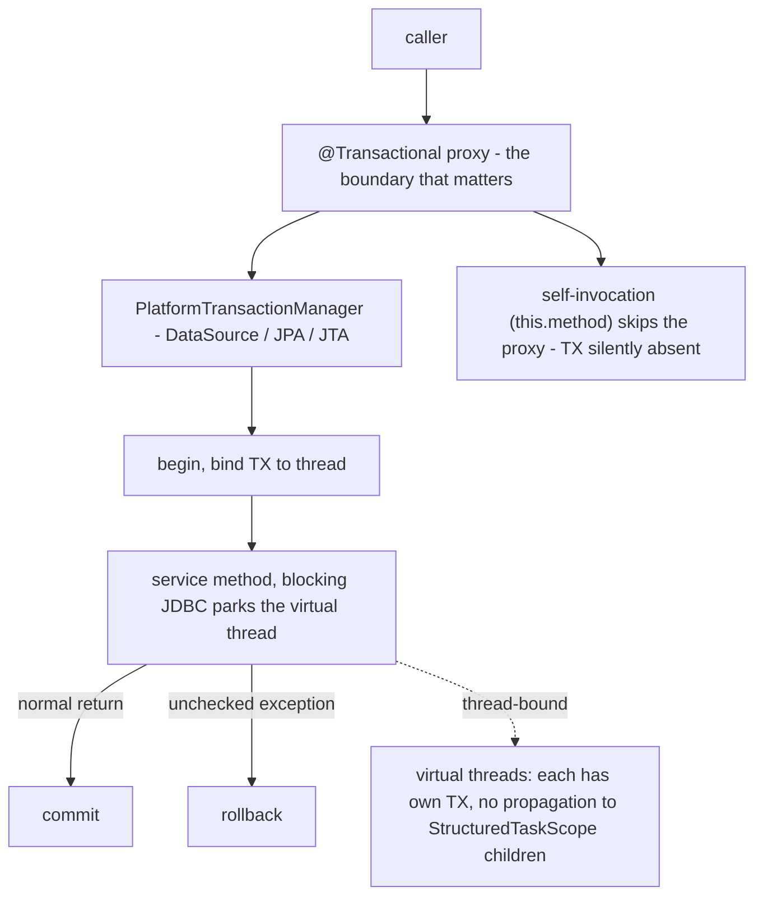
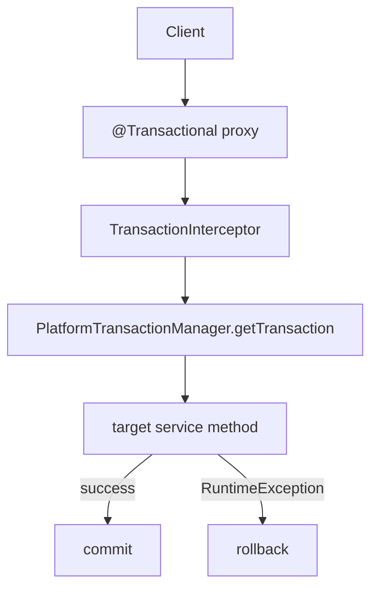

## Why it Matters

**Spring Transactions** is how a Spring app states **ACID boundaries declaratively**: put `@Transactional` on a service method and an AOP proxy starts a transaction before the method, commits on normal return, and rolls back on an unchecked exception. It matters because it removes hand-written `commit/rollback` boilerplate, and because its three classic traps are exactly what interviews probe: **self-invocation bypasses the proxy**, **checked exceptions do not roll back by default**, and **the transaction is thread-bound**, so it does not propagate to child virtual threads.

Core ideas:
- **Proxy-based**: `@Transactional` only works when the call crosses the proxy boundary, a call from outside the bean.
- **PlatformTransactionManager** family: `DataSourceTransactionManager` (JDBC), `JpaTransactionManager` (JPA/Hibernate), `ReactiveTransactionManager` (R2DBC), `JtaTransactionManager` (XA).
- **Propagation** decides join vs new: `REQUIRED` (default) joins the caller's transaction, `REQUIRES_NEW` suspends and commits independently.
- **Isolation and `readOnly`** are hints; `readOnly=true` is an optimisation, not an access guard.
- **Java 25 angle**: `spring.threads.virtual.enabled=true` makes the blocking JDBC call cheap (the virtual thread parks, JEP 491), but the transaction is still bound to one thread, so keep a transaction on one virtual thread and fan out only non-transactional work.

## Diagram



## Code

Declarative transactions, the propagation trap, and the rollback rule in one file:
```java
@Service
class OrderService {
 private final OrderRepository repo;
 private final AuditService audit; // separate bean, own proxy

 OrderService(OrderRepository repo, AuditService audit) { this.repo = repo; this.audit = audit; }

 @Transactional // proxy: begin before, commit after
 public Order place(Order o) {
 var saved = repo.save(o);
 audit.log("placed", saved.getId()); // @Transactional(REQUIRES_NEW) in AuditService
 return saved;
 }

 @Transactional(rollbackFor = Exception.class) // checked exceptions DO roll back now
 public void charge(Long id) throws PaymentException {
 var o = repo.findById(id).orElseThrow();
 if (!o.isPaid()) throw new PaymentException("unpaid"); // swallowed exceptions would NOT roll back
 }

 @Transactional(readOnly = true) // hint: skip dirty checks, may route to replica
 public List<Order> history(String user) { return repo.findByUser(user); }
}
```
The two traps this note exists for:
```java
@Service
class OrderService {
 @Transactional
 public void outer() { this.inner(); } // self-invocation: proxy bypassed, NO transaction

 @Transactional
 void inner() {} // must be public and called through another bean
}
```
Java 25, transactions are still thread-bound:
```java
@Transactional
public Order place(Order o) { // runs on ONE virtual thread
 var saved = repo.save(o);
 try (var scope = new StructuredTaskScope.ShutdownOnFailure()) { // preview
 scope.fork(() -> { /* NO TX here, it is a different thread */ return 0; });
 scope.join();
 }
 return saved; // keep TX on one thread, fan out only non-TX work
}
```

## When to use / not

| Use | Avoid |
|-----|-------|
| `@Transactional` on **service** methods that span multiple writes/reads | `@Transactional` on controllers or repositories as the default everywhere |
| `REQUIRED` (default) so called services join the caller's unit of work | `REQUIRES_NEW` unless the inner work must commit independently (audit/log), it suspends and adds a second DB connection |
| `rollbackFor = Exception.class` when checked exceptions signal business failure | Catching and swallowing an exception inside the method, the rollback never happens |
| Short transactions around DB work only | Long transactions that call HTTP/external IO, they hold locks for the whole duration |
| `TransactionTemplate` per child for parallel non-TX fan-out | `StructuredTaskScope` forks inside `@Transactional` expecting propagation |

## Trade-offs

| Pros | Cons |
|---|---|
| Declarative, no boilerplate `try/commit/rollback` | Proxy-based, self-invocation bypasses TX |
| Unified abstraction over JDBC/JPA/JMS/R2DBC | Misunderstood defaults (checked exceptions don't roll back) |
| Propagation/isolation/timeout/readonly in one place | Long TXs hold DB locks → contention; keep TX short (even on virtual threads) |
| Testable with `@Transactional` on tests (auto-rollback) | Multiple `TransactionManager`s require qualification |
| Virtual threads make blocking TX calls cheap (no pool exhaustion) | TX still thread-bound, cannot span structured children |

## Vs

**`REQUIRED` vs `REQUIRES_NEW` vs `NESTED`**

| Aspect | `REQUIRED` (default) | `REQUIRES_NEW` | `NESTED` |
|--------|----------------------|----------------|----------|
| Behaviour | join caller TX, or start one | suspend caller, start independent TX | savepoint within caller TX |
| Inner failure | rolls back whole TX | inner rolls back, outer can catch and continue | rolls back to savepoint, outer continues |
| Connections | reuses one | needs a **second** connection | one connection + savepoint support |
| Use | the default | audit/log that must commit independently | partial rollback (driver must support savepoints) |

**Declarative `@Transactional` vs programmatic `TransactionTemplate`**

| Aspect | `@Transactional` | `TransactionTemplate` |
|--------|------------------|-----------------------|
| Style | declarative, AOP proxy | explicit `execute(status -> ...)` |
| Granularity | whole method | a few lines inside a method |
| Self-invocation | silently bypassed | no proxy, so no problem |
| Use | the 95% case | conditional / partial transactions |

**Rollback: unchecked vs checked exceptions**

| Exception type | Rolls back by default? |
|----------------|------------------------|
| `RuntimeException`, `Error` | yes |
| checked `Exception` | **no**, add `rollbackFor = Exception.class` |
| swallowed in the method | no, rethrow or `setRollbackOnly()` |

**Java 25: platform threads vs virtual threads for a transaction**

| Aspect | Platform threads | Virtual threads (Java 25) |
|--------|------------------|---------------------------|
| Blocking JDBC | holds the OS thread, pool bound | parks the virtual thread (JEP 491), cheap |
| TX scope | thread-bound | thread-bound, **per virtual thread** |
| `StructuredTaskScope` children | n/a | do NOT inherit the transaction |

## Pitfalls

- Annotating `private`/`final` methods or the class's internal calls, proxy cannot intercept.
- Catching and swallowing exceptions inside `@Transactional` method → no rollback (rethrow or `TransactionAspectSupport.currentTransactionStatus().setRollbackOnly()`).
- Long-running TXs doing HTTP/IO, extends lock duration; split work (virtual threads reduce thread starvation but not DB lock contention).
- `NESTED` requires savepoints, not supported by all drivers.
- Forgetting `@EnableTransactionManagement` outside Spring Boot (Boot enables it).
- Forking `StructuredTaskScope` inside `@Transactional` and expecting TX propagation, it won't propagate.
- Native image without hints for custom TX types, add `RuntimeHintsRegistrar`.

## Interview q&a

**Q: Why doesn't `@Transactional` work when method is called via `this`?** Self-invocation skips the proxy; call goes directly to target. Fix: inject `self` proxy, move method to another bean, or use `AspectJ` weaving.

**Q: Which exceptions trigger rollback by default?** Only unchecked (`RuntimeException`, `Error`). For checked exceptions add `rollbackFor = Exception.class`.

**Q: `REQUIRED` vs `REQUIRES_NEW`?** `REQUIRED` joins caller's TX (one commit); `REQUIRES_NEW` suspends caller TX and commits independently, inner failure doesn't roll back outer (unless outer chooses to).

**Q: What is `readOnly=true` really?** Hint to provider: may flush less, disable dirty checks, route to read replica; not a security guard.

**Q: How to make two data sources transactional together?** Need XA / JTA (`JtaTransactionManager`) or use the saga/outbox pattern; plain `DataSourceTransactionManager` is one resource only.

**Q: Transactional tests auto-rollback, good or bad?** Good for isolation; but the TX never truly commits, lazy-loading quirks differ from production. Use `@Commit` or `TestEntityManager` when commit semantics matter.

**Q: How do transactions work with virtual threads (Java 25)?** TX is still thread-bound via `TransactionSynchronizationManager`, each virtual thread has its own TX. `spring.threads.virtual.enabled=true` makes blocking DB calls cheap (virtual thread parks, JEP 491), but TX does not propagate to child virtual threads from `StructuredTaskScope` or `newVirtualThreadPerTaskExecutor()`. Keep TX on one thread; fan out non-TX work only.

Why doesn't `@Transactional` work when method is called via `this`?:: Self-invocation skips the proxy; call goes directly to target. Fix: inject `self` proxy, move method to another bean, or use `AspectJ` weaving. #flashcard
Which exceptions trigger rollback by default?:: Only unchecked (`RuntimeException`, `Error`). For checked exceptions add `rollbackFor = Exception.class`. #flashcard
`REQUIRED` vs `REQUIRES_NEW`?:: `REQUIRED` joins caller's TX (one commit); `REQUIRES_NEW` suspends caller TX and commits independently, inner failure doesn't roll back outer (unless outer chooses to). #flashcard
What is `readOnly=true` really?:: Hint to provider: may flush less, disable dirty checks, route to read replica; not a security guard. #flashcard
How to make two data sources transactional together?:: Need XA / JTA (`JtaTransactionManager`) or use the saga/outbox pattern; plain `DataSourceTransactionManager` is one resource only. #flashcard
Transactional tests auto-rollback, good or bad?:: Good for isolation; but the TX never truly commits, lazy-loading quirks differ from production. Use `@Commit` or `TestEntityManager` when commit semantics matter. #flashcard
How do transactions work with virtual threads (Java 25)?:: TX is still thread-bound via `TransactionSynchronizationManager`, each virtual thread has its own TX. `spring.threads.virtual.enabled=true` makes blocking DB calls cheap (virtual thread parks, JEP 491), but TX does not propagate to child virtual threads from `StructuredTaskScope` or `newVirtualThreadPerTaskExecutor()`. Keep TX on one thread; fan out non-TX work only. #flashcard

## Related

- [[Spring Framework]] • [[Spring Core]] • [[Dependency Injection]] • [[Spring Security]] • [[Threads]]
- [[README|Java MOC]]

---
*Category: Spring • Part of [[README|Java MOC]] • Java 25*

# Spring Transaction

> Part of [[README|Java MOC]] • `Spring` • Java 25 / Spring Framework 6.2 / Boot 3.5

## Summary

Make transaction management declarative (`@Transactional`) so that service code states *what* must be atomic/consistent/isolated/durable (ACID) without manually opening, committing, or rolling back JDBC/JPA transactions, with Spring handling commit/rollback via AOP proxies.

> Transactions look simple until they don't apply. I always check: are you calling through the proxy? Self-invocation silently skips @Transactional, catches everyone once.

Spring's transaction abstraction (`PlatformTransactionManager` / `TransactionManager`) sits over `DataSourceTransactionManager` (JDBC), `JpaTransactionManager` (JPA/Hibernate), or `ReactiveTransactionManager` (R2DBC). `@Transactional` on a bean method causes a proxy to start a transaction before the method, commit on success, or roll back on (unchecked) exception.

## Architecture


```Client
 → @Transactional Proxy (JDK/CGLIB)
 │
 ├── TransactionInterceptor
 │ │ 1. TransactionAttributeSource reads @Transactional
 │ │ 2. PlatformTransactionManager.getTransaction(def)
 │ ▼
 │ Transaction (PROPAGATION, ISOLATION, timeout, readOnly)
 │ │
 ▼ ▼
 Target Service Method (business logic + Repository/JPA calls)
 │
 ├── success → manager.commit(tx)
 └── RuntimeException / rollbackFor → manager.rollback(tx)

 Stack:
 @EnableTransactionManagement → TransactionInterceptor (AOP Advice)
 → AbstractPlatformTransactionManager → DataSource / JpaTransactionManager
 → JDBC Connection / EntityManager bound to thread (TransactionSynchronizationManager)

 Java 25: TransactionSynchronizationManager now supports ScopedValue propagation
 for virtual threads / StructuredTaskScope (Spring 6.2+).
```
Reference talk: https://www.youtube.com/watch?v=eWl8G7NDKqo&list=PLVz2XdJiJQxxj_zMhm6zCPO6zhtOcq-wl

## `@Transactional`, key Attributes

| Attribute | Options | Default | Notes |
|---|---|---|---|
| `propagation` | `REQUIRED`, `REQUIRES_NEW`, `NESTED`, `SUPPORTS`, `NOT_SUPPORTED`, `MANDATORY`, `NEVER` | `REQUIRED` | Join existing or start new |
| `isolation` | `DEFAULT`, `READ_UNCOMMITTED`, `READ_COMMITTED`, `REPEATABLE_READ`, `SERIALIZABLE` | `DEFAULT` (DB) | Higher → more locking, less concurrency |
| `readOnly` | `true` / `false` | `false` | Hint for optimisation; some DBs enforce |
| `timeout` | seconds | `-1` (none) | Rollback on timeout |
| `rollbackFor` / `noRollbackFor` | exception classes | Rollback on unchecked (`RuntimeException`/`Error`) only | Add `rollbackFor = Exception.class` to include checked |
| `transactionManager` | bean name | primary `TransactionManager` | For multiple data sources |

### Propagation Cheat-sheet

| Propagation | If TX exists | If no TX |
|---|---|---|
| `REQUIRED` | Join | Create new |
| `REQUIRES_NEW` | Suspend & create new | Create new |
| `NESTED` | Nested savepoint | Create new |
| `SUPPORTS` | Join | Non-transactional |
| `MANDATORY` | Join | Throw exception |
| `NEVER` | Throw exception | Non-transactional |

## Virtual Threads & Transactions (Java 25)

> Enable virtual threads: `spring.threads.virtual.enabled=true` (Boot 3.2+/3.5). Transactions remain thread-bound, each virtual thread gets its own transaction, just like platform threads. What changes is context propagation and blocking cost.

### TransactionSynchronizationManager with Virtual Threads

`TransactionSynchronizationManager` historically uses `ThreadLocal` to bind `Connection` / `EntityManager` / synchronizations to the current thread. On Java 25 with virtual threads:

| Concern | Platform threads | Virtual threads (Java 25 / Spring 6.2+) |
|---|---|---|
| TX binding | `ThreadLocal<ConnectionHolder>` per platform thread | Same per virtual thread, each virtual thread has its own `ThreadLocal`, so isolation is preserved |
| Propagating TX to child threads | Not supported (TX is thread-bound by design) | Still not supported, don't fork a `StructuredTaskScope` inside a `@Transactional` and expect the TX to propagate. Keep TX on the owning thread |
| `ScopedValue` | N/A | Spring 6.2+ can expose TX context via `ScopedValue` for read-only propagation to structured children (not for committing) |
| Blocking cost | Platform thread blocked for DB call duration | Virtual thread parks (JEP 491), cheap, no carrier pinning |
```java
@Service
class OrderService {
 private final OrderRepository repo;
 OrderService(OrderRepository repo) { this.repo = repo; }

 @Transactional // REQUIRED: joins caller TX; rolls back on RuntimeException
 public Order place(CreateOrderRequest req) {
 return repo.save(new Order(Status.NEW));
 }

 @Transactional(propagation = Propagation.REQUIRES_NEW, rollbackFor = Exception.class)
 public Order auditTrail(Order o) { return repo.save(o); }
}
```
```java
java
@Service
class BadPattern {
 // WRONG: child virtual threads do NOT inherit the TX.
 // Keep DB work on the owning thread; fan out only non-TX work.
 @Transactional
 public void wrong() throws Exception {
 try (var scope = new StructuredTaskScope.ShutdownOnFailure()) {
 scope.fork(() -> repo.save(new Order(Status.NEW))); // no TX here!
 scope.join();
 }
 }
}
```Rules
 for Java 25:
- `@Transactional` is thread-bound, the TX lives on the thread that entered the proxy. Child virtual threads from `StructuredTaskScope` or `newVirtualThreadPerTaskExecutor()` do not inherit it.
- Keep the TX short and on one virtual thread; fan out outside the TX or fan out non-TX work only.
- `spring.threads.virtual.enabled=true` makes blocking TX calls cheap (virtual thread parks), but does not make long TXs desirable, they still hold DB locks.
- For async TX, use `TransactionTemplate` on the target thread or `@Transactional` on the async method itself (with `DelegatingSecurityContext` if needed).

### Programmatic Alternative (When aop Cannot Apply), Java 25

```
java
@Service
class ProgrammaticService {
 private final TransactionTemplate tx;
 ProgrammaticService(PlatformTransactionManager tm) { this.tx = new TransactionTemplate(tm); }

 Order place(CreateOrderRequest req) {
 return tx.execute(status -> repo.save(new Order(Status.NEW)));
 }
}
```

## How`@Transactional`Works Internally

1. `@EnableTransactionManagement` registers `TransactionInterceptor` + auto-proxy creator.
2. At startup, beans with `@Transactional` are wrapped in a proxy.
3. On method call, `TransactionInterceptor` reads `TransactionAttribute`, asks `PlatformTransactionManager` for a `TransactionStatus`, binds `Connection`/`EntityManager` to thread via `TransactionSynchronizationManager` (now `ScopedValue`-aware on Java 25).
4. Invokes target method; on return commits, on exception evaluates rollback rules.

## AOT Hints for Transactions (Java 25 / GraalVM)

```java
java
@Configuration
@ImportRuntimeHints(TxHints.class)
class TxHints implements RuntimeHintsRegistrar {
 @Override
 public void registerHints(RuntimeHints hints, ClassLoader cl) {
 hints.reflection().registerType(CustomTransactionManager.class, MemberCategory.INVOKE_DECLARED_CONSTRUCTORS);
 }
}
```-
 `@Transactional` proxies are auto-registered by Boot's AOT engine. Custom `PlatformTransactionManager` or `TransactionSynchronization` impls may need hints.