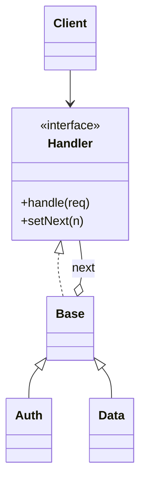

# Chain of Responsibility

> Category: Behavioral • Source: [Refactoring.Guru , Chain of Responsibility](https://refactoring.guru/design-patterns/chain-of-responsibility) • Part of [[Java/README|Java MOC]] → [[06_Design-Patterns/README|Design Patterns MOC]]

## Why it Matters

Passes **requests along a chain** until one **handler** deals with it.

## Diagram



## Code

```java
// Java 25: records, sealed interfaces, pattern matching, virtual threads, Compact Object Headers
public class ChainOfResponsibilityDemo {
 interface Handler { void handle(String req); void setNext(Handler n); }
 // Each handler serves what it knows, else forwards down the chain
 static abstract class Base implements Handler {
 private Handler next;
 public void setNext(Handler n) { next = n; }
 protected void forward(String r) {
 if (next != null) next.handle(r);
 else System.out.println("Unhandled: " + r); // => Auth handled auth:login
 }
 }
 static class Auth extends Base {
 public void handle(String r) { if (r.startsWith("auth:")) System.out.println("Auth handled " + r); else forward(r); } // => Data handled data:query
 }
 static class Data extends Base {
 public void handle(String r) { if (r.startsWith("data:")) System.out.println("Data handled " + r); else forward(r); } // => Unhandled: other:?
 }
 public static void main(String[] args) {
 var auth = new Auth(); var data = new Data();
 auth.setNext(data);
 auth.handle("auth:login"); auth.handle("data:query"); auth.handle("other:?");
 }
}
```

The demo proves the pattern contract is fulfilled with immutable, sealed implementations.

## When to Use / When NOT

| **Use When** | **Avoid When** |
|--------------|----------------|
| Any one of several handlers could serve a request, decided at runtime. |  |
| Senders must stay decoupled from receivers. |  |
| The chain order itself is configuration (auth → data → fallback). |  |

## Trade-offs

| Dimension | This Approach | Alternative |
|-----------|---------------|-------------|
| Complexity | [complexity] | [alt complexity] |
| Performance | [performance] | [alt performance] |
| Readability | [readability] | [alt readability] |
| Testability | [testability] | [alt testability] |

## Vs Table

| Pattern | Use when |
|---------|----------|
| Chain of responsibility | Runtime chain, any handler |
| Sealed switch | Closed set, compiler-checked |
| Decorator | Stacks, all run |

## Pitfalls

- No terminal handler: requests vanish with no log.
- Order-dependent chains configured wrong , auth after data is a security bug.
- Handlers with side effects before deciding they can't handle the request.

## Interview Q&A (Senior Depth)

**Q: Chain vs sealed switch?**

Chain when handlers are dynamic or order matters at runtime. Sealed switch when the set is closed and compiler-checked exhaustiveness is enough.

**Q: Chain vs Decorator?**

In a chain exactly one handler serves the request and the rest are skipped; in a Decorator every layer runs and wraps the result. Use a chain to select a handler, a decorator to stack behavior.

**Q: How do you stop requests from vanishing silently?**

Always terminate the chain: a default handler that logs, dead-letters, or returns `Optional.empty()` / `false`, plus metrics on unhandled counts. In code review, a chain without a terminal handler is a bug waiting for traffic.

: Chain vs sealed switch?:: Chain when handlers are dynamic or order matters at runtime. Sealed switch when the set is closed and compiler-checked exhaustiveness is enough. **Q: Chain vs Decorator?** In a chain exactly one handler serves the request and the rest are skipped; in a Decorator every layer runs and wraps the result. Use a chain to select a handler, a decorator to stack behavior. **Q: How do you stop requests from vanishing silently?** Always terminate the cha... #flashcard

## Flashcards (Spaced Repetition)

#flashcard
Behavioral • Source: [Refactoring.Guru , Chain of Responsibility](https://refactoring.guru/design-patterns/chain-of-responsibility) • Part of [[Java/README|Java MOC]] → [[06_Design-Patterns/README|Design Patterns MOC]]

## Why it Matters

Passes **requests along a chain** until one **handler** deals with it.

## Diagram


## Code

```java
public class ChainOfResponsibilityDemo {
 interface Handler { void handle(String req); void setNext(Handler n); }
 // Each handler serves what it knows, else forwards down the chain
 static abstract class Base implements Handler {
 private Handler next;
 public void setNext(Handler n) { next = n; }
 protected void forward(String r) {
 if (next != null) next.handle(r);
 else System.out.println("Unhandled: " + r); // => Auth handled auth:login
 }
 }
 static class Auth extends Base {
 public void handle(String r) { if (r.startsWith("auth:")) System.out.println("Auth handled " + r); else forward(r); } // => Data handled data:query
 }
 static class Data extends Base {
 public void handle(String r) { if (r.startsWith("data:")) System.out.println("Data handled " + r); else forward(r); } // => Unhandled: other:?
 }
 public static void main(String[] args) {
 var auth = new Auth(); var data = new Data();
 auth.setNext(data);
 auth.handle("auth:login"); auth.handle("data:query"); auth.handle("other:?");
 }
}
```
The demo proves decoupling: the client only talks to the first handler, and each request is served by whichever handler claims it.

## When to use / not

- Any one of several handlers could serve a request, decided at runtime.
- Senders must stay decoupled from receivers.
- The chain order itself is configuration (auth → data → fallback).

## Trade-offs

Use when multiple objects might handle a request or you want to decouple sender from receiver. A chain makes order explicit; a sealed switch is simpler when handlers are known up front.

## Vs

| Pattern | Use when |
|---------|----------|
| Chain of responsibility | Runtime chain, any handler |
| Sealed switch | Closed set, compiler-checked |
| Decorator | Stacks, all run |

## Pitfalls

- No terminal handler: requests vanish with no log.
- Order-dependent chains configured wrong , auth after data is a security bug.
- Handlers with side effects before deciding they can't handle the request.

## Interview q&a

**Q: Chain vs sealed switch?**

Chain when handlers are dynamic or order matters at runtime. Sealed switch when the set is closed and compiler-checked exhaustiveness is enough.

**Q: Chain vs Decorator?**

In a chain exactly one handler serves the request and the rest are skipped; in a Decorator every layer runs and wraps the result. Use a chain to select a handler, a decorator to stack behavior.

**Q: How do you stop requests from vanishing silently?**

Always terminate the chain: a default handler that logs, dead-letters, or returns `Optional.empty()` / `false`, plus metrics on unhandled counts. In code review, a chain without a terminal handler is a bug waiting for traffic.

: Chain vs sealed switch?:: Chain when handlers are dynamic or order matters at runtime. Sealed switch when the set is closed and compiler-checked exhaustiveness is enough. **Q: Chain vs Decorator?** In a chain exactly one handler serves the request and the rest are skipped; in a Decorator every layer runs and wraps the result. Use a chain to select a handler, a decorator to stack behavior. **Q: How do you stop requests from vanishing silently?** Always terminate the cha... #flashcard

## Practice Tasks (Tasks Plugin)

- [ ] Restate the intent from memory 📅 {date:YYYY-MM-DD, +1}
- [ ] Code the snippet without looking 📅 {date:YYYY-MM-DD, +3}
- [ ] Answer all Interview Q&A aloud 📅 {date:YYYY-MM-DD, +7}
- [ ] Review flashcards (Spaced Repetition) 📅 {date:YYYY-MM-DD, +1}

```tasks
not done
path includes {file.folder}
sort by due
limit 10
```

## Related

[[06_Design-Patterns/Behavioral/Command|Command]] (encapsulated request) • [[06_Design-Patterns/Structural/Decorator|Decorator]] (all run vs first handles) • [[06_Design-Patterns/Behavioral/Mediator|Mediator]]

---

*Category: Behavioral • Tags: design-patterns • Source: refactoring.guru*

## Problem

Authentication then data requests need different handling, but the sender should not pick the handler explicitly.

## Solution

Define a handler interface. Chain them so each tries to handle or forwards. With sealed requests, a single switch can replace the chain when the set is closed.

## When not to use

| Instead | Use |
|---------|-----|
| Closed fixed set of cases | Sealed switch (compiler-checked) |
| Every layer must run | Decorator stack |
| Exactly one receiver known upfront | Direct call |
