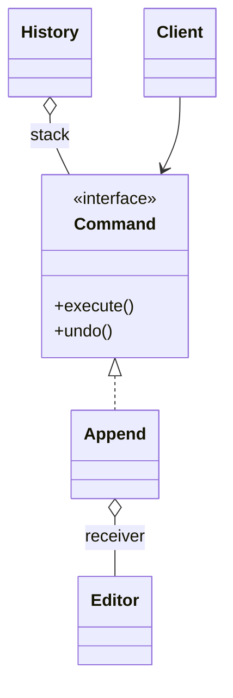

# Command

> Category: Behavioral • Source: [Refactoring.Guru , Command](https://refactoring.guru/design-patterns/command) • Part of [[Java/README|Java MOC]] → [[06_Design-Patterns/README|Design Patterns MOC]]

## Why it Matters

Turns a **request into an object** so it can be **stored, queued, or undone**.

## Diagram



## Code

```java
// Java 25: records, sealed interfaces, pattern matching, virtual threads, Compact Object Headers
public class CommandDemo {
 interface Command { void execute(); void undo(); }
 static class Editor { StringBuilder text = new StringBuilder(); }
 // Command captures the request plus its inverse, so history can undo it
 record Append(Editor ed, String s) implements Command {
 public void execute() { ed.text.append(s); }
 public void undo() { ed.text.delete(ed.text.length() - s.length(), ed.text.length()); }
 }
 public static void main(String[] args) {
 var ed = new Editor(); var history = new java.util.ArrayDeque<Command>();
 var c1 = new Append(ed, "hello "); var c2 = new Append(ed, "world");
 c1.execute(); history.push(c1); c2.execute(); history.push(c2);
 System.out.println(ed.text); // => hello world
 history.pop().undo();
 System.out.println(ed.text); // => hello
 }
}
```

The demo proves the pattern contract is fulfilled with immutable, sealed implementations.

## When to Use / When NOT

| **Use When** | **Avoid When** |
|--------------|----------------|
| Requests must be queued, logged, retried, or undone. |  |
| Buttons, jobs, and transactions share one execution mechanism. |  |
| The invoker must not know the receiver's API. |  |

## Trade-offs

| Dimension | This Approach | Alternative |
|-----------|---------------|-------------|
| Complexity | [complexity] | [alt complexity] |
| Performance | [performance] | [alt performance] |
| Readability | [readability] | [alt readability] |
| Testability | [testability] | [alt testability] |

## Vs Table

| Pattern | Use when |
|---------|----------|
| Command | Request as object, undo and queue |
| Strategy | Algorithm swap, not a queued request |

## Pitfalls

- Unbounded history stacks eating memory , cap or compact.
- Non-idempotent commands retried blindly cause double effects.
- Undo that captures too little state restores wrongly.

## Interview Q&A (Senior Depth)

**Q: Why store a command?**

To queue, log, or undo work. If you do not need those, a direct method call is simpler.

**Q: How do undo and queueing work?**

Each command stores everything needed to reverse itself, and a history stack pops commands to call undo; queueing works because commands are plain objects you can enqueue, log, or serialize before executing.

**Q: Command vs Runnable or Consumer , when is the extra class worth it?**

When the request needs state beyond execution: undo data, queueing metadata, retry counts, audit logs. For fire-and-forget callbacks a lambda is strictly better; Command pays off the moment history, macros, or transactions appear.

: Why store a command?:: To queue, log, or undo work. If you do not need those, a direct method call is simpler. **Q: How do undo and queueing work?** Each command stores everything needed to reverse itself, and a history stack pops commands to call undo; queueing works because commands are plain objects you can enqueue, log, or serialize before executing. **Q: Command vs Runnable or Consumer , when is the extra class worth it?** When the request needs state beyond ex... #flashcard

## Flashcards (Spaced Repetition)

#flashcard
Behavioral • Source: [Refactoring.Guru , Command](https://refactoring.guru/design-patterns/command) • Part of [[Java/README|Java MOC]] → [[06_Design-Patterns/README|Design Patterns MOC]]

## Why it Matters

Turns a **request into an object** so it can be **stored, queued, or undone**.

## Diagram


## Code

```java
public class CommandDemo {
 interface Command { void execute(); void undo(); }
 static class Editor { StringBuilder text = new StringBuilder(); }
 // Command captures the request plus its inverse, so history can undo it
 record Append(Editor ed, String s) implements Command {
 public void execute() { ed.text.append(s); }
 public void undo() { ed.text.delete(ed.text.length() - s.length(), ed.text.length()); }
 }
 public static void main(String[] args) {
 var ed = new Editor(); var history = new java.util.ArrayDeque<Command>();
 var c1 = new Append(ed, "hello "); var c2 = new Append(ed, "world");
 c1.execute(); history.push(c1); c2.execute(); history.push(c2);
 System.out.println(ed.text); // => hello world
 history.pop().undo();
 System.out.println(ed.text); // => hello
 }
}
```
The demo proves reification: appending twice prints "hello world", and popping history to undo restores "hello ".

## When to use / not

- Requests must be queued, logged, retried, or undone.
- Buttons, jobs, and transactions share one execution mechanism.
- The invoker must not know the receiver's API.

## Trade-offs

Use when you need to parameterize actions, queue them, or support undo. Commands decouple invoker from receiver. The cost is one small type per action; records keep that cheap.

## Vs

| Pattern | Use when |
|---------|----------|
| Command | Request as object, undo and queue |
| Strategy | Algorithm swap, not a queued request |

## Pitfalls

- Unbounded history stacks eating memory , cap or compact.
- Non-idempotent commands retried blindly cause double effects.
- Undo that captures too little state restores wrongly.

## Interview q&a

**Q: Why store a command?**

To queue, log, or undo work. If you do not need those, a direct method call is simpler.

**Q: How do undo and queueing work?**

Each command stores everything needed to reverse itself, and a history stack pops commands to call undo; queueing works because commands are plain objects you can enqueue, log, or serialize before executing.

**Q: Command vs Runnable or Consumer , when is the extra class worth it?**

When the request needs state beyond execution: undo data, queueing metadata, retry counts, audit logs. For fire-and-forget callbacks a lambda is strictly better; Command pays off the moment history, macros, or transactions appear.

: Why store a command?:: To queue, log, or undo work. If you do not need those, a direct method call is simpler. **Q: How do undo and queueing work?** Each command stores everything needed to reverse itself, and a history stack pops commands to call undo; queueing works because commands are plain objects you can enqueue, log, or serialize before executing. **Q: Command vs Runnable or Consumer , when is the extra class worth it?** When the request needs state beyond ex... #flashcard

## Practice Tasks (Tasks Plugin)

- [ ] Restate the intent from memory 📅 {date:YYYY-MM-DD, +1}
- [ ] Code the snippet without looking 📅 {date:YYYY-MM-DD, +3}
- [ ] Answer all Interview Q&A aloud 📅 {date:YYYY-MM-DD, +7}
- [ ] Review flashcards (Spaced Repetition) 📅 {date:YYYY-MM-DD, +1}

```tasks
not done
path includes {file.folder}
sort by due
limit 10
```

## Related

[[06_Design-Patterns/Behavioral/Memento|Memento]] (state undo) • [[06_Design-Patterns/Behavioral/Strategy|Strategy]] (algorithm swap) • [[06_Design-Patterns/Behavioral/Chain of Responsibility|Chain of Responsibility]]

---

*Category: Behavioral • Tags: design-patterns • Source: refactoring.guru*

## Problem

Editor actions are tied to buttons. That blocks undo, queueing, and logging.

## Solution

Put each action behind a command interface with execute and undo. An invoker holds commands and keeps history. Records make queued commands immutable.

## When not to use

| Instead | Use |
|---------|-----|
| Fire-and-forget function | Runnable / Consumer |
| Swapping algorithms on one object | Strategy |
| Saving state snapshots, not actions | Memento |
