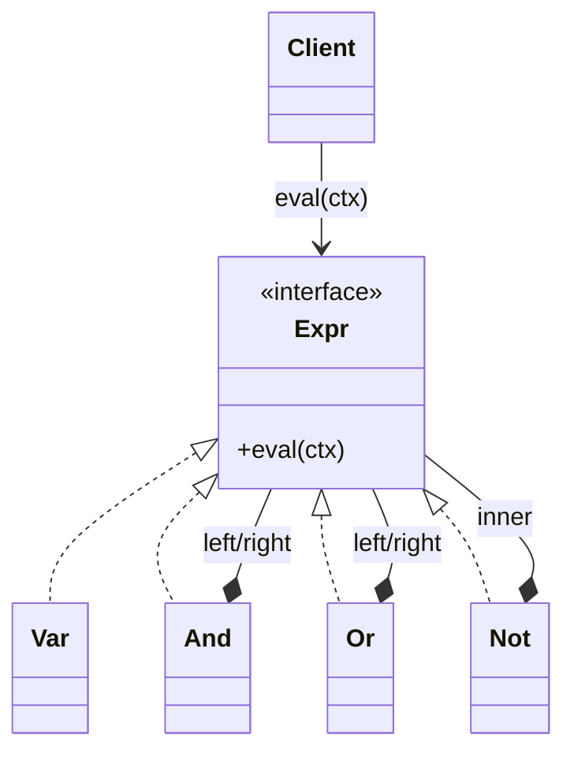

# Interpreter

> Category: Behavioral • Source: [Refactoring.Guru , Interpreter](https://refactoring.guru/design-patterns/interpreter) • Part of [[Java/README|Java MOC]] → [[06_Design-Patterns/README|Design Patterns MOC]]

## Why it Matters

Defines how to **interpret sentences** in a **small grammar** by representing each **rule as an expression object**.

## Diagram



## Code

```java
public class InterpreterDemo {
 interface Expr { boolean eval(java.util.Map<String, Boolean> ctx); }
 // Terminal reads a variable; non-terminals compose sub-expressions into a tree
 record Var(String name) implements Expr { public boolean eval(java.util.Map<String, Boolean> ctx) { return ctx.getOrDefault(name, false); } }
 record And(Expr l, Expr r) implements Expr { public boolean eval(java.util.Map<String, Boolean> ctx) { return l.eval(ctx) && r.eval(ctx); } }
 record Or(Expr l, Expr r) implements Expr { public boolean eval(java.util.Map<String, Boolean> ctx) { return l.eval(ctx) || r.eval(ctx); } }
 record Not(Expr e) implements Expr { public boolean eval(java.util.Map<String, Boolean> ctx) { return !e.eval(ctx); } }
 public static void main(String[] args) {
 Expr rule = new And(new Var("member"), new Or(new Var("admin"), new Not(new Var("banned"))));
 var ctx = new java.util.HashMap<String, Boolean>();
 ctx.put("member", true); ctx.put("admin", false); ctx.put("banned", false);
 System.out.println(rule.eval(ctx)); // => true
 ctx.put("banned", true); System.out.println(rule.eval(ctx)); // => false
 }
}
```
The demo proves tree evaluation: the rule member AND (admin OR NOT banned) prints true, then false after banned flips.

## When to use / not

- The language is tiny and stable: access rules, filters, config conditions.
- Rules change at runtime as data, not code deploys.
- No parser-generator dependency is justified.

## Trade-offs

Use for small, stable grammars like rule evaluators and filters. Each grammar rule becomes a class, so complex grammars explode into many types and slow tree walks , reach for a real parser (ANTLR, JavaCC) for actual languages.

## Vs

| Pattern | Use when |
|---------|----------|
| Interpreter | Evaluate sentences in a small grammar |
| Visitor | Operation over an existing object structure |
| Command | Encapsulate a request to queue or undo |

## Pitfalls

- Grammar growth: each rule is a class, so real languages explode.
- Tree-walk performance on hot paths , compile or cache for repeats.
- Left-recursion and precedence handled by hand instead of a real parser.

## Interview q&a

**Q: When should you NOT use Interpreter?**

For anything resembling a real language: every grammar rule becomes a class, so complexity and interpretation cost explode , use a parser generator and AST instead.

**Q: Interpreter vs Visitor?**

Both walk trees, but Interpreter's tree exists to be evaluated (eval is the point), while Visitor adds an external operation to a structure owned by someone else; an interpreter can itself accept visitors (e.g. pretty-print, optimize) as extra operations.

**Q: Where is Interpreter still used in practice?**

Rule engines, feature-flag evaluators, spreadsheet-style filters, and regex matchers are all interpreters over small grammars. Spring's SpEL and SQL `WHERE` evaluation follow the same shape: parse once into a tree, evaluate many times against a context.

: When should you NOT use Interpreter?:: For anything resembling a real language: every grammar rule becomes a class, so complexity and interpretation cost explode , use a parser generator and AST instead. **Q: Interpreter vs Visitor?** Both walk trees, but Interpreter's tree exists to be evaluated (eval is the point), while Visitor adds an external operation to a structure owned by someone else; an interpreter can itself accept visitors (e.g. pretty-print, optimize) as extra operati... #flashcard

## Related

[[06_Design-Patterns/Behavioral/Visitor|Visitor]] (operations over trees) • [[06_Design-Patterns/Behavioral/Command|Command]] • [[06_Design-Patterns/Behavioral/Iterator|Iterator]]

---
*Category: Behavioral • Tags: design-patterns • Source: refactoring.guru*

## Problem

Evaluating simple boolean or arithmetic rules (access checks, filters, config conditions) without pulling in a parser generator.

## Solution

Model the grammar as an expression tree: terminal expressions read values from a context, non-terminal expressions compose sub-expressions (AND, OR, NOT). Interpreting a sentence is one recursive eval call.

## When not to use

| Instead | Use |
|---------|-----|
| Anything resembling a real language | ANTLR / JavaCC + AST |
| One-shot operation over a fixed tree | Visitor |
| Queued reversible actions | Command |
