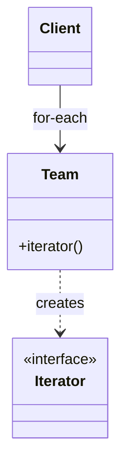

# Iterator

> Category: Behavioral • Source: [Refactoring.Guru , Iterator](https://refactoring.guru/design-patterns/iterator) • Part of [[Java/README|Java MOC]] → [[06_Design-Patterns/README|Design Patterns MOC]]

## Why it Matters

Lets you **traverse elements** without exposing the **collection internals**.

## Diagram



## Code

```java
public class IteratorDemo {
 // Iterable hides the array; clients get for-each without seeing storage
 record Team(String... members) implements Iterable<String> {
 public java.util.Iterator<String> iterator() { return java.util.Arrays.asList(members).iterator(); }
 }
 public static void main(String[] args) {
 var team = new Team("amy", "bo", "cy");
 for (var m : team) System.out.println(m); // => amy, bo, cy
 var it = team.iterator();
 while (it.hasNext()) System.out.println("next: " + it.next()); // => next: amy, next: bo, next: cy
 }
}
```
The demo proves encapsulation: clients traverse every member twice (for-each and cursor) without ever touching the backing array.

## When to use / not

- Clients need sequential access without seeing storage internals.
- Multiple simultaneous traversals must be independent.
- Lazy traversal of large or generated sequences is wanted.

## Trade-offs

Use when you need multiple traversal kinds or want to hide the collection type. Implementing Iterable gives for-each and stream support for free. Only write a custom iterator when built-ins do not fit.

## Vs

| Pattern | Use when |
|---------|----------|
| Iterator | Sequential access, hide collection |
| Visitor | Operation across a structure |
| Stream | Pipeline, not step-by-step cursor |

## Pitfalls

- Modifying the collection mid-iteration without fail-fast awareness.
- One-shot iterators returned where callers re-iterate.
- Exposing the live internal iterator instead of a snapshot when concurrency matters.

## Interview q&a

**Q: Do you still write custom iterators?**

Rarely. Implement Iterable and reuse built-in iterators. Only write one for special traversals.

**Q: What is fail-fast iteration?**

If a collection is structurally modified while an iterator is active (outside the iterator's own remove), the iterator throws ConcurrentModificationException instead of silently yielding stale data; iterate over a copy or use the iterator's remove when mutating mid-loop.

**Q: Custom Iterator vs Iterable vs Stream in API design?**

Expose `Iterable`/`Stream` from APIs , clients get for-each and pipelines free. Write a custom `Iterator` only for lazy, stateful, or resource-bound traversal (paged APIs, generators). Never return a one-shot `Iterator` where callers expect re-iteration.

: Do you still write custom iterators?:: Rarely. Implement Iterable and reuse built-in iterators. Only write one for special traversals. **Q: What is fail-fast iteration?** If a collection is structurally modified while an iterator is active (outside the iterator's own remove), the iterator throws ConcurrentModificationException instead of silently yielding stale data; iterate over a copy or use the iterator's remove when mutating mid-loop. **Q: Custom Iterator vs Iterable vs Stream... #flashcard

## Related

[[06_Design-Patterns/Behavioral/Visitor|Visitor]] • [[06_Design-Patterns/Behavioral/Observer|Observer]] (fan-out vs step-through) • [[06_Design-Patterns/Structural/Composite|Composite]]

---
*Category: Behavioral • Tags: design-patterns • Source: refactoring.guru*

## Problem

A social network stores profiles internally. Clients should not depend on list vs set vs map.

## Solution

Expose iteration through Iterable and Iterator. For custom traversals, implement Iterator with next and hasNext. Plain Iterable covers most cases.

## When not to use

| Instead | Use |
|---------|-----|
| Full collection pipelines | Stream API |
| Random access by key | Map / List API |
| One traversal only, internal | for-each over Iterable |
