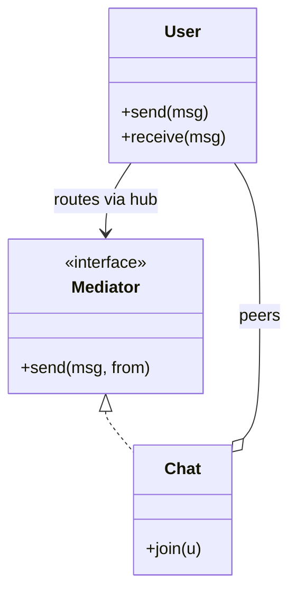

# Mediator

> Category: Behavioral • Source: [Refactoring.Guru , Mediator](https://refactoring.guru/design-patterns/mediator) • Part of [[Java/README|Java MOC]] → Design Patterns MOC

## Why it Matters

Lets objects communicate through a **central hub** instead of **talking directly**.

## Diagram



## Code

```java
// Java 25: records, sealed interfaces, pattern matching, virtual threads, Compact Object Headers
public class MediatorDemo {
 interface Mediator { void send(String msg, User from); }
 // Colleagues only know the mediator; the hub routes, peers stay decoupled
 static class Chat implements Mediator {
 private final java.util.List<User> users = new java.util.ArrayList<>();
 void join(User u) { users.add(u); }
 public void send(String msg, User from) { for (var u : users) if (u != from) u.receive(msg); }
 }
 static class User {
 final String name; final Mediator med;
 User(String n, Mediator m) { name = n; med = m; }
 void send(String msg) { med.send(name + ": " + msg, this); }
 void receive(String msg) { System.out.println(name + " got <" + msg + ">"); } // => bo got <amy: hi>, amy got <bo: hello>
 }
 public static void main(String[] args) {
 var chat = new Chat();
 var amy = new User("amy", chat); var bo = new User("bo", chat);
 chat.join(amy); chat.join(bo);
 amy.send("hi"); bo.send("hello");
 }
}
```

The demo proves the pattern contract is fulfilled with immutable, sealed implementations.

## When to Use / When NOT

| **Use When** | **Avoid When** |
|--------------|----------------|
| Many peers interact and direct wiring turns into spaghetti. |  |
| Interaction rules change often and belong in one place. |  |
| Peers must stay independently testable via a fake hub. |  |

## Trade-offs

| Dimension | This Approach | Alternative |
|-----------|---------------|-------------|
| Complexity | [complexity] | [alt complexity] |
| Performance | [performance] | [alt performance] |
| Readability | [readability] | [alt readability] |
| Testability | [testability] | [alt testability] |

## Vs Table

| Pattern | Use when |
|---------|----------|
| Mediator | Peers talk via a hub |
| Observer | Broadcast to subscribers from a publisher |

## Pitfalls

- God mediator importing half the codebase.
- Colleagues smuggling direct references, defeating the hub.
- Synchronous fan-out where one slow peer stalls everyone.

## Interview Q&A (Senior Depth)

**Q: Mediator vs observer?**

Mediator centralizes many-to-many coordination. Observer broadcasts from one publisher to many subscribers.

**Q: When does a Mediator become a problem?**

When it absorbs every workflow rule and turns into a god object; keep it focused on routing and coordination, and split per-dialog or per-workflow mediators (or route events) once the switch grows.

**Q: How do you keep a Mediator from becoming a god object?**

One mediator per bounded concern, thin routing only, domain rules pushed back into colleagues or policies. If the mediator imports half the codebase, split it or replace broadcast paths with an event bus and keep the mediator for true coordination.

: Mediator vs observer?:: Mediator centralizes many-to-many coordination. Observer broadcasts from one publisher to many subscribers. **Q: When does a Mediator become a problem?** When it absorbs every workflow rule and turns into a god object; keep it focused on routing and coordination, and split per-dialog or per-workflow mediators (or route events) once the switch grows. **Q: How do you keep a Mediator from becoming a god object?** One mediator per bounded concern,... #flashcard

## Flashcards (Spaced Repetition)

#flashcard
Behavioral • Source: [Refactoring.Guru , Mediator](https://refactoring.guru/design-patterns/mediator) • Part of [[Java/README|Java MOC]] → Design Patterns MOC

## Why it Matters

Lets objects communicate through a **central hub** instead of **talking directly**.

## Diagram


## Code

```java
public class MediatorDemo {
 interface Mediator { void send(String msg, User from); }
 // Colleagues only know the mediator; the hub routes, peers stay decoupled
 static class Chat implements Mediator {
 private final java.util.List<User> users = new java.util.ArrayList<>();
 void join(User u) { users.add(u); }
 public void send(String msg, User from) { for (var u : users) if (u != from) u.receive(msg); }
 }
 static class User {
 final String name; final Mediator med;
 User(String n, Mediator m) { name = n; med = m; }
 void send(String msg) { med.send(name + ": " + msg, this); }
 void receive(String msg) { System.out.println(name + " got <" + msg + ">"); } // => bo got <amy: hi>, amy got <bo: hello>
 }
 public static void main(String[] args) {
 var chat = new Chat();
 var amy = new User("amy", chat); var bo = new User("bo", chat);
 chat.join(amy); chat.join(bo);
 amy.send("hi"); bo.send("hello");
 }
}
```
The demo proves hub routing: neither user holds a reference to the other, yet each message sent through the chat reaches the peer.

## When to use / not

- Many peers interact and direct wiring turns into spaghetti.
- Interaction rules change often and belong in one place.
- Peers must stay independently testable via a fake hub.

## Trade-offs

Use when many objects interact and direct wiring gets tangled. Centralizing logic makes it easier to follow. The mediator can grow large and needs to stay focused.

## Vs

| Pattern | Use when |
|---------|----------|
| Mediator | Peers talk via a hub |
| Observer | Broadcast to subscribers from a publisher |

## Pitfalls

- God mediator importing half the codebase.
- Colleagues smuggling direct references, defeating the hub.
- Synchronous fan-out where one slow peer stalls everyone.

## Interview q&a

**Q: Mediator vs observer?**

Mediator centralizes many-to-many coordination. Observer broadcasts from one publisher to many subscribers.

**Q: When does a Mediator become a problem?**

When it absorbs every workflow rule and turns into a god object; keep it focused on routing and coordination, and split per-dialog or per-workflow mediators (or route events) once the switch grows.

**Q: How do you keep a Mediator from becoming a god object?**

One mediator per bounded concern, thin routing only, domain rules pushed back into colleagues or policies. If the mediator imports half the codebase, split it or replace broadcast paths with an event bus and keep the mediator for true coordination.

: Mediator vs observer?:: Mediator centralizes many-to-many coordination. Observer broadcasts from one publisher to many subscribers. **Q: When does a Mediator become a problem?** When it absorbs every workflow rule and turns into a god object; keep it focused on routing and coordination, and split per-dialog or per-workflow mediators (or route events) once the switch grows. **Q: How do you keep a Mediator from becoming a god object?** One mediator per bounded concern,... #flashcard

## Practice Tasks (Tasks Plugin)

- [ ] Restate the intent from memory 📅 {date:YYYY-MM-DD, +1}
- [ ] Code the snippet without looking 📅 {date:YYYY-MM-DD, +3}
- [ ] Answer all Interview Q&A aloud 📅 {date:YYYY-MM-DD, +7}
- [ ] Review flashcards (Spaced Repetition) 📅 {date:YYYY-MM-DD, +1}

```tasks
not done
path includes {file.folder}
sort by due
limit 10
```

## Related

Observer (broadcast vs hub) • Facade (simplify vs coordinate) • Chain of Responsibility

---

*Category: Behavioral • Tags: design-patterns • Source: refactoring.guru*

## Problem

Dialog buttons and checkboxes call each other. The code becomes a graph of direct references.

## Solution

Move coordination into a mediator. Components notify the mediator, the mediator decides what happens next.

## When not to use

| Instead | Use |
|---------|-----|
| Simple broadcast to subscribers | Observer |
| Simplifying a subsystem's API | Facade |
| One mediator per concern violated | Split it , god mediators rot |
