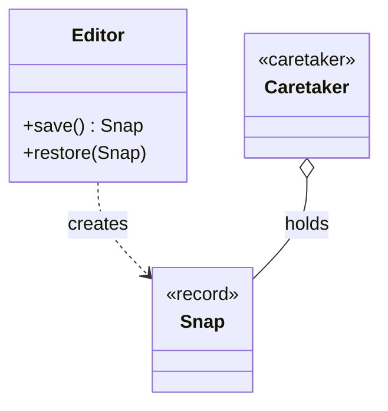

# Memento *Also Known as: Snapshot*

> Category: Behavioral • Source: [Refactoring.Guru , Memento](https://refactoring.guru/design-patterns/memento) • Part of [[Java/README|Java MOC]] → [[06_Design-Patterns/README|Design Patterns MOC]]

## Why it Matters

Captures and **restores an object's state** without exposing its **internals**.

## Diagram



## Code

```java
public class MementoDemo {
 static class Editor {
 private String text = "";
 void type(String s) { text += s; }
 // Snapshot is immutable; only the Editor that made it can restore it
 record Snap(String text) {}
 Snap save() { return new Snap(text); }
 void restore(Snap s) { text = s.text(); }
 public String toString() { return text; }
 }
 public static void main(String[] args) {
 var ed = new Editor(); var history = new java.util.ArrayDeque<Editor.Snap>();
 ed.type("hello "); history.push(ed.save());
 ed.type("world"); System.out.println(ed); // => hello world
 ed.restore(history.pop()); System.out.println(ed); // => hello
 }
}
```
The demo proves encapsulated undo: printing "hello world" then restoring the snapshot prints "hello " with no field ever exposed.

## When to use / not

- Undo/rollback of state is needed without exposing internals.
- Snapshots must be opaque tokens the caretaker cannot tamper with.
- History is bounded (a few steps, not infinite).

## Trade-offs

Use for undo where you must not leak internal state. Records give a compact immutable memento. Storing many large mementos costs memory, so cap history or keep deltas.

## Vs

| Pattern | Use when |
|---------|----------|
| Memento | Save and restore state, keep encapsulation |
| Command undo | Request object stores reverse action |

## Pitfalls

- Unbounded undo history , cap depth and size.
- Mementos leaking mutable internals (handing out the live list).
- Saving snapshots on every keystroke without throttling.

## Interview q&a

**Q: How long do you keep mementos?**

Only as long as undo is needed. Large or many snapshots cost memory, so bound history.

**Q: How does Memento protect encapsulation?**

The snapshot is opaque and immutable: the caretaker only holds and returns it without reading it, and only the originator can create or restore from it, so internal representation never leaks.

**Q: Memento vs serialized snapshot , which survives?**

Memento keeps encapsulation: the token is opaque, versioning stays inside the originator. Serialized snapshots leak field shape and break across refactors. Use mementos for in-session undo, serialization for durable persistence , and bound both.

: How long do you keep mementos?:: Only as long as undo is needed. Large or many snapshots cost memory, so bound history. **Q: How does Memento protect encapsulation?** The snapshot is opaque and immutable: the caretaker only holds and returns it without reading it, and only the originator can create or restore from it, so internal representation never leaks. **Q: Memento vs serialized snapshot , which survives?** Memento keeps encapsulation: the token is opaque, versioning sta... #flashcard

## Related

[[06_Design-Patterns/Behavioral/Command|Command]] (action undo) • [[06_Design-Patterns/Behavioral/State|State]] (state-driven behavior) • [[06_Design-Patterns/Behavioral/Iterator|Iterator]]

---
*Category: Behavioral • Tags: design-patterns • Source: refactoring.guru*

## Problem

Editor needs undo but exposing all fields breaks encapsulation.

## Solution

Let the originator create an opaque snapshot record and restore from it. A caretaker holds snapshots.

## When not to use

| Instead | Use |
|---------|-----|
| Undoing actions, not state | Command with inverse |
| Long-term persistence | Serialization / DB |
| Unbounded history | Cap it or use event sourcing |
