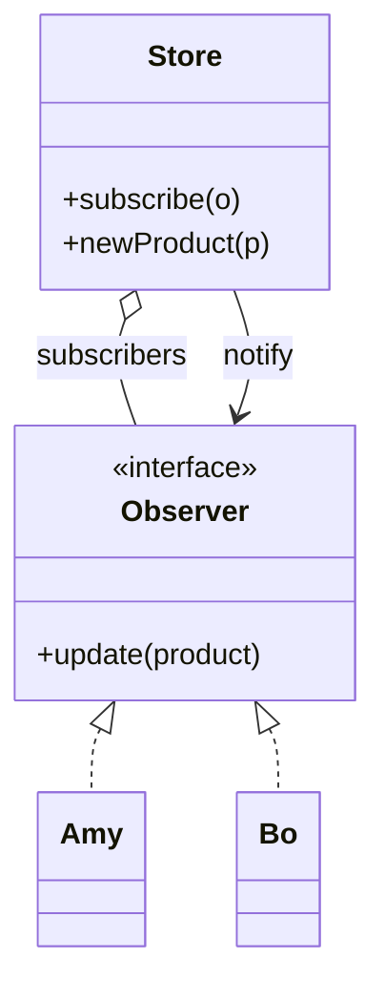

# Observer *Also Known as: Pub-Sub*

> Category: Behavioral • Source: [Refactoring.Guru , Observer](https://refactoring.guru/design-patterns/observer) • Part of [[Java/README|Java MOC]] → [[06_Design-Patterns/README|Design Patterns MOC]]

## Why it Matters

Defines a **subscription** so **observers react** when the **publisher changes**.

## Diagram



## Code

```java
public class ObserverDemo {
 interface Observer { void update(String product); }
 // Publisher fans out over a copy-safe list; unsubscribe to avoid leaks
 static class Store {
 private final java.util.List<Observer> subs = new java.util.concurrent.CopyOnWriteArrayList<>();
 void subscribe(Observer o) { subs.add(o); }
 void unsubscribe(Observer o) { subs.remove(o); }
 void newProduct(String p) { for (var o : subs) o.update(p); }
 }
 public static void main(String[] args) {
 var store = new Store();
 Observer amy = p -> System.out.println("amy notified: " + p); // => amy notified: phone, amy notified: laptop
 Observer bo = p -> System.out.println("bo notified: " + p); // => bo notified: phone
 store.subscribe(amy); store.subscribe(bo);
 store.newProduct("phone");
 store.unsubscribe(bo);
 store.newProduct("laptop");
 }
}
```
The demo proves broadcast with cleanup: both observers fire on "phone", and only Amy fires on "laptop" after Bo unsubscribes.

## When to use / not

- One publisher, many subscribers that come and go at runtime.
- Subscribers must not block or know about each other.
- UI updates, caches, and event fan-out.

## Trade-offs

Use when one change needs many reactions or subscribers come and go at runtime. CopyOnWriteArrayList handles concurrent subscribe and notify. Remember to unsubscribe or you keep objects alive longer than intended.

## Vs

| Pattern | Use when |
|---------|----------|
| Observer | One publisher, many subscribers |
| Mediator | Central hub for peers |
| Flow | Back-pressured async pub-sub |

## Pitfalls

- Forgotten unsubscribe → memory leaks and ghost updates.
- Calling listeners while holding a lock → reentrancy deadlocks.
- One throwing subscriber aborting the whole fan-out , isolate failures.

## Interview q&a

**Q: What is the common bug?**

Forgetting to unsubscribe. Stale observers keep objects alive and duplicate work.

**Q: Push vs pull notification?**

Push delivers the changed data with the update call (simpler, one trip); pull sends a bare signal and each observer queries the publisher for what it needs (avoids over-sharing and stale copies, at the cost of an extra round trip).

**Q: How do you avoid listener memory leaks?**

Always pair subscribe with unsubscribe (lifecycle methods, try-with-resources, weak references for UI listeners), fan out over a copy-safe list like `CopyOnWriteArrayList`, and never call alien code while holding the publisher's lock , reentrancy deadlocks are the classic Observer outage.

: What is the common bug?:: Forgetting to unsubscribe. Stale observers keep objects alive and duplicate work. **Q: Push vs pull notification?** Push delivers the changed data with the update call (simpler, one trip); pull sends a bare signal and each observer queries the publisher for what it needs (avoids over-sharing and stale copies, at the cost of an extra round trip). **Q: How do you avoid listener memory leaks?** Always pair subscribe with unsubscribe (lifecycle me... #flashcard

## Related

[[06_Design-Patterns/Behavioral/Mediator|Mediator]] • [[06_Design-Patterns/Behavioral/Iterator|Iterator]] • [[06_Design-Patterns/Behavioral/State|State]]

---
*Category: Behavioral • Tags: design-patterns • Source: refactoring.guru*
- [[Architect/04_Design-Patterns-Building-Blocks/01_Enterprise-Patterns.md|01_Enterprise-Patterns]] — Enterprise patterns - Observer

## Problem

A store should notify customers about new products without hard-coding who listens.

## Solution

Keep a thread-safe list of observers. Add subscribe and unsubscribe plus a notify loop. Sealed events with switch keep handling exhaustive.

## When not to use

| Instead | Use |
|---------|-----|
| Async streams with back-pressure | Flow / reactive |
| Peer coordination with rules | Mediator |
| Request-response | Direct call / Future |
