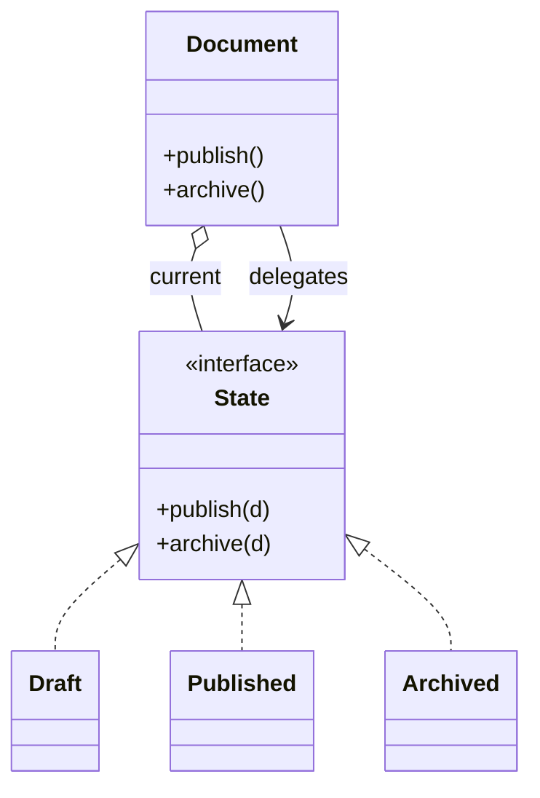

# State

> Category: Behavioral • Source: [Refactoring.Guru , State](https://refactoring.guru/design-patterns/state) • Part of [[Java/README|Java MOC]] → [[06_Design-Patterns/README|Design Patterns MOC]]

## Why it Matters

Lets an object **change behavior** when its **internal state** changes.

## Diagram



## Code

```java
public class StateDemo {
 interface State { void publish(Document d); void archive(Document d); String name(); }
 // Context delegates; each state object owns its own transition rules
 static class Document {
 State state = new Draft();
 void publish() { state.publish(this); }
 void archive() { state.archive(this); }
 }
 record Draft() implements State {
 public void publish(Document d) { d.state = new Published(); }
 public void archive(Document d) { System.out.println("cannot archive draft"); }
 public String name() { return "draft"; }
 }
 record Published() implements State {
 public void publish(Document d) { System.out.println("already published"); }
 public void archive(Document d) { d.state = new Archived(); }
 public String name() { return "published"; }
 }
 record Archived() implements State {
 public void publish(Document d) { System.out.println("archived, frozen"); }
 public void archive(Document d) { System.out.println("already archived"); }
 public String name() { return "archived"; }
 }
 public static void main(String[] args) {
 var doc = new Document();
 doc.publish(); System.out.println(doc.state.name()); // => published
 doc.archive(); System.out.println(doc.state.name()); // => archived
 }
}
```
The demo proves delegated transitions: the same publish/archive calls behave differently per state, moving the document draft → published → archived with no conditionals in Document.

## When to use / not

- Behavior branches on internal state and the branches keep growing.
- Transitions have rules that deserve named homes (draft → published → archived).
- If-else on status enums is spreading across methods.

## Trade-offs

Use when behavior branches on state and states have distinct rules. It removes conditionals and groups state logic together. Creating a type per state is overkill when differences are minor.

## Vs

| Pattern | Use when |
|---------|----------|
| State | Object changes behavior with state, delegates |
| Strategy | Algorithm chosen externally |
| Template method | Steps fixed, details vary |

## Pitfalls

- Status enums with if-else spread across methods instead of state objects.
- Illegal transitions failing silently , log or throw explicitly.
- States sharing mutable context without clear ownership.

## Interview q&a

**Q: State vs strategy choice?**

State switches internally when the object's own state changes. Strategy is picked by the caller.

**Q: Where do State transitions live?**

Inside the state objects themselves: each state decides the legal next state (Draft.publish moves to Published) and the context just holds the current one, so adding a state means adding a type instead of editing a conditional chain.

**Q: Where do transition rules live, and how do illegal ones behave?**

Rules live in the state objects themselves , each state decides its valid exits , so adding a state never edits the context. Illegal transitions should fail loudly in dev (exception) and degrade explicitly in prod (log + stay); silent no-ops hide broken workflows.

: State vs strategy choice?:: State switches internally when the object's own state changes. Strategy is picked by the caller. **Q: Where do State transitions live?** Inside the state objects themselves: each state decides the legal next state (Draft.publish moves to Published) and the context just holds the current one, so adding a state means adding a type instead of editing a conditional chain. **Q: Where do transition rules live, and how do illegal ones behave?** Rules... #flashcard

## Related

[[06_Design-Patterns/Behavioral/Strategy|Strategy]] (external choice vs internal transition) • [[06_Design-Patterns/Behavioral/Template Method|Template Method]] • [[06_Design-Patterns/Behavioral/Memento|Memento]]

---
*Category: Behavioral • Tags: design-patterns • Source: refactoring.guru*

## Problem

A document behaves differently as draft vs published vs archived, with conditionals everywhere.

## Solution

Extract each state into its own type with the same interface. The context holds the current state and delegates. Switching state changes behavior.

## When not to use

| Instead | Use |
|---------|-----|
| Externally chosen algorithm | Strategy |
| Fixed skeleton, varying steps | Template Method |
| Two states with no rules | Boolean / enum flag |
