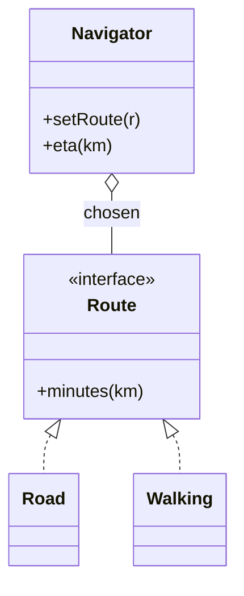

# Strategy *Also Known as: Policy*

> Category: Behavioral • Source: [Refactoring.Guru , Strategy](https://refactoring.guru/design-patterns/strategy) • Part of [[Java/README|Java MOC]] → [[06_Design-Patterns/README|Design Patterns MOC]]

## Why it Matters

Defines a **family of algorithms**, puts each in its own class, and makes them **interchangeable**.

## Diagram



## Code

```java
public class StrategyDemo {
 interface Route { int minutes(int km); }
 // Context delegates to the injected algorithm; swapping it changes the result
 record Road() implements Route { public int minutes(int km) { return km * 2; } }
 record Walking() implements Route { public int minutes(int km) { return km * 12; } }
 static class Navigator {
 private Route route;
 Navigator(Route r) { route = r; }
 void setRoute(Route r) { route = r; }
 int eta(int km) { return route.minutes(km); }
 }
 public static void main(String[] args) {
 var nav = new Navigator(new Road());
 System.out.println("road: " + nav.eta(10)); // => road: 20
 nav.setRoute(new Walking());
 System.out.println("walk: " + nav.eta(10)); // => walk: 120
 }
}
```
The demo proves runtime swapping: the same navigator reports different ETAs after setRoute exchanges the algorithm.

## When to use / not

- Multiple algorithms for one job must swap at runtime (road vs walking).
- Variant logic should live in isolated, testable classes.
- The context must stay closed to modification when algorithms grow.

## Trade-offs

Use when you swap algorithms at runtime or want to isolate variant logic. It keeps the context closed for change. The client must still choose a strategy, so defaults help.

## Vs

| Pattern | Use when |
|---------|----------|
| Strategy | Swap algorithms on one object |
| Command | Encapsulate a request to queue or undo |
| State | Internal state drives behavior |

## Pitfalls

- If-else selection chains duplicated at every call site , centralize the registry.
- Strategies needing the context's privates , pass a narrow context object.
- Stateful strategies shared across threads.

## Interview q&a

**Q: Strategy vs state pattern?**

Strategy is chosen externally and swapped at will. State changes itself based on internal transitions.

**Q: How does the client pick a strategy?**

The caller injects it via constructor or setter, usually with a sensible default plus a factory or map lookup by key; the context never hard-codes which algorithm it holds.

**Q: How do you pick a strategy without an if-else chain?**

A `Map<String, Route>` registry (or DI-injected map of all strategy beans) keyed by request attribute, with a named default. Adding a strategy then means registering one entry , the selection code never changes.

: Strategy vs state pattern?:: Strategy is chosen externally and swapped at will. State changes itself based on internal transitions. **Q: How does the client pick a strategy?** The caller injects it via constructor or setter, usually with a sensible default plus a factory or map lookup by key; the context never hard-codes which algorithm it holds. **Q: How do you pick a strategy without an if-else chain?** A `Map<String, Route>` registry (or DI-injected map of all strategy... #flashcard

## Related

[[06_Design-Patterns/Behavioral/State|State]] • [[06_Design-Patterns/Behavioral/Command|Command]] • [[06_Design-Patterns/Behavioral/Template Method|Template Method]]

---
*Category: Behavioral • Tags: design-patterns • Source: refactoring.guru*

## Problem

Navigator picks road vs walking vs transit. Adding an algorithm should not edit the navigator.

## Solution

Put each algorithm behind a sealed interface. Context holds the chosen strategy and delegates. Switching strategy changes the result.

## When not to use

| Instead | Use |
|---------|-----|
| Behavior driven by internal state | State |
| Queued or undoable request | Command |
| Single algorithm forever | Plain method |
