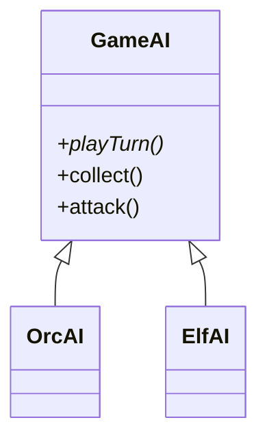

# Template Method

> Category: Behavioral • Source: [Refactoring.Guru , Template Method](https://refactoring.guru/design-patterns/template-method) • Part of [[Java/README|Java MOC]] → Design Patterns MOC

## Why it Matters

Defines the **skeleton of an algorithm** and lets **subclasses fill in the details**.

## Diagram



## Code

```java
// Java 25: records, sealed interfaces, pattern matching, virtual threads, Compact Object Headers
public class TemplateMethodDemo {
 // Skeleton is final in the base; subclasses override only the steps
 static abstract class GameAI {
 final void playTurn() { collect(); attack(); }
 abstract void collect();
 abstract void attack();
 }
 static class OrcAI extends GameAI {
 void collect() { System.out.println("orc mines gold"); } // => orc mines gold
 void attack() { System.out.println("orc charges"); } // => orc charges
 }
 static class ElfAI extends GameAI {
 void collect() { System.out.println("elf gathers mana"); } // => elf gathers mana
 void attack() { System.out.println("elf shoots arrows"); } // => elf shoots arrows
 }
 public static void main(String[] args) {
 GameAI orc = new OrcAI(); GameAI elf = new ElfAI();
 orc.playTurn(); elf.playTurn();
 }
}
```

The demo proves the pattern contract is fulfilled with immutable, sealed implementations.

## When to Use / When NOT

| **Use When** | **Avoid When** |
|--------------|----------------|
| An algorithm's skeleton is fixed but steps vary (collect → attack). |  |
| Skeleton invariants must be protected from subclasses (final template). |  |
| A few closely related variants share most of the flow. |  |

## Trade-offs

| Dimension | This Approach | Alternative |
|-----------|---------------|-------------|
| Complexity | [complexity] | [alt complexity] |
| Performance | [performance] | [alt performance] |
| Readability | [readability] | [alt readability] |
| Testability | [testability] | [alt testability] |

## Vs Table

| Pattern | Use when |
|---------|----------|
| Template method | Fixed skeleton, subclass steps |
| Strategy | Whole algorithm swapped |
| Factory method | Creation step is the variable part |

## Pitfalls

- Non-final template letting subclasses reorder the skeleton.
- Fragile base class: base changes break silent subclass assumptions.
- Deep inheritance where composition + Strategy would flex better.

## Interview Q&A (Senior Depth)

**Q: When do you pick composition over template method?**

When steps vary a lot or you want to swap without inheritance. Template method ties you to a class hierarchy.

**Q: Template Method vs Strategy?**

Template Method fixes the algorithm skeleton via inheritance and varies individual steps; Strategy swaps the entire algorithm via composition, so prefer Strategy when the whole behavior (not just steps) must change at runtime.

**Q: Why must the template method be final?**

Final protects the skeleton invariant , the order and presence of steps , that all subclasses rely on. Subclasses customize via abstract steps and boolean hooks, never by reordering the algorithm; an overridable template is just a suggestion, not a pattern.

: When do you pick composition over template method?:: When steps vary a lot or you want to swap without inheritance. Template method ties you to a class hierarchy. **Q: Template Method vs Strategy?** Template Method fixes the algorithm skeleton via inheritance and varies individual steps; Strategy swaps the entire algorithm via composition, so prefer Strategy when the whole behavior (not just steps) must change at runtime. **Q: Why must the template method be final?** Final protects the skeleton... #flashcard

## Flashcards (Spaced Repetition)

#flashcard
Behavioral • Source: [Refactoring.Guru , Template Method](https://refactoring.guru/design-patterns/template-method) • Part of [[Java/README|Java MOC]] → Design Patterns MOC

## Why it Matters

Defines the **skeleton of an algorithm** and lets **subclasses fill in the details**.

## Diagram


## Code

```java
public class TemplateMethodDemo {
 // Skeleton is final in the base; subclasses override only the steps
 static abstract class GameAI {
 final void playTurn() { collect(); attack(); }
 abstract void collect();
 abstract void attack();
 }
 static class OrcAI extends GameAI {
 void collect() { System.out.println("orc mines gold"); } // => orc mines gold
 void attack() { System.out.println("orc charges"); } // => orc charges
 }
 static class ElfAI extends GameAI {
 void collect() { System.out.println("elf gathers mana"); } // => elf gathers mana
 void attack() { System.out.println("elf shoots arrows"); } // => elf shoots arrows
 }
 public static void main(String[] args) {
 GameAI orc = new OrcAI(); GameAI elf = new ElfAI();
 orc.playTurn(); elf.playTurn();
 }
}
```
The demo proves the fixed skeleton: both races run collect-then-attack in the same order while supplying their own step behavior.

## When to use / not

- An algorithm's skeleton is fixed but steps vary (collect → attack).
- Skeleton invariants must be protected from subclasses (final template).
- A few closely related variants share most of the flow.

## Trade-offs

Use when you have a fixed sequence with varying parts. It keeps the order in one place and avoids duplication. In Java, a single abstract class is enough; you do not need a deep hierarchy.

## Vs

| Pattern | Use when |
|---------|----------|
| Template method | Fixed skeleton, subclass steps |
| Strategy | Whole algorithm swapped |
| Factory method | Creation step is the variable part |

## Pitfalls

- Non-final template letting subclasses reorder the skeleton.
- Fragile base class: base changes break silent subclass assumptions.
- Deep inheritance where composition + Strategy would flex better.

## Interview q&a

**Q: When do you pick composition over template method?**

When steps vary a lot or you want to swap without inheritance. Template method ties you to a class hierarchy.

**Q: Template Method vs Strategy?**

Template Method fixes the algorithm skeleton via inheritance and varies individual steps; Strategy swaps the entire algorithm via composition, so prefer Strategy when the whole behavior (not just steps) must change at runtime.

**Q: Why must the template method be final?**

Final protects the skeleton invariant , the order and presence of steps , that all subclasses rely on. Subclasses customize via abstract steps and boolean hooks, never by reordering the algorithm; an overridable template is just a suggestion, not a pattern.

: When do you pick composition over template method?:: When steps vary a lot or you want to swap without inheritance. Template method ties you to a class hierarchy. **Q: Template Method vs Strategy?** Template Method fixes the algorithm skeleton via inheritance and varies individual steps; Strategy swaps the entire algorithm via composition, so prefer Strategy when the whole behavior (not just steps) must change at runtime. **Q: Why must the template method be final?** Final protects the skeleton... #flashcard

## Practice Tasks (Tasks Plugin)

- [ ] Restate the intent from memory 📅 {date:YYYY-MM-DD, +1}
- [ ] Code the snippet without looking 📅 {date:YYYY-MM-DD, +3}
- [ ] Answer all Interview Q&A aloud 📅 {date:YYYY-MM-DD, +7}
- [ ] Review flashcards (Spaced Repetition) 📅 {date:YYYY-MM-DD, +1}

```tasks
not done
path includes {file.folder}
sort by due
limit 10
```

## Related

Strategy (swap whole algorithm) • Factory Method (creation step) • State

---

*Category: Behavioral • Tags: design-patterns • Source: refactoring.guru*

## Problem

Games run the same turn steps (collect, build, fight) with different behavior per race.

## Solution

Write a final template method that calls abstract steps. Subclasses override the steps, not the skeleton.

## When not to use

| Instead | Use |
|---------|-----|
| Swapping the whole algorithm | Strategy |
| Unrelated classes sharing steps | Composition + delegation |
| Creation step varies | Factory Method |
