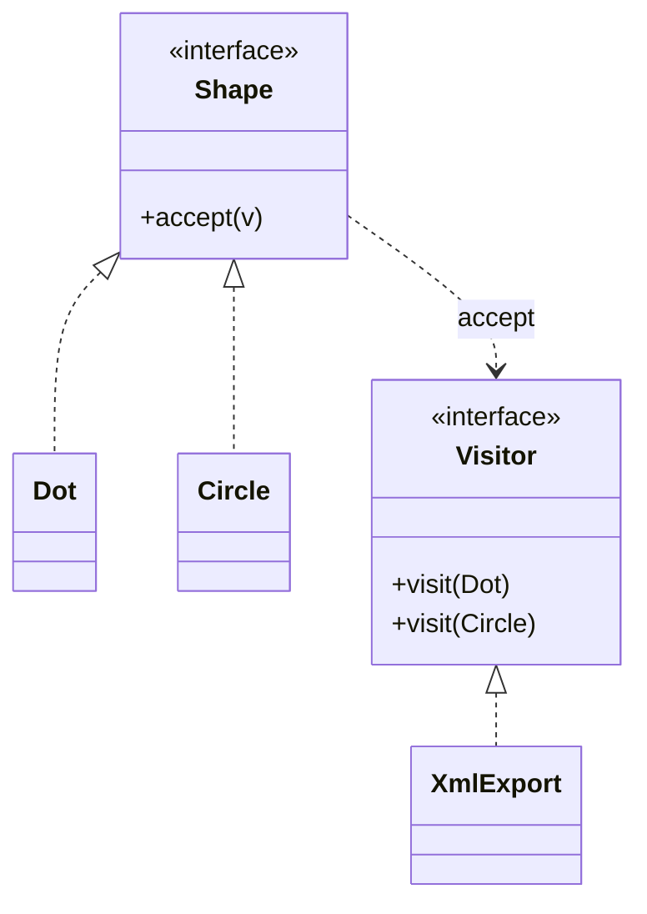

# Visitor

> Category: Behavioral • Source: [Refactoring.Guru , Visitor](https://refactoring.guru/design-patterns/visitor) • Part of [[Java/README|Java MOC]] → [[06_Design-Patterns/README|Design Patterns MOC]]

## Why it Matters

Separates an **algorithm** from the **objects it operates on**.

## Diagram



## Code

```java
public class VisitorDemo {
 interface Shape { String accept(Visitor v); }
 interface Visitor { String visit(Dot d); String visit(Circle c); }
 // Double dispatch: each element calls back the overload for its own type
 record Dot(int x) implements Shape { public String accept(Visitor v) { return v.visit(this); } }
 record Circle(int r) implements Shape { public String accept(Visitor v) { return v.visit(this); } }
 static class XmlExport implements Visitor {
 public String visit(Dot d) { return "<dot x=\"" + d.x() + "\"/>"; }
 public String visit(Circle c) { return "<circle r=\"" + c.r() + "\"/>"; }
 }
 public static void main(String[] args) {
 java.util.List<Shape> shapes = java.util.List.of(new Dot(1), new Circle(5));
 var export = new XmlExport();
 for (var s : shapes) System.out.println(s.accept(export)); // => <dot x="1"/>, <circle r="5"/>
 }
}
```
The demo proves separation: XML export is added as a new visitor without touching Dot or Circle, and each shape dispatches to its own overload.

## When to use / not

- New operations are added often to a stable element set (export, validate, price).
- Elements must stay untouched while operations grow.
- Double dispatch is acceptable to recover concrete types.

## Trade-offs

Use when you add many operations over a stable element set. The sealed switch version is simpler when you own the hierarchy; keep the classic visitor when visitors need mutable accumulation or the set is open.

## Vs

| Pattern | Use when |
|---------|----------|
| Visitor | Add operation without touching elements |
| Strategy | Swap one algorithm |
| Switch visitor | Lightweight alternative when sealed |

## Pitfalls

- Adding element types breaks every visitor , budget for it or use sealed switches.
- Visitors accumulating mutable cross-element state (non-reentrant).
- Exposing element internals through oversized visitor interfaces.

## Interview q&a

**Q: Do you still need classic visitor?**

Only when visitors accumulate state or elements are open. For stable sealed hierarchies a switch visitor is shorter.

**Q: What is double dispatch, and what trade-off does Visitor make?**

accept() re-dispatches on the element's runtime type so the matching visit overload runs , two dispatches (accept, then visit) select the operation; adding new operations is cheap (new visitor), but adding a new element type forces edits to every visitor.

**Q: What happens when you add a new element type?**

You touch the Visitor interface and every visitor implementation , that is the pattern's core trade-off, inverted from subclassing. Sealed hierarchies plus pattern-matching switches make the blast radius compiler-checked, which is why modern Java often skips classic Visitor.

: Do you still need classic visitor?:: Only when visitors accumulate state or elements are open. For stable sealed hierarchies a switch visitor is shorter. **Q: What is double dispatch, and what trade-off does Visitor make?** accept() re-dispatches on the element's runtime type so the matching visit overload runs , two dispatches (accept, then visit) select the operation; adding new operations is cheap (new visitor), but adding a new element type forces edits to every visitor. **Q:... #flashcard

## Related

[[06_Design-Patterns/Behavioral/Strategy|Strategy]] • [[06_Design-Patterns/Behavioral/Interpreter|Interpreter]] • [[06_Design-Patterns/Structural/Composite|Composite]]

---
*Category: Behavioral • Tags: design-patterns • Source: refactoring.guru*

## Problem

Exporting shapes to xml should not add export methods to every shape class.

## Solution

Keep shapes clean and put the operation in a visitor. With sealed shapes, a switch visitor does the same without double dispatch.

## When not to use

| Instead | Use |
|---------|-----|
| Elements change often | Sealed switch / pattern matching |
| One swappable algorithm | Strategy |
| Small stable hierarchy | Instanceof chains |
