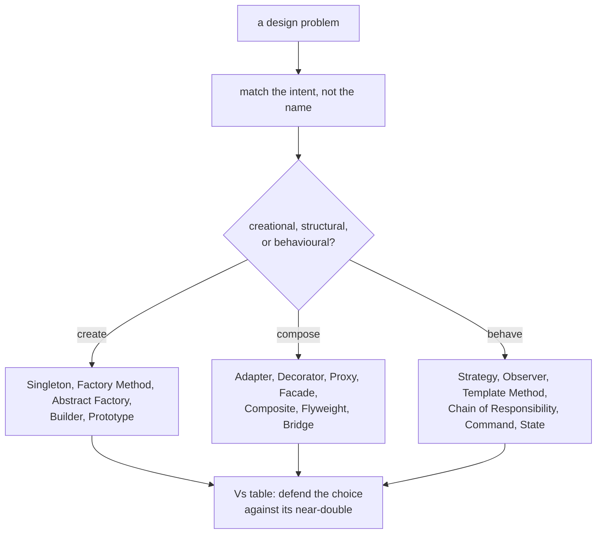

## Why it Matters

One-page index of the 22 GoF patterns plus DAO and DI, with intent, a one-line Java hook, and where Spring uses each. Use it to rehearse the intent sentence for every pattern, which is the actual interview ask.

## Diagram



## Code

```java
// Strategy — the pattern most often asked live; swap behaviour without the caller noticing
interface PaymentStrategy { void pay(int amount); }

record CardPayment(String card) implements PaymentStrategy {
 public void pay(int amount) { System.out.println("card " + card + " " + amount); }
}
record UpiPayment(String id) implements PaymentStrategy {
 public void pay(int amount) { System.out.println("upi " + id + " " + amount); }
}

record Checkout(PaymentStrategy strategy) { // injected, not new-ed in the client
 void checkout(int amount) { strategy.pay(amount); }
}

void demo() {
 new Checkout(new CardPayment("4242")).checkout(100); // => card 4242 100
 new Checkout(new UpiPayment("sukesh@upi")).checkout(100); // => upi sukesh@upi 100
}
```

## When to use / not

| Use | NOT |
|-----|-----|
| Naming a pattern already implicit in your code, then stating its intent | Applying a pattern to a three-line class, complexity without a driver |
| Preparing the "which pattern and why" whiteboard answer | Memorising all 23 UML diagrams; know the 10 bold cold instead |
| Reading Spring/JDK internals: `JdbcTemplate`, AOP proxy, `Comparator` | Using Singleton where DI-managed beans are available |

## Trade-offs

- One page recovers the intent, the Java anchor, and the confusable double for all 23 patterns.
- One line per pattern cannot carry the when-not-to reasoning; follow the link to the pattern's own note.

## Vs

| | Cheat Sheet | Pattern note (e.g. `Strategy.md`) | GoF book |
|--|-------------|----------------------------------|----------|
| Depth | intent + one example + the trap | full canonical sections | full motivation and consequences |
| Time to review | 10 minutes | 10 minutes per pattern | days |
| Best for | last-minute pattern recall | learning one pattern properly | authoritative reference |

## Pitfalls

- **Intent, not shape**, matching names ("it is called a Factory") without the intent gets marked down; say what it achieves.
- **Pattern first, problem second**, designing towards a pattern produces indirection the requirement never asked for.
- **Confusing near-doubles**, `Strategy` vs `State` and `Decorator` vs `Proxy` are the classic traps; the Vs table is the answer.
- **Singleton overuse**, a global in disguise; prefer a DI-managed bean so it stays testable.

## Interview q&a

**Q: When do you use a design pattern?** When the problem's shape already matches the pattern's intent and the indirection buys you a change axis you actually have; not because the pattern exists.

**Q: Which patterns must you whiteboard cold?** The bold 10: Singleton, Factory Method, Abstract Factory, Builder, Prototype, Adapter, Decorator, Proxy, Facade, Strategy, Observer, Template Method, Chain of Responsibility, Command, State, at minimum the first five and Strategy/Observer.

**Q: Strategy vs State?** Strategy is chosen by the client and swapped; State changes itself as the context's lifecycle moves. Both hold abehind an interface, but the driver differs.

**Q: Where does Spring use these?** DI (Dependency Injection), Singleton beans, Factory Method (`BeanFactory`), Proxy (AOP, `@Transactional`), Template Method (`JdbcTemplate`), Observer (`ApplicationEvent`).

When do you use a design pattern?:: When the problem's shape matches the pattern's intent and the indirection buys a change axis you actually have; not because the pattern exists. #flashcard
Strategy vs State?:: Strategy is chosen by the client and swapped; State changes itself as the context lifecycle moves; both hold an algorithm behind an interface. #flashcard
Where does Spring use these patterns?:: DI, Singleton beans, Factory Method (BeanFactory), Proxy (AOP, @Transactional), Template Method (JdbcTemplate), Observer (ApplicationEvent). #flashcard

## Related

- [[06_Design-Patterns/Creational/README|Creational]] • [[06_Design-Patterns/Structural/README|Structural]] • [[06_Design-Patterns/Behavioral/README|Behavioral]] • [[06_Design-Patterns/Extra/README|Extra]]
- [[../02_OOP/SOLID-Summary|SOLID]] • [[../99_Revision/Interview Questions|Interview Questions]]
- [[README|Java MOC]]

# Design Patterns , Cheat Sheet

## GoF at a Glance (23 Patterns , Know the **Bold** 10 Cold)

| Category | Pattern | Intent (One-Liner) | Java Example |
|---|---|---|---|
| **Creational** | **Singleton** | One instance | `Runtime.getRuntime()`, Spring singleton bean |
| | **Factory Method** | Subclass decides what to create | `Calendar.getInstance()` |
| | **Abstract Factory** | Family of products | `DocumentBuilderFactory` |
| | **Builder** | Telescoping constructor killer | `StringBuilder`, `Stream.Builder`, `Lombok @Builder` |
| | **Prototype** | Clone instead of new | `Object.clone()` |
| **Structural** | **Adapter** | Incompatible interfaces | `Arrays.asList()`, `InputStreamReader` |
| | **Decorator** | Add behavior without subclass | `BufferedInputStream`, `Collections.synchronizedList` |
| | **Proxy** | Stand-in (lazy, remote, TX) | Spring AOP proxy, `java.lang.reflect.Proxy` |
| | **Facade** | Simplify subsystem | `JdbcTemplate` |
| | Composite | Tree of objects | `Component` in Swing, `File` |
| | Flyweight | Share intrinsic state | `Integer.valueOf()` cache, `String.intern()` |
| **Behavioral** | **Strategy** | Swap algorithm | `Comparator`, `PaymentStrategy` |
| | **Observer** | Publish-subscribe | `ApplicationListener`, Kafka consumer |
| | **Template Method** | Skeleton + hooks | `AbstractList`, `JdbcTemplate.execute` |
| | **Chain of Responsibility** | Pass along chain | Servlet Filter chain, `HandlerInterceptor` |
| | **Command** | Encapsulate request | `Runnable`, `Queue<Command>` |
| | **State** | Behavior changes with state | `State` enum + transition map |
| | Iterator | Traverse without exposing | `Iterator<T>` |
| | Mediator | Central hub | `DispatcherServlet` |

## Vs Tables (Interview Traps)

| Comparison | A | B | When |
|---|---|---|---|
| **Strategy vs State** | Strategy: client picks algorithm | State: context changes behavior internally | Strategy = composition choice; State = lifecycle |
| **Decorator vs Proxy** | Decorator: adds feature, same interface, many layers | Proxy: controls access (lazy/TX/security), 1:1 | `BufferedInputStream` (dec) vs Spring TX proxy |
| **Factory vs Abstract Factory** | One product | Family of related products | `getLogger()` vs `UIFactory.createButton()+createMenu()` |
| **Adapter vs Facade** | Wraps one interface to match another | Simplifies many interfaces into one | Adapter = convert; Facade = simplify |
| **Builder vs Telescoping ctor** | Fluent, immutable result, validates at `build()` | Many constructors, unreadable | ≥4 params or optional params → Builder |
| **Singleton vs Static** | Singleton: OOP, interface, testable, lazy | Static: global, hard to mock | Prefer Singleton (DI-managed) over static utils |
| **Observer vs Pub-Sub** | Observer: sync, direct refs | Pub-Sub: async via broker, decoupled | In-process → Observer; cross-service → Pub-Sub |

## Code Skeletons , Java 25

```java

// Purpose: Design Patterns: creational/structural/behavioral intents at a glance
// Participants: is, AppConfig, User
// Structure: sealed hierarchy + records, exhaustive, immutable composition
// Behavior: wrapping/composition at runtime; no direct new of concrete in client
// Invariant: favors composition and abstraction over concrete coupling
```
```mermaidflowchart LR
 Client --> StrategyA & StrategyB
 Context[Context -has-a- Strategy] --> Client
 style Context fill:#1a1a2e,stroke:#e94560,color:#fff
```
> **Principles behind all patterns:** Program to interface · Favour composition · Single Responsibility · Open/Closed · Dependency Inversion.

*Category: CheatSheet*
