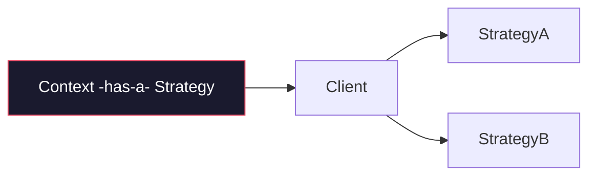

# Design Patterns — Cheat Sheet

## GoF at a Glance (23 Patterns — Know the **bold** 10 cold)

| Category | Pattern | Intent (One-Liner) | Java Example |
|---|---|---|---|
| **Creational** | **Singleton** | One instance | `Runtime.getRuntime()`, Spring singleton bean |
| | **Factory Method** | Subclass decides what to create | `Calendar.getInstance()` |
| | **Abstract Factory** | Family of products | `DocumentBuilderFactory` |
| | **Builder** | Telescoping constructor killer | `StringBuilder`, `Stream.Builder`, `Lombok @Builder` |
| | **Prototype** | Clone instead of new | `Object.clone()` |
| **Structural** | **Adapter** | Incompatible interfaces | `Arrays.asList()`, `InputStreamReader` |
| | **Decorator** | Add behavior without subclass | `BufferedInputStream`, `Collections.synchronizedList` |
| | **Proxy** | Stand-in (lazy, remote, TX) | Spring AOP proxy, `java.lang.reflect.Proxy` |
| | **Facade** | Simplify subsystem | `JdbcTemplate` |
| | Composite | Tree of objects | `Component` in Swing, `File` |
| | Flyweight | Share intrinsic state | `Integer.valueOf()` cache, `String.intern()` |
| **Behavioral** | **Strategy** | Swap algorithm | `Comparator`, `PaymentStrategy` |
| | **Observer** | Publish-subscribe | `ApplicationListener`, Kafka consumer |
| | **Template Method** | Skeleton + hooks | `AbstractList`, `JdbcTemplate.execute` |
| | **Chain of Responsibility** | Pass along chain | Servlet Filter chain, `HandlerInterceptor` |
| | **Command** | Encapsulate request | `Runnable`, `Queue<Command>` |
| | **State** | Behavior changes with state | `State` enum + transition map |
| | Iterator | Traverse without exposing | `Iterator<T>` |
| | Mediator | Central hub | `DispatcherServlet` |

## Vs Tables (Interview Traps)

| Comparison | A | B | When |
|---|---|---|---|
| **Strategy vs State** | Strategy: client picks algorithm | State: context changes behavior internally | Strategy = composition choice; State = lifecycle |
| **Decorator vs Proxy** | Decorator: adds feature, same interface, many layers | Proxy: controls access (lazy/TX/security), 1:1 | `BufferedInputStream` (dec) vs Spring TX proxy |
| **Factory vs Abstract Factory** | One product | Family of related products | `getLogger()` vs `UIFactory.createButton()+createMenu()` |
| **Adapter vs Facade** | Wraps one interface to match another | Simplifies many interfaces into one | Adapter = convert; Facade = simplify |
| **Builder vs Telescoping ctor** | Fluent, immutable result, validates at `build()` | Many constructors, unreadable | ≥4 params or optional params → Builder |
| **Singleton vs Static** | Singleton: OOP, interface, testable, lazy | Static: global, hard to mock | Prefer Singleton (DI-managed) over static utils |
| **Observer vs Pub-Sub** | Observer: sync, direct refs | Pub-Sub: async via broker, decoupled | In-process → Observer; cross-service → Pub-Sub |

## Code Skeletons — Java 25

```java

// Purpose: Design Patterns: creational/structural/behavioral intents at a glance
// Participants: is, AppConfig, User
// Structure: sealed hierarchy + records — exhaustive, immutable composition
// Behavior: wrapping/composition at runtime; no direct new of concrete in client
// Invariant: favors composition and abstraction over concrete coupling
```



> **Principles behind all patterns:** Program to interface · Favour composition · Single Responsibility · Open/Closed · Dependency Inversion.

*Category: CheatSheet*
