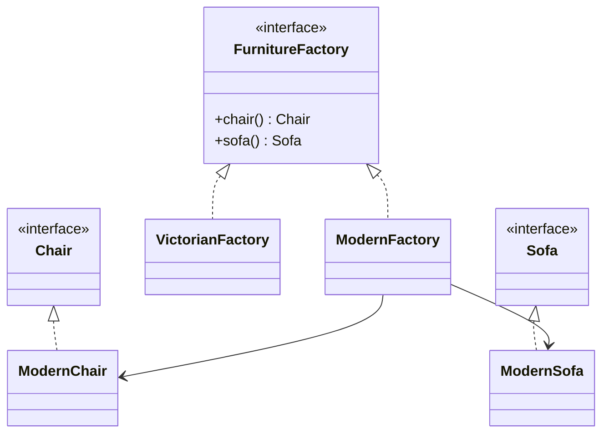

# Abstract Factory

> Category: Creational • Source: [Refactoring.Guru , Abstract Factory](https://refactoring.guru/design-patterns/abstract-factory) • Part of [[Java/README|Java MOC]] → [[06_Design-Patterns/README|Design Patterns MOC]]

## Why it Matters

Produces **families of related objects** without naming **concrete classes**.

## Diagram



## Code

```java
public class AbstractFactoryDemo {
 interface Chair { String name(); }
 interface Sofa { String name(); }
 record ModernChair() implements Chair { public String name() { return "modern chair"; } }
 record ModernSofa() implements Sofa { public String name() { return "modern sofa"; } }
 record VictorianChair() implements Chair { public String name() { return "victorian chair"; } }
 record VictorianSofa() implements Sofa { public String name() { return "victorian sofa"; } }
 // One factory per family keeps each chair+sofa pair stylistically consistent.
 interface FurnitureFactory { Chair chair(); Sofa sofa(); }
 record ModernFactory() implements FurnitureFactory { public Chair chair() { return new ModernChair(); } public Sofa sofa() { return new ModernSofa(); } }
 record VictorianFactory() implements FurnitureFactory { public Chair chair() { return new VictorianChair(); } public Sofa sofa() { return new VictorianSofa(); } }
 static void furnish(FurnitureFactory f) { System.out.println(f.chair().name() + " + " + f.sofa().name()); } // => modern chair + modern sofa, victorian chair + victorian sofa
 public static void main(String[] args) {
 furnish(new ModernFactory());
 furnish(new VictorianFactory());
 }
}
```
The demo proves each factory yields a matching chair-plus-sofa pair with no mixing of styles.

## When to use / not

- Products come in consistent families (modern vs victorian) that must not mix.
- The client must stay ignorant of concrete classes.
- Swapping a whole family at runtime or per environment is required.

## Trade-offs

Use when you work with families and need compatibility within a family. You get consistency and the client never touches concrete names. Adding a new family is easy; adding a new product kind touches every factory.

## Vs

| Pattern | Use when |
|---------|----------|
| Abstract factory | Family of products |
| Factory method | Single product |
| Builder | Step-by-step assembly |

## Pitfalls

- Mixing families (modern chair + victorian sofa) when the factory isn't the single source.
- Interface bloat: every new product kind breaks all families.
- Overkill for one product , that is Factory Method's job.

## Interview q&a

**Q: When do you need abstract factory at all?**

When you must create matching families. If you only make one product, factory method is enough.

**Q: What is easy vs hard to add to an Abstract Factory?**

Adding a new family is easy: write one new factory class and every product kind comes along consistently. Adding a new product kind is hard: it changes the factory interface, so every existing factory must be updated. That asymmetry is the pattern's signature trade-off , pick it when families vary more often than product kinds.

**Q: What is easy vs hard to add with Abstract Factory?**

Adding a new family (e.g. `FuturisticFactory`) is easy , one class implementing the interface. Adding a new product kind (e.g. `Lamp`) is hard , it touches the factory interface and every family. Pick it when families grow, not product kinds.

: When do you need abstract factory at all?:: When you must create matching families. If you only make one product, factory method is enough. **Q: What is easy vs hard to add to an Abstract Factory?** Adding a new family is easy: write one new factory class and every product kind comes along consistently. Adding a new product kind is hard: it changes the factory interface, so every existing factory must be updated. That asymmetry is the pattern's signature trade-off , pick it when familie... #flashcard

## Related

[[06_Design-Patterns/Creational/Factory Method|Factory Method]] (single product) • [[06_Design-Patterns/Creational/Builder|Builder]] (assembly) • [[06_Design-Patterns/Creational/Prototype|Prototype]] (copy vs create)

---
*Category: Creational • Tags: design-patterns • Source: refactoring.guru*

## Problem

Building matching furniture sets (modern vs victorian chair + sofa) should not mix styles.

## Solution

Define a factory interface with a method per product in the family. Each concrete factory creates a consistent set.

## When not to use

| Instead | Use |
|---------|-----|
| One product only | Factory Method |
| Stepwise construction | Builder |
| Ad-hoc creation without families | Simple factory |
