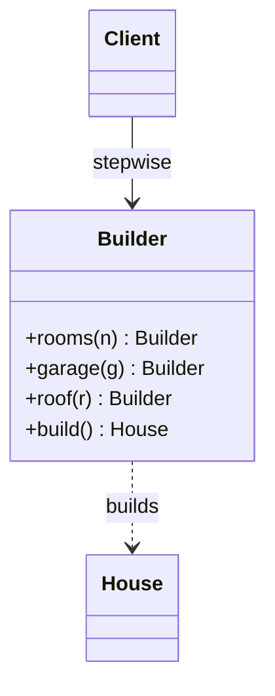

# Builder

> Category: Creational • Source: [Refactoring.Guru , Builder](https://refactoring.guru/design-patterns/builder) • Part of [[Java/README|Java MOC]] → [[06_Design-Patterns/README|Design Patterns MOC]]

## Why it Matters

Constructs **complex objects step by step**, letting the same code produce **different variants**.

## Diagram



## Code

```java
public class BuilderDemo {
 record House(int rooms, boolean garage, String roof) {}
 static final class Builder {
 private int rooms; private boolean garage; private String roof = "tile";
 Builder rooms(int n) { rooms = n; return this; }
 Builder garage(boolean g) { garage = g; return this; }
 Builder roof(String r) { roof = r; return this; }
 // Invariant checked once at build(): fail fast instead of a half-built object.
 House build() {
 if (rooms <= 0) throw new IllegalStateException("rooms > 0 required");
 return new House(rooms, garage, roof);
 }
 }
 public static void main(String[] args) {
 System.out.println(new Builder().rooms(3).garage(true).build()); // => House[rooms=3, garage=true, roof=tile]
 System.out.println(new Builder().rooms(1).roof("thatch").build()); // => House[rooms=1, garage=false, roof=thatch]
 }
}
```
The demo proves the same fluent steps build two different immutable House variants, with validation rejecting bad input.

## When to use / not

- Objects have many optional parameters (telescoping constructors loom).
- Invariants must be validated once, at build time.
- The same construction process must yield different variants.

## Trade-offs

Use when a type has many optional parts or when you need different representations from the same steps. It makes construction readable and keeps the product immutable. For only one or two options the extra builder class is not worth it.

## Vs

| Pattern | Use when |
|---------|----------|
| Builder | Stepwise, many options |
| Factory | One-shot creation |

## Pitfalls

- Forgetting validation in `build()` ships half-formed objects.
- Mutable builder reused across threads , builders are single-use, not shared.
- Builder for two-field objects adds ceremony with zero payoff.

## Interview q&a

**Q: When can you skip the builder?**

When you have one or two optional fields. A record constructor or copy method is clearer than a full builder.

**Q: What problem does Builder solve, and where does validation go?**

It kills the telescoping-constructor problem: with many optional parts, chained fluent calls are self-documenting where positional overloads are not. Validation belongs in build(), so the invariant is checked once and no half-built product escapes. For one or two options the builder class is overkill , a record constructor is clearer.

**Q: Builder vs telescoping constructor vs static factory?**

Telescoping constructors explode combinatorially and mislead at call sites; static factories name one configuration well but not many. Builder wins at three-plus options or when validation must run once over the whole combination before the object exists.

: When can you skip the builder?:: When you have one or two optional fields. A record constructor or copy method is clearer than a full builder. **Q: What problem does Builder solve, and where does validation go?** It kills the telescoping-constructor problem: with many optional parts, chained fluent calls are self-documenting where positional overloads are not. Validation belongs in build(), so the invariant is checked once and no half-built product escapes. For one or two opt... #flashcard

## Related

[[06_Design-Patterns/Creational/Abstract Factory|Abstract Factory]] • [[06_Design-Patterns/Creational/Prototype|Prototype]] (copy existing) • [[06_Design-Patterns/Creational/Factory Method|Factory Method]]

---
*Category: Creational • Tags: design-patterns • Source: refactoring.guru*

## Problem

A House with many optional parts leads to telescoping constructors that are hard to read and error prone.

## Solution

Move construction into a mutable builder with fluent methods. A director can encode preset recipes, but the client can also chain directly.

## When not to use

| Instead | Use |
|---------|-----|
| One or two required args | Constructor or static factory |
| No validation / no optionality | Direct construction |
| Creating families by type | Factory |
