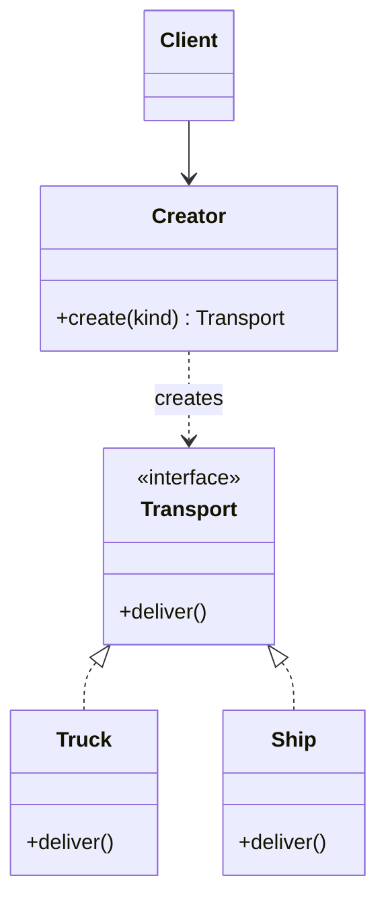

# Factory Method

> Category: Creational • Source: [Refactoring.Guru , Factory Method](https://refactoring.guru/design-patterns/factory-method) • Part of [[Java/README|Java MOC]] → [[06_Design-Patterns/README|Design Patterns MOC]]

## Why it Matters

Defines a **method for creating objects** and lets **subclasses decide** what to create.

## Diagram



## Code

```java
public class FactoryMethodDemo {
 sealed interface Transport permits Truck, Ship { void deliver(); }
 record Truck() implements Transport { public void deliver() { System.out.println("by road"); } } // => by road
 record Ship() implements Transport { public void deliver() { System.out.println("by sea"); } } // => by sea
 // Creator defers the concrete choice; the client only ever sees Transport.
 static Transport create(String kind) {
 return switch (kind) {
 case "ship" -> new Ship();
 default -> new Truck();
 };
 }
 public static void main(String[] args) {
 for (var kind : new String[]{"truck", "ship"}) create(kind).deliver();
 }
}
```
The demo proves the client delivers by road and by sea without ever naming Truck or Ship.

## When to use / not

- The client must work against an interface while subclasses pick the concrete type.
- New product types appear often and should not force edits in client code.
- Creation logic itself deserves a seam for testing.

## Trade-offs

Use when you do not know the exact product type up front or want to keep creation open for extension. It isolates creation from use and removes conditionals from the client, but adds another type per product.

## Vs

| Pattern | Use when |
|---------|----------|
| Factory method | Subclass decides which product to make |
| Abstract factory | Family of related products |

## Pitfalls

- A `switch` on strings with no registration path rots into the coupling it replaced.
- Returning null for unknown kinds , throw or return Optional instead.
- Creators that also embed business logic become untestable god factories.

## Interview q&a

**Q: How is this different from a simple factory function?**

Factory method lets a subclass or registered switch decide the concrete type without the client changing. Simple factory is a single function with a conditional.

**Q: How does Factory Method differ from Abstract Factory?**

Factory Method creates one product through an overridable method, letting subclasses or a switch pick the concrete type. Abstract Factory creates a whole family of related products behind one interface, guaranteeing the members match. Use factory method for a single varying product, abstract factory when the products must stay consistent with each other.

**Q: Where does Factory Method show up in real frameworks?**

Everywhere creation is deferred: `LoggerFactory.getLogger`, Spring `FactoryBean`, JDBC drivers via `DriverManager`, and collection factories like `List.of`. The caller codes to the interface; registration or subclassing decides the concrete type.

: How is this different from a simple factory function?:: Factory method lets a subclass or registered switch decide the concrete type without the client changing. Simple factory is a single function with a conditional. **Q: How does Factory Method differ from Abstract Factory?** Factory Method creates one product through an overridable method, letting subclasses or a switch pick the concrete type. Abstract Factory creates a whole family of related products behind one interface, guaranteeing the memb... #flashcard

## Related

[[06_Design-Patterns/Creational/Abstract Factory|Abstract Factory]] (families vs single product) • [[06_Design-Patterns/Behavioral/Template Method|Template Method]] (deferred step) • [[06_Design-Patterns/Creational/Singleton|Singleton]]

---
*Category: Creational • Tags: design-patterns • Source: refactoring.guru*

## Problem

You need to create transports without hard-coding Truck vs Ship in client code.

## Solution

Declare a creator with a factory method. Subclasses or a switch override it to return the right product. Sealed product plus switch keeps it exhaustive.

## When not to use

| Instead | Use |
|---------|-----|
| Fixed one-shot creation | Static factory or constructor |
| Families of related products | Abstract Factory |
| Stepwise assembly | Builder |
