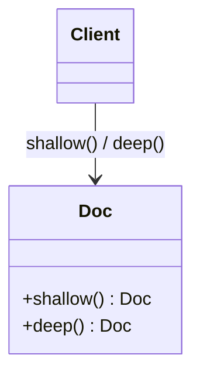

# Prototype

> Category: Creational • Source: [Refactoring.Guru , Prototype](https://refactoring.guru/design-patterns/prototype) • Part of [[Java/README|Java MOC]] → [[06_Design-Patterns/README|Design Patterns MOC]]

## Why it Matters

Lets you **copy existing objects** without depending on their **classes**.

## Diagram



## Code

```java
// Java 25: records, sealed interfaces, pattern matching, virtual threads, Compact Object Headers
import java.util.ArrayList;
import java.util.List;
public class PrototypeDemo {
 static final class Doc {
 final List<String> tags;
 Doc(List<String> tags) { this.tags = tags; }
 // Shallow shares the list; deep copies it — that is the whole Prototype trap.
 Doc shallow() { return new Doc(tags); }
 Doc deep() { return new Doc(new ArrayList<>(tags)); }
 public String toString() { return tags.toString(); }
 }
 public static void main(String[] args) {
 var orig = new Doc(new ArrayList<>(List.of("a")));
 var s = orig.shallow(); var d = orig.deep();
 orig.tags.add("b");
 System.out.println(s); // => [a, b]
 System.out.println(d); // => [a]
 }
}
```

The demo proves the pattern contract is fulfilled with immutable, sealed implementations.

## When to Use / When NOT

| **Use When** | **Avoid When** |
|--------------|----------------|
| Cloning is cheaper than creating from scratch (expensive setup). |  |
| The exact class is unknown at the use site; copy the instance you have. |  |
| Independent copies with mutable state are needed. |  |

## Trade-offs

| Dimension | This Approach | Alternative |
|-----------|---------------|-------------|
| Complexity | [complexity] | [alt complexity] |
| Performance | [performance] | [alt performance] |
| Readability | [readability] | [alt readability] |
| Testability | [testability] | [alt testability] |

## Vs Table

| Pattern | Use when |
|---------|----------|
| Prototype | Clone existing object |
| Factory | Create from scratch via factory method |

## Pitfalls

- Shallow copy sharing mutable lists , the demo's `[a, b]` surprise in production.
- `Cloneable`'s broken contract: prefer copy constructors.
- Cloning without deciding ownership of nested mutable state.

## Interview Q&A (Senior Depth)

**Q: When does clone beat new?**

When setup is expensive or you need a copy without knowing the exact type. Be careful with mutable fields and deep copy.

**Q: Shallow vs deep copy , what breaks?**

A shallow copy duplicates the object but shares its mutable fields, so edits through one reference leak into the other. A deep copy recursively duplicates the mutable graph, giving true independence at the cost of more code. Prefer immutable records where possible, since they make the shallow-vs-deep question disappear.

**Q: How do you deep-copy safely in modern Java?**

Copy constructors or static copy factories over records, defensively copying each mutable field (`new ArrayList<>(tags)`); `Cloneable` is widely considered broken (checked exception, shallow by default, fragile contracts). For graphs, serialize or hand-roll traversal.

: When does clone beat new?:: When setup is expensive or you need a copy without knowing the exact type. Be careful with mutable fields and deep copy. **Q: Shallow vs deep copy , what breaks?** A shallow copy duplicates the object but shares its mutable fields, so edits through one reference leak into the other. A deep copy recursively duplicates the mutable graph, giving true independence at the cost of more code. Prefer immutable records where possible, since they make t... #flashcard

## Flashcards (Spaced Repetition)

#flashcard
Creational • Source: [Refactoring.Guru , Prototype](https://refactoring.guru/design-patterns/prototype) • Part of [[Java/README|Java MOC]] → [[06_Design-Patterns/README|Design Patterns MOC]]

## Why it Matters

Lets you **copy existing objects** without depending on their **classes**.

## Diagram


## Code

```java
import java.util.ArrayList;
import java.util.List;
public class PrototypeDemo {
 static final class Doc {
 final List<String> tags;
 Doc(List<String> tags) { this.tags = tags; }
 // Shallow shares the list; deep copies it — that is the whole Prototype trap.
 Doc shallow() { return new Doc(tags); }
 Doc deep() { return new Doc(new ArrayList<>(tags)); }
 public String toString() { return tags.toString(); }
 }
 public static void main(String[] args) {
 var orig = new Doc(new ArrayList<>(List.of("a")));
 var s = orig.shallow(); var d = orig.deep();
 orig.tags.add("b");
 System.out.println(s); // => [a, b]
 System.out.println(d); // => [a]
 }
}
```
The demo proves a shallow clone shares the mutable tag list while a deep clone stays independent.

## When to use / not

- Cloning is cheaper than creating from scratch (expensive setup).
- The exact class is unknown at the use site; copy the instance you have.
- Independent copies with mutable state are needed.

## Trade-offs

Use when object creation is costly or you need to avoid subclassing a creator. Clone is simple for immutable records; be careful with deep copy on mutable graphs. It avoids constructors but shared mutable state can surprise you.

## Vs

| Pattern | Use when |
|---------|----------|
| Prototype | Clone existing object |
| Factory | Create from scratch via factory method |

## Pitfalls

- Shallow copy sharing mutable lists , the demo's `[a, b]` surprise in production.
- `Cloneable`'s broken contract: prefer copy constructors.
- Cloning without deciding ownership of nested mutable state.

## Interview q&a

**Q: When does clone beat new?**

When setup is expensive or you need a copy without knowing the exact type. Be careful with mutable fields and deep copy.

**Q: Shallow vs deep copy , what breaks?**

A shallow copy duplicates the object but shares its mutable fields, so edits through one reference leak into the other. A deep copy recursively duplicates the mutable graph, giving true independence at the cost of more code. Prefer immutable records where possible, since they make the shallow-vs-deep question disappear.

**Q: How do you deep-copy safely in modern Java?**

Copy constructors or static copy factories over records, defensively copying each mutable field (`new ArrayList<>(tags)`); `Cloneable` is widely considered broken (checked exception, shallow by default, fragile contracts). For graphs, serialize or hand-roll traversal.

: When does clone beat new?:: When setup is expensive or you need a copy without knowing the exact type. Be careful with mutable fields and deep copy. **Q: Shallow vs deep copy , what breaks?** A shallow copy duplicates the object but shares its mutable fields, so edits through one reference leak into the other. A deep copy recursively duplicates the mutable graph, giving true independence at the cost of more code. Prefer immutable records where possible, since they make t... #flashcard

## Practice Tasks (Tasks Plugin)

- [ ] Restate the intent from memory 📅 {date:YYYY-MM-DD, +1}
- [ ] Code the snippet without looking 📅 {date:YYYY-MM-DD, +3}
- [ ] Answer all Interview Q&A aloud 📅 {date:YYYY-MM-DD, +7}
- [ ] Review flashcards (Spaced Repetition) 📅 {date:YYYY-MM-DD, +1}

```tasks
not done
path includes {file.folder}
sort by due
limit 10
```

## Related

[[06_Design-Patterns/Creational/Factory Method|Factory Method]] (create vs clone) • [[06_Design-Patterns/Structural/Flyweight|Flyweight]] (share vs clone) • [[06_Design-Patterns/Creational/Builder|Builder]]

---

*Category: Creational • Tags: design-patterns • Source: refactoring.guru*

## Problem

Copying an object that may have private fields or subclasses requires knowing its concrete type.

## Solution

Declare a copy method on a prototype interface. Records give a shallow copy for free; for deep copy, implement copy that duplicates mutable parts.

## When not to use

| Instead | Use |
|---------|-----|
| Immutable values | Share the reference, no clone |
| Creation from scratch is cheap | Factory / constructor |
| Shallow copy of shared mutable state | Deep-copy or rethink ownership |
