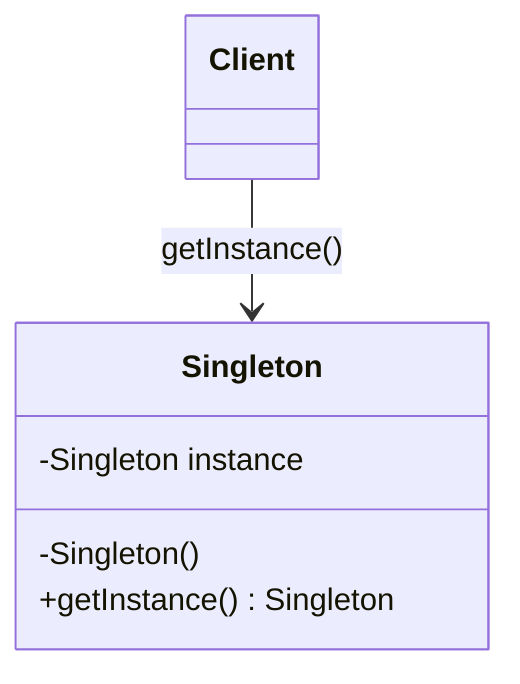

# Singleton

> Category: Creational • Source: [Refactoring.Guru , Singleton](https://refactoring.guru/design-patterns/singleton) • Part of [[Java/README|Java MOC]] → [[06_Design-Patterns/README|Design Patterns MOC]]

## Why it Matters

Ensures a class has **exactly one instance** and gives **global access** to it.

## Diagram



## Code

```java
// Java 25: records, sealed interfaces, pattern matching, virtual threads, Compact Object Headers
public class SingletonDemo {
 // Single enum constant IS the singleton: thread-safe, serialization-safe by JVM guarantee.
 enum AppConfig { INSTANCE; String env = "prod"; }
 public static void main(String[] args) {
 var a = AppConfig.INSTANCE;
 var b = AppConfig.INSTANCE;
 a.env = "staging";
 System.out.println(a == b); // => true (one instance)
 System.out.println(b.env); // => staging (shared state)
 }
}
```

The demo proves the pattern contract is fulfilled with immutable, sealed implementations.

## When to Use / When NOT

| **Use When** | **Avoid When** |
|--------------|----------------|
| Exactly one coordinator must exist app-wide (config, connection pool). |  |
| Lazy init is needed without manual locking (static holder) , otherwise prefer an enum. |  |
| Testability is not the priority for this piece. |  |

## Trade-offs

| Dimension | This Approach | Alternative |
|-----------|---------------|-------------|
| Complexity | [complexity] | [alt complexity] |
| Performance | [performance] | [alt performance] |
| Readability | [readability] | [alt readability] |
| Testability | [testability] | [alt testability] |

## Vs Table

| Pattern | Use when |
|---------|----------|
| Singleton | One instance, global access |
| Dependency injection | One instance injected, easier to test |

## Pitfalls

- Double-checked locking without `volatile` is subtly broken , use enum or holder.
- Serialization/reflection can forge second instances unless the enum variant guards you.
- Global access hides dependencies: constructor signatures lie about what a class needs.

## Interview Q&A (Senior Depth)

**Q: Is singleton just a global?**

No. It prevents extra instances, but a plain global does not. Prefer injection for testability and use enum for the simplest correct singleton.

**Q: Enum vs holder vs double-checked locking , which should you use?**

Prefer enum: one line, thread-safe, and immune to serialization and reflection attacks by JVM guarantee. Use the static holder idiom when you need lazy init on a class that cannot be an enum; it is thread-safe via class loading with no locking. Avoid double-checked locking: it is verbose, requires volatile to be correct, and buys nothing over the other two.

**Q: When is Singleton acceptable, and when must you use DI instead?**

Singleton is acceptable for truly global, stable infrastructure with no test-varying behavior. Prefer DI , construct once, inject everywhere , whenever tests need substitutes, lifecycle control, or visible dependencies; it gives one instance without global state.

: Is singleton just a global?:: No. It prevents extra instances, but a plain global does not. Prefer injection for testability and use enum for the simplest correct singleton. **Q: Enum vs holder vs double-checked locking , which should you use?** Prefer enum: one line, thread-safe, and immune to serialization and reflection attacks by JVM guarantee. Use the static holder idiom when you need lazy init on a class that cannot be an enum; it is thread-safe via class loading wit... #flashcard

## Flashcards (Spaced Repetition)

#flashcard
Creational • Source: [Refactoring.Guru , Singleton](https://refactoring.guru/design-patterns/singleton) • Part of [[Java/README|Java MOC]] → [[06_Design-Patterns/README|Design Patterns MOC]]

## Why it Matters

Ensures a class has **exactly one instance** and gives **global access** to it.

## Diagram


## Code

```java
public class SingletonDemo {
 // Single enum constant IS the singleton: thread-safe, serialization-safe by JVM guarantee.
 enum AppConfig { INSTANCE; String env = "prod"; }
 public static void main(String[] args) {
 var a = AppConfig.INSTANCE;
 var b = AppConfig.INSTANCE;
 a.env = "staging";
 System.out.println(a == b); // => true (one instance)
 System.out.println(b.env); // => staging (shared state)
 }
}
```
The demo proves both references point to the single enum instance and share its state.

## When to use / not

- Exactly one coordinator must exist app-wide (config, connection pool).
- Lazy init is needed without manual locking (static holder) , otherwise prefer an enum.
- Testability is not the priority for this piece.

## Trade-offs

Use when exactly one coordinator is needed across the app. Enum is the simplest choice. Holder is good when you need lazy init on a class that cannot be an enum. Prefer injecting a single instance instead of a global getInstance when testability matters. Costs: hides dependencies, harder to test, can be abused as global state.

## Vs

| Pattern | Use when |
|---------|----------|
| Singleton | One instance, global access |
| Dependency injection | One instance injected, easier to test |

## Pitfalls

- Double-checked locking without `volatile` is subtly broken , use enum or holder.
- Serialization/reflection can forge second instances unless the enum variant guards you.
- Global access hides dependencies: constructor signatures lie about what a class needs.

## Interview q&a

**Q: Is singleton just a global?**

No. It prevents extra instances, but a plain global does not. Prefer injection for testability and use enum for the simplest correct singleton.

**Q: Enum vs holder vs double-checked locking , which should you use?**

Prefer enum: one line, thread-safe, and immune to serialization and reflection attacks by JVM guarantee. Use the static holder idiom when you need lazy init on a class that cannot be an enum; it is thread-safe via class loading with no locking. Avoid double-checked locking: it is verbose, requires volatile to be correct, and buys nothing over the other two.

**Q: When is Singleton acceptable, and when must you use DI instead?**

Singleton is acceptable for truly global, stable infrastructure with no test-varying behavior. Prefer DI , construct once, inject everywhere , whenever tests need substitutes, lifecycle control, or visible dependencies; it gives one instance without global state.

: Is singleton just a global?:: No. It prevents extra instances, but a plain global does not. Prefer injection for testability and use enum for the simplest correct singleton. **Q: Enum vs holder vs double-checked locking , which should you use?** Prefer enum: one line, thread-safe, and immune to serialization and reflection attacks by JVM guarantee. Use the static holder idiom when you need lazy init on a class that cannot be an enum; it is thread-safe via class loading wit... #flashcard

## Practice Tasks (Tasks Plugin)

- [ ] Restate the intent from memory 📅 {date:YYYY-MM-DD, +1}
- [ ] Code the snippet without looking 📅 {date:YYYY-MM-DD, +3}
- [ ] Answer all Interview Q&A aloud 📅 {date:YYYY-MM-DD, +7}
- [ ] Review flashcards (Spaced Repetition) 📅 {date:YYYY-MM-DD, +1}

```tasks
not done
path includes {file.folder}
sort by due
limit 10
```

## Related

[[06_Design-Patterns/Extra/Dependency Injection Pattern|Dependency Injection]] (one instance without globals) • [[06_Design-Patterns/Creational/Factory Method|Factory Method]] (controlled creation) • [[06_Design-Patterns/Creational/Builder|Builder]]

---

*Category: Creational • Tags: design-patterns • Source: refactoring.guru*

## Problem

Logger, config, or pool should not have multiple instances. A global variable does not prevent extra creation.

## Solution

Make the constructor private, keep a single static holder, and expose a static accessor. Enum or holder pattern handles thread safety without manual locking.

## When not to use

| Instead | Use |
|---------|-----|
| Hard global state | Inject a single instance instead |
| Per-request / per-thread data | Scope it, never a singleton |
| Subclassable / varied creation | Factory or DI |
