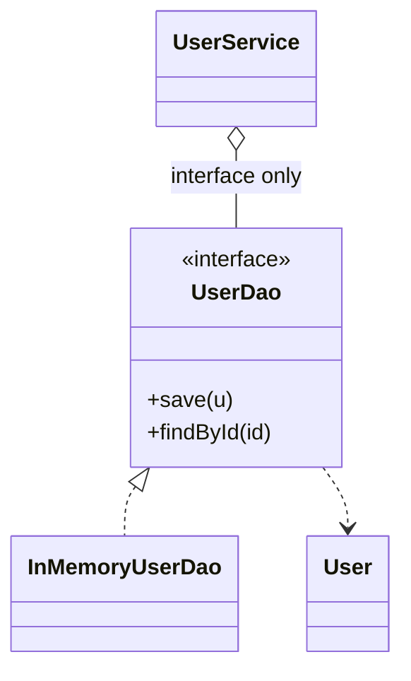

# DAO Pattern

> Category: Extra • Source: [Refactoring.Guru , DAO Pattern](https://refactoring.guru/design-patterns/1) • Part of [[Java/README|Java MOC]] → Design Patterns MOC

## Why it Matters

Isolates **business code** from **persistence details** behind an interface.

## Diagram



## Code

```java
// Java 25: records, sealed interfaces, pattern matching, virtual threads, Compact Object Headers
import java.util.*;

// Demo: save with `java DaoDemo.java` (Java 21+) and run it —
// service talks only to UserDao; swap the impl without touching business code.
record User(long id, String name) {}

interface UserDao {
 void save(User u);
 Optional<User> findById(long id);
 void delete(long id);
}

final class InMemoryUserDao implements UserDao {
 private final Map<Long, User> store = new HashMap<>();
 public void save(User u) { store.put(u.id(), u); }
 public Optional<User> findById(long id) { return Optional.ofNullable(store.get(id)); }
 public void delete(long id) { store.remove(id); }
}

final class UserService {
 private final UserDao dao; // depends on the interface, never the impl
 UserService(UserDao dao) { this.dao = dao; }
 String greet(long id) {
 return dao.findById(id).map(u -> "Hello, " + u.name()).orElse("(unknown user)");
 }
}

class DaoDemo {
 public static void main(String[] args) {
 var dao = new InMemoryUserDao(); // JdbcUserDao in prod, this one in tests
 var service = new UserService(dao);
 dao.save(new User(1, "Ada"));
 System.out.println(service.greet(1)); // => Hello, Ada
 dao.delete(1);
 System.out.println(service.greet(1)); // => (unknown user)
 }
}
```

The demo proves the pattern contract is fulfilled with immutable, sealed implementations.

## When to Use / When NOT

| **Use When** | **Avoid When** |
|--------------|----------------|
| Business code must not know JDBC, SQL, or ORM details. |  |
| Persistence backends swap per environment (in-memory tests, JDBC prod). |  |
| CRUD per entity deserves one seam for mocking. |  |

## Trade-offs

| Dimension | This Approach | Alternative |
|-----------|---------------|-------------|
| Complexity | [complexity] | [alt complexity] |
| Performance | [performance] | [alt performance] |
| Readability | [readability] | [alt readability] |
| Testability | [testability] | [alt testability] |

## Vs Table

| Pattern | Use when |
|---------|----------|
| DAO | CRUD for one entity |
| Repository | Collection-like, broader queries |
| Active record | Entity persists itself |

## Pitfalls

- Leaking SQL/JDBC types through the DAO interface defeats the seam.
- One giant DAO per database instead of per entity/aggregate.
- Business logic (greetings, rules) creeping into the DAO impl.

## Interview Q&A (Senior Depth)

**Q: DAO vs repository?**

DAO is plain crud for one entity. Repository feels like a collection with broader queries and specs.

**Q: DAO vs Repository , when do you pick which?**

DAO for plain CRUD on one entity; Repository when you want collection-like queries and specifications across aggregates.

**Q: How do you test services that depend on a DAO?**

Unit tests inject the in-memory implementation , no database, no containers, millisecond runs. Integration tests swap the JDBC implementation against a real database to verify SQL. The service never knows which it got; that ignorance is the whole point.

: DAO vs repository?:: DAO is plain crud for one entity. Repository feels like a collection with broader queries and specs. **Q: DAO vs Repository , when do you pick which?** DAO for plain CRUD on one entity; Repository when you want collection-like queries and specifications across aggregates. **Q: How do you test services that depend on a DAO?** Unit tests inject the in-memory implementation , no database, no containers, millisecond runs. Integration tests swap th... #flashcard

## Flashcards (Spaced Repetition)

#flashcard
Extra • Source: [Refactoring.Guru , DAO Pattern](https://refactoring.guru/design-patterns/dao-pattern) • Part of [[Java/README|Java MOC]] → Design Patterns MOC

## Why it Matters

Isolates **business code** from **persistence details** behind an interface.

## Diagram


## Code

```java
import java.util.*;

// Demo: save with `java DaoDemo.java` (Java 21+) and run it —
// service talks only to UserDao; swap the impl without touching business code.
record User(long id, String name) {}

interface UserDao {
 void save(User u);
 Optional<User> findById(long id);
 void delete(long id);
}

final class InMemoryUserDao implements UserDao {
 private final Map<Long, User> store = new HashMap<>();
 public void save(User u) { store.put(u.id(), u); }
 public Optional<User> findById(long id) { return Optional.ofNullable(store.get(id)); }
 public void delete(long id) { store.remove(id); }
}

final class UserService {
 private final UserDao dao; // depends on the interface, never the impl
 UserService(UserDao dao) { this.dao = dao; }
 String greet(long id) {
 return dao.findById(id).map(u -> "Hello, " + u.name()).orElse("(unknown user)");
 }
}

class DaoDemo {
 public static void main(String[] args) {
 var dao = new InMemoryUserDao(); // JdbcUserDao in prod, this one in tests
 var service = new UserService(dao);
 dao.save(new User(1, "Ada"));
 System.out.println(service.greet(1)); // => Hello, Ada
 dao.delete(1);
 System.out.println(service.greet(1)); // => (unknown user)
 }
}
```
The service only ever sees `UserDao`, so tests swap in `InMemoryUserDao` while production plugs in a JDBC implementation.

## When to use / not

- Business code must not know JDBC, SQL, or ORM details.
- Persistence backends swap per environment (in-memory tests, JDBC prod).
- CRUD per entity deserves one seam for mocking.

## Trade-offs

Use to keep persistence swappable and testable. Records make entities concise. In Spring Data, JpaRepository already plays this role, so a hand-rolled DAO is mainly for plain jdbc or test isolation.

## Vs

| Pattern | Use when |
|---------|----------|
| DAO | CRUD for one entity |
| Repository | Collection-like, broader queries |
| Active record | Entity persists itself |

## Pitfalls

- Leaking SQL/JDBC types through the DAO interface defeats the seam.
- One giant DAO per database instead of per entity/aggregate.
- Business logic (greetings, rules) creeping into the DAO impl.

## Interview q&a

**Q: DAO vs repository?**

DAO is plain crud for one entity. Repository feels like a collection with broader queries and specs.

**Q: DAO vs Repository , when do you pick which?**

DAO for plain CRUD on one entity; Repository when you want collection-like queries and specifications across aggregates.

**Q: How do you test services that depend on a DAO?**

Unit tests inject the in-memory implementation , no database, no containers, millisecond runs. Integration tests swap the JDBC implementation against a real database to verify SQL. The service never knows which it got; that ignorance is the whole point.

: DAO vs repository?:: DAO is plain crud for one entity. Repository feels like a collection with broader queries and specs. **Q: DAO vs Repository , when do you pick which?** DAO for plain CRUD on one entity; Repository when you want collection-like queries and specifications across aggregates. **Q: How do you test services that depend on a DAO?** Unit tests inject the in-memory implementation , no database, no containers, millisecond runs. Integration tests swap th... #flashcard

## Practice Tasks (Tasks Plugin)

- [ ] Restate the intent from memory 📅 {date:YYYY-MM-DD, +1}
- [ ] Code the snippet without looking 📅 {date:YYYY-MM-DD, +3}
- [ ] Answer all Interview Q&A aloud 📅 {date:YYYY-MM-DD, +7}
- [ ] Review flashcards (Spaced Repetition) 📅 {date:YYYY-MM-DD, +1}

```tasks
not done
path includes {file.folder}
sort by due
limit 10
```

## Related

Dependency Injection (inject the DAO) • Facade (simplified front) • Proxy (lazy/remote stand-in)

---

*Category: Extra • Tags: design-patterns • Source: refactoring.guru*

## Problem

Business logic mixed with jdbc calls is hard to test and hard to move from jdbc to jpa.

## Solution

Define a DAO interface with find, save, and delete. Concrete DAOs hide jdbc or in-memory detail. Services depend only on the interface.

## When not to use

| Instead | Use |
|---------|-----|
| Collection-like querying across aggregates | Repository |
| Entity persisting itself | Active Record |
| Raw SQL sprayed in services | Never , that's the problem DAO solves |
