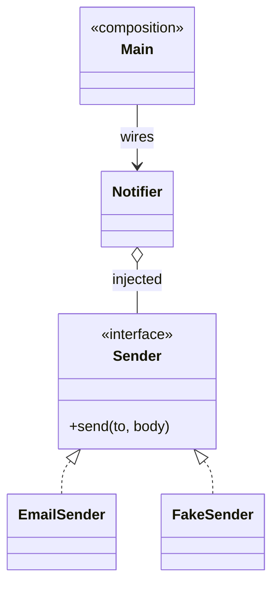

# Dependency Injection Pattern

> Category: Extra • Source: [Refactoring.Guru , Dependency Injection Pattern](https://refactoring.guru/design-patterns/2) • Part of [[Java/README|Java MOC]] → [[06_Design-Patterns/README|Design Patterns MOC]]

## Why it Matters

Gives a class **what it needs** instead of letting it **create dependencies itself**.

## Diagram



## Code

```java
// Java 25: records, sealed interfaces, pattern matching, virtual threads, Compact Object Headers
import java.util.*;

// Demo: save as DiDemo.java (Java 21+) and run — no framework, wiring lives in main.
// Tests inject FakeSender and assert; production injects EmailSender.
interface Sender { void send(String to, String body); }

final class EmailSender implements Sender {
 public void send(String to, String body) { System.out.println("email -> " + to + ": " + body); } // => email -> ada@ex.com: Welcome!
}

final class FakeSender implements Sender {
 final List<String> outbox = new ArrayList<>();
 public void send(String to, String body) { outbox.add(to + ": " + body); }
}

final class Notifier {
 private final Sender sender; // injected via constructor, never `new`'d inside
 Notifier(Sender sender) { this.sender = Objects.requireNonNull(sender); }
 void welcome(String to) { sender.send(to, "Welcome!"); }
}

class DiDemo {
 public static void main(String[] args) {
 new Notifier(new EmailSender()).welcome("ada@ex.com"); // composition root
 var fake = new FakeSender(); // test double: no network, fully assertable
 new Notifier(fake).welcome("t@t.t");
 System.out.println("sent in test: " + fake.outbox); // => sent in test: [t@t.t: Welcome!]
 }
}
```

The demo proves the pattern contract is fulfilled with immutable, sealed implementations.

## When to Use / When NOT

| **Use When** | **Avoid When** |
|--------------|----------------|
| Classes need collaborators but must not construct them. |  |
| Tests must substitute fakes without frameworks or reflection. |  |
| Wiring should live in one composition root. |  |

## Trade-offs

| Dimension | This Approach | Alternative |
|-----------|---------------|-------------|
| Complexity | [complexity] | [alt complexity] |
| Performance | [performance] | [alt performance] |
| Readability | [readability] | [alt readability] |
| Testability | [testability] | [alt testability] |

## Vs Table

| Pattern | Use when |
|---------|----------|
| Dependency injection | Give, do not create |
| Service locator | Ask a registry for it |
| Factory | Create without injecting |

## Pitfalls

- Field injection hiding required dependencies , prefer constructors.
- Circular dependencies papered over with setters instead of redesigned.
- Service-locator calls inside business code reintroducing hidden coupling.

## Interview Q&A (Senior Depth)

**Q: Why not just use a factory inside the class?**

Creating inside hides the dependency and blocks testing. Injection makes wiring visible at construction time.

**Q: Constructor vs field injection? What about circular dependencies?**

Prefer constructor injection , dependencies are explicit, `final`, and trivially faked in tests. Field injection hides requirements and needs reflection to test. Circular deps usually mean a missing abstraction; extract a third collaborator or an event instead of setter-injecting a cycle.

**Q: What is a composition root?**

The single place , `main`, a config class, the framework container , where the object graph is wired. Everything below it only receives dependencies. If `new` appears outside the root (or factories/tests), construction logic is leaking back into business code.

: Why not just use a factory inside the class?:: Creating inside hides the dependency and blocks testing. Injection makes wiring visible at construction time. **Q: Constructor vs field injection? What about circular dependencies?** Prefer constructor injection , dependencies are explicit, `final`, and trivially faked in tests. Field injection hides requirements and needs reflection to test. Circular deps usually mean a missing abstraction; extract a third collaborator or an event instead of... #flashcard

## Flashcards (Spaced Repetition)

#flashcard
Extra • Source: [Refactoring.Guru , Dependency Injection Pattern](https://refactoring.guru/design-patterns/dependency-injection-pattern) • Part of [[Java/README|Java MOC]] → [[06_Design-Patterns/README|Design Patterns MOC]]

## Why it Matters

Gives a class **what it needs** instead of letting it **create dependencies itself**.

## Diagram


## Code

```java
import java.util.*;

// Demo: save as DiDemo.java (Java 21+) and run — no framework, wiring lives in main.
// Tests inject FakeSender and assert; production injects EmailSender.
interface Sender { void send(String to, String body); }

final class EmailSender implements Sender {
 public void send(String to, String body) { System.out.println("email -> " + to + ": " + body); } // => email -> ada@ex.com: Welcome!
}

final class FakeSender implements Sender {
 final List<String> outbox = new ArrayList<>();
 public void send(String to, String body) { outbox.add(to + ": " + body); }
}

final class Notifier {
 private final Sender sender; // injected via constructor, never `new`'d inside
 Notifier(Sender sender) { this.sender = Objects.requireNonNull(sender); }
 void welcome(String to) { sender.send(to, "Welcome!"); }
}

class DiDemo {
 public static void main(String[] args) {
 new Notifier(new EmailSender()).welcome("ada@ex.com"); // composition root
 var fake = new FakeSender(); // test double: no network, fully assertable
 new Notifier(fake).welcome("t@t.t");
 System.out.println("sent in test: " + fake.outbox); // => sent in test: [t@t.t: Welcome!]
 }
}
```
All wiring happens once in `main`, so the class under test takes a fake and never touches the network.

## When to use / not

- Classes need collaborators but must not construct them.
- Tests must substitute fakes without frameworks or reflection.
- Wiring should live in one composition root.

## Trade-offs

Use to make code testable and wiring explicit. It removes hard creation from business code. Over-injecting many tiny dependencies is a sign the class does too much.

## Vs

| Pattern | Use when |
|---------|----------|
| Dependency injection | Give, do not create |
| Service locator | Ask a registry for it |
| Factory | Create without injecting |

## Pitfalls

- Field injection hiding required dependencies , prefer constructors.
- Circular dependencies papered over with setters instead of redesigned.
- Service-locator calls inside business code reintroducing hidden coupling.

## Interview q&a

**Q: Why not just use a factory inside the class?**

Creating inside hides the dependency and blocks testing. Injection makes wiring visible at construction time.

**Q: Constructor vs field injection? What about circular dependencies?**

Prefer constructor injection , dependencies are explicit, `final`, and trivially faked in tests. Field injection hides requirements and needs reflection to test. Circular deps usually mean a missing abstraction; extract a third collaborator or an event instead of setter-injecting a cycle.

**Q: What is a composition root?**

The single place , `main`, a config class, the framework container , where the object graph is wired. Everything below it only receives dependencies. If `new` appears outside the root (or factories/tests), construction logic is leaking back into business code.

: Why not just use a factory inside the class?:: Creating inside hides the dependency and blocks testing. Injection makes wiring visible at construction time. **Q: Constructor vs field injection? What about circular dependencies?** Prefer constructor injection , dependencies are explicit, `final`, and trivially faked in tests. Field injection hides requirements and needs reflection to test. Circular deps usually mean a missing abstraction; extract a third collaborator or an event instead of... #flashcard

## Practice Tasks (Tasks Plugin)

- [ ] Restate the intent from memory 📅 {date:YYYY-MM-DD, +1}
- [ ] Code the snippet without looking 📅 {date:YYYY-MM-DD, +3}
- [ ] Answer all Interview Q&A aloud 📅 {date:YYYY-MM-DD, +7}
- [ ] Review flashcards (Spaced Repetition) 📅 {date:YYYY-MM-DD, +1}

```tasks
not done
path includes {file.folder}
sort by due
limit 10
```

## Related

[[06_Design-Patterns/Extra/DAO Pattern|DAO]] (injected seam) • [[06_Design-Patterns/Creational/Factory Method|Factory Method]] (creation) • [[06_Design-Patterns/Creational/Singleton|Singleton]] (single instance without globals)

---

*Category: Extra • Tags: design-patterns • Source: refactoring.guru*

## Problem

A notifier that news up EmailSender directly cannot be tested or switched to sms without editing.

## Solution

Pass dependencies through the constructor or framework. Code against an interface and inject the concrete sender at composition time.

## When not to use

| Instead | Use |
|---------|-----|
| Looking services up on demand | Service Locator (hides deps) |
| Just creating objects | Factory |
| `new` inside business logic | Never , that's the coupling DI removes |
