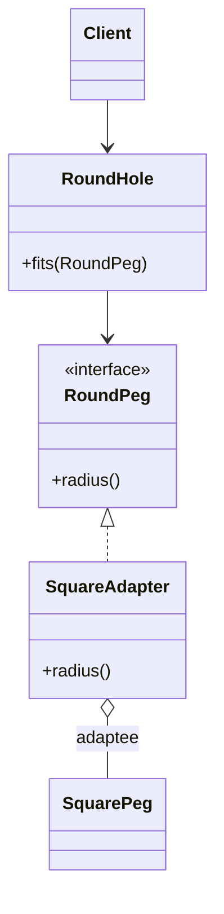

# Adapter *Also Known as: Wrapper*

> Category: Structural • Source: [Refactoring.Guru , Adapter](https://refactoring.guru/design-patterns/adapter) • Part of [[Java/README|Java MOC]] → [[06_Design-Patterns/README|Design Patterns MOC]]

## Why it Matters

Lets objects with **incompatible interfaces** **work together**.

## Diagram



## Code

```java
import java.util.List;
// Adapter translates SquarePeg to the RoundPeg target so RoundHole stays unchanged.
public class AdapterDemo {
 interface RoundPeg { double radius(); }
 static class SquarePeg {
 final double width;
 SquarePeg(double w) { width = w; }
 }
 static class SquareAdapter implements RoundPeg {
 private final SquarePeg peg;
 SquareAdapter(SquarePeg p) { peg = p; }
 public double radius() { return peg.width * Math.sqrt(2) / 2; }
 }
 record RoundHole(double radius) {
 boolean fits(RoundPeg p) { return p.radius() <= radius; }
 }
 public static void main(String[] args) {
 var hole = new RoundHole(5.0);
 var adapted = new SquareAdapter(new SquarePeg(6.0));
 System.out.println("fits: " + hole.fits(adapted)); // => fits: true
 System.out.println("fits small: " + hole.fits(() -> 2.0)); // => fits small: true
 System.out.println("adaptees reused: " + List.of(adapted.radius()).size()); // => adaptees reused: 1
 }
}
```
The demo proves an incompatible `SquarePeg` can fit a `RoundHole` unchanged via a translating adapter.

## When to use / not

- An existing class has the right behavior but the wrong interface.
- Third-party or legacy code cannot be modified.
- Translation is thin; no redesign of either side is wanted.

## Trade-offs

Use when you must reuse an existing class whose interface does not match. Prefer composition-based adapter. It adds a layer but avoids changing working code. This is translation, not redesign.

## Vs

| Pattern | Use when |
|---------|----------|
| Adapter | Translate existing interface after the fact |
| Bridge | Split abstraction and implementation by design |

## Pitfalls

- Leaky translation: adaptee exceptions and semantics bleed through untranslated.
- Adapting back and forth in layers , two adapters signal a missing shared interface.
- Stateful adapters shared across threads without synchronization.

## Interview q&a

**Q: Adapter vs decorator?**

Adapter changes the interface. Decorator keeps the same interface and stacks behavior.

**Q: Adapter vs Facade?**

An adapter translates one existing interface into the shape a client expects, without simplifying anything. A facade designs a new, simpler front over a whole subsystem. Use Adapter after the fact for mismatch, Facade up front for complexity.

**Q: Class adapter vs object adapter , which in Java?**

Object (composition) adapter , hold the adaptee, implement the target , is the Java default since single inheritance blocks most class adapters. Class adapters (extend adaptee, implement target) appear only when the adaptee was designed for extension.

: Adapter vs decorator?:: Adapter changes the interface. Decorator keeps the same interface and stacks behavior. **Q: Adapter vs Facade?** An adapter translates one existing interface into the shape a client expects, without simplifying anything. A facade designs a new, simpler front over a whole subsystem. Use Adapter after the fact for mismatch, Facade up front for complexity. **Q: Class adapter vs object adapter , which in Java?** Object (composition) adapter , hold... #flashcard

## Related

[[06_Design-Patterns/Structural/Bridge|Bridge]] (designed split vs after-the-fact) • [[06_Design-Patterns/Structural/Facade|Facade]] (simplify vs translate) • [[06_Design-Patterns/Structural/Decorator|Decorator]] (same interface)

---
*Category: Structural • Tags: design-patterns • Source: refactoring.guru*

## Problem

RoundHole expects RoundPeg but you have SquarePeg with a different interface.

## Solution

Wrap the adaptee in an adapter that implements the target interface and translates the call.

## When not to use

| Instead | Use |
|---------|-----|
| Both sides are new code | Design matching interfaces up front |
| Simplifying a whole subsystem | Facade |
| Splitting two evolving dimensions | Bridge |
