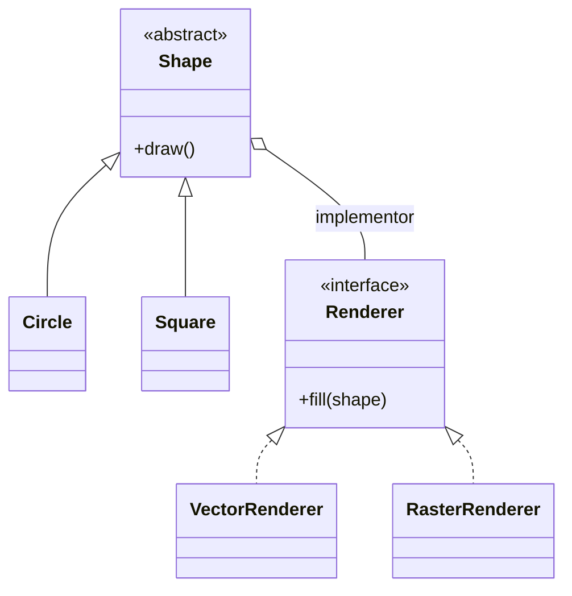

# Bridge

> Category: Structural • Source: [Refactoring.Guru , Bridge](https://refactoring.guru/design-patterns/bridge) • Part of [[Java/README|Java MOC]] → [[06_Design-Patterns/README|Design Patterns MOC]]

## Why it Matters

Splits a large class into **two independent hierarchies** , **abstraction** and **implementation** , so each can vary on its own.

## Diagram



## Code

```java
// Bridge: Shape (abstraction) delegates fill to Renderer (implementor); both vary freely.
public class BridgeDemo {
 interface Renderer { String fill(String shape); }
 record VectorRenderer() implements Renderer {
 public String fill(String s) { return "vector:" + s; }
 }
 record RasterRenderer() implements Renderer {
 public String fill(String s) { return "pixels:" + s; }
 }
 abstract static class Shape {
 final Renderer r;
 Shape(Renderer r) { this.r = r; }
 abstract String draw();
 }
 static class Circle extends Shape {
 Circle(Renderer r) { super(r); }
 String draw() { return r.fill("circle"); }
 }
 static class Square extends Shape {
 Square(Renderer r) { super(r); }
 String draw() { return r.fill("square"); }
 }
 public static void main(String[] args) {
 System.out.println(new Circle(new VectorRenderer()).draw()); // => vector:circle
 System.out.println(new Square(new RasterRenderer()).draw()); // => pixels:square
 System.out.println(new Circle(new RasterRenderer()).draw()); // => pixels:circle
 }
}
```
The demo proves new shapes and renderers can be combined freely without combinatorial subclasses.

## When to use / not

- Abstraction and implementation each have multiple dimensions (shapes × renderers).
- Both hierarchies must evolve independently without combinatorial subclasses.
- Runtime swapping of the implementation is needed.

## Trade-offs

Use when you have two dimensions that change often and combinatorial subclasses become unmanageable. It reduces subclass count and keeps each hierarchy focused. The extra indirection is the cost.

## Vs

| Pattern | Use when |
|---------|----------|
| Bridge | Two independent dimensions |
| Adapter | One interface translated to another |

## Pitfalls

- One-implementation bridges: abstraction + indirection with no second dimension.
- Leaking implementor types into the abstraction's public API.
- Confusing with Adapter , Bridge is designed up front, not applied after the fact.

## Interview q&a

**Q: When does bridge pay off?**

When two dimensions both change and combining them would explode subclasses. Otherwise plain composition is enough.

**Q: Bridge vs Adapter?**

Bridge is designed up front: two dimensions (e.g. Shape × Renderer) evolve independently behind a stable delegation link. Adapter is applied after the fact to make an existing class fit an interface it was never written for. Bridge prevents the mismatch; Adapter repairs it.

**Q: Bridge vs Strategy , how do you tell them apart?**

Bridge is structural and permanent: two dimensions (shape × renderer) coexist and both keep growing. Strategy is behavioral and swappable: one slot, one algorithm at a time. If both sides evolve independently, it's a Bridge.

: When does bridge pay off?:: When two dimensions both change and combining them would explode subclasses. Otherwise plain composition is enough. **Q: Bridge vs Adapter?** Bridge is designed up front: two dimensions (e.g. Shape × Renderer) evolve independently behind a stable delegation link. Adapter is applied after the fact to make an existing class fit an interface it was never written for. Bridge prevents the mismatch; Adapter repairs it. **Q: Bridge vs Strategy , how... #flashcard

## Related

[[06_Design-Patterns/Structural/Adapter|Adapter]] • [[06_Design-Patterns/Behavioral/Strategy|Strategy]] (swappable behavior) • [[06_Design-Patterns/Structural/Composite|Composite]]

---
*Category: Structural • Tags: design-patterns • Source: refactoring.guru*

## Problem

Shape with color variants explodes into RedCircle, BlueCircle, RedSquare and so on.

## Solution

Extract one dimension (color) behind an interface and have the other (shape) hold a reference to it.

## When not to use

| Instead | Use |
|---------|-----|
| One-off interface mismatch | Adapter |
| Single swappable algorithm | Strategy |
| Just adding behavior | Decorator |
