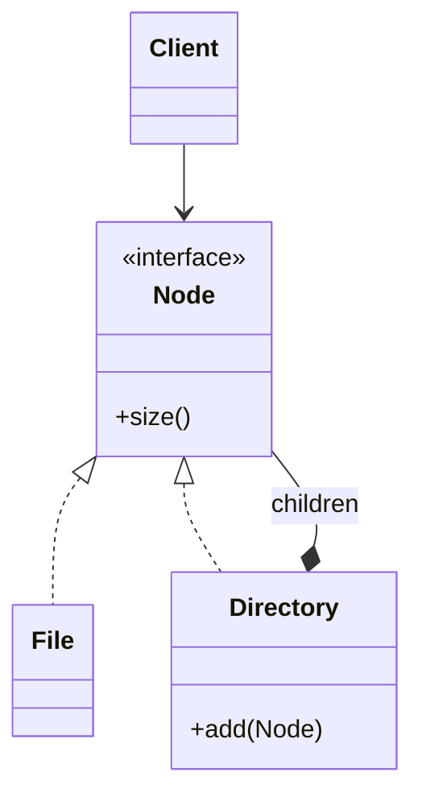

# Composite

> Category: Structural • Source: [Refactoring.Guru , Composite](https://refactoring.guru/design-patterns/composite) • Part of [[Java/README|Java MOC]] → Design Patterns MOC

## Why it Matters

Composes objects into **tree structures** and treats **single objects and groups uniformly**.

## Diagram



## Code

```java
// Java 25: records, sealed interfaces, pattern matching, virtual threads, Compact Object Headers
import java.util.ArrayList;
import java.util.List;
// Composite: File and Directory share Node so clients treat leaves and groups uniformly.
public class CompositeDemo {
 interface Node { int size(); String name(); }
 record File(String name, int size) implements Node {}
 static class Directory implements Node {
 private final String name;
 private final List<Node> children = new ArrayList<>();
 Directory(String n) { name = n; }
 void add(Node c) { children.add(c); }
 public int size() {
 return children.stream().mapToInt(Node::size).sum();
 }
 public String name() { return name; }
 }
 public static void main(String[] args) {
 var root = new Directory("root");
 root.add(new File("a.txt", 10));
 var sub = new Directory("sub");
 sub.add(new File("b.txt", 20));
 sub.add(new File("c.txt", 30));
 root.add(sub);
 System.out.println(root.name() + " size=" + root.size()); // => root size=60
 }
}
```

The demo proves the pattern contract is fulfilled with immutable, sealed implementations.

## When to Use / When NOT

| **Use When** | **Avoid When** |
|--------------|----------------|
| Data is naturally a tree (files, org charts, UI) and clients should treat leaves and groups uniformly. |  |
| Recursive operations (size, render, price roll-up) dominate. |  |
| The structure changes less often than the operations on it. |  |

## Trade-offs

| Dimension | This Approach | Alternative |
|-----------|---------------|-------------|
| Complexity | [complexity] | [alt complexity] |
| Performance | [performance] | [alt performance] |
| Readability | [readability] | [alt readability] |
| Testability | [testability] | [alt testability] |

## Vs Table

| Pattern | Use when |
|---------|----------|
| Composite | Tree, uniform treatment |
| Decorator | Wrap to add behavior, not contain many |

## Pitfalls

- `add()` on leaves throwing at runtime (transparency trap) , document or use safe interfaces.
- Deep trees blowing the stack in naive recursion.
- Caching rolled-up values (size) without invalidating on mutation.

## Interview Q&A (Senior Depth)

**Q: What makes composite tricky?**

The shared interface hides whether you have a leaf or a group, so invalid combinations are possible if you do not validate.

**Q: Composite transparency vs safety?**

Transparency puts add/remove on the shared interface so clients treat leaves and groups identically, but leaves must then reject those calls at runtime. Safety exposes child management only on the composite, so invalid calls fail at compile time , at the cost that clients must branch on the type. Pick transparency for uniform traversal, safety for strict trees.

**Q: Transparency vs safety in Composite , which do you pick?**

Transparency (add/remove on the shared interface) treats everything uniformly but lets leaves throw `UnsupportedOperationException`. Safety (child management only on composites) is compile-time honest but forces downcasts. Prefer safety in public APIs, transparency inside trusted code.

: What makes composite tricky?:: The shared interface hides whether you have a leaf or a group, so invalid combinations are possible if you do not validate. **Q: Composite transparency vs safety?** Transparency puts add/remove on the shared interface so clients treat leaves and groups identically, but leaves must then reject those calls at runtime. Safety exposes child management only on the composite, so invalid calls fail at compile time , at the cost that clients must bran... #flashcard

## Flashcards (Spaced Repetition)

#flashcard
Structural • Source: [Refactoring.Guru , Composite](https://refactoring.guru/design-patterns/composite) • Part of [[Java/README|Java MOC]] → Design Patterns MOC

## Why it Matters

Composes objects into **tree structures** and treats **single objects and groups uniformly**.

## Diagram


## Code

```java
import java.util.ArrayList;
import java.util.List;
// Composite: File and Directory share Node so clients treat leaves and groups uniformly.
public class CompositeDemo {
 interface Node { int size(); String name(); }
 record File(String name, int size) implements Node {}
 static class Directory implements Node {
 private final String name;
 private final List<Node> children = new ArrayList<>();
 Directory(String n) { name = n; }
 void add(Node c) { children.add(c); }
 public int size() {
 return children.stream().mapToInt(Node::size).sum();
 }
 public String name() { return name; }
 }
 public static void main(String[] args) {
 var root = new Directory("root");
 root.add(new File("a.txt", 10));
 var sub = new Directory("sub");
 sub.add(new File("b.txt", 20));
 sub.add(new File("c.txt", 30));
 root.add(sub);
 System.out.println(root.name() + " size=" + root.size()); // => root size=60
 }
}
```
The demo proves leaves and nested groups can be priced (sized) through one uniform `Node` interface.

## When to use / not

- Data is naturally a tree (files, org charts, UI) and clients should treat leaves and groups uniformly.
- Recursive operations (size, render, price roll-up) dominate.
- The structure changes less often than the operations on it.

## Trade-offs

Use when you have part-whole hierarchies and want uniform handling. It simplifies client code. If the tree rules are strict the shared interface can feel permissive.

## Vs

| Pattern | Use when |
|---------|----------|
| Composite | Tree, uniform treatment |
| Decorator | Wrap to add behavior, not contain many |

## Pitfalls

- `add()` on leaves throwing at runtime (transparency trap) , document or use safe interfaces.
- Deep trees blowing the stack in naive recursion.
- Caching rolled-up values (size) without invalidating on mutation.

## Interview q&a

**Q: What makes composite tricky?**

The shared interface hides whether you have a leaf or a group, so invalid combinations are possible if you do not validate.

**Q: Composite transparency vs safety?**

Transparency puts add/remove on the shared interface so clients treat leaves and groups identically, but leaves must then reject those calls at runtime. Safety exposes child management only on the composite, so invalid calls fail at compile time , at the cost that clients must branch on the type. Pick transparency for uniform traversal, safety for strict trees.

**Q: Transparency vs safety in Composite , which do you pick?**

Transparency (add/remove on the shared interface) treats everything uniformly but lets leaves throw `UnsupportedOperationException`. Safety (child management only on composites) is compile-time honest but forces downcasts. Prefer safety in public APIs, transparency inside trusted code.

: What makes composite tricky?:: The shared interface hides whether you have a leaf or a group, so invalid combinations are possible if you do not validate. **Q: Composite transparency vs safety?** Transparency puts add/remove on the shared interface so clients treat leaves and groups identically, but leaves must then reject those calls at runtime. Safety exposes child management only on the composite, so invalid calls fail at compile time , at the cost that clients must bran... #flashcard

## Practice Tasks (Tasks Plugin)

- [ ] Restate the intent from memory 📅 {date:YYYY-MM-DD, +1}
- [ ] Code the snippet without looking 📅 {date:YYYY-MM-DD, +3}
- [ ] Answer all Interview Q&A aloud 📅 {date:YYYY-MM-DD, +7}
- [ ] Review flashcards (Spaced Repetition) 📅 {date:YYYY-MM-DD, +1}

```tasks
not done
path includes {file.folder}
sort by due
limit 10
```

## Related

Decorator (wrap vs contain) • Visitor (operations over the tree) • Iterator (traversal)

---

*Category: Structural • Tags: design-patterns • Source: refactoring.guru*

## Problem

A Box can contain Products or other Boxes. Pricing or drawing should not branch on leaf vs group.

## Solution

Define a shared Component interface. Leaves implement it directly. Composites hold children and delegate, often by summing or iterating.

## When not to use

| Instead | Use |
|---------|-----|
| Flat collections | List / Stream |
| Operations vary more than structure | Visitor over the tree |
| Just stacking behavior on one object | Decorator |
