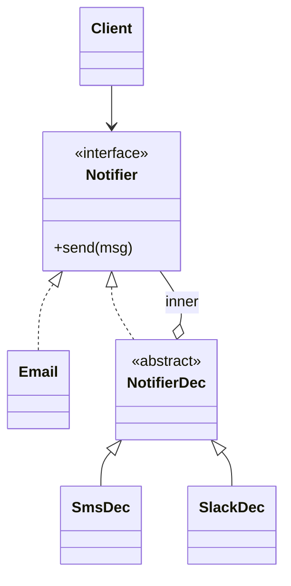

# Decorator *Also Known as: Wrapper*

> Category: Structural • Source: [Refactoring.Guru , Decorator](https://refactoring.guru/design-patterns/decorator) • Part of [[Java/README|Java MOC]] → [[06_Design-Patterns/README|Design Patterns MOC]]

## Why it Matters

Adds behavior by **wrapping an object** in another with the **same interface**.

## Diagram



## Code

```java
// Decorator stacks wrappers on the same Notifier interface; order defines behavior.
public class DecoratorDemo {
 interface Notifier { void send(String msg); }
 static class Email implements Notifier {
 public void send(String m) { System.out.println("email: " + m); } // => email: build green
 }
 abstract static class NotifierDec implements Notifier {
 final Notifier inner;
 NotifierDec(Notifier n) { inner = n; }
 }
 static class SmsDec extends NotifierDec {
 SmsDec(Notifier n) { super(n); }
 public void send(String m) { inner.send(m); System.out.println("sms: " + m); } // => sms: build green
 }
 static class SlackDec extends NotifierDec {
 SlackDec(Notifier n) { super(n); }
 public void send(String m) { inner.send(m); System.out.println("slack: " + m); } // => slack: build green
 }
 public static void main(String[] args) {
 Notifier n = new SlackDec(new SmsDec(new Email()));
 n.send("build green");
 }
}
```
The demo proves behaviors (email, SMS, Slack) can be mixed at runtime without a subclass per combination.

## When to use / not

- Behavior must stack at runtime in any combination (email + sms + slack).
- Subclass explosion looms for every combination.
- The interface must stay unchanged while capabilities grow.

## Trade-offs

Use when you need to add responsibilities at runtime without touching existing code. It beats subclassing and keeps each addition focused. Deep stacks are harder to debug and order matters.

## Vs

| Pattern | Use when |
|---------|----------|
| Decorator | Same interface, stackable |
| Proxy | Same interface, controls access |
| Adapter | Different interface |

## Pitfalls

- Order-dependent stacks with no documented order.
- Forgetting to delegate one method silently drops behavior.
- Identity breakage: `==` and `getClass()` on the wrapper lie about the wrapped object.

## Interview q&a

**Q: Decorator vs proxy?**

Both share the interface. Decorator adds behavior and stacks. Proxy controls access and usually does not stack.

**Q: Decorator vs inheritance for adding behavior?**

Subclassing bakes every combination in at compile time, so three options need up to eight classes. Decorators compose at runtime in any order, keeping each addition in one class , at the cost that deep stacks are harder to debug and order-sensitive.

**Q: When do decorators become a problem?**

Deep stacks produce confusing stack traces and ordering bugs (compression before encryption vs after matters). Cap depth, document order-sensitivity, and switch to explicit pipelines or middleware chains when ordering is itself business logic.

: Decorator vs proxy?:: Both share the interface. Decorator adds behavior and stacks. Proxy controls access and usually does not stack. **Q: Decorator vs inheritance for adding behavior?** Subclassing bakes every combination in at compile time, so three options need up to eight classes. Decorators compose at runtime in any order, keeping each addition in one class , at the cost that deep stacks are harder to debug and order-sensitive. **Q: When do decorators become a... #flashcard

## Related

[[06_Design-Patterns/Structural/Proxy|Proxy]] (access vs features) • [[06_Design-Patterns/Structural/Adapter|Adapter]] (different interface) • [[06_Design-Patterns/Structural/Composite|Composite]]

---
*Category: Structural • Tags: design-patterns • Source: refactoring.guru*

## Problem

Notifier needs email, then sms, then slack, in any mix. Subclassing every combination does not scale.

## Solution

Wrap the component in a decorator that does work before or after delegating. Decorators stack.

## When not to use

| Instead | Use |
|---------|-----|
| Changing the interface | Adapter |
| Controlling access, not adding features | Proxy |
| Fixed compile-time extension | Subclassing |
