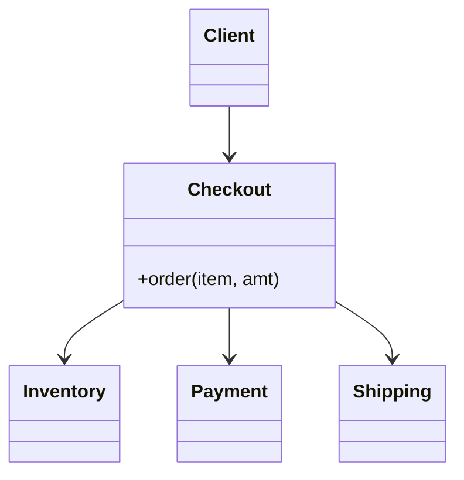

# Facade

> Category: Structural • Source: [Refactoring.Guru , Facade](https://refactoring.guru/design-patterns/facade) • Part of [[Java/README|Java MOC]] → [[06_Design-Patterns/README|Design Patterns MOC]]

## Why it Matters

Gives a **simple interface** to a **complex subsystem**.

## Diagram



## Code

```java
// Facade: one checkout() hides inventory + payment + shipping wiring from the client.
public class FacadeDemo {
 static class Inventory {
 boolean reserve(String item) { System.out.println("reserved " + item); return true; } // => reserved book
 }
 static class Payment {
 void charge(double amt) { System.out.println("charged $" + amt); } // => charged $29.99
 }
 static class Shipping {
 void ship(String item) { System.out.println("shipped " + item); } // => shipped book
 }
 static class Checkout {
 private final Inventory inv = new Inventory();
 private final Payment pay = new Payment();
 private final Shipping ship = new Shipping();
 void order(String item, double amt) {
 if (inv.reserve(item)) { pay.charge(amt); ship.ship(item); }
 }
 }
 public static void main(String[] args) {
 new Checkout().order("book", 29.99);
 }
}
```
The demo proves a single `order()` call correctly sequences three subsystem steps the client never touches.

## When to use / not

- A subsystem has many moving parts but most clients need one entry flow (checkout).
- Onboarding cost to the subsystem is high; a guided front door helps.
- The subsystem must stay usable directly for power users.

## Trade-offs

Use when a subsystem is hard to use directly or to decouple clients from it. You hide complexity and make the call site readable. It can become overly large if it absorbs too many responsibilities.

## Vs

| Pattern | Use when |
|---------|----------|
| Facade | Simplified front for a subsystem |
| Adapter | Translate one interface |
| Mediator | Peers coordinate through a hub |

## Pitfalls

- God facade: every subsystem method re-exposed, becoming the new complexity.
- Business logic creeping into the facade instead of staying in the subsystem.
- Clients bypassing the facade inconsistently, so two idioms rot in parallel.

## Interview q&a

**Q: When would you not use a facade?**

When the subsystem is already simple or you need fine-grained control over each step.

**Q: When does Facade become a problem?**

When it absorbs business logic instead of just delegating, it turns into a god object that every change funnels through. Keep the facade thin , ordering and wiring only , and leave rules inside the subsystem classes so each stays independently testable.

**Q: Does a Facade hide the subsystem?**

No , and that is deliberate. A facade is a convenient front door; power clients can still use subsystem classes directly. If you must enforce access rules between peers, that is a Mediator, not a Facade.

: When would you not use a facade?:: When the subsystem is already simple or you need fine-grained control over each step. **Q: When does Facade become a problem?** When it absorbs business logic instead of just delegating, it turns into a god object that every change funnels through. Keep the facade thin , ordering and wiring only , and leave rules inside the subsystem classes so each stays independently testable. **Q: Does a Facade hide the subsystem?** No , and that is deliber... #flashcard

## Related

[[06_Design-Patterns/Structural/Adapter|Adapter]] • [[06_Design-Patterns/Behavioral/Mediator|Mediator]] (coordinate vs simplify) • [[06_Design-Patterns/Structural/Proxy|Proxy]]

---
*Category: Structural • Tags: design-patterns • Source: refactoring.guru*

## Problem

Video conversion touches files, codecs, buffers, and bitrates. Calling each part in order is tedious and brittle.

## Solution

Put a single class in front that wires the steps in the right order. Clients call one method.

## When not to use

| Instead | Use |
|---------|-----|
| Peer coordination with rules | Mediator |
| Translating one interface | Adapter |
| Hiding the subsystem entirely | Don't , facades don't lock the door |
