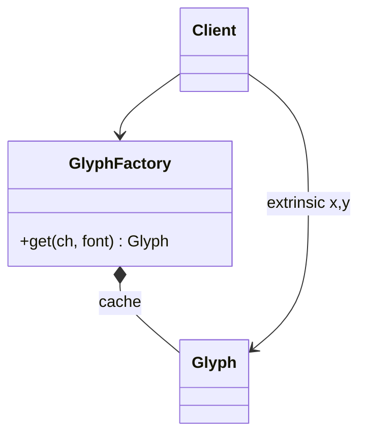

# Flyweight

> Category: Structural • Source: [Refactoring.Guru , Flyweight](https://refactoring.guru/design-patterns/flyweight) • Part of [[Java/README|Java MOC]] → [[06_Design-Patterns/README|Design Patterns MOC]]

## Why it Matters

Shares **common state** among **many objects** instead of keeping a copy in each object.

## Diagram



## Code

```java
// Java 25: records, sealed interfaces, pattern matching, virtual threads, Compact Object Headers
import java.util.HashMap;
import java.util.Map;
// Flyweight: intrinsic glyph data is shared via the cache; position stays extrinsic.
public class FlyweightDemo {
 record Glyph(char ch, String font) {}
 static class GlyphFactory {
 private final Map<String, Glyph> cache = new HashMap<>();
 Glyph get(char ch, String font) {
 return cache.computeIfAbsent(ch + font, k -> new Glyph(ch, font));
 }
 int cached() { return cache.size(); }
 }
 static void draw(Glyph g, int x, int y) {
 System.out.println(g.ch() + "@" + x + "," + y + " " + g.font()); // => a@0,0 serif, a@10,0 serif, b@20,0 serif
 }
 public static void main(String[] args) {
 var f = new GlyphFactory();
 var a1 = f.get('a', "serif");
 var a2 = f.get('a', "serif");
 draw(a1, 0, 0);
 draw(a2, 10, 0);
 draw(f.get('b', "serif"), 20, 0);
 System.out.println("shared=" + (a1 == a2) + " cached=" + f.cached()); // => shared=true cached=2
 }
}
```

The demo proves the pattern contract is fulfilled with immutable, sealed implementations.

## When to Use / When NOT

| **Use When** | **Avoid When** |
|--------------|----------------|
| Thousands of similar objects threaten memory (glyphs, particles, tiles). |  |
| State cleanly splits into shared intrinsic (char, font) and per-use extrinsic (x, y). |  |
| Object identity does not matter to clients. |  |

## Trade-offs

| Dimension | This Approach | Alternative |
|-----------|---------------|-------------|
| Complexity | [complexity] | [alt complexity] |
| Performance | [performance] | [alt performance] |
| Readability | [readability] | [alt readability] |
| Testability | [testability] | [alt testability] |

## Vs Table

| Pattern | Use when |
|---------|----------|
| Flyweight | Share intrinsic state, many objects |
| Singleton | One object |
| Prototype | Clone instead of sharing |

## Pitfalls

- Storing extrinsic state inside the flyweight destroys sharing.
- Unbounded caches that never evict , a memory leak wearing a pattern costume.
- Mutable intrinsic state shared across threads without safety.

## Interview Q&A (Senior Depth)

**Q: What can go wrong?**

Mixing intrinsic and extrinsic state makes bugs. Keep shared state immutable and pass the rest in.

**Q: Intrinsic vs extrinsic state in Flyweight?**

Intrinsic state (e.g. glyph character + font) is shareable and must be immutable, stored once in the factory. Extrinsic state (e.g. x/y position) varies per use and is passed in at call time, never stored in the flyweight. Mixing them , storing position in the shared object , causes aliasing bugs across all users of that instance.

**Q: Where does the JVM already use Flyweight?**

String interning, `Integer`/`Long` caches for small values, and `EnumSet`/`Collections.emptyList` singletons all share immutable intrinsic state. The pattern is the same: canonical instances in a cache, extrinsic context passed per use.

: What can go wrong?:: Mixing intrinsic and extrinsic state makes bugs. Keep shared state immutable and pass the rest in. **Q: Intrinsic vs extrinsic state in Flyweight?** Intrinsic state (e.g. glyph character + font) is shareable and must be immutable, stored once in the factory. Extrinsic state (e.g. x/y position) varies per use and is passed in at call time, never stored in the flyweight. Mixing them , storing position in the shared object , causes aliasing bugs... #flashcard

## Flashcards (Spaced Repetition)

#flashcard
Structural • Source: [Refactoring.Guru , Flyweight](https://refactoring.guru/design-patterns/flyweight) • Part of [[Java/README|Java MOC]] → [[06_Design-Patterns/README|Design Patterns MOC]]

## Why it Matters

Shares **common state** among **many objects** instead of keeping a copy in each object.

## Diagram


## Code

```java
import java.util.HashMap;
import java.util.Map;
// Flyweight: intrinsic glyph data is shared via the cache; position stays extrinsic.
public class FlyweightDemo {
 record Glyph(char ch, String font) {}
 static class GlyphFactory {
 private final Map<String, Glyph> cache = new HashMap<>();
 Glyph get(char ch, String font) {
 return cache.computeIfAbsent(ch + font, k -> new Glyph(ch, font));
 }
 int cached() { return cache.size(); }
 }
 static void draw(Glyph g, int x, int y) {
 System.out.println(g.ch() + "@" + x + "," + y + " " + g.font()); // => a@0,0 serif, a@10,0 serif, b@20,0 serif
 }
 public static void main(String[] args) {
 var f = new GlyphFactory();
 var a1 = f.get('a', "serif");
 var a2 = f.get('a', "serif");
 draw(a1, 0, 0);
 draw(a2, 10, 0);
 draw(f.get('b', "serif"), 20, 0);
 System.out.println("shared=" + (a1 == a2) + " cached=" + f.cached()); // => shared=true cached=2
 }
}
```
The demo proves thousands of character draws can share two cached `Glyph` objects while positions vary per call.

## When to use / not

- Thousands of similar objects threaten memory (glyphs, particles, tiles).
- State cleanly splits into shared intrinsic (char, font) and per-use extrinsic (x, y).
- Object identity does not matter to clients.

## Trade-offs

Use when you have many similar objects and memory matters. Records and ConcurrentHashMap make the cache concise. Only do this when you have measured duplication; otherwise the factory adds indirection for little gain.

## Vs

| Pattern | Use when |
|---------|----------|
| Flyweight | Share intrinsic state, many objects |
| Singleton | One object |
| Prototype | Clone instead of sharing |

## Pitfalls

- Storing extrinsic state inside the flyweight destroys sharing.
- Unbounded caches that never evict , a memory leak wearing a pattern costume.
- Mutable intrinsic state shared across threads without safety.

## Interview q&a

**Q: What can go wrong?**

Mixing intrinsic and extrinsic state makes bugs. Keep shared state immutable and pass the rest in.

**Q: Intrinsic vs extrinsic state in Flyweight?**

Intrinsic state (e.g. glyph character + font) is shareable and must be immutable, stored once in the factory. Extrinsic state (e.g. x/y position) varies per use and is passed in at call time, never stored in the flyweight. Mixing them , storing position in the shared object , causes aliasing bugs across all users of that instance.

**Q: Where does the JVM already use Flyweight?**

String interning, `Integer`/`Long` caches for small values, and `EnumSet`/`Collections.emptyList` singletons all share immutable intrinsic state. The pattern is the same: canonical instances in a cache, extrinsic context passed per use.

: What can go wrong?:: Mixing intrinsic and extrinsic state makes bugs. Keep shared state immutable and pass the rest in. **Q: Intrinsic vs extrinsic state in Flyweight?** Intrinsic state (e.g. glyph character + font) is shareable and must be immutable, stored once in the factory. Extrinsic state (e.g. x/y position) varies per use and is passed in at call time, never stored in the flyweight. Mixing them , storing position in the shared object , causes aliasing bugs... #flashcard

## Practice Tasks (Tasks Plugin)

- [ ] Restate the intent from memory 📅 {date:YYYY-MM-DD, +1}
- [ ] Code the snippet without looking 📅 {date:YYYY-MM-DD, +3}
- [ ] Answer all Interview Q&A aloud 📅 {date:YYYY-MM-DD, +7}
- [ ] Review flashcards (Spaced Repetition) 📅 {date:YYYY-MM-DD, +1}

```tasks
not done
path includes {file.folder}
sort by due
limit 10
```

## Related

[[06_Design-Patterns/Creational/Singleton|Singleton]] (one vs shared many) • [[06_Design-Patterns/Creational/Prototype|Prototype]] (clone vs share) • [[06_Design-Patterns/Structural/Composite|Composite]]

---

*Category: Structural • Tags: design-patterns • Source: refactoring.guru*

## Problem

A forest with thousands of trees repeats the same type data in every tree and wastes memory.

## Solution

Split intrinsic shared state (type) from extrinsic varying state (position). Store intrinsic once in a factory and pass extrinsic at draw time.

## When not to use

| Instead | Use |
|---------|-----|
| Few objects | Plain instances |
| State won't split cleanly | Cloning / Prototype |
| Just one shared instance | Singleton |
