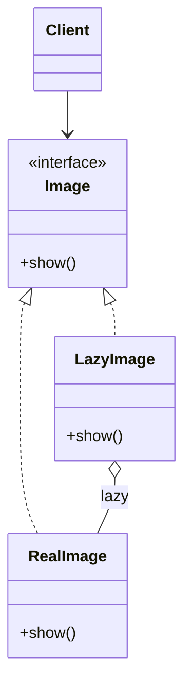

# Proxy

> Category: Structural • Source: [Refactoring.Guru , Proxy](https://refactoring.guru/design-patterns/proxy) • Part of [[Java/README|Java MOC]] → [[06_Design-Patterns/README|Design Patterns MOC]]

## Why it Matters

Controls access by placing a **stand-in** in front of an object.

## Diagram



## Code

```java
// Proxy: stand-in controls access and lazily creates the heavy RealImage on first use.
public class ProxyDemo {
 interface Image { void show(); }
 static class RealImage implements Image {
 RealImage(String f) { System.out.println("loading " + f); } // => loading photo.jpg
 public void show() { System.out.println("showing pixels"); } // => showing pixels, showing pixels
 }
 static class LazyImage implements Image {
 private final String file;
 private RealImage real;
 LazyImage(String f) { file = f; }
 public void show() {
 if (real == null) real = new RealImage(file);
 real.show();
 }
 }
 public static void main(String[] args) {
 Image img = new LazyImage("photo.jpg");
 System.out.println("proxy created, nothing loaded yet"); // => proxy created, nothing loaded yet
 img.show();
 img.show();
 }
}
```
The demo proves the heavy image loads exactly once, on first `show()`, with the proxy fully interchangeable.

## When to use / not

- A stand-in must control access: lazy load, cache, guard, or log.
- The real object is expensive to create or remote.
- Clients must keep the same interface.

## Trade-offs

Use to add lazy init, caching, or access checks without changing the subject. The proxy is interchangeable because the interface is the same. Each proxy does one kind of control; do not mix unrelated checks in one.

## Vs

| Pattern | Use when |
|---------|----------|
| Proxy | Controls access, same interface |
| Decorator | Adds behavior, stackable |
| Adapter | Different interface |

## Pitfalls

- Self-invocation bypassing the proxy (Spring `@Transactional` classic).
- Proxy doing real work: it should control access, not implement features.
- Lazy proxies hiding latency spikes on first use with no timeout story.

## Interview q&a

**Q: Proxy vs decorator?**

Proxy controls how you reach the object, often one layer for caching or checks. Decorator adds features and often stacks.

**Q: Proxy vs Decorator vs Adapter?**

All three wrap an object, but with different intent: Proxy (same interface) controls access , lazy init, caching, permission checks , and is usually a single layer. Decorator (same interface) adds behavior and stacks freely. Adapter (different interface) translates so incompatible types can connect.

**Q: What proxies do Java frameworks use?**

JDK dynamic proxies implement interfaces at runtime (Spring AOP's default for interface beans); CGLIB subclasses concrete classes when no interface exists. `@Transactional`, `@Cacheable`, and lazy JPA associations are all proxies , which is why self-invocation silently skips advice.

: Proxy vs decorator?:: Proxy controls how you reach the object, often one layer for caching or checks. Decorator adds features and often stacks. **Q: Proxy vs Decorator vs Adapter?** All three wrap an object, but with different intent: Proxy (same interface) controls access , lazy init, caching, permission checks , and is usually a single layer. Decorator (same interface) adds behavior and stacks freely. Adapter (different interface) translates so incompatible types... #flashcard

## Related

[[06_Design-Patterns/Structural/Decorator|Decorator]] • [[06_Design-Patterns/Structural/Adapter|Adapter]] • [[06_Design-Patterns/Structural/Facade|Facade]]

---
*Category: Structural • Tags: design-patterns • Source: refactoring.guru*

## Problem

A YouTube client hits the network on every listVideos call. Caching or access checks belong in front.

## Solution

Write a proxy that implements the same interface, holds the real subject, and adds logic before or after delegating.

## When not to use

| Instead | Use |
|---------|-----|
| Stacking extra behavior | Decorator |
| Different interface needed | Adapter |
| Eager creation is already cheap | Use the real object |
