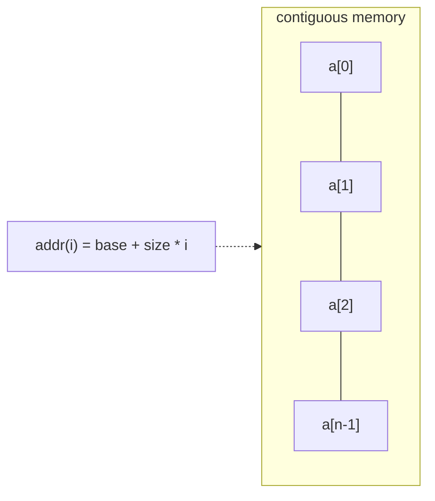

## Why it Matters

An **array** is a contiguous block of memory holding equal-sized elements indexed by contiguous integers. Element address is computed arithmetically: `addr(i) = base + elem_size × (i - first_index)`, hence O(1) random access. Fixed capacity; dynamic growth requires reallocation (e.g., `ArrayList`).

> [!INFO] Address Formula
> `array_addr + elem_size * (i - first_index)`

## Diagram



## Code

```java
// Binary search needs sorted input; mid avoids (lo+hi) overflow
int binarySearch(int[] a, int key) {
 int lo = 0, hi = a.length - 1;
 while (lo <= hi) {
 int mid = lo + (hi - lo) / 2; // invariant: key in a[lo..hi] if present
 if (a[mid] == key) return mid;
 if (a[mid] < key) lo = mid + 1; else hi = mid - 1;
 }
 return -(lo + 1); // not found: insertion point
}

void demo() {
 int[] a = {1, 3, 5, 7, 9};
 System.out.println(binarySearch(a, 7)); // => 3
 System.out.println(binarySearch(a, 4)); // => -3
 int[] b = Arrays.copyOf(a, a.length + 1); // O(n) growth, like ArrayList
 b[a.length] = 11;
 System.out.println(Arrays.toString(b)); // => [1, 3, 5, 7, 9, 11]
}
```

## When to use / not

| Use | NOT |
|-----|-----|
| O(1) random access, fixed-size buffers, heaps/stacks backing | Frequent middle insert/delete → `Linked List` or `ArrayList` |
| Cache-heavy scans, matrices, binary search on sorted data | Unknown size at runtime → dynamic array / list |

## Trade-offs

- O(1) access, best cache locality, minimal overhead.
- Fixed size; middle insert/delete O(n); binary search needs sorted order.

## Vs

| | `Array` | `ArrayList` | `Linked List` |
|--|---------|-------------|-----------------|
| Size | fixed | dynamic 1.5x | dynamic, per-node |
| Access | O(1) | O(1) | O(n) |
| Mid insert | O(n) | O(n) | O(1) with node |
| Memory | minimal | minimal + slack | pointers per node |

## Pitfalls

- **Fixed size**, `ArrayIndexOutOfBoundsException`; check bounds or use `ArrayList`.
- **Shallow copy**, `clone()` / `Arrays.copyOf` on object arrays copies references, not deep clones.
- **Default values**, `new int[n]` fills with `0`, `new Object[n]` with `null` → NPE risk.
- **`==` vs `Arrays.equals`**, `==` compares identity, not contents.
- **Resizing cost**, repeated `copyOf` in a loop is O(n²); prefer `ArrayList` with initial capacity `new ArrayList<>(n)`.
- **Integer overflow** in binary search midpoint, use `mid = lo + (hi - lo)/2`.

## Interview q&a

> **Java 25 tip:** Mention Compact Object Headers when asked about array memory overhead, shows you track runtime evolution.

**Q: Array vs ArrayList?** Array fixed, primitive-friendly, slightly faster; ArrayList dynamic, generic, richer API.

**Q: Why is random access O(1)?** Contiguous storage + arithmetic addressing.

**Q: Row-major vs column-major, why care?** Iteration order matching layout maximises cache hits (row-major → iterate rows inner loop).

Array vs ArrayList?:: Array fixed, primitive-friendly, slightly faster; ArrayList dynamic, generic, richer API. #flashcard
Why is random access O(1)?:: Contiguous storage + arithmetic addressing. #flashcard
Row-major vs column-major, why care?:: Iteration order matching layout maximises cache hits (row-major → iterate rows inner loop). #flashcard

- [303. Range Sum Query Immutable](https://leetcode.com/problems/range-sum-query-immutable/)
- [525. Contiguous Array](https://leetcode.com/problems/contiguous-array/)
- [560. Subarray Sum Equals K](https://leetcode.com/problems/subarray-sum-equals-k/)

---
*Category: DSA • Part of [[README|Java MOC]]*

## Related

- Linked List • [[Java/07_DSA/Stack|Stack]] • [[Java/07_DSA/Queue|Queue]] • [[Java/07_DSA/HashMap|HashMap (DSA)]]
- [[README|Java MOC]]

# Array

> Part of [[README|Java MOC]] • `DSA`

## Characteristics

- **Homogeneous, indexed, zero-based** in Java; length fixed at allocation (`new int[n]`).
- **Cache-friendly** (locality), best sequential scan performance.
- **Multi-dimensional** arrays are arrays of arrays; two layouts exist (relevant for performance in row-major languages like Java/C).

### Multi-dimensional Layouts

| Layout | Order | Java |
|---|---|---|
| **Row-major** | `(1,1)(1,2)(1,3)(1,4)…(2,1)…` | yes Java is row-major |
| **Column-major** | `(1,1)(2,1)(3,1)(1,2)…` | Fortran/MATLAB |

## Operations , Complexity

| Operation | Complexity | Notes |
|---|---|---|
| Access `a[i]` / Write `a[i]=v` | **O(1)** | Direct address arithmetic |
| Search (unsorted) | **O(n)** | Linear scan |
| Search (sorted) | **O(log n)** | Binary search |
| Insert , end (if capacity) | **O(1)** | Amortised O(1) for dynamic array |
| Insert , beginning / middle | **O(n)** | Shift elements |
| Delete , end | **O(1)** | |
| Delete , beginning / middle | **O(n)** | Shift elements |
| Traverse | **O(n)** | |
| Sort (comparison) | **O(n log n)** | |

### Summary Table (as in Original)

| | Add | Remove |
|---|---|---|
| **Beginning** | O(n) | O(n) |
| **End** | O(1) | O(1) |
| **Middle** | O(n) | O(n) |

## Java 25 Notes

- **Compact Object Headers (JEP 450, Java 25):** `-XX:+UseCompactObjectHeaders` reduces object header to 64-bit (8 B); arrays of objects/nodes benefit, ~10-20% heap saving for large `ArrayList`/`HashMap` node arrays. Enable in production for memory-bound workloads.
- **SequencedCollection (JEP 431):** `ArrayList` now implements `SequencedCollection`, use `addFirst`/`addLast`/`getFirst`/`getLast`/`reversed()` instead of index arithmetic. `var` keeps code concise.
- **Pattern matching:** use `if (obj instanceof String s)` and record patterns in loops where applicable (see Linked List / Trees).

## Solve with Patterns

- [[Coding Patterns/01_Array/01 - Prefix Sum]]
- [[Coding Patterns/01_Array/02 - Two Pointers]]
- [[Coding Patterns/01_Array/03 - Sliding Window]]
- [[Coding Patterns/01_Array/04 - Frequency Counting]]
- [[Coding Patterns/04_Intervals_Search/02 - Modified Binary Search]]
