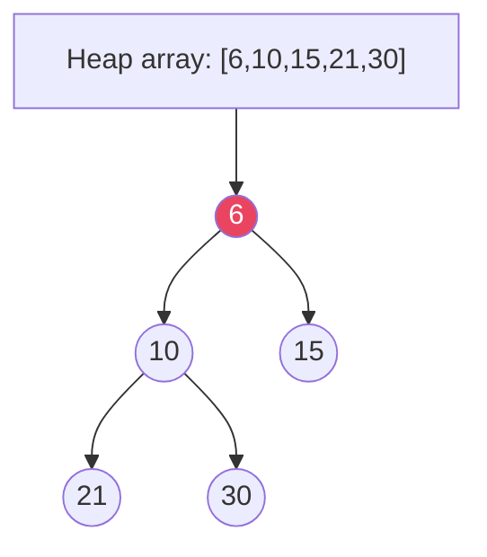

# DSA — Cheat Sheet

## Big-O Quick Reference

| Structure / Algo | Access | Search | Insert | Delete | Space | Notes |
|---|---|---|---|---|---|---|
| **Array** | O(1) | O(n) | O(n) | O(n) | O(n) | Cache-friendly |
| **HashMap** | — | O(1) avg | O(1) avg | O(1) avg | O(n) | Worst O(log n) tree |
| **BST (balanced)** | — | O(log n) | O(log n) | O(log n) | O(n) | Skewed → O(n) |
| **Heap (PQ)** | O(1) peek | O(n) | O(log n) | O(log n) | O(n) | Array-backed |
| **Graph (Adj List)** | — | — | — | — | O(V+E) | Adj Matrix O(V²) |
| **Trie** | — | O(L) | O(L) | O(L) | O(N·Σ) | L = word length |
| **Sort: Quick/Merge/Heap** | — | — | — | — | — | Avg O(n log n); Quick worst O(n²) |

## Algorithm Complexities

| Problem | Best Approach | Time | Space |
|---|---|---|---|
| **Two Sum / Pair** | HashMap | O(n) | O(n) |
| **Sort** | `Arrays.sort` (Dual-Pivot Quick + TimSort) | O(n log n) | O(log n) |
| **Binary Search** | Sorted array | O(log n) | O(1) |
| **BFS / DFS** | Queue / Recursion+Stack | O(V+E) | O(V) |
| **Dijkstra (PQ)** | Min-heap | O((V+E) log V) | O(V) |
| **Bellman-Ford** | DP relaxation | O(VE) | O(V) |
| **Floyd-Warshall** | DP all-pairs | O(V³) | O(V²) |
| **LCS / Knapsack** | DP | O(n·m) | O(n·m) → O(min) optimized |
| **Backtracking (N-Queens, Subsets)** | DFS + prune | O(2ⁿ) / O(n!) | O(n) |

## Vs Tables

| Comparison | A: When | B: When |
|---|---|---|
| **BFS vs DFS** | Shortest path (unweighted), level order | Topological, cycle detect, path existence, memory tighter |
| **Array vs LinkedList** | Random access, sort, binary search | Frequent insert/delete at head (rare) |
| **Heap vs TreeSet** | Top-k, duplicates OK, O(1) peek | Sorted unique, range queries |
| **Adj List vs Matrix** | Sparse graph | Dense graph, O(1) edge check |
| **Recursion vs Iteration** | Clean for trees/graphs | Avoid stack overflow (n>10⁴) |
| **DP Top-Down vs Bottom-Up** | Memoization, sparse states | Tabulation, no recursion overhead |



> **Heap property:** parent ≤ children (min-heap). `heapify` O(n), `poll/offer` O(log n). `PriorityQueue` in Java is min-heap.

## Java 25 One-Liners

```java

// Purpose: DSA Cheat Sheet: complexity and structure trade-offs at a glance
// Representation: Trie, DSU — records/nodes; contiguous vs linked trade-off
// Operations: bfs, dfs, insert, search
// Invariant: complexity assumes stated representation; handles empty/null boundaries
```

*Category: CheatSheet*
