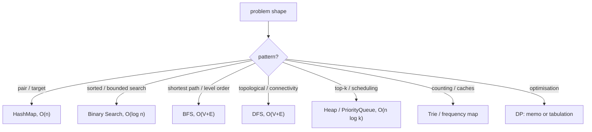
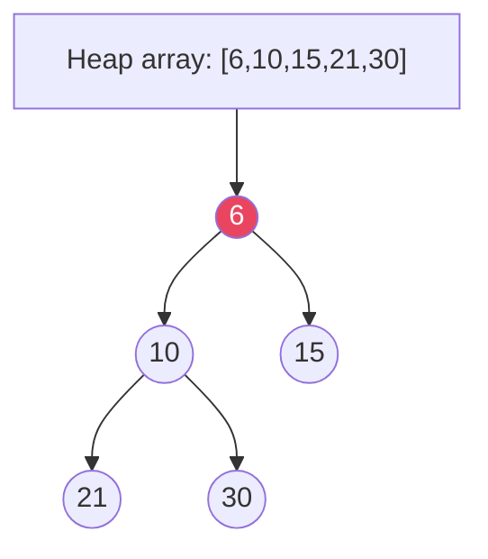

---
title: "DSA Cheat Sheet"
category: "DSA"
tags: [java, cheat-sheet, dsa]
created: 2026-09-03
pattern: 0
difficulty: Medium
completed: false
reviewed: ""
sr-due: ""
problems-solved: []
problems-solved-dates: {}
excalidraw: ""
---## Diagram



## Code

```java
// Templates that cover the highest-frequency families
// 1. Two Sum pair lookup
int[] twoSum(int[] a, int t) {
 var seen = new java.util.HashMap<Integer, Integer>();
 for (int i = 0; i < a.length; i++) {
 if (seen.containsKey(t - a[i])) return new int[]{seen.get(t - a[i]), i};
 seen.put(a[i], i);
 }
 return new int[]{};
}

// 2. Top-k with a min-heap
List<Integer> topK(int[] a, int k) {
 var pq = new java.util.PriorityQueue<Integer>();
 for (int x : a) { pq.offer(x); if (pq.size() > k) pq.poll(); }
 return new java.util.ArrayList<>(pq);
}

// 3. BFS level order
List<List<Integer>> levels(TreeNode r) {
 var res = new java.util.ArrayList<List<Integer>>();
 var q = new java.util.ArrayDeque<TreeNode>();
 if (r != null) q.add(r);
 while (!q.isEmpty()) {
 int n = q.size();
 var lvl = new java.util.ArrayList<Integer>();
 for (int i = 0; i < n; i++) { var x = q.poll(); lvl.add(x.val); if (x.left != null) q.add(x.left); if (x.right != null) q.add(x.right); }
 res.add(lvl);
 }
 return res;
}

record TreeNode(int val, TreeNode left, TreeNode right) {}
```

## When to use / not

| Use | NOT |
|-----|-----|
| HashMap for pair/target/counting, O(n) | Nested loops when a hash pass suffices, O(n²) |
| BFS for shortest unweighted path | DFS for shortest path, it does not guarantee minimal |
| Min-heap of size k for top-k | Full sort, O(n log n) when O(n log k) is available |
| Recursion for trees/graphs | Recursion at n > 10⁴, stack overflow, iterate instead |
| Tabulation when states are dense | Memoization when states are sparse |

## Trade-offs

- Structure-by-complexity and pattern-by-shape tables decide the approach in seconds.
- The Vs table covers the choices that actually change the solution (BFS vs DFS, heap vs TreeSet).
- Complexity here is the average/common case; always state worst case and the assumption behind it.

## Vs

| Comparison | A: When | B: When |
|---|---|---|
| **BFS vs DFS** | Shortest path (unweighted), level order | Topological, cycle detect, path existence, memory tighter |
| **Array vs LinkedList** | Random access, sort, binary search | Frequent insert/delete at head (rare) |
| **Heap vs TreeSet** | Top-k, duplicates OK, O(1) peek | Sorted unique, range queries |
| **Adj List vs Matrix** | Sparse graph | Dense graph, O(1) edge check |
| **Recursion vs Iteration** | Clean for trees/graphs | Avoid stack overflow (n>10⁴) |
| **DP Top-Down vs Bottom-Up** | Memoization, sparse states | Tabulation, no recursion overhead |

> **Heap property:** parent ≤ children (min-heap). `heapify` O(n), `poll/offer` O(log n). `PriorityQueue` in Java is min-heap.

## Pitfalls

- Quicksort worst case is O(n²), average O(n log n); say which you mean.
- Adjacency list is O(V+E), matrix O(V²); pick by graph density.
- Off-by-one on binary search bounds, `lo <= hi` vs `lo < hi` decides correctness.
- DP space can drop to O(min(n,m)) by keeping two rows.
- `PriorityQueue` is not sorted overall, only the head is guaranteed.

## Interview q&a

**Q: BFS vs DFS?** BFS for shortest unweighted path and level order; DFS for topology, connectivity, and backtracking, with lower memory on deep graphs.

**Q: When is a heap better than sorting?** Streaming top-k, O(n log k) vs O(n log n), and no need for full order.

**Q: Two Sum optimal?** One hash pass, O(n) time and space.

**Q: Recursion vs iteration?** Recursion mirrors tree/graph structure; iterate when depth is unbounded to avoid stack overflow.

BFS vs DFS?:: BFS for shortest unweighted path and level order; DFS for topology, connectivity, and backtracking. #flashcard
When is a heap better than sorting?:: Streaming top-k: O(n log k) vs O(n log n), no full order needed. #flashcard
Two Sum optimal approach?:: One hash pass, O(n) time and space. #flashcard

## Related

- [[07_DSA/README|DSA MOC]] • [[Array]] • [[Linked List]] • [[Singly Linked List]] • [[Doubly Linked List]]
- [[07_DSA/Stack|Stack]] • [[07_DSA/Queue|Queue]] • [[HashMap]] • [[Trees]] • [[Heap]] • [[Graph]]
- [[03_Collections/README|Collections]] (JDK implementations of these structures)

# DSA , Cheat Sheet

## Big-O Quick Reference

| Structure / Algo | Access | Search | Insert | Delete | Space | Notes |
|---|---|---|---|---|---|---|
| **Array** | O(1) | O(n) | O(n) | O(n) | O(n) | Cache-friendly |
| **HashMap** | , | O(1) avg | O(1) avg | O(1) avg | O(n) | Worst O(log n) tree |
| **BST (balanced)** | , | O(log n) | O(log n) | O(log n) | O(n) | Skewed → O(n) |
| **Heap (PQ)** | O(1) peek | O(n) | O(log n) | O(log n) | O(n) | Array-backed |
| **Graph (Adj List)** | , | , | , | , | O(V+E) | Adj Matrix O(V²) |
| **Trie** | , | O(L) | O(L) | O(L) | O(N·Σ) | L = word length |
| **Sort: Quick/Merge/Heap** | , | , | , | , | , | Avg O(n log n); Quick worst O(n²) |

## Algorithm Complexities

| Problem | Best Approach | Time | Space |
|---|---|---|---|
| **Two Sum / Pair** | HashMap | O(n) | O(n) |
| **Sort** | `Arrays.sort` (Dual-Pivot Quick + TimSort) | O(n log n) | O(log n) |
| **Binary Search** | Sorted array | O(log n) | O(1) |
| **BFS / DFS** | Queue / Recursion+Stack | O(V+E) | O(V) |
| **Dijkstra (PQ)** | Min-heap | O((V+E) log V) | O(V) |
| **Bellman-Ford** | DP relaxation | O(VE) | O(V) |
| **Floyd-Warshall** | DP all-pairs | O(V³) | O(V²) |
| **LCS / Knapsack** | DP | O(n·m) | O(n·m) → O(min) optimized |
| **Backtracking (N-Queens, Subsets)** | DFS + prune | O(2ⁿ) / O(n!) | O(n) |

## Java 25 One-liners

```java

// Purpose: DSA Cheat Sheet: complexity and structure trade-offs at a glance
// Representation: Trie, DSU — records/nodes; contiguous vs linked trade-off
// Operations: bfs, dfs, insert, search
// Invariant: complexity assumes stated representation; handles empty/null boundaries
```
*Category: CheatSheet*
