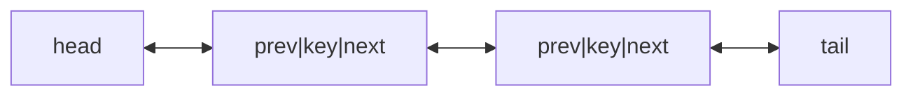

## Why it Matters

A **doubly linked list** extends the singly linked list: each node stores `key`, `next`, and `prev` pointers. You get **bidirectional traversal** and O(1) `PopBack` / `AddBefore` when the target node is known, at the cost of one extra pointer per node and more link maintenance.

- Node: `{ key, next, prev }`

![[Pasted image 20230728114551.png]]

## Diagram



## Code

```java
// JDK doubly list: LinkedList — O(1) at both ends, ListIterator for mid edits
void demo() {
 var dll = new java.util.LinkedList<>(List.of(1, 2, 3));
 dll.addFirst(0); // O(1)
 dll.addLast(4); // O(1)
 System.out.println(dll); // => [0, 1, 2, 3, 4]
 System.out.println(dll.getFirst()); // => 0
 System.out.println(dll.getLast()); // => 4
 System.out.println(dll.reversed()); // => [4, 3, 2, 1, 0]

 // LRU sketch: HashMap key -> node + move-to-front on access
 var lru = new LinkedHashMap<Integer, String>(16, 0.75f, true) {
 protected boolean removeEldestEntry(Map.Entry<Integer, String> e) {
 return size() > 2;
 }
 };
 lru.put(1, "a"); lru.put(2, "b"); lru.get(1); lru.put(3, "c"); // evicts 2
 System.out.println(lru.keySet()); // => [1, 3]
}
```

## When to use / not

| Use | NOT |
|-----|-----|
| LRU cache (map + list), `PopBack`/`AddBefore` O(1), bidirectional walk | Memory-tight payloads → singly or array |
| `java.util.LinkedList` as `SequencedCollection` | Pure queue/stack → `ArrayDeque` |

## Trade-offs

- O(1) both ends + `AddBefore`; bidirectional; LRU-ready.
- Two pointers per node; four link updates per insert , easy to corrupt.

## Vs

| | `Doubly` | `Singly` | `ArrayDeque` |
|--|----------|----------|--------------|
| Both-ends ops | O(1) | `PopBack` O(n) | O(1), array-backed |
| Overhead | 2 ptrs/node | 1 ptr/node | circular buffer |
| Use | LRU, bidirectional | minimal memory | queue/stack default |

## Pitfalls

- **Four link updates** per insertion, missing one (`prev` or `next` on neighbour) corrupts the list.
- **Self-links on edge**, `AddBefore(head, ...)` must update `head`; `AddAfter(tail, ...)` must update `tail`.
- **Memory overhead**, two pointers per node; for tiny payloads consider `ArrayList`.
- **Iterator invalidation**, structural modification during traversal requires `ListIterator`.

## Interview q&a

**Q: Singly vs Doubly, when to prefer doubly?** When `PopBack`, `AddBefore`, reverse traversal, or LRU cache (move-to-front) are frequent.

**Q: Can you implement LRU with it?** Yes, doubly list + `HashMap<key, Node>` gives O(1) `get`/`put` with eviction.

**Q: How to reverse a doubly list?** Swap `next`/`prev` for each node, then swap `head`/`tail`, O(n).

Singly vs Doubly, when to prefer doubly?:: When `PopBack`, `AddBefore`, reverse traversal, or LRU cache (move-to-front) are frequent. #flashcard
Can you implement LRU with it?:: Yes, doubly list + `HashMap<key, Node>` gives O(1) `get`/`put` with eviction. #flashcard
How to reverse a doubly list?:: Swap `next`/`prev` for each node, then swap `head`/`tail`, O(n). #flashcard

- [146. Lru Cache](https://leetcode.com/problems/lru-cache/)
- [430. Problem 430](https://leetcode.com/problems/problem-430/)
- [206. Reverse Linked List](https://leetcode.com/problems/reverse-linked-list/)

## Related

- [[Linked List]] • [[Singly Linked List]] • [[Array]]
- [[README|Java MOC]]

# Doubly Linked List

> Part of [[README|Java MOC]] • `DSA`

## Operations , Complexity

| Operation | No tail | With tail | Notes |
|---|---|---|---|
| `PushFront(key)` | **O(1)** | O(1) | |
| `TopFront` | **O(1)** | O(1) | |
| `PopFront` | **O(1)** | O(1) | |
| `PushBack(key)` | **O(n)** | **O(1)** | |
| `PopBack` | **O(1)** | O(1) | Doubly → O(1) via `tail.prev` |
| `TopBack` | **O(n)** | **O(1)** | |
| `Find(key)` | **O(n)** | O(n) | |
| `Erase(key)` | **O(n)** | O(n) | Search dominates |
| `Empty()` | **O(1)** | O(1) | |
| `AddBefore(node, key)` | **O(1)** | O(1) | Knows predecessor |
| `AddAfter(node, key)` | **O(1)** | O(1) | |

## Algorithms (Pseudocode)

#### PushBack(key)

```
algorithmnode ← new Node; node.key ← key; node.next ← nilif tail = nil:
 head ← tail ← node; node.prev ← nil
else:
 tail.next ← node; node.prev ← tail; tail ← node
```

#### PopBack()
```
algorithmif head = nil: ERROR empty
if head = tail: head ← tail ← nil
else: tail ← tail.prev; tail.next ← nil
```

#### AddAfter(node, Key) , Corrected

```
algorithmnode2 ← new Node; node2.key ← keynode2.next ← node.next; node2.prev ← node
node.next ← node2
if node2.next ≠ nil: node2.next.prev ← node2
if tail = node: tail ← node2
```

#### AddBefore(node, Key) , Corrected
```
algorithmnode2 ← new Node; node2.key ← key
node2.next ← node; node2.prev ← node.prev
node.prev ← node2
if node2.prev ≠ nil: node2.prev.next ← node2
if head = node: head ← node2
```

## Java 25 Notes

- **Record Node:** `record Node<T>(T val, Node<T> next, Node<T> prev)` as immutable holder, or keep mutable class for bidirectional updates. Java 25 trend: record for data + separate structure for links.
- **Compact Object Headers (JEP 450):** doubly nodes have 2 pointers → header saving is proportionally huge (~16 B → 8 B per node).
- **SequencedCollection:** `java.util.LinkedList` is the stdlib doubly list, now `SequencedCollection` with `reversed()` view.
- **Pattern matching:** `if (node instanceof Node<T>(var v, var n, var p))` for destructuring.

## Solve with Patterns

- [[Coding Patterns/02_LinkedList/01 - Fast and Slow Pointers]]
