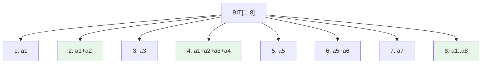

# Fenwick Tree (Binary Indexed Tree)

> Part of [[README|Java MOC]] • `Java/07_DSA`
> 🎨 **Visual diagram:** Create Excalidraw drawing from template: `Cmd+P → Excalidraw: New from template → Java Diagram`

## Intent

A **Fenwick Tree** (Binary Indexed Tree) answers **prefix sums** and supports **point updates** in **O(log n)** with **O(n)** memory. Simpler and faster than segment tree for invertible operations.

## Why it Matters

- **Prefix sums / range sums** on mutable arrays: O(log n) query + update
- **Frequency tables / order statistics**: find k-th element, count less than x
- **Inversion count** in arrays: classic BIT application
- **2D BIT**: grid range queries
- Lower constant factor and memory vs segment tree

## Diagram



## Code / Example

```java
// Java 25: records, var, pattern matching
// Fenwick Tree for Prefix Sum + Point Update

class FenwickTree {
    private final int n;
    private final long[] bit; // 1-indexed
    
    FenwickTree(int n) {
        this.n = n;
        bit = new long[n + 1];
    }
    
    FenwickTree(long[] arr) {
        this(arr.length);
        for (int i = 0; i < n; i++) add(i + 1, arr[i]);
    }
    
    // Add val at index idx (1-indexed)
    void add(int idx, long val) {
        for (; idx <= n; idx += idx & -idx) bit[idx] += val;
    }
    
    // Prefix sum [1..idx]
    long sum(int idx) {
        long res = 0;
        for (; idx > 0; idx -= idx & -idx) res += bit[idx];
        return res;
    }
    
    // Range sum [l..r] (1-indexed)
    long rangeSum(int l, int r) {
        return sum(r) - sum(l - 1);
    }
    
    // Point update: set idx to val
    void set(int idx, long val) {
        add(idx, val - rangeSum(idx, idx));
    }
    
    // Find smallest idx such that prefix sum >= target (1-indexed)
    // Requires all values >= 0
    int lowerBound(long target) {
        int idx = 0;
        int bitMask = 1 << (31 - Integer.numberOfLeadingZeros(n));
        for (; bitMask > 0; bitMask >>= 1) {
            int next = idx + bitMask;
            if (next <= n && bit[next] < target) {
                idx = next;
                target -= bit[next];
            }
        }
        return idx + 1; // 1-indexed
    }
}

// Range Add + Point Query (difference array BIT)
class RangeAddPointQueryBIT {
    private final FenwickTree bit;
    RangeAddPointQueryBIT(int n) { bit = new FenwickTree(n); }
    void rangeAdd(int l, int r, long val) {
        bit.add(l, val);
        bit.add(r + 1, -val);
    }
    long pointQuery(int idx) { return bit.sum(idx); }
}

// Range Add + Range Sum (two BITs)
class RangeAddRangeSumBIT {
    private final FenwickTree bit1, bit2;
    RangeAddRangeSumBIT(int n) { 
        bit1 = new FenwickTree(n);
        bit2 = new FenwickTree(n);
    }
    void rangeAdd(int l, int r, long val) {
        bit1.add(l, val);
        bit1.add(r + 1, -val);
        bit2.add(l, val * (l - 1));
        bit2.add(r + 1, -val * r);
    }
    long prefixSum(int idx) {
        return bit1.sum(idx) * idx - bit2.sum(idx);
    }
    long rangeSum(int l, int r) {
        return prefixSum(r) - prefixSum(l - 1);
    }
}
```

### Concrete Example

- **Input:** `arr = [3,2,-1,6,5,4,-3,3,7,2,3]`, query sum[1,5], add 2 at index 3, query sum[1,5]
- **Output:** First sum = 15, after add = 17

## When to Use / When NOT

| **Use When** | **Avoid When** |
|--------------|----------------|
| - Prefix sums / range sums with point updates | - Range min/max/gcd (non-invertible) |
| - Inversion count, frequency tables | - Range updates + range queries (need 2 BITs) |
| - Order statistics (k-th element) | - Persistent/immutable needed |
| - Memory-constrained (O(n) vs 4n) | - 2D queries without compression |

## Trade-offs

| Dimension | Fenwick Tree | Segment Tree | Prefix Sum Array |
|-----------|--------------|--------------|------------------|
| Prefix sum | O(log n) | O(log n) | O(1) |
| Point update | O(log n) | O(log n) | O(n) |
| Range sum | O(log n) | O(log n) | O(1) |
| Memory | n+1 | 4n | n |
| Operations | Invertible only | Any associative | Static only |

## Vs Table

| Aspect | Fenwick Tree | Segment Tree | Order Statistic Tree |
|--------|--------------|--------------|---------------------|
| Prefix sum | O(log n) | O(log n) | O(log n) |
| Range min/max | No | Yes | No |
| k-th element | Yes (lowerBound) | Yes (persistent) | Yes |
| Range add + range sum | Two BITs | Lazy segtree | No |

## Pitfalls

- **1-indexed**: always use 1..n; convert 0-indexed input
- **Non-invertible ops**: cannot do min/max/gcd; needs segment tree
- **lowerBound requires non-negative values**: sum must be monotonic
- **Overflow**: use `long`; modulo for large sums
- **Not thread-safe**: synchronize if concurrent

## Interview Q&A (Senior Depth)

**Q1. What is the core insight of Fenwick Tree, and why does it work?**
**A:** Each index `i` stores sum of range `(i - lowbit(i) + 1) .. i` where `lowbit(i) = i & -i`. Query accumulates by clearing lowest set bit; update propagates by adding lowest set bit. It's a implicit binary tree over array indices.

**Q2. When would you choose Segment Tree over Fenwick Tree?**
**A:** Need range min/max/gcd, non-invertible operations, lazy range updates, or persistence. Fenwick is strictly for invertible operations (sum, xor, product with inverses).

**Q3. How do you support range add + range sum with Fenwick Tree?**
**A:** Use two BITs: `bit1` for coefficient, `bit2` for constant. `rangeAdd(l,r,val)` updates both. `prefixSum(x) = bit1.sum(x)*x - bit2.sum(x)`. Range sum is difference of prefix sums.

**Q4. Walk me through a non-obvious problem that reduces to Fenwick Tree.**
**A:** **Inversion count**: process from right, query BIT for count of elements smaller than current. **Count of subarrays with sum in range**: prefix sums + coordinate compression + BIT. **K-th smallest in range**: persistent BIT or wavelet tree (BIT-based).

**Q5. What is the memory/performance implication at scale?**
**A:** n+1 `long` array → 8 bytes per element. For 10^7: ~80 MB. Cache-friendly (sequential access in query/update loops). No recursion. Iterative bit operations are extremely fast.

## Flashcards (Spaced Repetition)

#flashcard
**Q:** What is the time complexity of Fenwick Tree operations? :: **A:** O(log n) for add, sum, rangeSum. #flashcard

#flashcard
**Q:** What operations can Fenwick Tree NOT do? :: **A:** Range min/max/gcd (non-invertible). Needs segment tree. #flashcard

#flashcard
**Q:** How to do range add + range sum with BIT? :: **A:** Two BITs: bit1 for coefficient, bit2 for constant. prefixSum(x) = bit1.sum(x)*x - bit2.sum(x). #flashcard

#flashcard
**Q:** Fenwick tree memory vs segment tree? :: **A:** BIT: n+1. Segment tree: 4n. BIT is 4x more memory efficient. #flashcard

#flashcard
**Q:** How to find k-th element with BIT? :: **A:** lowerBound(target) using binary lifting on bitMask, requires all values >= 0. #flashcard

## Practice Tasks (Tasks Plugin)

- [ ] Restate the intent from memory 📅 {{date:YYYY-MM-DD, +1}}
- [ ] Code the snippet without looking 📅 {{date:YYYY-MM-DD, +3}}
- [ ] Answer all Interview Q&A aloud 📅 {{date:YYYY-MM-DD, +7}}
- [ ] Review flashcards (Spaced Repetition) 📅 {{date:YYYY-MM-DD, +1}}

```tasks
not done
path includes Java/07_DSA
sort by due
limit 10
```

## Related

- [[README|Java MOC]]
- DSA MOC
- [[Java/07_DSA/Segment Tree|Segment Tree]]
- Inversion Count

---

*Category: Java/07_DSA • Part of [[README|Java MOC]] • Java 25*

## Problem

Need prefix sums and point updates on a mutable array with minimal memory and simple code.

## Solution

Use 1-indexed array where each index i stores sum of (i - lowbit(i) + 1) to i. Query clears lowest bit; update adds lowest bit.

## When not to use

| Instead | Use |
|---------|-----|
| Range min/max/gcd | Segment Tree |
| Persistent/immutable | Persistent Segment Tree |
| Static array, many queries | Prefix Sum Array |
| 2D range queries | 2D BIT / 2D Segment Tree |