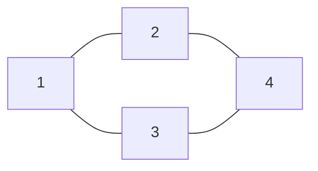

## Why it Matters

A **graph** `G = (V, E)` is a set of **vertices** `V` and **edges** `E ⊆ V × V`. Edges may be **directed** (ordered pair) or **undirected** (unordered), **weighted** (cost) or **unweighted**, **cyclic** or **acyclic**. Graphs model networks, maps, dependencies, and social relations.

- **Directed vs undirected:** `u→v` vs `u,v` (undirected = two directed edges).
- **Weighted:** `Edge(u, v, w)` with weight `w`.
- **Degree:** undirected → number of incident edges; directed → in-degree / out-degree.
- **Connected components, cycles, DAG** (directed acyclic graph) for topological sort.
```
Undirected: Directed (weighted):
 1, 2 1 ──2──► 2
 | | │ │
 3, 4 5 3──1──►4
Adjacency: 1:{2,3} Adjacency: 1→{2:2}, 2→{3:4}
```
**Graph vs Tree:** every tree is a graph (connected, acyclic, `|E|=|V|-1`) but most graphs have cycles and disconnected components. Traversal needs `visited` set to avoid revisiting.

## Diagram



## Code

```java
// Adjacency list: List<List<Edge>>; BFS for unweighted shortest path
record Edge(int to, int w) {}

Map<Integer, Integer> bfsDist(List<List<Integer>> adj, int src) {
 var dist = new HashMap<Integer, Integer>(); // invariant: dist holds shortest found
 Deque<Integer> q = new ArrayDeque<>();
 q.offer(src); dist.put(src, 0);
 while (!q.isEmpty()) {
 int u = q.poll();
 for (int v : adj.get(u)) {
 if (!dist.containsKey(v)) { dist.put(v, dist.get(u) + 1); q.offer(v); }
 }
 }
 return dist; // O(V + E)
}

void demo() {
 var adj = List.of(List.of(1, 2), List.of(3), List.of(3), List.of());
 System.out.println(bfsDist(adj, 0)); // => {0=0, 1=1, 2=1, 3=2}
}
```

## When to use / not

| Use | NOT |
|-----|-----|
| Networks, dependencies, grids-as-graphs; adjacency list default | Dense graphs with O(1) edge checks → matrix |
| BFS (unweighted shortest), DFS (components/cycles/topo), Dijkstra (weighted, no negatives) | Negative weights with Dijkstra → Bellman-Ford |

## Trade-offs

- Models any relation; BFS/DFS/Dijkstra are O(V + E).
- Needs `visited` discipline; adjacency choice (list vs matrix) shapes cost.

## Vs

| | `BFS` | `DFS` | `Dijkstra` |
|--|-------|-------|--------------|
| Structure | queue | stack/recursion | min-heap |
| Finds | unweighted shortest path | components, cycles, topo | weighted shortest (no negatives) |
| Cost | O(V + E) | O(V + E) | O((V + E) log V) |

## Pitfalls

- **Forgetting `visited` set**, graph has cycles; DFS/BFS without `visited` → infinite loop / stack overflow.
- **Dijkstra fails with negative weights**, use **Bellman-Ford** (O(V·E), detects negative cycles); BFS is only for unweighted shortest path.
- **Stale PQ entries**, must check `if (d > dist[u]) continue;` after `poll` (multiple entries per node).
- **1-indexed vs 0-indexed**, LeetCode often 1-indexed (`n` nodes labeled 1..n); building `List<List<Edge>>` of size `n+1` or converting to 0-index is a common bug.
- **Recursive DFS stack overflow** on large/deep graphs, switch to iterative `ArrayDeque` stack.
- **Adjacency matrix for sparse graphs** wastes `O(V²)` memory and slows traversal to `O(V²)`.
- **`int` overflow in distances**, use `long` or `Integer.MAX_VALUE/2` as INF and check `dist[u] != INF` before `dist[u]+w`.
- **Undirected edge added once**, undirected graphs need both `u→v` and `v→u`.

## Interview q&a

**Q: Adjacency list vs matrix, which to use?** List: `O(V+E)` space, `O(V+E)` traversal, default for sparse graphs (most interviews). Matrix: `O(V²)` space, `O(1)` edge check, only for dense graphs or Floyd-Warshall.

**Q: BFS vs DFS, when to use which?** BFS for **unweighted shortest path** and level-order (Word Ladder, Rotting Oranges). DFS for **path existence, connected components, topological sort, cycle detection, Clone Graph**. Both `O(V+E)`.

**Q: How does Dijkstra work? Why does it fail with negative weights?** Greedy + min-heap (`[[Heap]]`): always expand smallest `dist[u]`; relax neighbors `dist[v] = min(dist[v], dist[u]+w)`. Fails with negative weights because a later path through a negative edge could improve an already-finalized node; Bellman-Ford handles negatives and detects negative cycles.

**Q: How to detect a cycle?** Undirected: DFS/BFS + parent check. Directed: DFS with 3-color states (0=unvisited, 1=visiting, 2=visited), if visiting neighbor → cycle; or Kahn's topological sort (if not all nodes ordered → cycle).

**Q: What is topological sort?** Linear order of DAG where `u→v` implies `u` before `v`. Kahn (BFS, indegree queue) or DFS post-order reversed; `O(V+E)`.

**Q: Why `ArrayDeque` over `Stack` / `LinkedList`?** `Stack` is legacy synchronized `Vector`; `LinkedList` allocates nodes. `ArrayDeque` is faster, array-backed, `SequencedCollection`, and forbids `null`.

Adjacency list vs matrix, which to use?:: List: `O(V+E)` space, `O(V+E)` traversal, default for sparse graphs (most interviews). Matrix: `O(V²)` space, `O(1)` edge check, only for dense graphs or Floyd-Warshall. #flashcard
BFS vs DFS, when to use which?:: BFS for unweighted shortest path and level-order (Word Ladder, Rotting Oranges). DFS for path existence, connected components, topological sort, cycle detection, Clone Graph. Both `O(V+E)`. #flashcard
How does Dijkstra work? Why does it fail with negative weights?:: Greedy + min-heap (`[[Heap]]`): always expand smallest `dist[u]`; relax neighbors `dist[v] = min(dist[v], dist[u]+w)`. Fails with negative weights because a later path through a negative edge could improve an already-finalized node; Bellman-Ford handles negatives and detects negative cycles. #flashcard
How to detect a cycle?:: Undirected: DFS/BFS + parent check. Directed: DFS with 3-color states (0=unvisited, 1=visiting, 2=visited), if visiting neighbor → cycle; or Kahn's topological sort (if not all nodes ordered → cycle). #flashcard
What is topological sort?:: Linear order of DAG where `u→v` implies `u` before `v`. Kahn (BFS, indegree queue) or DFS post-order reversed; `O(V+E)`. #flashcard
Why `ArrayDeque` over `Stack` / `LinkedList`?:: `Stack` is legacy synchronized `Vector`; `LinkedList` allocates nodes. `ArrayDeque` is faster, array-backed, `SequencedCollection`, and forbids `null`. #flashcard

- [200. Number Of Islands](https://leetcode.com/problems/number-of-islands/)
- [994. Rotting Oranges](https://leetcode.com/problems/rotting-oranges/)
- [207. Course Schedule](https://leetcode.com/problems/course-schedule/)

## Related

- [[Heap]] (PriorityQueue for Dijkstra) • [[Trees]] (tree is a special graph) • [[Java/07_DSA/Queue|Queue]] (BFS) • [[Java/07_DSA/Stack|Stack]] (DFS) • [[Java/07_DSA/HashMap|HashMap (DSA)]]
- [[README|Java MOC]]

# Graph

> Part of [[README|Java MOC]] • `DSA`

## Representation , Adjacency List vs Matrix

| Aspect | **Adjacency List** | **Adjacency Matrix** |
|---|---|---|
| **Structure** | `Map<V, List<Edge>>` / `List<List<int[]>>` | `int[V][V]` / `boolean[V][V]` |
| **Space** | **O(V + E)** , sparse-friendly | **O(V²)** , dense only |
| **Add edge** | **O(1)** | **O(1)** |
| **Check edge `u→v`** | **O(deg(u))** (scan list) | **O(1)** |
| **Iterate neighbors of u** | **O(deg(u))** | **O(V)** (scan row) |
| **Iterate all edges** | **O(V + E)** | **O(V²)** |
| **When to use** | Sparse graphs (most interviews), Dijkstra/BFS/DFS | Dense graphs, Floyd-Warshall, fast edge-existence checks |
| **Java** | `List<List<Edge>>` or `Map<Integer,List<Edge>>` | `int[][] matrix = new int[n][n]` |

> **Interview default:** adjacency list. Mention matrix trade-off if graph is dense (`E ≈ V²`).

```
algorithm// List: graph[u] = [(v,w), ...]AdjList: for v in graph[u]: visit(v)
// Matrix: matrix[u][v] = w (0/INF if no edge)
Matrix: for v = 0..n-1: if matrix[u][v] != INF: visit(v)
```

## Operations , Complexity

| Operation | Adj. List | Adj. Matrix |
|---|---|---|
| Add vertex | O(1) | O(V²) to resize |
| Add / Remove edge | O(1) / O(deg) | O(1) |
| Check edge | O(deg) | O(1) |
| **BFS / DFS** | **O(V + E)** | **O(V²)** |
| **Dijkstra (binary heap)** | **O((V+E) log V)** | **O(V²)** (without heap) |
| **Topological sort (Kahn/DFS)** | **O(V + E)** | **O(V²)** |
| Space | **O(V+E)** | **O(V²)** |

## BFS vs dfs

| Aspect | **BFS (Breadth-First Search)** | **DFS (Depth-First Search)** |
|---|---|---|
| **Structure** | `Queue` (level by level) | `Stack` / recursion (deep, backtrack) |
| **Order** | Level-order; expands frontier | Goes deep before siblings |
| **Shortest path** | **Yes** , unweighted graphs (fewest edges) | **No** (needs Dijkstra for weighted) |
| **Use cases** | Shortest path (unweighted), level order, Word Ladder, Rotting Oranges | Path existence, connected components, topological sort, Clone Graph, Number of Islands |
| **Memory** | **O(V)** worst (wide frontier) | **O(h)** recursion depth; O(V) worst (skewed) |
| **Cycle detection** | Via `visited` + parent | Via `visited` + recursion stack / colors (0/1/2) |
| **Implementation** | Iterative with `ArrayDeque` | Recursive or iterative with `ArrayDeque` as stack |
| **Time** | **O(V + E)** | **O(V + E)** |
```
algorithmBFS(src): Queue q; visited{src}; q.enqueue(src); while q not empty: u←q.dequeue(); for v in adj[u]: if v not visited: visited.add(v); q.enqueue(v)
DFS(u): visited.add(u); for v in adj[u]: if v not visited: DFS(v) // or explicit stack
Dijkstra(src): dist[src]=0; pq{(0,src)}; while pq: (d,u)←poll; if d>dist[u] continue; for (v,w) in adj[u]: if dist[u]+w < dist[v]: dist[v]=dist[u]+w; pq.offer((dist[v],v))
```

## Java 25 Notes

- **Record Node/Edge:** `record Node(int id)` and `record Edge(int to, int weight)`, auto `equals/hashCode`, immutable, works with `if (e instanceof Edge(var to, var w))` record pattern matching (Java 21/25). Prefer records over `int[]` for `int[]{to,w}` clarity.
- **Sequenced (JEP 431):** `ArrayList` and `ArrayDeque` are `SequencedCollection`, use `getFirst()`/`getLast()`/`reversed()` for adjacency lists and queues. `LinkedHashMap` is `SequencedMap` for ordered graph maps. BFS queue and DFS stack both use `ArrayDeque` sequenced idioms.
- **Compact Object Headers (JEP 450, Java 25):** `-XX:+UseCompactObjectHeaders` shrinks object header to 8 B. Graph adjacency lists with millions of `Edge` records / `Node` objects save tens of MB; `PriorityQueue` backing array (Dijkstra) also benefits. Flag it for memory-heavy graph interviews.
- **Virtual threads (JEP 444/491, stable in Java 25):** parallel BFS/DFS/Dijkstra multi-source via `StructuredTaskScope.ShutdownOnFailure` + virtual threads, `scope.fork(() -> bfs(partition))`. Cheap (~1M threads) vs platform-thread pools.
- **Pattern matching:** `switch (edge) { case Edge(var to, var w) when w < 0 -> ... }` for weighted-graph guards.

## Solve with Patterns

- [[Coding Patterns/05_Trees_Graphs/02 - DFS]]
- [[Coding Patterns/05_Trees_Graphs/03 - BFS]]
- [[Coding Patterns/05_Trees_Graphs/04 - Shortest Path]], Dijkstra & Bellman-Ford
- [[Coding Patterns/05_Trees_Graphs/01 - Binary Tree Traversal]] • [[Coding Patterns/06_Matrix/01 - Matrix Traversal]]
