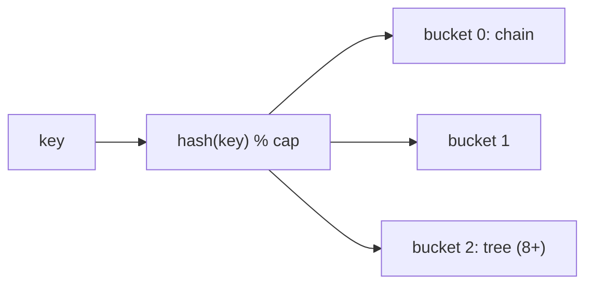

## Why it Matters

A **HashMap / Hash Table** is a **[[Map]]** implementation that maps **keys → values** via a **hash function**: `index = hash(key) % capacity`. It provides expected O(1) `get`/`put`/`remove` by indexing into an array of **buckets**, each holding a chain (linked list / tree) for collisions.

- **Hashing**, `hash(key)` → integer → bucket index. Good hash spreads keys uniformly.

![[Pasted image 20230727120429.png]]

## Diagram



## Code

```java
// HashMap: hash -> bucket; equal keys need consistent equals + hashCode
void demo() {
 Map<String, Integer> freq = new HashMap<>();
 for (String w : List.of("a", "b", "a", "c", "b", "a")) {
 freq.merge(w, 1, Integer::sum); // O(1) avg per word
 }
 System.out.println(freq.get("a")); // => 3
 System.out.println(freq.getOrDefault("z", 0)); // => 0

 record User(int id, String name) {} // correct equals/hashCode for keys
 var byId = new HashMap<User, Integer>();
 byId.put(new User(1, "Ada"), 95);
 System.out.println(byId.get(new User(1, "Ada"))); // => 95

 var lru = new LinkedHashMap<Integer, String>(16, 0.75f, true) {
 protected boolean removeEldestEntry(Map.Entry<Integer, String> e) {
 return size() > 100; // invariant: eldest = least recently used
 }
 };
 lru.put(1, "one"); lru.put(2, "two");
 System.out.println(lru.keySet()); // => [1, 2]
}
```

## When to use / not

| Use | NOT |
|-----|-----|
| O(1) lookup, frequency counts, memoization, two-sum patterns | Sorted keys → `TreeMap`; insertion order → `LinkedHashMap` |
| Record keys (free `equals`/`hashCode`) | Concurrent writes → `ConcurrentHashMap` |

## Trade-offs

- O(1) average ops; versatile (counts, caches, indexes).
- Degrades on bad hashes; unordered; resize pauses; mutable keys corrupt.

## Vs

| | `HashMap` | `TreeMap` | `LinkedHashMap` |
|--|-----------|-----------|-------------------|
| Order | none | sorted | insertion/access |
| `get`/`put` | O(1) avg | O(log n) | O(1) avg |
| Null key | one | no | one |

## Pitfalls

- **Broken `hashCode`/`equals` contract**, equal objects must have equal hash codes; mutating a key after insertion corrupts the map.
- **Mutable keys**, changing a field that affects `hashCode` after `put` makes `get` fail.
- **`null` keys**, `HashMap` allows one `null` key (bucket 0); `Hashtable`/`ConcurrentHashMap` do not.
- **Iteration order is not insertion order**, use `LinkedHashMap` for that; `TreeMap` for sorted order.
- **Not thread-safe**, concurrent `put` can cause infinite loops (pre-Java 8) or lost updates; use `ConcurrentHashMap` or external sync.
- **Poor hash function**, many collisions degrade to O(n); ensure uniform distribution.
- **Capacity vs load factor tuning**, small initial capacity + many puts causes repeated rehashing.

## Interview q&a

**Q: `HashMap` vs `HashTable` vs `ConcurrentHashMap`?** `HashMap` non-sync, allows null; `Hashtable` legacy sync, no nulls; `ConcurrentHashMap` segmented/CAS, high concurrency, no nulls, fail-safe iteration.

**Q: What happens when two keys collide?** Chaining, stored in same bucket's linked list / tree; lookup walks the chain.

**Q: Why treeify buckets in Java 8?** To bound worst-case from O(n) to O(log n) under hash-collision attack (many keys with same hash).

**Q: Time complexity of resize?** O(n) to rehash all entries; amortised O(1) per `put`.

Reference: [How HashMap works in Java, Animation (Java 8)](https://www.youtube.com/watch?v=c3RVW3KGIIE)

`HashMap` vs `HashTable` vs `ConcurrentHashMap`?:: `HashMap` non-sync, allows null; `Hashtable` legacy sync, no nulls; `ConcurrentHashMap` segmented/CAS, high concurrency, no nulls, fail-safe iteration. #flashcard
What happens when two keys collide?:: Chaining, stored in same bucket's linked list / tree; lookup walks the chain. #flashcard
Why treeify buckets in Java 8?:: To bound worst-case from O(n) to O(log n) under hash-collision attack (many keys with same hash). #flashcard
Time complexity of resize?:: O(n) to rehash all entries; amortised O(1) per `put`. Reference: [How HashMap works in Java, Animation (Java 8)](https://www.youtube.com/watch?v=c3RVW3KGIIE) #flashcard

- [1. Two Sum](https://leetcode.com/problems/two-sum/)
- [560. Subarray Sum Equals K](https://leetcode.com/problems/subarray-sum-equals-k/)
- [49. Group Anagrams](https://leetcode.com/problems/group-anagrams/)

---
*Category: DSA • Part of [[README|Java MOC]]*

## Related

- [[Array]] • [[Linked List]] • [[Trees]] (bucket tree)
- [[README|Java MOC]]

# HashMap (DSA)

> Part of [[README|Java MOC]] • `DSA`

## Structure

```
hash(key) → bucket index┌──────────────────────────────────┐
│ buckets: Array<Node<K,V>> │
│ [0] → Node(k1,v1) → Node(k2,v2) │ (chain)
│ [1] → null │
│ [2] → Node(k3,v3) → (tree if long chain, Java 8+) │
│ ... │
└──────────────────────────────────┘
 collision → chaining (or open addressing in other designs)
```

**Java 8+ optimisation:** when a bucket's chain length ≥ 8 and capacity ≥ 64, it treeifies into a red-black tree → worst-case O(log n) instead of O(n).

## Operations , Complexity

| Operation | Average | Worst (many collisions) | Notes |
|---|---|---|---|
| `put(key, val)` | **O(1)** | O(log n) tree / O(n) list | Rehash on load factor |
| `get(key)` | **O(1)** | O(log n) / O(n) | |
| `remove(key)` | **O(1)** | O(log n) / O(n) | |
| `containsKey` | **O(1)** | O(log n) / O(n) | |
| Traverse / `entrySet` | **O(n)** | O(n) | |
| Resize (rehash) | **O(n)** | O(n) | Amortised |

**Load factor** (default 0.75) = `size / capacity`; when exceeded, capacity doubles and all entries are rehashed.

## Java 25 Notes

- **Record keys:** `record User(int id, String name)` auto-generates correct `equals/hashCode`, eliminates broken-contract bug.
- **Pattern instanceof:** `if (o instanceof User(int id, String name))` (record pattern, Java 21/25) for destructuring keys.
- **SequencedMap:** `LinkedHashMap` now `SequencedMap`, `firstEntry()`/`lastEntry()`/`reversed()` replace manual iteration for LRU ordered maps.
- **Compact Object Headers (JEP 450):** each bucket `Node` header 8 B → HashMap with 1M entries saves ~8 MB. Mention in interviews on memory tuning.

## Solve with Patterns

- [[Coding Patterns/01_Array/01 - Prefix Sum]]
- [[Coding Patterns/01_Array/04 - Frequency Counting]]
- [[Coding Patterns/03_Stack_Heap/02 - Top K Elements]]
- [[Coding Patterns/08_Bit_Manipulation/01 - Bit Manipulation]]
